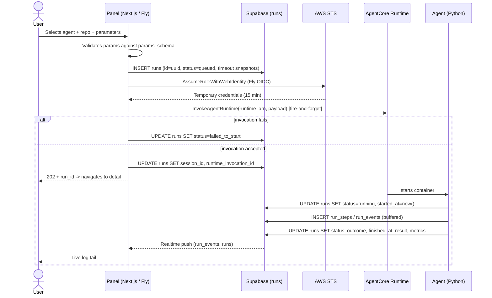
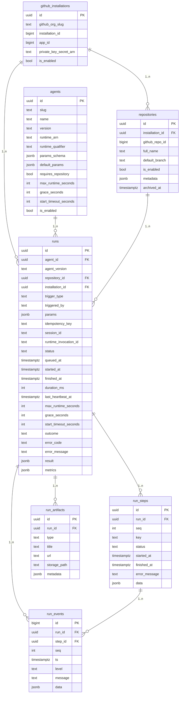
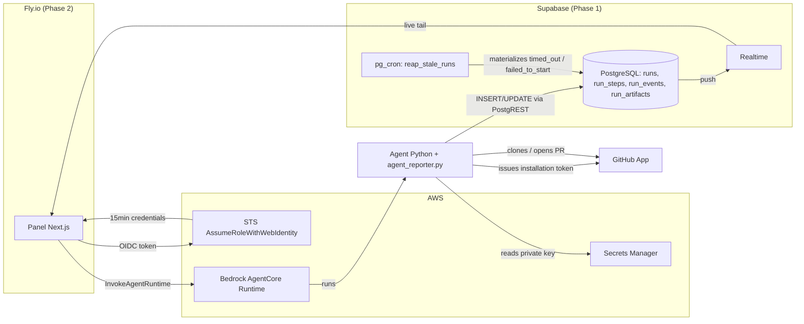

# PRD — Agent Fleet Control Panel v2

## Changelog

| Version | Date       | Summary                                                                 | Author           |
| ------- | ---------- | ----------------------------------------------------------------------- | ---------------- |
| 1.0     | 2026-08-26 | Initial version. Reformatted from `PRD-agent-fleet-v2-consolidado.md` (Draft 2, tmp) into standard PRD structure. Decisions (D1-D14) and risks (R1-R7) preserved. | product-engineer |
| 1.1     | 2026-08-26 | Reference artifacts moved from `tmp/` to `docs/reference/`. All mentions now link to their files. | product-engineer |
| 2.0     | 2026-08-26 | Translated to English. Introduced two-phase delivery model: Phase 1 (database + agent + base API) and Phase 2 (Next.js panel for visualization). | product-engineer |

> **Source:** this document reorganizes, without altering the substantive content, `tmp/PRD-agent-fleet-v2-consolidado.md` (Draft 2 — consolidated, August 26 2026, author Llipe), together with the reference artifacts [`001_schema.sql`](../reference/001_schema.sql), [`002_seed.sql`](../reference/002_seed.sql), [`agent_reporter.py`](../reference/agent_reporter.py), and [`credentials.ts`](../reference/credentials.ts). Closed decisions are referenced by their original identifier (D1-D14) and risks by theirs (R1-R7) for traceability with the source document.

## 1. Executive Summary

Today there is no way to see what agents running on AWS Bedrock AgentCore did without entering the AWS console and crafting CloudWatch Logs Insights queries. That does not scale to multiple agents across ~20 repositories and does not allow triggering an execution with parameters outside the console. This v2 introduces Supabase as the *system of record* for executions — the agent reports its own state explicitly — and a Next.js panel to list agents, view executions with live log tailing, and invoke agents manually with parameters.

Delivery is split into two phases:

- **Phase 1:** Deploy the database schema, build and deploy the `dependency-update` agent connected to GitHub, and expose a base API layer (Supabase PostgREST) so the agent can write lifecycle and events back to the database when manually invoked. If the API is unreachable, the run falls back to leaving logs in CloudWatch (the SDK dumps payloads to stderr on write failure).
- **Phase 2:** Build the Next.js application to visualize run information from the database — agent list, run list, run detail with live log tail, and the manual invocation form.

## 2. Feature Overview

The agent fleet control panel enables:

- Viewing the list of configured agents in the organization.
- Viewing, per agent, the list of its executions (`runs`) with status, duration, and outcome.
- Viewing, per execution, the complete log with live tail (no page reload).
- Manually invoking an agent with parameters from a form generated from its `params_schema`.
- Automatically detecting executions that did not finish (hung or never started) and marking them accordingly, with an event explaining the reason.

Structural change from v1: **Supabase becomes the system of record** for executions. The agent reports state explicitly at every relevant step; nothing is reconstructed by parsing log lines after the execution ended. CloudWatch remains as infrastructure telemetry, outside the panel's functional scope — but acts as a fallback when the agent cannot reach Supabase.

The following diagram summarizes the end-to-end flow of a manual invocation with all pieces involved:

## 3. Goals & Objectives

1. Replace the AWS console / CloudWatch Logs Insights as the sole means of seeing what an agent did.
2. Allow invoking an agent with parameters from the panel, without going through the AWS console.
3. Record the state of each execution explicitly and reliably, including executions that fail silently.
4. Design the data model to support, in the medium term, multiple agents across multiple repos, schedule/webhook triggers, and per-repo agent enablement — without needing to re-model when those capabilities activate.
5. Deliver a productive agent (`dependency-update`) functioning end-to-end on the panel.
6. Keep the local development environment functional against real AgentCore, without static AWS credentials.

## 4. Affected Repositories

| Repo / component | Role / Expected impact |
|---|---|
| `dev-tasks-agent-fleet` (this repo) | Contains the Supabase schema ([`001_schema.sql`](../reference/001_schema.sql), [`002_seed.sql`](../reference/002_seed.sql)), the agent reporting SDK ([`agent_reporter.py`](../reference/agent_reporter.py)), the front-end AWS credential provider ([`credentials.ts`](../reference/credentials.ts)), and the Next.js front-end (pending, Phase 2) |
| Agent repo(s) (e.g., `dependency-update`) | Receives a copy of [`agent_reporter.py`](../reference/agent_reporter.py) (D13); implements the runtime deployed to AgentCore (Phase 1) |
| Supabase project (infrastructure, not code repo) | Applies the `001_schema.sql` migration and the `002_seed.sql` seed; enables `pg_cron` for the reaper (Phase 1) |
| AWS account (infrastructure, not code repo) | Hosts AgentCore runtimes; requires IAM Role + OIDC provider setup described in §12 (Technical Considerations) |

## 5. Target Users

**Primary:** the project author/operator, in their role as maintainer of the GitHub organization, who needs to trigger and audit agents on their repos without using the AWS console.

**Secondary (outside v1, backlog):** other members of a small team, once Supabase Auth with allowlist exists (see §10, Non-Goals).

There is no external end-user or intent for commercial distribution.

## 6. User Stories

1. As an operator, I want to see the list of configured agents so I know what I can invoke without consulting code or external configuration.
2. As an operator, I want to see, per agent, the list of its executions with status, duration, and outcome, to quickly know if something went well or badly.
3. As an operator, I want to see the complete log of an execution with live tail, to debug without entering CloudWatch Logs Insights.
4. As an operator, I want to manually invoke `dependency-update` on a chosen repo with agent-specific parameters from a form in the panel.
5. As an operator, I want executions that hang or never start to be automatically marked as such with an explanation, so I am not left waiting for a result that will never arrive.
6. As an operator, I want to add a new agent by inserting a row in the database without requiring a front-end deploy, so that adding agents is cheap.
7. As an operator, I want the panel to work locally against real AgentCore without having to manage AWS keys by hand, so I can develop without credential friction.

## 7. Functional Requirements

### Phase 1 — Database + Agent + Base API

1. The database schema **must** be deployed to Supabase, including all tables (`github_installations`, `repositories`, `agents`, `runs`, `run_steps`, `run_events`, `run_artifacts`), enums, indexes, the `v_runs` view, the `reap_stale_runs()` function, and RLS deny-all policies — as specified in [`001_schema.sql`](../reference/001_schema.sql).
2. The seed **must** be applied to configure at least one installation, the target repositories, and the `dependency-update` agent — as specified in [`002_seed.sql`](../reference/002_seed.sql).
3. `pg_cron` **must** be enabled and scheduled to run `reap_stale_runs()` every minute — **D10**.
4. The `dependency-update` agent **must** be deployed to AWS Bedrock AgentCore, connected to the target GitHub organization via the GitHub App.
5. The agent **must** use [`agent_reporter.py`](../reference/agent_reporter.py) to write its lifecycle (`status`, `outcome`, `started_at`, `finished_at`), steps, events (buffered per D5), and artifacts back to Supabase via PostgREST.
6. If the Supabase API is unreachable (network failure, misconfiguration), the agent SDK **must** fall back to writing payloads to stderr, which lands in CloudWatch. The agent **must not** crash due to reporting failures — reporting never kills the agent.
7. When manually invoked (via AWS CLI or the future panel), the agent **must** receive `run_id` as a parameter, update the run row from `queued` to `running`, execute its task, and finalize the row with the appropriate terminal status and outcome.
8. The system **must** detect stale executions on two distinct clocks — **D8, D9**:

   | Condition | New status |
   |---|---|
   | `status = running` and `now() > started_at + max_runtime_seconds + grace_seconds` | `timed_out` |
   | `status = queued` and `now() > queued_at + start_timeout_seconds` | `failed_to_start` |

9. The system **must** distinguish `status` (lifecycle) from `outcome` (business result) as separate columns — **D3**.

### Phase 2 — Next.js Panel (Visualization + Invocation)

10. The system **must** list configured agents from the `agents` table, showing at least slug, name, description, and `is_enabled` state.
11. The system **must** list, per agent, its executions (`runs`) ordered by date descending, showing `status`, `outcome`, duration, and associated repository (if applicable).
12. The system **must** show, per execution, the complete log (`run_events`) ordered by `seq`, with live tail via Supabase Realtime — the user does not reload the page to see new events.
13. The system **must** render the invocation form from `agents.params_schema` (JSON Schema) — **D2**. The repository field is rendered separately, outside the schema, when `agents.requires_repository = true`.
14. When invoking an agent, the front-end **must**:
    a. Generate the `run_id` (uuid) and insert the `runs` row with `status = queued` before invoking AgentCore — **D1**.
    b. Validate received parameters against `params_schema` before invoking.
    c. Snapshot `max_runtime_seconds`, `grace_seconds`, `start_timeout_seconds`, `agent_version`, and `params` in the `runs` row — **D8**.
    d. Invoke `InvokeAgentRuntime` in a fire-and-forget manner from the route handler — **D7**.
    e. If the invocation throws, mark the run as `failed_to_start` immediately, without waiting for the reaper.
    f. Respond `202` with the `run_id` and navigate to the execution detail.
15. The front-end **must** obtain AWS credentials without static keys: via Fly OIDC + `AssumeRoleWithWebIdentity` in production, and via the standard SDK chain (`fromNodeProviderChain`) locally — **D12**.
16. Adding a new agent **must** require only inserting a row in `agents` with its `params_schema`, no front-end changes or deploy — verified by acceptance criterion #5.

## 8. Business Rules

- **D1 — The front-end generates the `run_id` and creates the `queued` row before invoking.** If the agent never starts, the failure record still exists.
- **D2 — The invocation form is rendered from `agents.params_schema`.** A new agent does not require a front-end deploy.
- **D3 — `status` and `outcome` are separate columns.** An execution that finishes successfully and finds no issues is not a failure.
- **D4 — The log is structured rows in `run_events`, not a blob.** Enables level filtering and live tail via Realtime.
- **D5 — The agent writes with buffering: flush every 50 events or 2 seconds, forced at step boundaries and on termination.** One row per line over HTTPS from AgentCore does not hold up.
- **D6 — Repositories are a first-class entity, not a string in `params`.** The GitHub App token is issued per installation; enables "all runs for repo X."
- **D7 — The front-end runs on Fly.io; invocation to AgentCore is fire-and-forget from the route handler.** The Node process persists after responding; no durable hop (SQS/Lambda) is required.
- **D8 — Timeout is detected by comparing against `max_runtime_seconds`, snapshotted in each run.** The agent cannot report its own death: AgentCore kills the container.
- **D9 — `timed_out` and `failed_to_start` are distinct states on two distinct clocks.** They are two different runbooks: hung agent vs. invocation that never started.
- **D10 — The reaper runs in `pg_cron` inside Supabase, not on Fly.** Does not depend on the panel being alive; does not duplicate if Fly scales to two machines.
- **D11 — RLS enabled and deny-all from the first migration.** Enabling it later is an ugly migration.
- **D12 — The front-end authenticates to AWS via Fly OIDC + `AssumeRoleWithWebIdentity`, no static keys.** Closes the hole that D7 left open on how the front-end calls `InvokeAgentRuntime`.
- **D13 — The agent reporting SDK is a Python file copied per repo, no dependencies.** For 2-3 agents, drift is not a real problem; a pip package adds versioning and publishing overhead that does not pay off today.
- **D14 — The SDK uses a hybrid interface: standard `logging.Handler` + explicit lifecycle API.** The handler captures third-party noise; the lifecycle does not fit in a `logger.info()`.
- **D15 — The agent writes to Supabase via direct PostgREST (Option A), authenticating with the service role key stored in AWS Secrets Manager.** No dedicated API layer in Phase 1. The key never lives as a plaintext env var in the AgentCore runtime config — the agent fetches it from Secrets Manager at startup. A dedicated reporting API is deferred until R2 mitigation or fleet growth justifies it.

## 9. Data Requirements

Full reference DDL: [`001_schema.sql`](../reference/001_schema.sql). Reference seed: [`002_seed.sql`](../reference/002_seed.sql).

Design notes encapsulated by the data model:

- **`github_installations`:** one row in v1 — not multi-tenancy, it is a requirement of the GitHub App token flow (token is issued per installation at the organization level).
- **`repositories`:** unique `(installation_id, full_name)`. `archived_at` is soft delete that preserves historical runs. `metadata jsonb` stores language, package manager, owning team.
- **`agents`:** no `agent_versions` table in v1 — each run snapshots `agent_version`, `params`, and `max_runtime_seconds`, providing auditability without the extra table. `params_schema` does **not** include the repository (first-class field rendered separately). `max_runtime_seconds` must reflect the real timeout configured in AgentCore.
- **`runs`:** `id` generated by the front-end (D1). Timeout thresholds snapshotted at dispatch — if the agent's timeout changes from 10 to 30 minutes tomorrow, historical runs are not re-evaluated against the new value. `grace_seconds` compensates for `started_at` being marked by the agent at startup while AgentCore's clock starts earlier during container cold start. `last_heartbeat_at` is declared but not used for detection in v1. Indexes: `(agent_id, created_at desc)`, `(repository_id, created_at desc)`, partial on `status in ('queued','running')` for the reaper, partial unique on `idempotency_key`.
- **`run_steps`:** `id` generated by the agent SDK (uuid4), not the database, to avoid a read round-trip before associating events. The agent emits steps from day one even if the v1 front-end only displays raw log — **retrofitting steps over historical logs is not possible**.
- **`run_events`:** `seq` is monotonic, assigned by the agent, not the database — with buffering, arrival order is not emission order. Messages truncated to 8 KB. Realtime enabled, filtered by `run_id`.
- **`run_artifacts`:** the generated PR lives here, not buried in `result jsonb` — the link is rendered in the execution list without parsing JSON.

## 10. Non-Goals (Out of Scope)

**Out of v1 (explicitly declared):**

- User authentication — the first iteration runs without login.
- Automatic schedules.
- Repo sync from the GitHub App — manual seed in its place ([`002_seed.sql`](../reference/002_seed.sql)).
- Cost Explorer, prompt evaluation, findings materialization.

**Declared backlog, not implemented (data model already supports or anticipates):**

| Item | Future form |
|---|---|
| Supabase Auth with allowlist | Populate `triggered_by` with `auth.uid()`. RLS policies per role |
| `schedules` | `schedules` table (`agent_id`, `cron`, `params`, `is_enabled`) + EventBridge |
| `agent_repository_settings` | Enable/disable an agent per repo |
| Repo sync | Job that reads the GitHub App installation and upserts into `repositories` |
| `findings` with stable fingerprint | For the security agent; deduplication across runs |
| Run cancellation | `status = canceled` already exists in the enum; the signal mechanism to the agent is missing |
| `run_events` retention | Collapse to Storage + purge (see R3 in §17) |
| Heartbeat | Use `last_heartbeat_at` for finer detection than the timeout threshold |
| R5 mitigation | Per-agent configurable minimum captured level, if an actual agent triggers it |
| SDK as pip package | If the fleet exceeds ~4 agents and drift between copies starts hurting (revisit D13) |

## 11. Design Considerations

**`/DESIGN.md` now exists.** A high-fidelity prototype at `/docs/prototype/` (built on the Nocturne dark design system) was analyzed and codified into [`/DESIGN.md`](/DESIGN.md). That file is the visual source of truth for Phase 2 implementation, covering: design tokens (colors, typography, spacing, radius, shadows), component specifications (buttons, tags, status pills, inputs, log lines, nav items, toggles), layout architecture (sidebar + content shell, table/card grids, run detail full-height layout), interaction patterns (animations, hover states, keyboard shortcuts, live-tail scroll behavior), and data formatting conventions (timestamps, durations, counts, typography usage rules).

The prototype defines 6 screens:
1. **App Shell** — collapsible sidebar (212px/52px) + top breadcrumb bar + content area
2. **Agents Dashboard** — three density variants (dense table, 2-col cards, ledger list)
3. **Agent Run History** — filterable run table with status/outcome pills, repo + PR links
4. **Run Detail** — full-height layout with summary, steps panel, and streaming log viewer
5. **Run Detail States** — terminal-state banners (timed_out, failed_to_start, queued)
6. **Invoke Agent** — schema-driven form dialog with toggle switches, select fields, success confirmation

Functional UI considerations already decided at product level:

- The invocation form is generated dynamically from `params_schema` (JSON Schema) — no forms are hand-coded per agent.
- The repository selector is shown separately from the dynamic form, conditional on `agents.requires_repository`.
- The log tail must feel live (no reload), consistent with Realtime on `run_events`. Auto-scroll when within 24px of bottom; scroll-up pauses; click "live tail" resumes.
- The execution list must allow distinguishing `status` and `outcome` at a glance — they are separate concepts: status is a colored pill with a dot, outcome is an outlined uppercase tag. They are never merged into a single visual element.
- A `failed` run carrying a `pull_request` artifact (the `MAJOR_UPDATE_REQUIRED` case from the dependency-update agent PRD) must surface the artifact link alongside the red status — not hide it behind the failure color.
- Status colors: `succeeded` = `#74b58f`, `failed` = `#d1706b`, `timed_out` = `#d1a45e`, `running` = accent (`#9184d9` with pulse animation and glow), `failed_to_start` = hollow dot (muted).
- The design system is Nocturne (dark theme, Inter font, 0.7x density spacing, 8px base radius, blurple accent #9184d9 used as lines/glows never as floods).

## 12. Technical Considerations

**Reference architecture:**

**Front-end AWS authentication (D12).** The front-end needs to call `bedrock-agentcore:InvokeAgentRuntime`. Without OIDC, the alternative would be an IAM user with static keys in `fly secrets` — long-lived credentials, no rotation, identical for all Machines. Instead:

1. **AWS setup (one-time):**
   - Register Fly as an OIDC Identity Provider: issuer `https://oidc.fly.io/{your-org}`, audience `sts.amazonaws.com`.
   - Create an IAM Role with a federated trust policy scoped to `aud = sts.amazonaws.com` and `sub` matching `<your-org>:panel-agentes:*` (Machine wildcard — pinning to a specific Machine breaks on every deploy).
   - Attach permissions scoped to `bedrock-agentcore:InvokeAgentRuntime` on the runtimes ARN, not `*`.
2. **In the front-end:** a single credential provider ([`credentials.ts`](../reference/credentials.ts)) with two branches transparent to invocation code:

   | Environment | Branch | How |
   |---|---|---|
   | Fly | `fly-oidc` | OIDC token from local socket → `AssumeRoleWithWebIdentity` → 15-min credentials, cached in memory with 60-second margin |
   | Local | `local-chain` | `fromNodeProviderChain()` — SSO profile, `~/.aws/credentials`, or env vars. SDK handles its own refresh |

   Environment detection is by `FLY_APP_NAME` plus existence of the local socket (`/.fly/api`). Invocation code receives the provider and does not know which branch it is on.

   **Pending verification** (not validated against the real Fly endpoint): exact JSON response shape from the OIDC socket; literal claim name `sub` as normalized by AWS in the trust policy; that `DurationSeconds: 900` is compatible with the role's configured `MaxSessionDuration`.

**Agent reporting contract (§9 of the source document).** [`agent_reporter.py`](../reference/agent_reporter.py), copied to each agent repo (D13). Stdlib only (`urllib`) — the container does not gain a dependency tree to do POST/PATCH. Required env vars: `SUPABASE_URL`, `RUN_ID`, `RUN_PARAMS`, `AGENT_LOG_LEVEL`. The `SUPABASE_SERVICE_ROLE_KEY` is **not** an env var — the agent fetches it from AWS Secrets Manager at startup (D15), keeping it out of the runtime configuration visible in the AgentCore console. Changing the transport (move writes to a panel endpoint instead of direct PostgREST) touches only the `_SupabaseClient` class, ~40 lines.

**Fallback behavior:** when PostgREST is unreachable (Phase 1 development, network issues, or misconfiguration), the SDK writes the failed payloads to stderr after 3 retries. Those payloads land in CloudWatch via AgentCore's log routing. This ensures no execution is invisible — if the database cannot record it, CloudWatch still captures the raw evidence.

**`dependency-update` agent (first productive agent, Phase 1):**

| Param | Type | Default | Description |
|---|---|---|---|
| `repository_id` | uuid | — | First-class field, outside `params_schema` |
| `fix_mode` | enum `audit_only` \| `llm_fix` | `audit_only` | `audit_only` runs npm audit and reports; `llm_fix` attempts to fix and open a PR |
| `fail_on_findings` | bool | `true` | Only applies in `audit_only`: if there are vulnerabilities, the run finishes as `failed` |

Expected outcomes:

| `status` | `outcome` | Meaning |
|---|---|---|
| `succeeded` | `no_vulnerabilities` | npm audit clean |
| `succeeded` | `fixed` | PR opened with all vulnerabilities resolved |
| `succeeded` | `partial` | PR opened, some vulnerabilities remain unresolved |
| `succeeded` | `needs_review` | Findings exist, no fix attempted (`audit_only` with `fail_on_findings=false`) |
| `failed` | `needs_review` | `audit_only` with findings and `fail_on_findings=true` |

The agent reads the GitHub App private key and `installation_id` from Secrets Manager to issue an installation token for cloning and PR creation. The Supabase credential arrives via the runtime's environment variables.

## 13. Acceptance Criteria

### Phase 1 Acceptance

1. The database schema is deployed to Supabase and `reap_stale_runs()` runs on schedule via `pg_cron`.
2. A manual invocation of `dependency-update` (via AWS CLI) on a real repo finishes with `status = succeeded` and the correct `outcome`, with lifecycle and events written to the database.
3. If the Supabase API is unreachable during a run, the agent does not crash and leaves logs in CloudWatch via stderr.
4. A run that is never picked up (simulated by not starting the agent) is marked `failed_to_start` by the reaper within `start_timeout_seconds + 60s`.
5. A run that hangs (simulated by a sleep exceeding `max_runtime_seconds`) is marked `timed_out` by the reaper within 60 seconds after exceeding the threshold.

### Phase 2 Acceptance

6. The log is visible in the panel in real time, without page reload.
7. A new agent is added by inserting a row in `agents` with its `params_schema` — zero front-end deploys.
8. The front-end runs on Fly without any AWS keys in `fly secrets`, and runs locally with an SSO profile with no code changes.

## 14. Success Metrics

Equivalent to the acceptance criteria (§13) — in a product of this type, the acceptance criterion *is* the success metric, without indirect proxies for adoption or engagement given that the user is the system's own operator. Additionally:

- Absence of executions stuck indefinitely in `queued` or `running` without resolving to a terminal state (validated by the reaper, criteria 4-5).
- Zero front-end deploy time when adding a new agent (criterion 7).

## 15. Assumptions

- A single GitHub organization and a single `github_installation` are sufficient for v1.
- Execution and log event volume in v1 is low, so R3 (`run_events` growth) and R5 (per-execution write volume) are manageable without immediate mitigation (see §17).
- AgentCore, Fly.io, and the GitHub App are or will be configured outside the scope of this panel; the panel consumes them, it does not provision them.
- The agent fleet stays small (on the order of 2-4) long enough that copying `agent_reporter.py` per repo (D13) does not cause problematic drift.
- `max_runtime_seconds` in the `agents` table is kept manually in sync with the real timeout configured in AgentCore — there is no automatic cross-validation in v1.

## 16. Constraints & Dependencies

- **External infrastructure dependency (to be provisioned outside this panel):** Supabase project with `pg_cron` enabled, AWS account with Bedrock AgentCore, GitHub App installed at the organization level, Fly.io app (Phase 2).
- **Design artifacts already defined** (status per source document):

  | File | What it is | Status |
  |---|---|---|
  | [`001_schema.sql`](../reference/001_schema.sql) | Full DDL: tables, enums, indexes, `v_runs` view, `reap_stale_runs()`, RLS | Done. `pg_cron` schedule commented until the extension is enabled |
  | [`002_seed.sql`](../reference/002_seed.sql) | Idempotent seed: installation, repo list, `dependency-update` agent | Done. Edit block 1, repo list, and `runtime_arn` |
  | [`agent_reporter.py`](../reference/agent_reporter.py) | Agent reporting SDK | Done. Tested with fake client: write sequence, monotonic `seq`, step association, exception propagation |
  | [`credentials.ts`](../reference/credentials.ts) | AWS credential provider with Fly OIDC and local branches | Done. Compiles with `tsc --strict`. §12 pending verification items not validated against real Fly endpoint |
  | Next.js front-end | Routes, schema-generated forms, live tail | Pending (Phase 2) |
  | `dependency-update` agent | AgentCore runtime | Pending — pre-reset version exists to port (Phase 1) |

- **Timeline:** not formalized in the source document; no delivery date is fixed in this PRD.

## 17. Security & Compliance

Risks identified in the source document with their minimal mitigation or declared future exit:

**R1 — No authentication in the first iteration.** The panel triggers agents that write to organization repos; anyone with the URL can invoke them. Read access without auth is a minor problem; **invocation** without auth is not. Minimal mitigation while Supabase Auth does not exist: shared-secret header on `/api/agents/[slug]/invoke`, or keeping the app private on Fly.

**R2 — The agent uses the Supabase `service role key`.** Grants full database access, not just writing its own events. The key is stored in AWS Secrets Manager and fetched at startup (D15) — not exposed as a plaintext env var in the AgentCore runtime config. Acceptable for a single-tenant personal system. Exit: dedicated Postgres role with grants limited to `insert` on `run_events`/`run_steps` and `update` on its own `run_id`, via a signed JWT for that role. Does not resolve D12 — they are credentials for two different APIs.

**R3 — `run_events` growth over time.** Will be the largest table by two orders of magnitude. Retention policy to define before it hurts: events older than 90 days collapse to an artifact in Supabase Storage and rows are purged.

**R4 — `params_schema` without strong validation.** If the schema in the database does not match what the agent expects, failure appears at runtime. Mitigation: the agent validates its own payload at startup and fails fast with `error_code = INVALID_PARAMS`.

**R5 — Write volume from a verbose agent.** An agent that logs at `DEBUG` over a noisy library can generate thousands of lines per execution. Distinct from R3 (growth over time): R5 is volume *within a single execution*. Chosen option: evaluate later, do nothing until an actual agent evidences it. If it appears, the first lever is raising the minimum captured level (`INFO+`).

**R6 — Drift between local and Fly environments.** The local SSO profile almost always has more permissions than the scoped OIDC role — something that works locally may fail on Fly due to a missing permission in the policy. Mitigation if it bothers: assume the same role locally with a profile pointing to the Fly `role_arn`.

**R7 — Test runs against the production database.** Local development invokes real AgentCore and the agent writes to whichever Supabase is configured — mixing test runs with real ones. Exit: a second Supabase project for development, same schema.

**Additional compliance:** RLS enabled deny-all from the first migration (D11); the GitHub App private key never lives in the database, only its ARN in Secrets Manager; no static AWS keys in any deployment environment (D12); Supabase service role key stored in Secrets Manager, not as an env var (D15).

## 18. Open Questions

- At what point (number of agents, or actual drift signal) is `agent_reporter.py` packaged as a pip package instead of copied per repo (D13, §10)?
- What is the retention threshold for `run_events` before table growth hurts (R3), and who reviews it?
- Is the minimal mitigation for R1 (no authentication) decided before or after the first Fly deployment?
- When does it become worthwhile to move from "a second Supabase project for development" (R7) to a more formal staging environment?
- The exact JSON response shape from the Fly OIDC socket, and the literal `sub` claim name as normalized by AWS, remain pending empirical verification against a real Machine (§12) — blocks end-to-end validation of acceptance criterion #8.
- Does each agent's repo (e.g., `dependency-update`) live in this monorepo or in a separate repo? The source document does not specify explicitly beyond "copied to the agent's repo."
