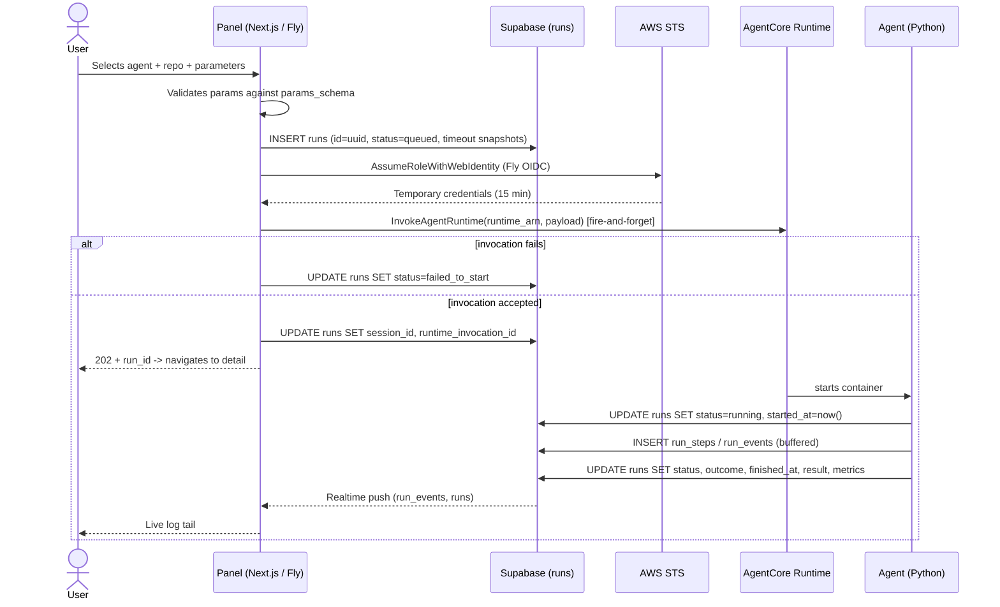
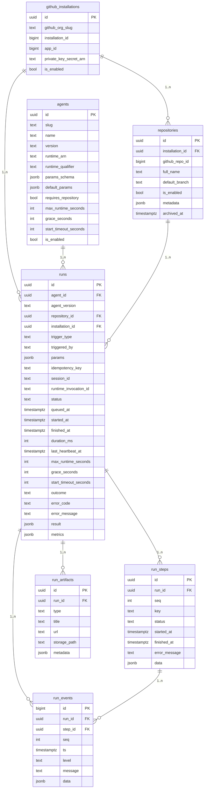
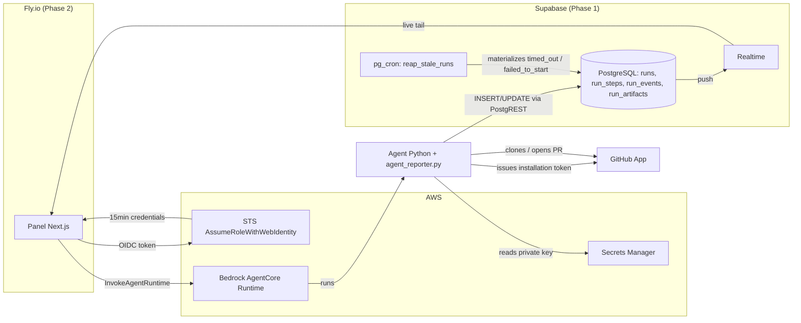

# PRD — Agent Fleet Control Panel v2

## Changelog

| Version | Date       | Summary                                                                 | Author           |
| ------- | ---------- | ----------------------------------------------------------------------- | ---------------- |
| 1.0     | 2026-08-26 | Initial version. Reformatted from `PRD-agent-fleet-v2-consolidado.md` (Draft 2, tmp) into standard PRD structure. Decisions (D1-D14) and risks (R1-R7) preserved. | product-engineer |
| 1.1     | 2026-08-26 | Reference artifacts moved from `tmp/` to `docs/reference/`. All mentions now link to their files. | product-engineer |
| 2.0     | 2026-08-26 | Translated to English. Introduced two-phase delivery model: Phase 1 (database + agent + base API) and Phase 2 (Next.js panel for visualization). | product-engineer |
| 2.4     | 2026-08-27 | Reconciled §19 against `origin/main` at `c8d515e` (issue #77 deployment merged). **F3 partially resolved upstream** — `max_fix_attempts` and the real `runtime_arn` are now seeded; only the Spanish-label fix remains. F1 re-verified unchanged. Recorded the seeded timeout change (`max_runtime_seconds` 900 → 3600, `grace_seconds` 60 → 120) and its effect on log volume. Noted that `docs/runbooks/issue-77-deployment-e2e.md` already carries the correct payload shape while the older manual-config runbook still does not. | product-engineer |
| 2.3     | 2026-08-27 | Linked the Supabase Auth backlog item to the new [`prd-panel-auth-and-rls.md`](prd-panel-auth-and-rls.md). Recorded in F2 that the two deny-all hardening items (explicit `REVOKE`, `security_invoker` on `v_runs`) land with the auth work rather than in Phase 2, with the rationale. | product-engineer |
| 2.2     | 2026-08-27 | Added §19 Fix Proposals — seven research findings (F1-F7) with proposed fixes, severity, and owner. F1 (agent invocation payload contract) additionally tracked as [#89](https://github.com/llipe/dev-tasks-agent-fleet/issues/89) because the panel is its only production caller. F2 resolved in favour of a server-side Realtime relay over an `anon` read policy — the anon key ships in the browser bundle and Supabase's API is public, so D16's private-Fly mitigation would not have covered that exposure. | product-engineer |
| 2.1     | 2026-08-27 | Spec-readiness pass. Resolved D16 (no user auth; R1 mitigation is a Fly deploy setting, not code), D17 (dashboard density toggle, default dense rows). Fixed the §12 Supabase-credential contradiction against D15. Updated Phase 1 status (agent implemented, deployment pending). Scoped Phase 2 to four screens — All runs / Repositories / Settings / System health moved to Non-Goals. Deferred DESIGN.md-derived UI requirements to [`prd-agent-fleet-panel-v3-ui-depth.md`](prd-agent-fleet-panel-v3-ui-depth.md). Added acceptance criteria for FR10, FR11, FR13, FR14. Added FR11a (`v_runs` as read source). Resolved Open Questions #3 and #6. Folded in three correctness corrections from [`research-phase2-panel-spec-inputs-2026-08-27.md`](../../workstream/research-phase2-panel-spec-inputs-2026-08-27.md): the authoritative agent invocation payload contract (`repository_org`/`repository_name`, not a uuid), the RLS deny-all constraint on data-access architecture, and two `002_seed.sql` `params_schema` defects that block the invoke form. | product-engineer |

> **Source:** this document reorganizes, without altering the substantive content, `tmp/PRD-agent-fleet-v2-consolidado.md` (Draft 2 — consolidated, August 26 2026, author Llipe), together with the reference artifacts [`001_schema.sql`](../reference/001_schema.sql), [`002_seed.sql`](../reference/002_seed.sql), [`agent_reporter.py`](../reference/agent_reporter.py), and [`credentials.ts`](../reference/credentials.ts). Closed decisions are referenced by their original identifier (D1-D14) and risks by theirs (R1-R7) for traceability with the source document.

## 1. Executive Summary

Today there is no way to see what agents running on AWS Bedrock AgentCore did without entering the AWS console and crafting CloudWatch Logs Insights queries. That does not scale to multiple agents across ~20 repositories and does not allow triggering an execution with parameters outside the console. This v2 introduces Supabase as the *system of record* for executions — the agent reports its own state explicitly — and a Next.js panel to list agents, view executions with live log tailing, and invoke agents manually with parameters.

Delivery is split into two phases:

- **Phase 1:** Deploy the database schema, build and deploy the `dependency-update` agent connected to GitHub, and expose a base API layer (Supabase PostgREST) so the agent can write lifecycle and events back to the database when manually invoked. If the API is unreachable, the run falls back to leaving logs in CloudWatch (the SDK dumps payloads to stderr on write failure).
- **Phase 2:** Build the Next.js application to visualize run information from the database — agent list, run list, run detail with live log tail, and the manual invocation form.

## 2. Feature Overview

The agent fleet control panel enables:

- Viewing the list of configured agents in the organization.
- Viewing, per agent, the list of its executions (`runs`) with status, duration, and outcome.
- Viewing, per execution, the complete log with live tail (no page reload).
- Manually invoking an agent with parameters from a form generated from its `params_schema`.
- Automatically detecting executions that did not finish (hung or never started) and marking them accordingly, with an event explaining the reason.

Structural change from v1: **Supabase becomes the system of record** for executions. The agent reports state explicitly at every relevant step; nothing is reconstructed by parsing log lines after the execution ended. CloudWatch remains as infrastructure telemetry, outside the panel's functional scope — but acts as a fallback when the agent cannot reach Supabase.

The following diagram summarizes the end-to-end flow of a manual invocation with all pieces involved:

## 3. Goals & Objectives

1. Replace the AWS console / CloudWatch Logs Insights as the sole means of seeing what an agent did.
2. Allow invoking an agent with parameters from the panel, without going through the AWS console.
3. Record the state of each execution explicitly and reliably, including executions that fail silently.
4. Design the data model to support, in the medium term, multiple agents across multiple repos, schedule/webhook triggers, and per-repo agent enablement — without needing to re-model when those capabilities activate.
5. Deliver a productive agent (`dependency-update`) functioning end-to-end on the panel.
6. Keep the local development environment functional against real AgentCore, without static AWS credentials.

## 4. Affected Repositories

| Repo / component | Role / Expected impact |
|---|---|
| `dev-tasks-agent-fleet` (this repo) | Contains the Supabase schema ([`001_schema.sql`](../reference/001_schema.sql), [`002_seed.sql`](../reference/002_seed.sql)), the agent reporting SDK ([`agent_reporter.py`](../reference/agent_reporter.py)), the front-end AWS credential provider ([`credentials.ts`](../reference/credentials.ts)), and the Next.js front-end (pending, Phase 2) |
| Agent repo(s) (e.g., `dependency-update`) | Receives a copy of [`agent_reporter.py`](../reference/agent_reporter.py) (D13); implements the runtime deployed to AgentCore (Phase 1) |
| Supabase project (infrastructure, not code repo) | Applies the `001_schema.sql` migration and the `002_seed.sql` seed; enables `pg_cron` for the reaper (Phase 1) |
| AWS account (infrastructure, not code repo) | Hosts AgentCore runtimes; requires IAM Role + OIDC provider setup described in §12 (Technical Considerations) |

## 5. Target Users

**Primary:** the project author/operator, in their role as maintainer of the GitHub organization, who needs to trigger and audit agents on their repos without using the AWS console.

**Secondary (outside v1, backlog):** other members of a small team, once Supabase Auth with allowlist exists (see §10, Non-Goals).

There is no external end-user or intent for commercial distribution.

## 6. User Stories

1. As an operator, I want to see the list of configured agents so I know what I can invoke without consulting code or external configuration.
2. As an operator, I want to see, per agent, the list of its executions with status, duration, and outcome, to quickly know if something went well or badly.
3. As an operator, I want to see the complete log of an execution with live tail, to debug without entering CloudWatch Logs Insights.
4. As an operator, I want to manually invoke `dependency-update` on a chosen repo with agent-specific parameters from a form in the panel.
5. As an operator, I want executions that hang or never start to be automatically marked as such with an explanation, so I am not left waiting for a result that will never arrive.
6. As an operator, I want to add a new agent by inserting a row in the database without requiring a front-end deploy, so that adding agents is cheap.
7. As an operator, I want the panel to work locally against real AgentCore without having to manage AWS keys by hand, so I can develop without credential friction.

## 7. Functional Requirements

### Phase 1 — Database + Agent + Base API

1. The database schema **must** be deployed to Supabase, including all tables (`github_installations`, `repositories`, `agents`, `runs`, `run_steps`, `run_events`, `run_artifacts`), enums, indexes, the `v_runs` view, the `reap_stale_runs()` function, and RLS deny-all policies — as specified in [`001_schema.sql`](../reference/001_schema.sql).
2. The seed **must** be applied to configure at least one installation, the target repositories, and the `dependency-update` agent — as specified in [`002_seed.sql`](../reference/002_seed.sql).
3. `pg_cron` **must** be enabled and scheduled to run `reap_stale_runs()` every minute — **D10**.
4. The `dependency-update` agent **must** be deployed to AWS Bedrock AgentCore, connected to the target GitHub organization via the GitHub App.
5. The agent **must** use [`agent_reporter.py`](../reference/agent_reporter.py) to write its lifecycle (`status`, `outcome`, `started_at`, `finished_at`), steps, events (buffered per D5), and artifacts back to Supabase via PostgREST.
6. If the Supabase API is unreachable (network failure, misconfiguration), the agent SDK **must** fall back to writing payloads to stderr, which lands in CloudWatch. The agent **must not** crash due to reporting failures — reporting never kills the agent.
7. When manually invoked (via AWS CLI or the future panel), the agent **must** receive `run_id` as a parameter, update the run row from `queued` to `running`, execute its task, and finalize the row with the appropriate terminal status and outcome.
8. The system **must** detect stale executions on two distinct clocks — **D8, D9**:

   | Condition | New status |
   |---|---|
   | `status = running` and `now() > started_at + max_runtime_seconds + grace_seconds` | `timed_out` |
   | `status = queued` and `now() > queued_at + start_timeout_seconds` | `failed_to_start` |

9. The system **must** distinguish `status` (lifecycle) from `outcome` (business result) as separate columns — **D3**.

### Phase 2 — Next.js Panel (Visualization + Invocation)

10. The system **must** list configured agents from the `agents` table, showing at least slug, name, description, and `is_enabled` state.
11. The system **must** list, per agent, its executions (`runs`) ordered by date descending, showing `status`, `outcome`, duration, and associated repository (if applicable).

    **FR11a.** The panel **must** derive displayed run status from the `v_runs` view's `effective_status`, not from `runs.status` directly. This prevents the UI from showing a run as `running` when it has already exceeded its timeout threshold but the `pg_cron` reaper has not yet materialized the state change (see `technical-guidelines.md` §3 — the reaper materializes eventual truth, the view tells immediate truth). Note that `v_runs` is a view and therefore **cannot** be a Realtime subscription source — `001_schema.sql:212-213` publishes `runs` and `run_events` only. The spec must define how a live-updating row reconciles the subscription source with the display source.

12. The system **must** show, per execution, the complete log (`run_events`) ordered by `seq`, with live tail via Supabase Realtime — the user does not reload the page to see new events.
13. The system **must** render the invocation form from `agents.params_schema` (JSON Schema) — **D2**. The repository field is rendered separately, outside the schema, when `agents.requires_repository = true`.
14. When invoking an agent, the front-end **must**:
    a. Generate the `run_id` (uuid) and insert the `runs` row with `status = queued` before invoking AgentCore — **D1**.
    b. Validate received parameters against `params_schema` before invoking.
    c. Snapshot `max_runtime_seconds`, `grace_seconds`, `start_timeout_seconds`, `agent_version`, and `params` in the `runs` row — **D8**.
    d. Invoke `InvokeAgentRuntime` in a fire-and-forget manner from the route handler — **D7**.
    e. If the invocation throws, mark the run as `failed_to_start` immediately, without waiting for the reaper.
    f. Respond `202` with the `run_id` and navigate to the execution detail.
15. The front-end **must** obtain AWS credentials without static keys: via Fly OIDC + `AssumeRoleWithWebIdentity` in production, and via the standard SDK chain (`fromNodeProviderChain`) locally — **D12**.
16. Adding a new agent **must** require only inserting a row in `agents` with its `params_schema`, no front-end changes or deploy — verified by acceptance criterion #5.
17. The Agents Dashboard **must** offer a view toggle across the three density variants defined in `/DESIGN.md` §5.1, defaulting to dense rows (variant 1a), with the selection persisted client-side — **D17**.
18. The panel **must not** implement user authentication — **D16**. No login screen, no user avatar, no roles (consistent with `/DESIGN.md` §11.3). The residual exposure risk this creates is accepted and mitigated at deploy time, not in code (see R1 in §17).

## 8. Business Rules

- **D1 — The front-end generates the `run_id` and creates the `queued` row before invoking.** If the agent never starts, the failure record still exists.
- **D2 — The invocation form is rendered from `agents.params_schema`.** A new agent does not require a front-end deploy.
- **D3 — `status` and `outcome` are separate columns.** An execution that finishes successfully and finds no issues is not a failure.
- **D4 — The log is structured rows in `run_events`, not a blob.** Enables level filtering and live tail via Realtime.
- **D5 — The agent writes with buffering: flush every 50 events or 2 seconds, forced at step boundaries and on termination.** One row per line over HTTPS from AgentCore does not hold up.
- **D6 — Repositories are a first-class entity, not a string in `params`.** The GitHub App token is issued per installation; enables "all runs for repo X."
- **D7 — The front-end runs on Fly.io; invocation to AgentCore is fire-and-forget from the route handler.** The Node process persists after responding; no durable hop (SQS/Lambda) is required.
- **D8 — Timeout is detected by comparing against `max_runtime_seconds`, snapshotted in each run.** The agent cannot report its own death: AgentCore kills the container.
- **D9 — `timed_out` and `failed_to_start` are distinct states on two distinct clocks.** They are two different runbooks: hung agent vs. invocation that never started.
- **D10 — The reaper runs in `pg_cron` inside Supabase, not on Fly.** Does not depend on the panel being alive; does not duplicate if Fly scales to two machines.
- **D11 — RLS enabled and deny-all from the first migration.** Enabling it later is an ugly migration.
- **D12 — The front-end authenticates to AWS via Fly OIDC + `AssumeRoleWithWebIdentity`, no static keys.** Closes the hole that D7 left open on how the front-end calls `InvokeAgentRuntime`.
- **D13 — The agent reporting SDK is a Python file copied per repo, no dependencies.** For 2-3 agents, drift is not a real problem; a pip package adds versioning and publishing overhead that does not pay off today.
- **D14 — The SDK uses a hybrid interface: standard `logging.Handler` + explicit lifecycle API.** The handler captures third-party noise; the lifecycle does not fit in a `logger.info()`.
- **D15 — The agent writes to Supabase via direct PostgREST (Option A), authenticating with the service role key stored in AWS Secrets Manager.** No dedicated API layer in Phase 1. The key never lives as a plaintext env var in the AgentCore runtime config — the agent fetches it from Secrets Manager at startup, using the secret ID carried in `SUPABASE_KEY_SECRET_ID`. A dedicated reporting API is deferred until R2 mitigation or fleet growth justifies it.
- **D16 — Phase 2 ships with no user authentication, and no shared-secret header either.** The two auth concerns in this system are distinct and must not be conflated: *panel → AWS* machine auth is solved by D12 (Fly OIDC + `AssumeRoleWithWebIdentity`) and is required for invocation to work at all; *operator → panel* user auth does not exist. The alternative mitigation floated in R1 (shared-secret header on the invoke route) is **rejected for this iteration** — it would add an auth layer to the API contract for a benefit that keeping the Fly app private achieves with zero code. Consequence for the spec: no middleware, no session handling, no protected routes. `runs.triggered_by` is populated with a constant or left null, not with an authenticated identity.
- **D17 — The Agents Dashboard ships all three density variants behind a persisted view toggle, defaulting to dense rows.** The variants share one query and differ only in presentation; the correct default is not knowable before real usage. See §11.

## 9. Data Requirements

Full reference DDL: [`001_schema.sql`](../reference/001_schema.sql). Reference seed: [`002_seed.sql`](../reference/002_seed.sql).

Design notes encapsulated by the data model:

- **`github_installations`:** one row in v1 — not multi-tenancy, it is a requirement of the GitHub App token flow (token is issued per installation at the organization level).
- **`repositories`:** unique `(installation_id, full_name)`. `archived_at` is soft delete that preserves historical runs. `metadata jsonb` stores language, package manager, owning team.
- **`agents`:** no `agent_versions` table in v1 — each run snapshots `agent_version`, `params`, and `max_runtime_seconds`, providing auditability without the extra table. `params_schema` does **not** include the repository (first-class field rendered separately). `max_runtime_seconds` must reflect the real timeout configured in AgentCore.
- **`runs`:** `id` generated by the front-end (D1). Timeout thresholds snapshotted at dispatch — if the agent's timeout changes from 10 to 30 minutes tomorrow, historical runs are not re-evaluated against the new value. `grace_seconds` compensates for `started_at` being marked by the agent at startup while AgentCore's clock starts earlier during container cold start. `last_heartbeat_at` is declared but not used for detection in v1. Indexes: `(agent_id, created_at desc)`, `(repository_id, created_at desc)`, partial on `status in ('queued','running')` for the reaper, partial unique on `idempotency_key`.
- **`run_steps`:** `id` generated by the agent SDK (uuid4), not the database, to avoid a read round-trip before associating events. The agent emits steps from day one even if the v1 front-end only displays raw log — **retrofitting steps over historical logs is not possible**.
- **`run_events`:** `seq` is monotonic, assigned by the agent, not the database — with buffering, arrival order is not emission order. Messages truncated to 8 KB. Realtime enabled, filtered by `run_id`.
- **`run_artifacts`:** the generated PR lives here, not buried in `result jsonb` — the link is rendered in the execution list without parsing JSON.

## 10. Non-Goals (Out of Scope)

**Out of v1 (explicitly declared):**

- User authentication — the first iteration runs without login (**D16**). This is a decision, not a deferral pending design: no shared-secret header either.
- Automatic schedules.
- Repo sync from the GitHub App — manual seed in its place ([`002_seed.sql`](../reference/002_seed.sql)).
- Cost Explorer, prompt evaluation, findings materialization.

**Out of Phase 2 scope — deferred UI surfaces.** The prototype's sidebar shows four destinations with no backing requirement in this PRD. They are out of scope and **must not** be implemented as functioning routes:

| Deferred screen | Why deferred |
|---|---|
| **All runs** (cross-agent run feed) | Redundant with per-agent run history at v1 fleet size (1 agent) |
| **Repositories** | Repo management is manual seed in v1 (see above); no CRUD surface is warranted |
| **Settings** | Nothing user-configurable exists — all configuration lives in the `agents` table or AgentCore |
| **System health** | No health-signal source exists; `last_heartbeat_at` is declared but unused for detection in v1 |

**Out of Phase 2 scope — deferred UI depth.** A set of `/DESIGN.md`-specified behaviors (run history filtering and pagination, step-panel click-to-filter, log viewport bounding, Realtime reconnect backfill semantics, and the terminal-state banner matrix) are captured as a next-iteration PRD at [`prd-agent-fleet-panel-v3-ui-depth.md`](prd-agent-fleet-panel-v3-ui-depth.md) for later refinement. They are **not** in scope for the Phase 2 spec.

**Declared backlog, not implemented (data model already supports or anticipates):**

| Item | Future form |
|---|---|
| Supabase Auth with allowlist | **Now specified** in [`prd-panel-auth-and-rls.md`](prd-panel-auth-and-rls.md) — GitHub OAuth, `app_users` allowlist, `viewer`/`operator` roles, RLS policies per role, `triggered_by` = `auth.uid()`. Retires R1 |
| `schedules` | `schedules` table (`agent_id`, `cron`, `params`, `is_enabled`) + EventBridge |
| `agent_repository_settings` | Enable/disable an agent per repo |
| Repo sync | Job that reads the GitHub App installation and upserts into `repositories` |
| `findings` with stable fingerprint | For the security agent; deduplication across runs |
| Run cancellation | `status = canceled` already exists in the enum; the signal mechanism to the agent is missing |
| `run_events` retention | Collapse to Storage + purge (see R3 in §17) |
| Heartbeat | Use `last_heartbeat_at` for finer detection than the timeout threshold |
| R5 mitigation | Per-agent configurable minimum captured level, if an actual agent triggers it |
| SDK as pip package | If the fleet exceeds ~4 agents and drift between copies starts hurting (revisit D13) |

## 11. Design Considerations

**`/DESIGN.md` now exists.** A high-fidelity prototype at `/docs/prototype/` (built on the Nocturne dark design system) was analyzed and codified into [`/DESIGN.md`](/DESIGN.md). That file is the visual source of truth for Phase 2 implementation, covering: design tokens (colors, typography, spacing, radius, shadows), component specifications (buttons, tags, status pills, inputs, log lines, nav items, toggles), layout architecture (sidebar + content shell, table/card grids, run detail full-height layout), interaction patterns (animations, hover states, keyboard shortcuts, live-tail scroll behavior), and data formatting conventions (timestamps, durations, counts, typography usage rules).

The prototype defines 6 screens:
1. **App Shell** — collapsible sidebar (212px/52px) + top breadcrumb bar + content area
2. **Agents Dashboard** — three density variants (dense table, 2-col cards, ledger list)
3. **Agent Run History** — filterable run table with status/outcome pills, repo + PR links
4. **Run Detail** — full-height layout with summary, steps panel, and streaming log viewer
5. **Run Detail States** — terminal-state banners (timed_out, failed_to_start, queued)
6. **Invoke Agent** — schema-driven form dialog with toggle switches, select fields, success confirmation

**Phase 2 screen scope.** All six prototype screens are in scope. The sidebar destinations that the prototype shows but that have no backing requirement in this PRD — **All runs**, **Repositories**, **Settings**, **System health** — are out of scope (see §10). The spec **must** render them as disabled or absent nav entries rather than dead links.

**D17 — The Agents Dashboard ships all three density variants behind a user-selectable view toggle, defaulting to dense rows (variant 1a).** The toggle state is a client-side preference persisted in `localStorage`, consistent with the sidebar-collapse pattern in `/DESIGN.md` §11.3. Rationale: the three variants share one data query and differ only in presentation, so the marginal cost over picking one is presentation-layer work, and the right default is not knowable before the operator has used the panel against real run volume.

Functional UI considerations already decided at product level:

- The invocation form is generated dynamically from `params_schema` (JSON Schema) — no forms are hand-coded per agent.
- The repository selector is shown separately from the dynamic form, conditional on `agents.requires_repository`.
- The log tail must feel live (no reload), consistent with Realtime on `run_events`. Auto-scroll when within 24px of bottom; scroll-up pauses; click "live tail" resumes.
- The execution list must allow distinguishing `status` and `outcome` at a glance — they are separate concepts: status is a colored pill with a dot, outcome is an outlined uppercase tag. They are never merged into a single visual element.
- A `failed` run carrying a `pull_request` artifact (the `MAJOR_UPDATE_REQUIRED` case from the dependency-update agent PRD) must surface the artifact link alongside the red status — not hide it behind the failure color.
- Status colors: `succeeded` = `#74b58f`, `failed` = `#d1706b`, `timed_out` = `#d1a45e`, `running` = accent (`#9184d9` with pulse animation and glow), `failed_to_start` = hollow dot (muted).
- The design system is Nocturne (dark theme, Inter font, 0.7x density spacing, 8px base radius, blurple accent #9184d9 used as lines/glows never as floods).

## 12. Technical Considerations

**Reference architecture:**

**Front-end AWS authentication (D12).** The front-end needs to call `bedrock-agentcore:InvokeAgentRuntime`. Without OIDC, the alternative would be an IAM user with static keys in `fly secrets` — long-lived credentials, no rotation, identical for all Machines. Instead:

1. **AWS setup (one-time):**
   - Register Fly as an OIDC Identity Provider: issuer `https://oidc.fly.io/{your-org}`, audience `sts.amazonaws.com`.
   - Create an IAM Role with a federated trust policy scoped to `aud = sts.amazonaws.com` and `sub` matching `<your-org>:panel-agentes:*` (Machine wildcard — pinning to a specific Machine breaks on every deploy).
   - Attach permissions scoped to `bedrock-agentcore:InvokeAgentRuntime` on the runtimes ARN, not `*`.
2. **In the front-end:** a single credential provider ([`credentials.ts`](../reference/credentials.ts)) with two branches transparent to invocation code:

   | Environment | Branch | How |
   |---|---|---|
   | Fly | `fly-oidc` | OIDC token from local socket → `AssumeRoleWithWebIdentity` → 15-min credentials, cached in memory with 60-second margin |
   | Local | `local-chain` | `fromNodeProviderChain()` — SSO profile, `~/.aws/credentials`, or env vars. SDK handles its own refresh |

   Environment detection is by `FLY_APP_NAME` plus existence of the local socket (`/.fly/api`). Invocation code receives the provider and does not know which branch it is on.

   **Pending verification** (not validated against the real Fly endpoint): exact JSON response shape from the OIDC socket; literal claim name `sub` as normalized by AWS in the trust policy; that `DurationSeconds: 900` is compatible with the role's configured `MaxSessionDuration`.

**Agent reporting contract (§9 of the source document).** [`agent_reporter.py`](../reference/agent_reporter.py), copied to each agent repo (D13). Stdlib only (`urllib`) — the container does not gain a dependency tree to do POST/PATCH. Required env vars: `SUPABASE_URL`, `RUN_ID`, `RUN_PARAMS`, `AGENT_LOG_LEVEL`. The `SUPABASE_SERVICE_ROLE_KEY` is **not** supplied as a runtime env var — the agent fetches it from AWS Secrets Manager at startup (D15) using the secret ID in `SUPABASE_KEY_SECRET_ID`, then sets it into the process environment in-process so the SDK's `from_env()` contract still holds. This keeps the key out of the runtime configuration visible in the AgentCore console. Changing the transport (move writes to a panel endpoint instead of direct PostgREST) touches only the `_SupabaseClient` class, ~40 lines.

**Fallback behavior:** when PostgREST is unreachable (Phase 1 development, network issues, or misconfiguration), the SDK writes the failed payloads to stderr after 3 retries. Those payloads land in CloudWatch via AgentCore's log routing. This ensures no execution is invisible — if the database cannot record it, CloudWatch still captures the raw evidence.

**Deferred to the Phase 2 spec (technical decisions, not product requirements).** The following are within Phase 2 scope but this PRD deliberately does not prescribe them — they are implementation choices the specification must resolve:

| Decision | Constraint the spec must satisfy |
|---|---|
| Realtime reconnect semantics | On subscription drop and recovery, events emitted during the gap **must not** be silently lost. `run_events.seq` is monotonic per run, so a backfill query above the last-seen `seq` is available. The connection-state indicator in `/DESIGN.md` §11.3 must reflect actual subscription state |
| Initial `run_events` fetch size | R3 warns this table grows two orders of magnitude beyond the others; the run-detail view must not attempt an unbounded fetch |
| Front-end test layer taxonomy | The repository default is test-first design. `technical-guidelines.md` §11 defers the JS/TS framework choice to Phase 2 start — the spec must define it and extend `/TESTING.md` accordingly |
| Data-access layer | Whether the panel reads Supabase via the JS client, PostgREST directly, or Next.js server components. Constrained by FR11a (`v_runs`, not `runs`) **and by the RLS posture below** |

**RLS constrains the data-access architecture (D11 consequence, not previously stated).** `001_schema.sql` enables RLS on all seven tables and creates **zero policies** — deny-all, with only `service_role` bypassing. Two consequences the spec must design around:

1. **A browser-side Supabase client using the anon key reads nothing and receives no Realtime events.** The conventional Supabase + Next.js pattern does not work here. Because the service role key cannot ship in a browser bundle, data access must be server-side (server components or route handlers) unless read policies are added — which is a scope decision, not an implementation detail.
2. **Granting `anon` SELECT on `v_runs` is not a safe shortcut.** In PostgreSQL 15+, `security_invoker` defaults to `false`, so a view executes with its owner's privileges and bypasses RLS on its base tables. Exposing `v_runs` to an unauthenticated client would surface every `runs` column — including `params` and `error_message` — which combined with D16 (no user auth) means public exposure if the Fly app is ever made public. If the spec chooses this path it **must** create the view with `security_invoker = true` and add explicit policies.

**`dependency-update` agent (first productive agent, Phase 1):**

| Param | Type | Default | Description |
|---|---|---|---|
| `repository_id` | uuid | — | First-class field, outside `params_schema`. **This is the `runs` row FK, not the invocation payload** — see the payload contract note below |
| `fix_mode` | enum `audit_only` \| `llm_fix` | `audit_only` | `audit_only` runs npm audit and reports; `llm_fix` attempts to fix and open a PR |
| `fail_on_findings` | bool | `true` | Only applies in `audit_only`: if there are vulnerabilities, the run finishes as `failed` |
| `max_fix_attempts` | int 0-5 | `3` | Retry budget for the LLM fix loop. Accepted and clamped by the agent, but **currently absent from `002_seed.sql`'s `params_schema`** — see prerequisites below |

**Invocation payload contract (authoritative: `agents/dependency-update/app/dependencyUpdate/main.py`).** The agent requires three non-empty top-level strings — `run_id`, `repository_org`, `repository_name` — plus optional `params` and `base_branch` (default `main`). A payload missing any of the three is rejected as `failed` / `not_applicable` / `INVALID_PARAMS` before any clone occurs.

The panel therefore **must** translate: it holds `repository_id` for the `runs` FK, and must resolve it to `repositories.full_name`, split on `/`, and emit `repository_org` + `repository_name` in the invocation payload. The repository is **not** passed as a uuid and **not** nested under `params`.

> Documentation drift corrected in v2.1: earlier revisions of this PRD implied the uuid was sent to the agent, and `workstream/pending-manual-config-dependency-update-agent.md` §9 contains E2E examples nesting the repo as `params.repository.full_name`. Both are wrong against the implemented agent. The runbook needs the same correction.

**Phase 2 prerequisites in `002_seed.sql`.** Two seed defects must be fixed before the invoke form is usable, because the form renders directly from `params_schema`:

1. The `params_schema` `title` and `description` values are Spanish. Rendering them produces a Spanish UI, violating the repository's English-only rule through data rather than code — invisible to any linter.
2. `max_fix_attempts` is absent from `params_schema`, so the generated form cannot expose a parameter the agent accepts. This is an instance of the R4 drift class, already present before the panel exists.

Expected outcomes:

| `status` | `outcome` | Meaning |
|---|---|---|
| `succeeded` | `no_vulnerabilities` | npm audit clean |
| `succeeded` | `fixed` | PR opened with all vulnerabilities resolved |
| `succeeded` | `partial` | PR opened, some vulnerabilities remain unresolved |
| `succeeded` | `needs_review` | Findings exist, no fix attempted (`audit_only` with `fail_on_findings=false`) |
| `failed` | `needs_review` | `audit_only` with findings and `fail_on_findings=true` |

The agent reads the GitHub App private key and `installation_id` from Secrets Manager to issue an installation token for cloning and PR creation. The Supabase service role key is fetched from Secrets Manager at startup as well (D15) — only the *pointer* to it (`SUPABASE_KEY_SECRET_ID`, default `agent-fleet/prod/SUPABASE_SERVICE_ROLE_KEY`) is a runtime environment variable. The key value itself is never present in the AgentCore runtime configuration.

## 13. Acceptance Criteria

### Phase 1 Acceptance

1. The database schema is deployed to Supabase and `reap_stale_runs()` runs on schedule via `pg_cron`.
2. A manual invocation of `dependency-update` (via AWS CLI) on a real repo finishes with `status = succeeded` and the correct `outcome`, with lifecycle and events written to the database.
3. If the Supabase API is unreachable during a run, the agent does not crash and leaves logs in CloudWatch via stderr.
4. A run that is never picked up (simulated by not starting the agent) is marked `failed_to_start` by the reaper within `start_timeout_seconds + 60s`.
5. A run that hangs (simulated by a sleep exceeding `max_runtime_seconds`) is marked `timed_out` by the reaper within 60 seconds after exceeding the threshold.

### Phase 2 Acceptance

6. The log is visible in the panel in real time, without page reload.
7. A new agent is added by inserting a row in `agents` with its `params_schema` — zero front-end deploys.
8. The front-end runs on Fly without any AWS keys in `fly secrets`, and runs locally with an SSO profile with no code changes.
9. *(FR10)* The Agents Dashboard lists every `is_enabled` agent from the `agents` table with slug, name, and description, and the density toggle switches between all three `/DESIGN.md` §5.1 variants with the selection surviving a page reload.
10. *(FR11, FR11a)* The Agent Run History lists that agent's runs newest-first with `status`, `outcome`, duration, and repository. A run whose timeout threshold has passed but which the reaper has not yet updated displays as `timed_out`, not `running` — verified by reading from `v_runs` with the `pg_cron` job paused.
11. *(FR13)* The invocation form for `dependency-update` renders `fix_mode` as a select and `fail_on_findings` as a toggle, derived solely from `agents.params_schema`, with the repository selector rendered separately because `requires_repository = true`.
12. *(FR14)* An invocation inserts a `queued` run row with snapshotted thresholds *before* calling AgentCore, returns `202` with the `run_id`, and navigates to the run detail. An invocation whose `InvokeAgentRuntime` call throws is marked `failed_to_start` by the route handler itself, without waiting for the reaper.
13. *(FR14b)* Parameters that violate `params_schema` are rejected client-side before any `runs` row is inserted — a rejected submission leaves no database trace.
14. *(§11)* A `failed` run carrying a `pull_request` artifact surfaces the artifact link alongside the red status pill, not hidden behind the failure state.

## 14. Success Metrics

Equivalent to the acceptance criteria (§13) — in a product of this type, the acceptance criterion *is* the success metric, without indirect proxies for adoption or engagement given that the user is the system's own operator. Additionally:

- Absence of executions stuck indefinitely in `queued` or `running` without resolving to a terminal state (validated by the reaper, criteria 4-5).
- Zero front-end deploy time when adding a new agent (criterion 7).

## 15. Assumptions

- A single GitHub organization and a single `github_installation` are sufficient for v1.
- Execution and log event volume in v1 is low, so R3 (`run_events` growth) and R5 (per-execution write volume) are manageable without immediate mitigation (see §17).
- AgentCore, Fly.io, and the GitHub App are or will be configured outside the scope of this panel; the panel consumes them, it does not provision them.
- The agent fleet stays small (on the order of 2-4) long enough that copying `agent_reporter.py` per repo (D13) does not cause problematic drift.
- `max_runtime_seconds` in the `agents` table is kept manually in sync with the real timeout configured in AgentCore — there is no automatic cross-validation in v1.

## 16. Constraints & Dependencies

- **External infrastructure dependency (to be provisioned outside this panel):** Supabase project with `pg_cron` enabled, AWS account with Bedrock AgentCore, GitHub App installed at the organization level, Fly.io app (Phase 2).
- **Design artifacts already defined** (status per source document):

  | File | What it is | Status |
  |---|---|---|
  | [`001_schema.sql`](../reference/001_schema.sql) | Full DDL: tables, enums, indexes, `v_runs` view, `reap_stale_runs()`, RLS | Done. `pg_cron` schedule commented until the extension is enabled |
  | [`002_seed.sql`](../reference/002_seed.sql) | Idempotent seed: installation, repo list, `dependency-update` agent | Done. Edit block 1, repo list, and `runtime_arn` |
  | [`agent_reporter.py`](../reference/agent_reporter.py) | Agent reporting SDK | Done. Tested with fake client: write sequence, monotonic `seq`, step association, exception propagation |
  | [`credentials.ts`](../reference/credentials.ts) | AWS credential provider with Fly OIDC and local branches | Done. Compiles with `tsc --strict`. §12 pending verification items not validated against real Fly endpoint |
  | Next.js front-end | Routes, schema-generated forms, live tail | Pending (Phase 2) — this is the sole remaining scope of the Phase 2 spec |
  | `dependency-update` agent | AgentCore runtime | **Implemented** (Phase 1). Deterministic audit→classify→update→validate pipeline, bounded LLM fix loop ([ADR-001](../adr/ADR-001-llm-fix-agent-escape-hatch.md)), idempotent `open_pr` step + `pull_request` artifact ([ADR-002](../adr/ADR-002-open-pr-step-and-pr-artifact.md)). 328 tests passing. **Pending: deployment + E2E** (issue #77) and the manual infrastructure runbook in [`pending-manual-config-dependency-update-agent.md`](../../workstream/pending-manual-config-dependency-update-agent.md) |
  | Supabase schema + seed applied to a live project | Schema, seed, `pg_cron` reaper schedule | Pending — manual runbook steps 5 and 7 |

- **Timeline:** not formalized in the source document; no delivery date is fixed in this PRD.

## 17. Security & Compliance

Risks identified in the source document with their minimal mitigation or declared future exit:

**R1 — No authentication in the first iteration (D16).** The panel triggers agents that write to organization repos; anyone with the URL can invoke them. Read access without auth is a minor problem; **invocation** without auth is not. **Decision for this iteration:** the shared-secret header is rejected and the risk is mitigated at deploy time — the Fly app is kept private (no public service / no allocated public IP), so the invoke route is not reachable from the internet. This is a deployment configuration item, not a code requirement, and therefore imposes nothing on the Phase 2 spec. The residual risk is that a future deploy that exposes the app publicly silently removes the only mitigation; the exit path remains Supabase Auth with an allowlist (§10 backlog).

**R2 — The agent uses the Supabase `service role key`.** Grants full database access, not just writing its own events. The key is stored in AWS Secrets Manager and fetched at startup (D15) — not exposed as a plaintext env var in the AgentCore runtime config. Acceptable for a single-tenant personal system. Exit: dedicated Postgres role with grants limited to `insert` on `run_events`/`run_steps` and `update` on its own `run_id`, via a signed JWT for that role. Does not resolve D12 — they are credentials for two different APIs.

**R3 — `run_events` growth over time.** Will be the largest table by two orders of magnitude. Retention policy to define before it hurts: events older than 90 days collapse to an artifact in Supabase Storage and rows are purged.

**R4 — `params_schema` without strong validation.** If the schema in the database does not match what the agent expects, failure appears at runtime. Mitigation: the agent validates its own payload at startup and fails fast with `error_code = INVALID_PARAMS`.

**R5 — Write volume from a verbose agent.** An agent that logs at `DEBUG` over a noisy library can generate thousands of lines per execution. Distinct from R3 (growth over time): R5 is volume *within a single execution*. Chosen option: evaluate later, do nothing until an actual agent evidences it. If it appears, the first lever is raising the minimum captured level (`INFO+`).

**R6 — Drift between local and Fly environments.** The local SSO profile almost always has more permissions than the scoped OIDC role — something that works locally may fail on Fly due to a missing permission in the policy. Mitigation if it bothers: assume the same role locally with a profile pointing to the Fly `role_arn`.

**R7 — Test runs against the production database.** Local development invokes real AgentCore and the agent writes to whichever Supabase is configured — mixing test runs with real ones. Exit: a second Supabase project for development, same schema.

**Additional compliance:** RLS enabled deny-all from the first migration (D11); the GitHub App private key never lives in the database, only its ARN in Secrets Manager; no static AWS keys in any deployment environment (D12); Supabase service role key stored in Secrets Manager, not as an env var (D15).

## 18. Open Questions

**Resolved in v2.1:**

- ~~Is the minimal mitigation for R1 (no authentication) decided before or after the first Fly deployment?~~ → Resolved as **D16**: no user auth and no shared-secret header. Mitigation is keeping the Fly app private, applied at deploy time.
- ~~Does each agent's repo (e.g., `dependency-update`) live in this monorepo or in a separate repo?~~ → Resolved by implementation: agents live in this repo under `agents/<slug>/`. [`agent_reporter.py`](../reference/agent_reporter.py) is copied to `agents/dependency-update/app/dependencyUpdate/` rather than to a separate repository, so D13's drift concern currently applies within one repo.
- ~~Which Agents Dashboard density variant ships?~~ → Resolved as **D17**: all three behind a toggle, default dense rows.

**Still open:**

- At what point (number of agents, or actual drift signal) is `agent_reporter.py` packaged as a pip package instead of copied per repo (D13, §10)?
- What is the retention threshold for `run_events` before table growth hurts (R3), and who reviews it?
- When does it become worthwhile to move from "a second Supabase project for development" (R7) to a more formal staging environment?
- The exact JSON response shape from the Fly OIDC socket, and the literal `sub` claim name as normalized by AWS, remain pending empirical verification against a real Machine (§12) — blocks end-to-end validation of acceptance criterion #8. **This is the one open question that constrains the Phase 2 spec**: the spec can define the credential-provider contract, but acceptance criterion #8 cannot be closed until a Fly Machine is available to probe.
- How many `run_events` should the run-detail viewer load initially, and does it bound the viewport? Deferred to [`prd-agent-fleet-panel-v3-ui-depth.md`](prd-agent-fleet-panel-v3-ui-depth.md), but the Phase 2 spec must still choose an initial fetch size — flagged as a spec-level decision rather than a product requirement.

---

## 19. Fix Proposals — Research Findings

Source: [`workstream/research-phase2-panel-spec-inputs-2026-08-27.md`](../../workstream/research-phase2-panel-spec-inputs-2026-08-27.md) (commit `411b027`). Each finding below is a defect in an existing artifact that Phase 2 depends on, with a proposed fix and an owner. These are **not** new product scope — they are corrections required for the Phase 2 requirements in §7 to be implementable as written.

Severity key: **Blocking** = Phase 2 cannot function without it. **Correctness** = Phase 2 functions but produces a wrong result. **Hygiene** = no functional impact, but violates a repository rule or leaves a trap.

| ID | Finding | Severity | Proposed fix | Owner |
|---|---|---|---|---|
| F1 | Agent invocation payload contract mismatch | **Blocking** | See F1 below — panel-side translation + runbook correction. Tracked as [#89](https://github.com/llipe/dev-tasks-agent-fleet/issues/89) | Phase 2 spec + `developer` |
| F2 | RLS deny-all blocks browser-side reads and Realtime | **Blocking** | See F2 below — server-side data access, no anon client | Phase 2 spec |
| F3 | `002_seed.sql` `params_schema` is Spanish and omits `max_fix_attempts` | **Correctness** | **Partially resolved upstream** by issue #77 — `max_fix_attempts` and the real `runtime_arn` are now seeded. Only the Spanish-label fix remains. See F3 below | Phase 2 spec (prerequisite task) |
| F4 | `v_runs` cannot be a Realtime source; display source ≠ subscription source | **Correctness** | See F4 below — client-side `effective_status` recomputation | Phase 2 spec |
| F5 | `credentials.ts` token-extraction fallback is unsafe; comments are Spanish; file is unplaced | **Correctness** | See F5 below | Phase 2 spec |
| F6 | `001_schema.sql` / `002_seed.sql` are documents, not migrations | **Hygiene** | See F6 below — adopt Supabase CLI migrations | Phase 2 spec |
| F7 | No JS/TS package is reachable from `make validate` or CI | **Hygiene** | See F7 below — wire the panel into the aggregate gate | Phase 2 spec |

### F1 — Agent invocation payload contract (Blocking)

**Finding.** The authoritative contract is `agents/dependency-update/app/dependencyUpdate/main.py`: `_REQUIRED_FIELDS = ("run_id", "repository_org", "repository_name")`, three non-empty top-level strings. Optional `params` and `base_branch` (default `main`). A payload missing any required field is rejected as `failed` / `not_applicable` / `INVALID_PARAMS` before any clone.

Three documents describe three different shapes, and only the code is right:

| Source | Shape | Correct? |
|---|---|---|
| `main.py:64` | `repository_org` + `repository_name`, flat strings | **Authoritative** |
| This PRD, pre-v2.1 §12 | `repository_id` uuid sent to the agent | No |
| `workstream/pending-manual-config-dependency-update-agent.md` §9 | `params.repository.full_name`, nested | No |

**Proposed fix (three parts):**

1. **Panel-side translation (Phase 2 spec, normative).** The invoke route handler resolves `repository_id` → `repositories.full_name`, splits on the first `/`, and emits `repository_org` + `repository_name` at the payload top level. `repository_id` remains the FK on the `runs` row and is **never** sent to the agent. The split must reject a `full_name` without exactly one `/` rather than sending a malformed payload.
2. **Runbook correction.** Fix the §9 E2E invoke examples in `pending-manual-config-dependency-update-agent.md` to the authoritative shape. As written they fail validation, so anyone following that file gets `INVALID_PARAMS` and debugs the wrong layer. **Status after the `origin/main` merge:** the *newer* `docs/runbooks/issue-77-deployment-e2e.md` already uses the correct shape (line 236), so the corrected examples exist — but the older file still carries the wrong ones and is not marked superseded. Either fix it or point it at the new runbook; two runbooks disagreeing is worse than one being wrong.
3. **Contract test (Phase 2 spec, normative).** A test asserting the panel's emitted payload satisfies `_REQUIRED_FIELDS`. Because the panel is TypeScript and the agent is Python, no compiler catches drift here — this boundary needs an explicit test or it will break silently again. Suggested form: a fixture of the exact payload the panel produces, asserted against the agent's `validate_payload` contract.

**Why it is tracked as an issue rather than only as a spec line.** The UI is the only production caller of this contract — the panel is what will actually trigger the agent, and no code path exercises the translation today. It needs a checklist item with a verification step, not a paragraph. Tracked as [#89](https://github.com/llipe/dev-tasks-agent-fleet/issues/89).

**Do not fix by changing the agent.** The agent is implemented, tested (328 tests), and about to deploy. Changing `_REQUIRED_FIELDS` to accept a uuid would require the agent to query Supabase for the repository row before it can clone, adding a database round-trip and a failure mode to a path that currently has neither. The panel already holds the repository row it needs.

### F2 — RLS deny-all blocks browser-side data access (Blocking)

**Finding.** `001_schema.sql` enables RLS on all seven tables and creates zero policies (D11, deny-all). Only `service_role` bypasses. Consequences:

- A browser Supabase client using the anon key returns zero rows and receives zero Realtime events. FR12 (live tail) has no working transport under the conventional pattern.
- The service role key cannot ship in a browser bundle.
- Granting `anon` SELECT on `v_runs` is not a safe workaround: in PostgreSQL 15+ `security_invoker` defaults to `false`, so the view runs with its owner's privileges and **bypasses RLS on its base tables**, exposing every `runs` column including `params` and `error_message`. Under D16 (no user auth) that is public exposure if the Fly app is ever made public.

**Proposed fix.** Keep the service role key server-side and add **no** RLS policies in Phase 2:

1. All reads go through Next.js server components or route handlers holding the service role key as a server-only secret. No `NEXT_PUBLIC_`-prefixed Supabase key exists.
2. Realtime is the one case needing a live push to the browser. Two options were considered:
   - **Rejected: a narrow read-only `anon` policy on `run_events`.** This looks cheap and keeps Realtime's native browser subscription, but the exposure is wider than it first appears. The anon key ships in the browser bundle, and Supabase's REST and Realtime endpoints are public — so an `anon` read policy exposes every run log line to anyone holding that key, independent of whether the Fly app is private. D16's mitigation (private Fly app) does not cover Supabase's own public API surface. Log lines carry repository names, dependency versions, and agent error output.
   - **Chosen: server-side subscription relayed to the browser.** A route handler holds the service role key, subscribes to `run_events` server-side, and re-publishes to the client over Server-Sent Events. Deny-all is preserved completely and no Supabase credential reaches the browser. The cost is implementing the relay and managing its lifecycle; at single-operator concurrency (1-2 connections) this is not a scaling concern.
3. `v_runs` **must not** be granted to `anon` under either option. If a future iteration needs it client-side, recreate it with `security_invoker = true` first.
4. Record the choice as a decision in the spec, because it is the single largest architectural consequence of D11 and is not recoverable cheaply later.

**Two hardening items deferred to the auth PRD, not to Phase 2.** Analysis of the deny-all posture surfaced that it is a *single* control, not defence in depth: `001_schema.sql` contains zero `GRANT`/`REVOKE` statements, so Supabase's default `anon` grants remain in place and RLS is the only thing blocking the public API. Disabling RLS on one table — or adding a new table without enabling it — exposes it instantly. Separately, `v_runs` has no `security_invoker`, so it executes with owner privileges and bypasses RLS on its base tables.

Both fixes are specified as FR17 and FR18 in [`prd-panel-auth-and-rls.md`](prd-panel-auth-and-rls.md) rather than here, because they are cheap to land alongside the policy work and premature in isolation: with no policies to protect, `REVOKE` and `security_invoker` guard nothing that deny-all does not already guard. Phase 2 **must not** grant `anon` access to any table or view, which keeps both traps closed until the auth work lands.

### F3 — `002_seed.sql` `params_schema` defects (Correctness — **partially resolved upstream**)

> **Status update (merge of `origin/main` at `c8d515e`, issue #77).** Two of the three defects were fixed upstream while this PRD was being written. `max_fix_attempts` is now present in `params_schema` with `minimum: 0, maximum: 5, default: 3` and in `default_params`. `runtime_arn` now carries the real deployed ARN. **The Spanish-label defect remains** and is the only part of F3 still open.
>
> The merge also changed the seeded timeouts materially: `max_runtime_seconds` 900 → **3600** and `grace_seconds` 60 → **120**, to match `maxLifetime` in `agentcore.json`. The `001_schema.sql` column defaults are unchanged; the seed overrides them. This does not alter any requirement, but it means a single run can now span 60 minutes rather than 15 — relevant to the log-viewport bound in the Phase 2 spec (SD11) and to R3's growth argument.

**Finding.** The invoke form renders directly from `agents.params_schema` (D2), so defects in seed data become defects in the UI.

1. ~~`max_fix_attempts` is absent from the schema~~ — **resolved upstream.**
2. `title` and `description` values are Spanish — a Spanish UI, violating the repository's English-only rule through *data*, so no linter can catch it. Current values: `"Modo de corrección"`, `"Fallar si hay hallazgos"`, `"Intentos máximos del agente LLM"`, plus all three descriptions. **Still open.**

**Proposed fix.** Translate all `title` / `description` strings to English and re-apply as a Phase 2 prerequisite, before the invoke form is built. The seed is idempotent via `on conflict`, so re-application is safe. It **must** go through F6's migration tooling rather than another hand-paste into the SQL Editor.

**Standing mitigation.** The deeper problem is that nothing validates `params_schema` against what the agent accepts. `max_fix_attempts` being fixed upstream does not close that gap — it closed one instance of it. A cheap guard: a test asserting the seeded schema's property names are a subset of the agent's known parameter names. That closes R4's feedback loop without building schema cross-validation infrastructure.

### F4 — `v_runs` display source vs. Realtime subscription source (Correctness)

**Finding.** FR11a requires displaying `v_runs.effective_status`. But `001_schema.sql:212-213` publishes only `runs` and `run_events` to `supabase_realtime`, and views cannot be published. So the subscription source and the display source are necessarily different objects. A naive implementation subscribes to `runs`, receives a push carrying `status = 'running'`, and overwrites a correctly-computed `timed_out` display — the exact bug FR11a exists to prevent, reintroduced through the live-update path.

**Proposed fix.** Recompute `effective_status` client-side on every render, from fields the panel already has:

1. Initial load reads `v_runs` (server-side), which supplies `effective_status` plus the snapshot columns `started_at`, `queued_at`, `max_runtime_seconds`, `grace_seconds`, `start_timeout_seconds`.
2. A single pure function — mirroring the view's `case` expression in `001_schema.sql:240-248` — derives display status from those fields plus current time. It is applied to both the initial row and every Realtime push, so the two paths cannot disagree.
3. That function is the natural home for a unit test asserting parity with the SQL view's three branches (`running` past threshold → `timed_out`; `queued` past threshold → `failed_to_start`; otherwise passthrough). Duplicated logic across two languages needs a test pinning them together.

This is duplicated logic, which is a real cost. The alternative — polling `v_runs` instead of subscribing — trades a correctness risk for a latency and load cost, and contradicts D4's rationale for Realtime. Duplicate the three-branch `case` and test it.

### F5 — `credentials.ts` defects (Correctness)

**Finding.** Three distinct problems in the reference artifact:

1. **Unsafe token extraction.** Line 60: `parsed.value ?? parsed.token ?? parsed.aud`. `aud` is the audience (`sts.amazonaws.com`), not a token. If the real response shape uses neither `value` nor `token`, this sends the audience string to STS as a web identity token, producing a confusing authentication error rather than a clear parse failure. The final fallback (`data.trim()` on unparseable output) has the same problem.
2. **Spanish comments** throughout, violating the English-only rule.
3. **Unplaced.** The header targets `lib/aws/credentials.ts`, a path that does not exist. Nothing imports it.

**Proposed fix.**

1. Replace the guess-chain with an explicit allowlist of expected field names (`value`, `token`) and **fail loudly** when none is present, rather than falling through to a value known to be wrong. An unverified endpoint shape is a reason to error clearly, not to guess.
2. Translate all comments to English during adoption.
3. Relocate to the panel's `lib/aws/` on adoption; the spec fixes the exact path when it settles the folder convention.
4. Keep the embedded `curl` verification command (line 57) as a comment — it is the procedure that closes Open Question #5.

### F6 — Schema and seed are documents, not migrations (Hygiene)

**Finding.** There is no `supabase/` directory and no `supabase/migrations/`. `001_schema.sql` and `002_seed.sql` live under `docs/reference/` and are applied by hand-pasting into the Supabase SQL Editor (`pending-manual-config-dependency-update-agent.md` §5). F3 already requires a second application, and F2's Realtime option may require a third. There is no versioned path for any of them.

**Proposed fix.** Adopt Supabase CLI migrations as part of Phase 2 setup:

1. Create `supabase/migrations/` and move the schema in as the first timestamped migration, preserving content exactly so the live database matches without a destructive re-apply.
2. Keep the seed as `supabase/seed.sql` (already idempotent via `on conflict`).
3. Land F3's corrections as a second migration rather than an edit to the first.
4. Leave `docs/reference/` copies in place as documentation, or replace them with links to the migration files — the spec decides, but they **must not** remain independently editable, or they will drift from the applied database.

This also serves R7 (test runs against production): a migration directory makes standing up a second Supabase project for development a command instead of a manual replay.

### F7 — No JS/TS package reachable from the aggregate gate (Hygiene)

**Finding.** `make validate` (Makefile:32) runs Python-only lint, format-check, typecheck, test-cov, and audit. CI (`.github/workflows/ci.yml`) runs a Python 3.13/3.14 matrix. `TESTING.md` records that no JS/TS application test package exists, and treats unreachability from the aggregate gate as a harness defect class. The one existing TS package (`agents/dependency-update/agentcore/cdk/`) has jest with **no coverage wiring** — a weak precedent that would produce a panel package passing `pnpm test` while measuring nothing.

**Proposed fix.**

1. Add the panel as a `pnpm` package with the canonical scripts (`lint`, `format:check`, `typecheck`, `test`, `test:unit`, `test:integration`, `test:e2e`, `audit`, `validate`) per `technical-guidelines.md` §12.
2. Extend `make validate` with a JS/TS branch so the panel's gates run in the same aggregate command as the agent's, and extend the CI workflow with a Node job.
3. Wire coverage from the start — do not follow the `agentcore-cdk-app` precedent.
4. Update `TESTING.md` with the panel's package row, its layer assignments, and its reachability from the gate. Per `technical-guidelines.md` §11 this is where the front-end layer taxonomy gets defined.
