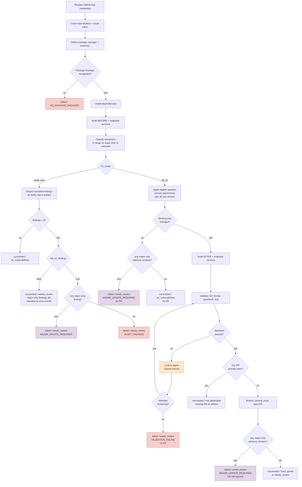
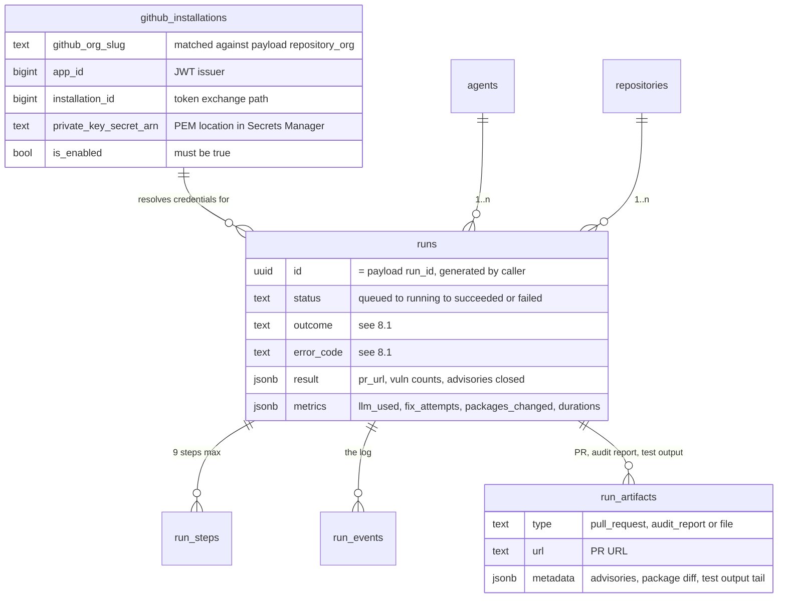
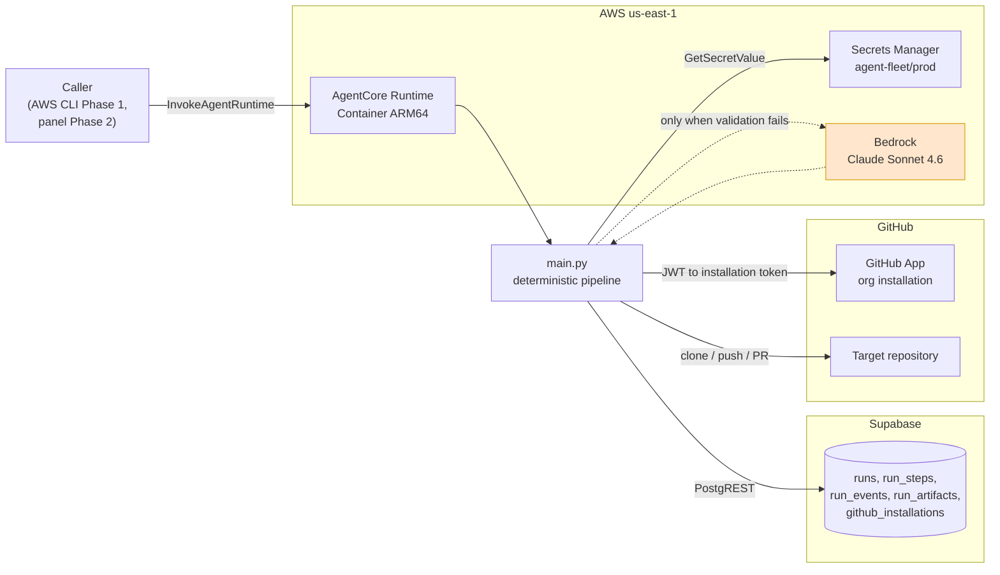

# PRD — Dependency Update Agent

## Changelog

| Version | Date       | Summary                                                                                                                                                            | Author           |
| ------- | ---------- | ------------------------------------------------------------------------------------------------------------------------------------------------------------------ | ---------------- |
| 1.0     | 2026-08-26 | Initial version. Scopes the first productive agent of the fleet: deterministic dependency-update pipeline with an LLM escape hatch, GitHub App auth, AgentCore Container runtime under `/agents/`. Introduces decisions D16-D24. | product-engineer |
| 1.1     | 2026-08-26 | An advisory that only a major-version bump can close is now a first-class, identified failure rather than a `partial` footnote. Adds D25, `error_code = MAJOR_UPDATE_REQUIRED`, advisory classification requirements, risk R13, and open questions on precedence and range parsing. | product-engineer |
| 1.2     | 2026-08-26 | Adds the version eligibility policy (D26, requirements 32-35): semver patch and minor accepted, `0.x` minors treated as major-equivalent, and **non-semver versions accepted outright** with the validation suite as the gate. Eligibility judged on resolved lockfile versions. Adds acceptance criteria 9-11 and a reporting obligation in the PR body. | product-engineer |

> **Relationship to other documents.** This PRD is a **child** of [`prd-agent-fleet-panel-v2.md`](prd-agent-fleet-panel-v2.md). The parent PRD defines the control plane (Supabase as system of record, the `runs` lifecycle, the reaper, the Next.js panel) and declares the `dependency-update` agent as a Phase 1 deliverable without specifying its internals. This document specifies those internals. Decisions D1-D15 are inherited from the parent and are **not** restated except where this agent constrains them; new decisions continue the numbering at **D16**. Risks R1-R7 are likewise inherited; new risks continue at **R8**.>
> **Structural reference.** The pipeline design is adapted from [`llipe/dep-update-agent`](https://github.com/llipe/dep-update-agent), specifically [`dependencyUpdateAgent/app/depUpdateAgent/main.py`](https://github.com/llipe/dep-update-agent/blob/main/dependencyUpdateAgent/app/depUpdateAgent/main.py). That repository is a standalone proof of concept using a PAT and no persistence layer. This PRD adapts the pattern to the fleet: GitHub App authentication, Supabase run reporting via [`agent_reporter.py`](../reference/agent_reporter.py), and a monorepo layout under `/agents/`.

---

## 1. Executive Summary

The `dependency-update` agent is the first productive agent of the fleet. It keeps the dependency trees of the organization's repositories patched by running a **deterministic pipeline** — clone, audit, update, validate, open PR — and invokes an LLM **only** when the validation suite breaks as a consequence of the version bumps. On the happy path the run consumes zero model tokens.

It is also deliberately honest about its own limits. The agent updates only within declared semver ranges, so a vulnerability that only a major-version bump can close is outside what it may do. Rather than absorbing that into a partial success, the run **fails with a named error that identifies the package, the installed version, and the major it would take** — because a security gap the agent cannot close is a human migration decision, and reporting it as anything other than a failure would hide it.

Its strategic importance is twofold: it delivers real value (removes the toil of manually patching ~20 repos) and it is the **first end-to-end proof** of the control plane defined in the parent PRD — a real agent writing a real lifecycle to Supabase, satisfying Phase 1 acceptance criterion #2.

---

## 2. Feature Overview

Given a target repository and a mode, the agent:

1. Resolves GitHub App credentials for the repository's organization and mints a short-lived installation token.
2. Clones the repository shallowly and scrubs the token from disk immediately.
3. Detects the package manager and the toolchain version the project expects.
4. Installs dependencies and snapshots the audit state and the resolved package versions.
5. In `audit_only` mode: classifies and reports findings, then stops.
6. In `llm_fix` mode: applies every eligible update — semver patch and minor, plus any change where the version is not semver and the guard cannot apply — then re-snapshots and runs the validation suite.
7. If the validation suite fails, a Strands coding agent (Claude Sonnet) diagnoses and fixes the breakage, bounded by a retry budget.
8. Opens a pull request with a body containing the security diff, the package diff, and the validation results.
9. If any vulnerability remains that **only a major-version bump can close**, the run ends as a failure that names the package, the installed version, and the major it would take — because that is a human migration decision the agent is not permitted to make.

Throughout, it reports `status`, `outcome`, steps, events, and artifacts to Supabase through [`agent_reporter.py`](../reference/agent_reporter.py).

### 2.1 Pipeline shape

Two properties are decisive. The first is where the LLM sits: outside the main path, reachable from one edge only. The second is that a vulnerability outranging the agent's mandate exits through its own labelled door rather than being folded into a success.



Note the ordering on the right-hand path: the pull request is opened **before** the major-only check terminates the run. Validated patch/minor work is never discarded because of a separate vulnerability the agent was never permitted to touch — see D25.

### 2.2 Credential resolution

Two secrets, two different lookups. Neither credential is ever a plaintext environment variable in the AgentCore runtime configuration.

```mermaid
sequenceDiagram
    participant AC as AgentCore Runtime
    participant AG as Agent (main.py)
    participant SM as AWS Secrets Manager<br/>(agent-fleet/prod)
    participant DB as Supabase (PostgREST)
    participant GH as GitHub API

    AC->>AG: invoke(run_id, repository_org, repository_name, params)
    AG->>AG: validate payload against expected shape
    Note over AG: fail fast with INVALID_PARAMS if invalid

    AG->>SM: GetSecretValue(SUPABASE_SERVICE_ROLE_KEY)
    SM-->>AG: service role key
    AG->>AG: inject into os.environ, then RunReporter.from_env()
    AG->>DB: PATCH runs SET status=running, started_at

    AG->>DB: GET github_installations?github_org_slug=eq.{repository_org}
    DB-->>AG: app_id, installation_id, private_key_secret_arn
    AG->>SM: GetSecretValue(private_key_secret_arn)
    SM-->>AG: GitHub App private key (PEM)

    AG->>AG: sign RS256 JWT (iss=app_id, exp=+9min)
    AG->>GH: POST /app/installations/{installation_id}/access_tokens
    GH-->>AG: installation token (1h TTL)
    Note over AG: token used for clone and PR;<br/>scrubbed from .git/config after clone
```

---

## 3. Goals & Objectives

1. **Eliminate manual dependency patching** across the organization's repositories, for pnpm and npm projects.
2. **Keep the cost floor at zero.** No model tokens are consumed unless the validation suite breaks. Measurable: `llm_used = false` in the run metrics on the happy path.
3. **Prove the control plane end-to-end.** A real invocation produces a complete, correct `runs` row with steps, events, and artifacts — satisfying parent PRD Phase 1 acceptance criterion #2.
4. **Establish the agent project convention.** `/agents/<agent-name>/` becomes the reproducible layout for every future agent, deployable with `agentcore deploy` and no bespoke infrastructure code.
5. **Replace PAT-based access with GitHub App access,** so repository access is scoped, auditable, and revocable per installation rather than tied to a human account.
6. **Never open a PR that a human cannot trust.** Either the validation suite passes, or no PR is created.
7. **Never report success over a vulnerability the agent could not close.** A finding that requires a major-version bump is surfaced as a named failure with the package, the installed version, and the target major — not absorbed into a `partial` outcome.

---

## 4. Affected Repositories

| Repo / component                       | Role / Expected impact                                                                                                                                                                                                                    |
| -------------------------------------- | ----------------------------------------------------------------------------------------------------------------------------------------------------------------------------------------------------------------------------------------- |
| `dev-tasks-agent-fleet` (this repo)    | **Primary.** Adds `/agents/dependency-update/` — an AgentCore CLI project (config, CDK, `app/`, Dockerfile) with `main.py` and a copy of `agent_reporter.py`. Updates [`002_seed.sql`](../reference/002_seed.sql) with this agent's `params_schema`, `runtime_arn`, and timeout thresholds. |
| Target repositories (~20, org-wide)    | **Read + write via GitHub App.** Cloned; receive a branch `deps/update-<timestamp>` and a pull request. No direct pushes to their default branch.                                                                                          |
| Supabase project (infrastructure)      | Consumes writes to `runs`, `run_steps`, `run_events`, `run_artifacts`. Requires a `github_installations` row for the target organization with a populated `private_key_secret_arn`. **No schema migration required.**                        |
| AWS account (infrastructure)           | Hosts the AgentCore Container runtime (ARM64, `us-east-1`), the `agent-fleet/prod` Secrets Manager entries, and the agent execution role. Provisioned by `agentcore deploy` (CDK) plus a one-time secrets setup.                            |
| GitHub App (infrastructure)            | Installed at organization level with the permissions listed in §17. Its `app_id`, `installation_id`, and private key ARN are recorded in `github_installations`.                                                                            |

---

## 5. Target Users

**Primary:** the fleet operator (project author), who invokes the agent — via AWS CLI in Phase 1, via the panel in Phase 2 — and reviews the resulting pull requests.

**Secondary:** any future maintainer of a target repository, who consumes the agent's output as a PR to review. They never interact with the agent directly; the PR body is their entire interface, which is why §7 requirement 24 treats the PR body as a first-class deliverable.

There is no external end user.

---

## 6. User Stories

1. As an operator, I want to invoke the agent on a repository and get a reviewable pull request with patch/minor dependency updates, so I stop doing it by hand.
2. As an operator, I want the agent to run without consuming model tokens when nothing breaks, so routine maintenance is effectively free.
3. As an operator, I want the agent to fix its own breakage when a version bump changes an API, so a broken test suite does not silently abandon the update.
4. As an operator, I want to run the agent in audit-only mode to see the security posture of a repository without changing anything.
5. As an operator, I want the PR body to tell me which advisories were closed and which packages moved, so I can review without reconstructing the diff myself.
6. As an operator, I want a vulnerability that only a major bump can close to be reported as a failure naming the package and the target version, so it lands on my desk as a migration decision instead of disappearing into a green run.
7. As an operator, I want the agent to never open a PR whose tests fail, so a green PR means something.
8. As an operator, I want a second invocation on the same repository to be a no-op while my PR is still open, so a schedule or a double-click does not create PR spam.
9. As an operator, I want to see which pipeline step a run is on and read its log live, so I can debug a failure without opening CloudWatch.
10. As an operator, I want repository access to come from a GitHub App rather than my personal token, so access is scoped and survives my credentials rotating.
11. As an operator, I want to add a second agent later by copying the `/agents/<name>/` layout, so the first agent sets a reusable convention instead of a one-off.

---

## 7. Functional Requirements

### 7.1 Project structure and deployment

1. The agent **MUST** live at `/agents/dependency-update/` inside this repository, as a self-contained AgentCore CLI project — **D16**.
2. The project structure **MUST** be generated by the AgentCore CLI (`agentcore create`) as the first implementation task, rather than hand-authored, so the layout stays canonical for `agentcore deploy` — **D22**. The expected result:

   ```
   agents/dependency-update/
     agentcore/
       agentcore.json        # runtime config: Container build, entrypoint, lifecycle
       aws-targets.json      # account + region (us-east-1)
       cdk/                  # CDK infrastructure, CLI-managed
     app/
       dependencyUpdate/
         main.py             # entrypoint: deterministic pipeline + LLM escape hatch
         agent_reporter.py   # copy of docs/reference/agent_reporter.py (D13)
         Dockerfile          # ARM64, Node + pnpm + gh CLI + Python
         pyproject.toml      # Python dependencies
     README.md
   ```

3. The runtime **MUST** use the `Container` build type, not `CodeZip`, because the agent requires system-level dependencies (Node, pnpm, npm, `git`, `gh` CLI) that a source-zip runtime cannot provide.
4. The container image **MUST** be ARM64 (AgentCore Runtime requirement) and **MUST** include Node 26, pnpm, npm, `git`, the `gh` CLI, and Python 3.13+.
5. Deployment **MUST** be performed by `agentcore deploy`. No separate hand-written CDK stack is introduced for this agent.
6. The entrypoint **MUST** use the `bedrock-agentcore` Python SDK (`BedrockAgentCoreApp`, `@app.entrypoint`) and the `HTTP` protocol.
7. The fix agent **MUST** use the Strands Agents framework with Bedrock as the model provider, model `us.anthropic.claude-sonnet-4-6` — **D23**. The model ID **MUST** be overridable by the `MODEL_ID` environment variable without a code change.

### 7.2 Invocation contract

8. The agent **MUST** accept the following invocation payload:

   ```json
   {
     "run_id": "uuid",
     "repository_org": "string",
     "repository_name": "string",
     "params": {
       "fix_mode": "audit_only | llm_fix",
       "fail_on_findings": true,
       "max_fix_attempts": 3
     }
   }
   ```

9. The agent **MUST** tolerate the payload arriving wrapped as a JSON string inside a `prompt` key (the shape the AgentCore CLI and SDK produce) and unwrap it transparently.
10. The agent **MUST** validate the payload before doing any work and, on mismatch, terminate the run as `failed` with `error_code = INVALID_PARAMS` — the mitigation declared for inherited risk R4.
11. Parameter defaults **MUST** be: `fix_mode = audit_only`, `fail_on_findings = true`, `max_fix_attempts = 3`. `max_fix_attempts` **MUST** be constrained to `0..5`; `0` disables the LLM escape hatch entirely.
12. The clone URL **MUST** be derived as `https://github.com/{repository_org}/{repository_name}.git`. The agent **MUST NOT** accept a caller-supplied URL, so a payload cannot redirect the agent at an arbitrary host.
13. The agent **MUST NOT** receive `repository_id` or `installation_id` in the payload. `run_id` is sufficient: the `runs` row already carries both foreign keys, and `repository_org` is sufficient to resolve credentials (see requirement 15).

### 7.3 Credentials

14. The agent **MUST** read the Supabase service role key from AWS Secrets Manager at startup, from the `agent-fleet/prod` vault under a secret named `SUPABASE_SERVICE_ROLE_KEY`. The secret ID **MUST** be overridable via the `SUPABASE_KEY_SECRET_ID` environment variable. `SUPABASE_URL` remains a plain environment variable — it is not a secret.
15. The agent **MUST** resolve GitHub App credentials by querying `github_installations` via PostgREST, filtered on `github_org_slug = repository_org`, selecting `app_id`, `installation_id`, and `private_key_secret_arn` — **D18, option A**. It **MUST NOT** construct the Secrets Manager path from the organization name.
16. If no enabled `github_installations` row matches `repository_org`, the run **MUST** terminate as `failed` with `error_code = NO_INSTALLATION`.
17. The agent **MUST** mint a GitHub App installation token by signing an RS256 JWT (`iss = app_id`, `exp ≤ 10 minutes`) with the PEM fetched from `private_key_secret_arn`, then exchanging it at `POST /app/installations/{installation_id}/access_tokens`. It **MUST NOT** use a Personal Access Token — **D18**.
18. After cloning, the agent **MUST** rewrite the `origin` remote to the tokenless URL, so no credential is left on disk in `.git/config`. The token **MUST** be supplied to `git push` only for the duration of that call, via an ephemeral credential helper.
19. The agent **MUST** scrub the token from every error message, log event, and command string before it reaches `run_events`, stderr, or the returned payload.
20. Because installation tokens expire after one hour and an `llm_fix` run may approach that bound, the agent **MUST** re-mint the token before pushing if more than 45 minutes have elapsed since it was issued.

### 7.4 Toolchain detection — the opinionated contract

21. The agent **MUST** detect the package manager from lockfile evidence, in this precedence order — **D19**:

    | Evidence                                        | Package manager |
    | ----------------------------------------------- | --------------- |
    | `packageManager` field in `package.json`        | as declared     |
    | `pnpm-lock.yaml`                                | pnpm            |
    | `package-lock.json`                             | npm             |
    | none of the above                               | **fail**        |

    On failure the run **MUST** terminate as `failed` with `error_code = NO_PACKAGE_MANAGER` and a message naming what was searched for. Python (pip/uv) support is explicitly deferred — see §10.

22. For pnpm, the agent **MUST** match the major version the project expects, inferring it from the `packageManager` field or from `lockfileVersion` in `pnpm-lock.yaml` (`9.x → pnpm 9`, `6.x → pnpm 8`, `5.x → pnpm 7`), and install that major globally when the container's default differs.
23. The agent **MUST** resolve its validation commands from `package.json` `scripts` against this contract — **D20**:

    | Script                            | Requirement | Behavior if absent                                    |
    | --------------------------------- | ----------- | ----------------------------------------------------- |
    | `test`                            | **required** | Run terminates `failed` / `error_code = NO_TEST_SCRIPT` |
    | `lint` (and optional `lint:fix`)   | optional    | Reported as `skipped`; run continues                  |
    | `format` (or `format:fix`, `format:check`) | optional | Reported as `skipped`; run continues            |
    | `typecheck` (or `type-check`, or `tsconfig.json` → `tsc --noEmit`) | optional | Reported as `skipped`; run continues |

    Every absent optional script **MUST** produce a `warn`-level `run_event` naming it, so the gap is visible in the panel rather than silent. This is the intended reading of "opinionated with some margin": the agent refuses to work on a repository it cannot verify, but does not refuse over cosmetics.

24. When `lint` fails and a `lint:fix` script exists, the agent **MUST** run `lint:fix` once and re-check before reporting failure. The same applies to `format` / `format:fix`.

### 7.5 Audit, classification, and update

25. The agent **MUST** run the package manager's audit in JSON mode both **before** and **after** the update, and snapshot resolved direct dependency versions at both points, so the PR body can state a security diff and a package diff rather than a bare version list.
26. The agent **MUST** treat a non-zero audit exit code as data, not as an error — an audit that finds vulnerabilities has succeeded at its job.
27. The agent **MUST** compute which advisories were closed by diffing advisory identifiers between the before and after snapshots.
28. In `audit_only` mode the agent **MUST NOT** modify the working tree, **MUST NOT** push a branch, and **MUST NOT** open a pull request. It records the audit result as a `run_artifacts` row of type `audit_report`.
29. In `llm_fix` mode the agent **MUST** apply **patch and minor updates within existing semver ranges only**. It **MUST NOT** widen a declared range, edit a `package.json` version specifier, or perform a major-version bump on a semver-versioned package — see §10, requirement 32, and requirement 46.
30. After updating, the agent **MUST** reconcile the lockfile with a follow-up install so that a consumer running a frozen/CI install does not fail on a lockfile configuration mismatch.
31. If the working tree is unchanged after the update, the agent **MUST** stop without opening a pull request. It terminates as `succeeded` / `no_vulnerabilities` — **D21** — unless requirement 38 applies.

#### Version eligibility — what the agent may accept

32. The agent **MUST** decide eligibility per candidate version change by comparing the **resolved versions** taken from the lockfile, not the declared specifiers — **D26**:

    | Installed → target                                                | Eligible | Rationale                                                        |
    | ----------------------------------------------------------------- | -------- | ---------------------------------------------------------------- |
    | Both parse as semver, major unchanged (patch or minor)             | **yes**  | The semver contract says this is non-breaking                    |
    | Both parse as semver, major increases                              | no       | Human migration decision — see requirements 39-43                |
    | Both parse as semver, major is `0` and **minor** increases          | no       | Under semver, `0.y.z` offers no stability guarantee, and npm/pnpm caret ranges already treat a `0.x` minor as breaking. Classified major-equivalent. |
    | Either resolved version **does not parse as semver**                | **yes**  | See requirement 33                                               |

33. When either resolved version does not parse as semver, the change **MUST** be accepted — **D26**. A non-semver version carries no reliable signal about whether the change is breaking, so the semver guard has nothing to act on. Refusing on that basis would freeze those dependencies permanently, security patches included, which is a worse outcome than accepting the change and letting the validation suite decide. **The test suite is the gate for these, not the version string.**
34. Non-semver acceptance **MUST NOT** become a route around requirement 32. If the **target** version parses as semver and its major exceeds the installed major, ineligibility stands, regardless of whether the installed version parsed.
35. Every version change accepted under requirement 33 **MUST** be reported: a `warn`-level `run_event` naming the package and both versions, and a dedicated section in the PR body listing them as accepted without a semver guarantee. A reviewer is entitled to know which rows of the package diff the guard did not cover.

    *Implementation note.* The npm registry enforces semver on published versions, so non-semver **resolved** versions arise almost entirely from `git:`, `file:`, `workspace:`, aliased, or patched dependencies — most of which the package manager will not move on its own anyway. This rule is a correctness guard for a narrow set of cases, not a common path; it does not warrant heavy machinery.

#### Advisory classification — major-version detection

36. The agent **MUST** classify every advisory it observes into exactly one of three buckets — **D25**:

    | Bucket           | Meaning                                                                                              |
    | ---------------- | ---------------------------------------------------------------------------------------------------- |
    | `in_range`       | A version satisfying the advisory's patched range exists within the dependency's declared semver range, and reaching it is eligible under requirement 32. The agent can close it. |
    | `major_required` | The lowest version satisfying the patched range is ineligible under requirement 32 — a higher major, or a `0.x` minor increase, or outside the declared range. Only a human migration closes it. |
    | `unknown`        | The patched range could not be parsed, the advisory carries no usable patched-version information, or the affected package's resolved version is not semver so no comparison is possible. |

37. Classification **MUST** be derived from three inputs: the advisory's patched-version range as reported by the audit, the resolved version of the affected package, and the range declared in `package.json`. It **MUST** use the same eligibility rules as requirement 32, so the two do not drift apart. The agent **MUST NOT** ask the LLM to perform this classification — it is deterministic parsing, and D17 keeps the model off the main path.
38. When the patched range cannot be parsed with confidence, or the affected package is not semver-versioned, the agent **MUST** classify the advisory as `unknown` rather than guessing either way. An `unknown` advisory **MUST** be reported as such and **MUST NOT** trigger the `major_required` failure path — fabricating a migration requirement is worse than admitting the comparison was not possible. This is the same reasoning as requirement 33, applied to advisories rather than to version changes.
39. If any advisory remains classified `major_required` at the end of the pipeline, the run **MUST** terminate as `failed` with `error_code = MAJOR_UPDATE_REQUIRED`, in both modes. This is a deliberate, identified failure: the agent has hit the boundary of its mandate and is refusing to report success across it — **D25**.
40. For each `major_required` advisory, the agent **MUST** emit an `error`-level `run_event` naming, at minimum:
    - the package name;
    - the currently resolved version;
    - the range declared in `package.json`;
    - the lowest version that closes the advisory, and its major;
    - the advisory identifier and any CVE references;
    - the severity.

    A summary event **MUST** state the count and the highest severity among them, so the panel's log view leads with the headline rather than requiring the reader to assemble it.

41. The `audit_report` artifact **MUST** record the three buckets as separate, distinguishable groups, so the panel can render "3 fixable, 1 needs a major migration" without re-deriving the classification.
42. **Precedence rules**, which resolve the interaction between this failure and every other terminal state:
    - `MAJOR_UPDATE_REQUIRED` **MUST** take precedence over any `succeeded` outcome, including `fixed`, `partial`, and `no_vulnerabilities`.
    - `VALIDATION_FAILING` **MUST** take precedence over `MAJOR_UPDATE_REQUIRED`. A broken suite is the more urgent problem and the run produced no PR anyway.
    - In `audit_only` mode with `fail_on_findings = false`, the run **MUST** still terminate `succeeded` / `needs_review`. The parameter is an explicit instruction not to fail on findings and overriding it would make the parameter a lie. The `error`-level events of requirement 40 and the artifact classification of requirement 41 are still emitted, so the information is not lost — only the status is softened, on request.
    - Where an already-open pull request short-circuits the run (requirement 56), the classification of the current audit **MUST** still be reported, but the run terminates `succeeded` / `not_applicable`. The open PR is the actionable item; a duplicate failure adds noise.

43. When the run opens a pull request **and** a `major_required` advisory remains, the agent **MUST** open the pull request first and terminate `failed` afterwards. Validated patch/minor work **MUST NOT** be discarded because of a vulnerability the agent was never permitted to address — **D25**. The resulting run is a `failed` run carrying a legitimate `pull_request` artifact, and §8.1 documents this combination as intentional.

### 7.6 The LLM escape hatch

44. The LLM **MUST** be invoked only when the validation suite fails **after** a dependency update in `llm_fix` mode — **D17**. It **MUST NOT** be invoked to triage audit findings, to classify advisories, to decide version eligibility, to choose versions, to author the PR body, or anywhere on the happy path.
45. The fix agent **MUST** be given exactly these tools, and no others: run a shell command inside the checkout, read a file, write a file, find files by name, and grep source files.
46. Every path-taking tool **MUST** resolve the path against the workspace root and refuse any path that escapes it, so the model cannot read or write outside the checkout.
47. The fix agent's system prompt **MUST** forbid: deleting, skipping, or weakening a test to make the suite green; editing dependency versions to roll the update back; and widening a declared semver range or performing a major bump to make an error go away. The purpose of the run is to land the eligible update, not to survive it or to quietly exceed its mandate.
48. The fix loop **MUST** be bounded by `max_fix_attempts`. After each attempt the agent re-runs the validation suite.
49. If the fix agent succeeds, the agent **MUST** re-run lint, format, and typecheck, because the model may have touched source files after those checks last passed.
50. After the fix agent runs, the agent **MUST** verify that `package.json` version specifiers are unchanged from the pre-update state. If the model widened a range or bumped a major despite requirement 47, the run **MUST** terminate `failed` with `error_code = MANDATE_VIOLATION` and **MUST NOT** open a pull request. A prompt constraint is not an enforcement mechanism; this is the enforcement.
51. If the validation suite still fails after the attempt budget is exhausted, the agent **MUST NOT** open a pull request. It terminates as `failed` / `needs_review` / `VALIDATION_FAILING` with the test output tail recorded as a `run_artifacts` row.
52. The run **MUST** record whether the LLM was used, and how many attempts it took, in `runs.metrics`.

### 7.7 Pull request

53. The branch name **MUST** be `deps/update-<UTC timestamp YYYYMMDD-HHMMSS>`.
54. The commit message **MUST** follow Conventional Commits: `chore(deps): automated dependency update`.
55. The agent **MUST NOT** push to or merge into the target repository's default branch. Its only write is a new branch plus a pull request.
56. Before creating a pull request the agent **MUST** check for an already-open pull request whose head branch matches `deps/update-*`. If one exists, it **MUST** stop, record that PR's URL as the run artifact, and terminate as `succeeded` / `not_applicable` — **D21**, subject to the precedence rule in requirement 42.
57. The pull request body **MUST** be passed via `--body-file`, never inline, and **MUST** contain:
    - a security summary table: vulnerability count before, after, and advisories closed;
    - a table of closed advisories with severity, package, title, and CVE or advisory reference;
    - **when any advisory remains classified `major_required`, a prominent section** titled to make the gap unmissable, listing each such package with its resolved version, declared range, the minimum version that closes the advisory, severity, and advisory reference — plus an explicit statement that this PR does **not** resolve them and that a human major-version migration is required;
    - when any advisory remains classified `unknown`, a short section listing them as unverifiable rather than silently omitting them;
    - **when any version change was accepted under requirement 33**, a section listing those packages as accepted without a semver guarantee, so the reviewer knows which rows of the package diff the semver guard did not cover;
    - a table of changed packages with from/to versions, capped for readability;
    - a validation results table covering lint, format, typecheck, tests, and lockfile reconciliation, distinguishing passed from skipped;
    - **when the LLM was used, a prominent warning** stating that an AI agent modified source files and that the non-lockfile diff needs careful review.
58. The pull request **MUST** be recorded as a `run_artifacts` row of type `pull_request` with its URL and title, so the panel can render the link without parsing `result`.

### 7.8 Reporting

59. The agent **MUST** report its lifecycle through [`agent_reporter.py`](../reference/agent_reporter.py), used as a context manager, so that an unhandled exception marks the run `failed` with a traceback and closes any open step as `failed`.
60. The copy of `agent_reporter.py` under `/agents/dependency-update/app/` **SHOULD** remain byte-identical to `docs/reference/agent_reporter.py`. To achieve this while honoring D15, `main.py` **MUST** fetch the service role key from Secrets Manager and inject it into `os.environ` **before** calling `RunReporter.from_env()`, rather than modifying the SDK — **D24**. This keeps the D13 copy-per-repo decision from accumulating drift on its first use.
61. The agent **MUST** emit these `run_steps`, in order, with these keys:

    | `run_steps.key`     | Covers                                                        | Modes         |
    | ------------------- | ------------------------------------------------------------- | ------------- |
    | `resolve_credentials` | Installation lookup, PEM fetch, installation token mint     | both          |
    | `checkout`          | Clone, token scrub, git identity                              | both          |
    | `detect_toolchain`  | Package manager, toolchain version, script contract           | both          |
    | `install`           | Dependency install                                            | both          |
    | `audit`             | Audit before, version snapshot, advisory classification       | both          |
    | `update`            | Apply updates, lockfile reconciliation, audit after + diff + reclassification | `llm_fix` |
    | `validate`          | lint, format, typecheck, test                                 | `llm_fix`     |
    | `llm_fix`           | Fix agent attempts (only created when validation failed)      | `llm_fix`     |
    | `open_pr`           | Idempotency check, branch, commit, push, PR creation          | `llm_fix`     |

    Steps **MUST** be emitted even though the Phase 1 consumer displays only raw log, because step structure cannot be retrofitted over historical logs (inherited parent-PRD constraint).

62. Reporting failures **MUST NOT** terminate the agent. When PostgREST is unreachable, the SDK's stderr fallback carries the payload to CloudWatch and the pipeline continues.
63. The agent **MUST** return a structured result payload from its entrypoint containing at minimum: `status`, `outcome`, `error_code`, `pr_url` (when applicable), vulnerability counts before and after, advisories closed, the count of remaining advisories per classification bucket, packages changed, fix attempts, and `llm_used`.

### 7.9 Seed configuration

64. [`002_seed.sql`](../reference/002_seed.sql) **MUST** be updated so the `dependency-update` row carries the `params_schema` implied by requirement 8, `requires_repository = true`, and timeout thresholds consistent with the deployed runtime: `max_runtime_seconds = 3600`, `grace_seconds = 120`, `start_timeout_seconds = 300`.
65. `agents.max_runtime_seconds` **MUST** match the `maxLifetime` configured in `agentcore.json`. There is no automatic cross-validation (inherited assumption); the two values are kept in sync manually and this coupling **MUST** be stated in the agent's README.

---

## 8. Business Rules

New decisions introduced by this PRD. D1-D15 are inherited from the parent PRD.

- **D16 — Agents live in this monorepo under `/agents/<agent-name>/`, one self-contained AgentCore project each.** Resolves the open question left by the parent PRD ("does the agent live in this monorepo or a separate repo"). Keeping them here means the schema, the reporting SDK, and its consumers version together; the cost is that this repository is polyglot, which it already is.
- **D17 — Deterministic pipeline, LLM as escape hatch on exactly one edge.** The model is reachable only from "validation failed after update." Everything else — version selection, advisory diffing, PR body assembly, idempotency — is code. This is what makes the happy path cost nothing and makes failures reproducible.
- **D18 — GitHub App, not PAT.** Access is scoped to the installation, auditable per app, and survives rotation of any human credential. The agent discovers `app_id`, `installation_id`, and the private key ARN from the `github_installations` row matching the repository's organization (**option A**), rather than deriving a secret path by naming convention. The database stays the single source of truth for installation identity, and adding a second organization is a row insert rather than a code change. Cost: one PostgREST read at startup.
- **D19 — pnpm and npm in Phase 1; Python deferred.** Detection is from lockfile evidence, not configuration. An unrecognized project fails loudly rather than guessing.
- **D20 — The script contract is opinionated: `test` is required, the rest are reported.** An agent that cannot verify its own change has no business opening a pull request, so a missing `test` script is a hard failure. A missing linter is a gap worth reporting, not a reason to refuse work. Absent optional scripts are surfaced as `warn` events so the gap is visible.
- **D21 — Two silent no-ops: no working-tree change, and an already-open PR.** Both terminate `succeeded` without a pull request. This makes the agent safe to invoke repeatedly — a prerequisite for the scheduled triggers in the parent PRD's backlog.
- **D22 — Scaffold with `agentcore create` before writing any pipeline code.** The CLI owns the layout that `agentcore deploy` consumes, including the CDK app. Hand-authoring it invites drift against a tool that is still moving.
- **D23 — Model is `us.anthropic.claude-sonnet-4-6`, overridable by environment variable.** Pinned for reproducibility, overridable so a model change is a redeploy rather than a code change.
- **D24 — `main.py` injects the Supabase key into the environment; `agent_reporter.py` is not modified.** D15 requires the key to come from Secrets Manager, but the SDK's `from_env()` reads it from the environment. Injecting at startup satisfies both and keeps the copied SDK byte-identical to the reference, which is the only thing making D13's copy-per-repo tolerable.
- **D25 — A vulnerability that only a major-version bump can close is a named failure, not a footnote.** The agent's promise is "your dependencies are patched." Reporting `partial` over a finding the agent structurally cannot fix hides a live security gap behind a success status, and the operator cannot tell the difference between "I fixed everything I found" and "there is a vulnerability here that needs your migration decision." So: the agent classifies every advisory as `in_range`, `major_required`, or `unknown`; any surviving `major_required` terminates the run `failed` with `error_code = MAJOR_UPDATE_REQUIRED`; and the failure names the package, the resolved version, the declared range, and the major it would take. Three deliberate consequences. **First**, the pull request is opened before the failure is raised, so validated patch/minor work is never thrown away over something out of the agent's mandate — a `failed` run can legitimately carry a `pull_request` artifact. **Second**, `fail_on_findings = false` still wins in `audit_only` mode, because a parameter that says "do not fail" must not fail; the events and the artifact carry the information instead. **Third**, an unparseable patched range is classified `unknown` and does **not** trigger the failure — inventing a migration requirement is worse than admitting the parse failed.
- **D26 — Where semver applies, honor it; where it does not, accept the change and let the tests decide.** Eligibility is judged on resolved versions from the lockfile. When both sides parse as semver, the agent accepts patch and minor and refuses a major — with `0.x` minors counted as major-equivalent, because semver grants `0.y.z` no stability guarantee and npm/pnpm caret ranges already treat them as breaking. When either side is **not** semver, the agent accepts the change. The reasoning is that a non-semver version string carries no signal about breaking change, so there is nothing for the guard to act on; refusing on that basis would freeze those dependencies permanently, security patches included. The validation suite is the real gate for these, and it is a better one than a version string — which is the same instinct that makes the `test` script mandatory under D20. Two protections keep this from becoming a loophole: a semver target with a higher major stays ineligible regardless of what the installed side looked like, and every change accepted this way is reported as a `warn` event and called out in the PR body, so a reviewer knows exactly which rows of the package diff the guard did not cover.

### 8.1 Status and outcome mapping

The parent PRD's separation of `status` (lifecycle) from `outcome` (business result) is load-bearing here — a clean audit is a success, not an absence of failure.

| Mode         | Condition                                                        | `status`   | `outcome`            | `error_code`         | PR  |
| ------------ | ---------------------------------------------------------------- | ---------- | -------------------- | -------------------- | --- |
| `audit_only` | No vulnerabilities                                               | `succeeded` | `no_vulnerabilities` | —                    | no  |
| `audit_only` | Vulnerabilities, `fail_on_findings = false` (any classification)   | `succeeded` | `needs_review`       | —                    | no  |
| `audit_only` | Vulnerabilities, `fail_on_findings = true`, none `major_required`  | `failed`    | `needs_review`       | `AUDIT_FINDINGS`     | no  |
| `audit_only` | Vulnerabilities, `fail_on_findings = true`, any `major_required`   | `failed`    | `needs_review`       | `MAJOR_UPDATE_REQUIRED` | no |
| `llm_fix`    | No working-tree change, no `major_required` remaining              | `succeeded` | `no_vulnerabilities` | —                    | no  |
| `llm_fix`    | No working-tree change, `major_required` remaining                 | `failed`    | `needs_review`       | `MAJOR_UPDATE_REQUIRED` | no |
| `llm_fix`    | Our PR already open                                              | `succeeded` | `not_applicable`     | —                    | no (existing) |
| `llm_fix`    | Validation passed, all advisories closed                          | `succeeded` | `fixed`              | —                    | yes |
| `llm_fix`    | Validation passed, some closed, remainder `in_range`/`unknown`     | `succeeded` | `partial`            | —                    | yes |
| `llm_fix`    | Validation passed, packages moved, no advisory closed              | `succeeded` | `needs_review`       | —                    | yes |
| `llm_fix`    | Validation passed, **any `major_required` remaining**              | `failed`    | `needs_review`       | `MAJOR_UPDATE_REQUIRED` | **yes** |
| `llm_fix`    | Validation still failing after attempt budget                     | `failed`    | `needs_review`       | `VALIDATION_FAILING` | no  |
| `llm_fix`    | Fix agent widened a range or bumped a major                        | `failed`    | `needs_review`       | `MANDATE_VIOLATION`  | no  |
| both         | Payload invalid                                                  | `failed`    | `needs_review`       | `INVALID_PARAMS`     | no  |
| both         | No matching `github_installations` row                            | `failed`    | `needs_review`       | `NO_INSTALLATION`    | no  |
| both         | Package manager not recognized                                    | `failed`    | `not_applicable`     | `NO_PACKAGE_MANAGER` | no  |
| both         | No `test` script                                                  | `failed`    | `not_applicable`     | `NO_TEST_SCRIPT`     | no  |
| both         | Clone failed / GitHub auth failed / install failed                | `failed`    | `needs_review`       | `CLONE_FAILED` / `GITHUB_AUTH_FAILED` / `INSTALL_FAILED` | no |
| both         | Unhandled exception                                              | `failed`    | `needs_review`       | exception class name | no  |

**Precedence, in order of decreasing priority:** `VALIDATION_FAILING` and `MANDATE_VIOLATION` (no PR exists, and both are more urgent) → `MAJOR_UPDATE_REQUIRED` → any `succeeded` outcome. The already-open-PR short-circuit sits outside this ordering and wins, per requirement 38.

Three notes on the choices above. The **`failed` row carrying a PR** is intentional, not an inconsistency: `status` describes the lifecycle verdict and `outcome` the business result, so a run can legitimately deliver validated work and still report that it hit a wall. A run in `llm_fix` mode where the audit was already clean but packages moved is a routine-maintenance PR; it reports `no_vulnerabilities` because that is the accurate security statement, and the `pull_request` artifact is what distinguishes it from the do-nothing case. Whether the `run_outcome` enum should gain a dedicated `updated` value to make that distinction explicit in the column is deferred to §18.

---

## 9. Data Requirements

**No schema migration is required.** [`001_schema.sql`](../reference/001_schema.sql) already carries every field this agent needs, which is the practical argument for D18 option A: `github_installations` holds `github_org_slug`, `app_id`, `installation_id`, and `private_key_secret_arn`, so credential resolution is a single filtered read.



### 9.1 Data this agent writes

| Target                    | Content                                                                                                                    |
| ------------------------- | -------------------------------------------------------------------------------------------------------------------------- |
| `runs` (update)           | `status`, `outcome`, `started_at`, `finished_at`, `error_code`, `error_message`, `result`, `metrics`                        |
| `run_steps`               | Up to 9 rows per §7.8                                                                                                      |
| `run_events`              | Pipeline narration plus captured third-party logging, buffered per D5                                                      |
| `run_artifacts`           | `pull_request` (URL, title); `audit_report` (advisory list with per-advisory classification, counts per bucket); `file` (test output tail, when validation failed) |
| `runs.metrics` (proposed) | `llm_used`, `fix_attempts`, `packages_changed`, `vulnerabilities_before`, `vulnerabilities_after`, `advisories_fixed`, `advisories_major_required`, `advisories_unknown`, `package_manager`, per-step durations |

### 9.2 Data this agent reads

| Source                                     | Content                                                        |
| ------------------------------------------ | -------------------------------------------------------------- |
| `github_installations` (PostgREST)         | `app_id`, `installation_id`, `private_key_secret_arn`          |
| Secrets Manager `agent-fleet/prod`         | `SUPABASE_SERVICE_ROLE_KEY`; GitHub App PEM at the row's ARN   |
| Target repository (clone)                  | `package.json`, lockfile, source, test suite                   |

### 9.3 Sensitivity

The GitHub App private key and the Supabase service role key are the two sensitive values. Neither appears in the AgentCore runtime configuration, in `run_events`, in the returned payload, or on disk after use. Requirement 19 makes scrubbing an explicit obligation rather than a hope; the reference implementation's practice of scrubbing `CalledProcessError.cmd` and `.stderr` is the specific case that matters, since a failing `git` command is exactly where a token would otherwise leak.

---

## 10. Non-Goals (Out of Scope)

**Explicitly out of scope for this agent:**

- **Major-version bumps.** Updates stay within the eligibility rules of requirement 32. A major bump on a semver-versioned package is a human decision with a migration attached. Note the distinction from silence: the agent **does not perform** major bumps, but it **does detect and loudly report** when one is required (D25, requirements 36-43). "Out of scope" here means "will not be attempted," not "will not be mentioned." Note also the deliberate asymmetry with D26: a change the agent cannot classify as major is **not** treated as one.
- **Deciding or planning a major-version migration.** The agent names the gap; it does not propose an upgrade path, estimate effort, or open a tracking issue. Whether it should is §18.
- **Reading the affected package's changelog or migration guide** to enrich the `major_required` report. Tempting, and squarely on the wrong side of D17 — it would put the model on the main path.
- **Python dependencies (pip / uv / Poetry).** Declared as a later capability by the operator; the detection table in requirement 21 is the extension point.
- **Yarn.** Not detected; a yarn-only repository fails with `NO_PACKAGE_MANAGER`.
- **Merging its own pull requests.** The agent opens; a human merges. Reinforced by the repository's own git invariants.
- **Direct pushes to any default branch.**
- **Editing source code for reasons other than repairing update breakage.** No opportunistic refactors, no lint-debt cleanup beyond running the project's own `lint:fix`.
- **Scheduled invocation.** The agent is invocable; the scheduler is the parent PRD's backlog (`schedules` table + EventBridge).
- **Cancellation.** `status = canceled` exists in the enum, but no signal path to a running container exists (inherited constraint).
- **Cross-repository fan-out.** One invocation targets one repository. Multi-repo sweeps are orchestrated by the caller.
- **Monorepo workspace awareness.** Updates are applied at the project root; per-workspace filtering is not modeled.

**Deferred, with the shape they would take:**

| Item                                     | Future form                                                                                       |
| ---------------------------------------- | ------------------------------------------------------------------------------------------------- |
| pip / uv support                          | Extend the detection table with `requirements.txt` / `pyproject.toml` + `uv.lock`; `pip-audit` as the audit tool |
| Major-version bumps                       | A distinct `fix_mode` with a per-package allowlist and a mandatory human-review label             |
| Auto-filed migration issue                | On `MAJOR_UPDATE_REQUIRED`, open (or update) a GitHub Issue per affected package so the gap is tracked rather than re-reported every run |
| Draft PR on validation failure            | Instead of no PR, open a draft PR carrying the failing diff so the work is not discarded          |
| `findings` materialization                | Parent PRD backlog: stable advisory fingerprints deduplicated across runs, which would also stop `MAJOR_UPDATE_REQUIRED` from re-alerting on a known, accepted gap |
| Per-workspace monorepo updates            | `pnpm --filter` scoping driven by a new parameter                                                 |

---

## 11. Design Considerations

This agent has **no user interface**. It has no screens, forms, or visual behavior, so `/DESIGN.md` is not affected and no design contract notes are required. The panel that renders this agent's output is scoped by the parent PRD's Phase 2.

The agent nonetheless produces two human-facing surfaces, and both are deliberate:

**The pull request body** is the only interface most reviewers will ever see, and it must let a reviewer decide in one screenful whether the change is safe. That is why requirement 57 fixes its structure — security diff, package diff, validation results — and why two of its sections are required to be prominent rather than footnotes. A reviewer who does not know a model touched the source will review the diff with the wrong assumptions. And a reviewer who sees "4 advisories closed" without seeing "1 advisory remains open and needs a major migration" will merge with a false sense of completion. The `major_required` section exists to make a green PR stop meaning "all clear."

**The step and event stream** is what makes a run legible in the panel. The nine step keys in requirement 61 are chosen so a stalled run is diagnosable from the last open step alone: a run stuck in `resolve_credentials` is a secrets problem, one stuck in `install` is a registry problem, one stuck in `llm_fix` is a model problem. Collapsing them into fewer, larger steps would lose that.

**One consequence for the Phase 2 panel,** worth recording here because it constrains the parent PRD's UI work: `MAJOR_UPDATE_REQUIRED` is a `failed` run that may carry a successful pull request. A panel that renders `status = failed` as a flat red row with nothing else will mislead the operator into thinking no work landed. The run list needs to surface the artifact alongside the status, which the parent PRD's D6 rationale for `run_artifacts` already anticipates — this is the first concrete case that demands it.

---

## 12. Technical Considerations

### 12.1 Where this sits



The dotted edge is the entire LLM surface. Everything else is deterministic.

### 12.2 Container image

Node 26, pnpm, npm, `git`, `gh` CLI, Python 3.13+, ARM64. The image is larger than a typical agent container because it must host a full JavaScript toolchain; this is the accepted cost of the `Container` build type over `CodeZip`.

The `gh` CLI is used for PR creation and PR listing rather than raw REST calls, because it handles the base/head resolution and the `--body-file` mechanics that requirement 44 depends on. It authenticates from `GH_TOKEN` supplied per-call.

### 12.3 Timeouts, layered

| Bound                                  | Value            | Owner                     |
| -------------------------------------- | ---------------- | ------------------------- |
| `agentcore.json` `maxLifetime`         | 3600s            | AgentCore (hard kill)     |
| `agents.max_runtime_seconds`           | 3600s            | Reaper threshold, must mirror the above |
| `agents.grace_seconds`                 | 120s             | Cold-start compensation   |
| Validation suite (`TEST_TIMEOUT`)      | 600s, env-tunable | Agent                     |
| Individual shell command               | 180s             | Agent (fix-agent tool)    |
| GitHub installation token TTL          | 3600s            | GitHub (hence requirement 20) |

The agent cannot report its own death — AgentCore kills the container — so the reaper is the only mechanism that resolves a hung run. That is the inherited D8 rationale, and it is why the mirror in requirement 52 matters: if `max_runtime_seconds` drifts below `maxLifetime`, the reaper marks live runs as `timed_out`; if it drifts above, killed runs sit in `running` until the larger threshold elapses.

### 12.4 Interaction with the reaper

An `llm_fix` run that reaches the LLM path is the longest-lived thing in the fleet, so it is the most likely to be reaped incorrectly. Two consequences: `grace_seconds` is raised to 120 (from the schema default of 60) to absorb container cold start plus image pull for a large image, and the validation timeout is deliberately well under `maxLifetime` so that even three fix attempts plus a push and a PR fit inside the budget.

### 12.5 IAM

The agent execution role needs, and only needs:

- `secretsmanager:GetSecretValue` on `agent-fleet/prod/*`
- `bedrock:InvokeModel` on the Claude Sonnet inference profile
- CloudWatch Logs write for its own log group

Not `*` on any of them. The role is created by `agentcore deploy`; the two non-default permissions are added to its CDK-managed policy.

### 12.6 Local development

`agentcore dev` runs the container locally on port 8080 with the developer's AWS credentials mounted, mirroring the reference repository's Docker workflow. This inherits parent risk R7 — a local run writes to whichever Supabase is configured — which is the case for the second Supabase project noted there.

---

## 13. Acceptance Criteria

1. **Project scaffolding.** `/agents/dependency-update/` exists with the layout in requirement 2, was generated by `agentcore create`, and `agentcore validate` passes.
2. **Deploys.** `agentcore deploy` provisions the runtime in `us-east-1` and `agentcore status` reports it ready. `002_seed.sql` carries the resulting `runtime_arn`.
3. **Happy path, audit-only.** Invoking with `fix_mode = audit_only` on a repository with a clean audit produces `status = succeeded`, `outcome = no_vulnerabilities`, an `audit_report` artifact, no branch, and no PR. `metrics.llm_used = false`.
4. **Audit-only with findings, failing.** The same invocation against a repository with known in-range-fixable vulnerabilities and `fail_on_findings = true` produces `status = failed`, `outcome = needs_review`, `error_code = AUDIT_FINDINGS`, and no PR.
5. **Audit-only with findings, tolerant.** With `fail_on_findings = false`, the same repository produces `status = succeeded`, `outcome = needs_review`.
6. **Major-only advisory detected in audit-only mode.** Against a repository pinned to a range where the only patched version is a higher major, with `fail_on_findings = true`, the run produces `status = failed`, `outcome = needs_review`, `error_code = MAJOR_UPDATE_REQUIRED`. An `error`-level `run_event` exists per affected package carrying all six fields of requirement 36, and the `audit_report` artifact groups it under `major_required`.
7. **`fail_on_findings = false` still wins.** The same repository with `fail_on_findings = false` produces `status = succeeded` / `needs_review` — **not** a failure — while the `error`-level events and the artifact classification are still present. Verifies the precedence rule of requirement 38.
8. **Unparseable patched range does not fabricate a failure.** An advisory whose patched-version range cannot be parsed is classified `unknown`, appears in the artifact's `unknown` group, and does **not** produce `MAJOR_UPDATE_REQUIRED`. Verified by unit test over the classifier with recorded audit fixtures, not only end-to-end.
9. **Version eligibility table is honored exactly.** Unit-tested against the four rows of requirement 32: `1.2.3 → 1.3.0` eligible; `1.2.3 → 2.0.0` ineligible; `0.1.2 → 0.2.0` **ineligible** (`0.x` minor treated as major-equivalent); a non-semver resolved version on either side eligible. Each case asserted directly against the eligibility function.
10. **Non-semver change is accepted and reported.** For a dependency whose resolved version is not semver (git, `file:`, `workspace:`, aliased, or patched), an available change is applied rather than refused, a `warn`-level event names the package and both versions, and the PR body carries the "accepted without semver guarantee" section of requirement 57.
11. **Non-semver is not a loophole.** When the target version parses as semver with a higher major, the change stays ineligible even if the installed side did not parse — verifying requirement 34 against the eligibility function directly.
12. **Happy path, fix mode, zero tokens.** Invoking with `fix_mode = llm_fix` on a repository with available patch/minor updates and a passing test suite opens exactly one PR on branch `deps/update-<timestamp>`, terminates `succeeded` with `outcome` in {`fixed`, `partial`, `needs_review`, `no_vulnerabilities`} per §8.1, and records `metrics.llm_used = false` with `fix_attempts = 0`. No Bedrock invocation appears in the run.
13. **Major-only advisory in fix mode, with work to land.** Against a repository having both an in-range-fixable advisory and a major-only advisory: the run closes the first, opens a PR, and **then** terminates `failed` / `needs_review` / `MAJOR_UPDATE_REQUIRED`. The `pull_request` artifact exists and its URL is live. Verifies requirement 43 — the ordering, and that validated work survives the failure.
14. **Major-only advisory with nothing to land.** Against a repository whose only advisory is major-only and which has no other available updates, the run terminates `failed` / `needs_review` / `MAJOR_UPDATE_REQUIRED` with **no** branch and **no** PR.
15. **PR body names the gap.** The PR from criterion 13 contains the prominent `major_required` section required by requirement 57, listing package, resolved version, declared range, minimum closing version, severity, and advisory reference, plus the explicit statement that this PR does not resolve them.
16. **Precedence: validation failure outranks major requirement.** Against a repository with both a major-only advisory and a breakage the fix agent cannot repair, the run terminates `failed` / `VALIDATION_FAILING` — not `MAJOR_UPDATE_REQUIRED` — with no PR.
17. **PR body completeness.** The PR body contains every applicable element of requirement 57, was created via `--body-file`, and the `pull_request` artifact row carries its URL.
18. **No-change no-op.** Invoking `llm_fix` on a repository already fully up to date, with no advisories of any classification, terminates `succeeded` / `no_vulnerabilities` with no branch and no PR.
19. **Idempotency.** A second `llm_fix` invocation while the first PR is open terminates `succeeded` / `not_applicable`, creates no second branch or PR, and records the existing PR URL — even when a `major_required` advisory is present, per requirement 42.
20. **LLM escape hatch fires.** On a repository seeded with a breaking bump (a test asserting behavior the new version changed), the run reaches step `llm_fix`, records `metrics.llm_used = true` with `fix_attempts ≥ 1`, and — when the fix succeeds — opens a PR whose body carries the AI-modification warning.
21. **LLM budget respected.** With `max_fix_attempts = 1` against an unfixable breakage, the run makes exactly one attempt, terminates `failed` / `needs_review` / `VALIDATION_FAILING`, opens **no** PR, and records the test output tail as an artifact.
22. **LLM disabled.** With `max_fix_attempts = 0` and a failing suite, no Bedrock invocation occurs and the run terminates `failed` / `needs_review`.
23. **Mandate violation is caught, not trusted away.** With the fix agent induced to widen a `package.json` range or bump a major, the post-fix comparison of requirement 50 detects it, the run terminates `failed` / `MANDATE_VIOLATION`, and no PR is opened. Verified by asserting the comparison logic directly against a mutated `package.json`, not by attempting to prompt the model into misbehaving.
24. **Test script required.** A repository with no `test` script terminates `failed` / `not_applicable` / `NO_TEST_SCRIPT` before any update is applied.
25. **Optional scripts reported, not fatal.** A repository with `test` but no `lint`, `format`, or `typecheck` completes normally, emits one `warn` event per absent script, and the PR body marks each as `skipped`.
26. **npm parity.** A repository with `package-lock.json` and no `pnpm-lock.yaml` completes the full `llm_fix` path using npm commands, including version eligibility and advisory classification.
27. **Unknown toolchain fails loudly.** A repository with no recognized lockfile terminates `failed` / `not_applicable` / `NO_PACKAGE_MANAGER` with a message naming what was searched for.
28. **GitHub App auth, no PAT.** The run authenticates via installation token derived from the `github_installations` row. No PAT exists anywhere in the configuration. Revoking the App installation causes the next run to fail at `resolve_credentials`.
29. **Unknown org.** Invoking with a `repository_org` having no enabled `github_installations` row terminates `failed` / `NO_INSTALLATION`.
30. **No credential on disk or in logs.** After a successful run, `.git/config` in the workspace contains no token. Across a deliberately failed `git push`, no `run_events` row, no artifact, and no returned payload contains the token or the PEM.
31. **Invalid payload fast-fails.** A payload missing `run_id` or carrying an unknown `fix_mode` terminates `failed` / `INVALID_PARAMS` without cloning.
32. **Path escape refused.** The fix agent's file tools reject a relative path resolving outside the workspace (verified by direct unit test of the resolver, not by prompting the model).
33. **Step stream complete.** A completed `llm_fix` run has `run_steps` rows matching requirement 61 in order, each terminal, with events associated to the correct step.
34. **Reporting outage is survivable.** With PostgREST unreachable, the pipeline still completes, the PR is still opened, and the lost payloads appear on stderr in CloudWatch.
35. **Unhandled failure is recorded.** An injected unexpected exception mid-pipeline leaves `status = failed` with a traceback and the open step closed as `failed` — not a run stuck in `running`.
36. **Reaper interlock.** `agents.max_runtime_seconds` equals `agentcore.json` `maxLifetime`, and a deliberately hung run is marked `timed_out` by the reaper rather than sitting in `running`.

---

## 14. Success Metrics

The acceptance criteria are the primary measure, as in the parent PRD. Beyond them, three operational signals are worth watching once the agent is live:

| Signal                          | Target                                | Why it matters                                                        |
| ------------------------------- | ------------------------------------- | --------------------------------------------------------------------- |
| Share of runs with `llm_used = false` | High majority                     | The zero-token happy path is the core economic claim of D17. A collapsing ratio means updates are routinely breaking and the design assumption is wrong. |
| Share of opened PRs merged without further commits | Majority          | Measures whether the agent's output is trustworthy. PRs that always need human follow-up commits mean the validation contract is too weak. |
| Count of distinct packages standing in `major_required` | Trending down    | This is the security debt the agent has surfaced but cannot pay. Flat or rising means the reports are being generated and ignored, which is worse than not knowing — see §18 on auto-filed migration issues. |
| Share of package changes accepted under the non-semver rule (D26) | Low        | These are the changes landing without a semver guarantee, carried by the test suite alone. A high share means the guard is rarely doing anything and the real safety comes entirely from test quality. |
| Runs terminating `failed` with an infrastructure `error_code` | Near zero after stabilization | `NO_INSTALLATION`, `CLONE_FAILED`, `INSTALL_FAILED` are configuration problems, not agent problems, and should not be recurring. |
| Runs terminating `MANDATE_VIOLATION` | Zero                           | Non-zero means the fix agent is routinely exceeding its instructions and the prompt constraints in requirement 43 need strengthening. |

Explicit non-metrics: number of PRs opened, and number of packages updated. Both reward churn.

---

## 15. Assumptions

- A single GitHub App installed at organization level covers every target repository (inherited from the parent PRD's single-installation assumption).
- Target repositories are JavaScript/TypeScript projects using pnpm or npm, with a working `test` script. Repositories that are not are expected to fail loudly rather than be accommodated.
- `pnpm update` / `npm update` semantics are trusted to stay within declared semver ranges. The agent does not independently verify that no major bump slipped through, **except** after the fix agent runs, where requirement 50 checks `package.json` explicitly because a model is less trustworthy than a package manager.
- **The validation suite is a sufficient gate for changes the semver guard cannot judge.** This is the assumption D26 rests on. It is only as strong as the repository's tests, which is precisely why D20 makes a `test` script mandatory — the two decisions are load-bearing for each other. A repository with a token test suite will accept non-semver changes on essentially no evidence.
- Advisory identifiers are stable enough between two audits minutes apart for the before/after diff in requirement 27 to be meaningful.
- The audit JSON shape is stable enough per package manager to parse. Parse failure is treated as "audit unavailable" and reported, not as a crash — the reference implementation's `parse_failed` fallback.
- **Patched-version ranges are parseable often enough for the `major_required` classification to be useful.** This is the load-bearing assumption behind D25 and the least certain one in this document. Audit tools report patched ranges in varied forms (`>=5.0.0`, `>=4.17.21 <5.0.0`, `<0.21.0 || >=0.21.1`, or nothing at all), and npm's and pnpm's shapes differ. If the `unknown` bucket turns out to dominate in practice, the failure signal is diluted and the classifier needs the dedicated semver comparison noted in §18.
- Bedrock model access for Claude Sonnet is enabled in `us-east-1`.
- `agentcore` CLI behavior is stable enough to rely on for scaffolding and deployment; it is a fast-moving tool, which is the reason for D22 rather than a reason against it.
- One invocation targets one repository, and the caller handles fan-out.

---

## 16. Constraints & Dependencies

**Hard dependencies before the first real run:**

| Dependency                                        | Owner          | Blocks                        |
| ------------------------------------------------- | -------------- | ----------------------------- |
| `001_schema.sql` applied to Supabase              | Infrastructure | All reporting                 |
| `github_installations` row with populated `private_key_secret_arn` | Infrastructure | `resolve_credentials`, AC #17 |
| GitHub App created, installed org-wide, PEM stored in `agent-fleet/prod` | Infrastructure | `resolve_credentials`         |
| `SUPABASE_SERVICE_ROLE_KEY` in `agent-fleet/prod` | Infrastructure | Startup                       |
| Bedrock Claude Sonnet access in `us-east-1`       | Infrastructure | LLM escape hatch only         |
| CDK bootstrapped in the target account            | Infrastructure | `agentcore deploy`            |
| `pg_cron` scheduled on `reap_stale_runs()`        | Infrastructure | AC #25                        |

**Constraints:**

- **This repository's git invariants apply to the agent's own behavior**, not merely to its development: no pushing or merging to a default branch, Conventional Commits, `--body-file` for all PR bodies. Requirements 50, 51, and 53 encode them.
- ARM64 only, imposed by AgentCore Runtime.
- The agent cannot be cancelled once running (inherited).
- Node 26 with `aws-cdk-lib` has a documented incompatibility recorded in the technical guidelines; the CDK version `agentcore deploy` pulls should be checked against the container's Node version before relying on teardown.
- No timeline is fixed. Phase 1 of the parent PRD is the containing milestone.

**Testing dependency.** The repository's `/TESTING.md` contract governs how the criteria in §13 are verified. A large share of them — 8 (unknown classification), 23 (mandate-violation detection), 30 (credential scrubbing), 32 (path escape), 27's advisory diff, the whole of §8.1's outcome and precedence mapping, and the advisory classifier of requirements 36-38 — are unit-testable against pure functions over recorded audit fixtures, and should be, rather than being deferred to end-to-end runs. The classifier in particular deserves a fixture corpus of real audit JSON from both pnpm and npm, since §15 names its parseability as the weakest assumption in the design. Criteria 6, 7, 13-16, and 20-22 require purpose-built fixture repositories — one with a seeded breaking bump, one pinned to a range where only a higher major carries the patch. Standing those up is a prerequisite, not an afterthought.

---

## 17. Security & Compliance

New risks introduced by this agent. R1-R7 are inherited from the parent PRD and unchanged.

**R8 — The agent writes to organization repositories.** It holds an installation token with content write and pull-request write across the installation. A compromised or confused agent could push a branch to any repository in the organization. Mitigations in force: it never pushes to a default branch (requirement 51); it never merges; the clone URL is constructed by the agent from org and name rather than accepted from the payload (requirement 12); and the branch namespace is fixed to `deps/update-*`. Residual risk accepted for a single-tenant fleet. Exit path: narrow the App installation to selected repositories rather than all.

**R9 — The LLM can write arbitrary files inside the checkout, and that content reaches a pull request.** This is the intended capability, and it is the sharpest risk in the design. Mitigations: the model is reachable on exactly one edge and never on the happy path (D17); its tool surface is five tools, all workspace-confined by a resolver that refuses escaping paths (requirements 45-46); its system prompt forbids weakening tests, rolling the update back, and widening ranges (requirement 47); that last constraint is **enforced by comparison rather than trusted** (requirement 46); attempts are budgeted and can be set to zero (requirements 11, 48); and a PR carrying model-authored changes must say so prominently (requirement 57). Above all, no PR is opened unless the suite passes (requirement 51), and a human merges. Residual risk: a model change that makes tests pass for the wrong reason. That is precisely what the AI-modification warning exists to put in front of a reviewer.

**R10 — The agent executes untrusted code from the repositories it updates.** `pnpm install` runs lifecycle scripts, and the test suite is arbitrary code. A malicious dependency or a compromised target repository executes inside a container holding an installation token and Secrets Manager access. Mitigations: the container is ephemeral per invocation; the token is scrubbed from disk after clone (requirement 18); IAM is scoped to the two grants in §12.5. Not mitigated: the token remains in process memory for the run's duration, so lifecycle scripts run alongside it. Accepted because the target repositories are the operator's own. Exit path if that stops holding: install with lifecycle scripts disabled, or mint the push token only after validation completes.

**R11 — Prompt injection through repository content.** Test output, source comments, and dependency changelogs flow into the fix agent's context. Content there could attempt to redirect the model. Mitigations: the tool surface cannot reach outside the workspace or the network beyond shell commands; no credential is exposed to the model as a tool argument; the outcome is gated by a test suite the model is forbidden from weakening; and requirement 50 catches the specific injection payoff of "widen the range so the vulnerability disappears." Residual risk accepted, bounded by human PR review.

**R12 — Token leakage through error paths.** A failing `git` or `gh` invocation naturally embeds the URL or environment in its error output. Requirement 19 makes scrubbing an obligation across `run_events`, artifacts, stderr, and the returned payload; the reference implementation's handling of `CalledProcessError.cmd` and `.stderr` is the specific pattern to carry over. Acceptance criterion 30 tests it deliberately rather than assuming it.

**R13 — A misclassified advisory sends the wrong signal, in either direction.** The `major_required` classification is derived from parsing patched-version ranges (requirement 37), and §15 names that parseability as the weakest assumption in the design. Two failure modes with asymmetric cost. **False positive** — an in-range-fixable advisory classified `major_required` — fails a run that should have succeeded and sends the operator chasing a migration that is not needed; annoying, self-correcting on inspection. **False negative** — a genuinely major-only advisory classified `in_range` or `unknown` — is the dangerous one, because it returns the design to exactly the behavior D25 exists to eliminate: a live vulnerability reported under a `succeeded` status. Mitigations: `unknown` is a first-class, reported bucket rather than a silent bin (requirements 38, 41, 57), so an unparseable advisory still reaches the operator even though it does not fail the run; and the classifier is required to be unit-tested against a fixture corpus of real audit JSON from both package managers (§16). Residual risk accepted for now, on the grounds that this is strictly better than the alternative of not classifying at all. Exit path: a proper semver range-satisfaction library rather than major-number extraction, and — once the parent PRD's `findings` table exists — tracking classification per advisory fingerprint over time so a flip between runs is itself a detectable signal.

**GitHub App permissions** — least privilege, and no more:

| Permission            | Level        | Why                                    |
| --------------------- | ------------ | -------------------------------------- |
| Contents              | Read + write | Clone; push the update branch          |
| Pull requests         | Read + write | Open the PR; list PRs for idempotency  |
| Metadata              | Read         | Mandatory baseline                     |
| Everything else       | None         | —                                      |

Notably **not** requested: Actions, Administration, Checks, Members, Secrets, Workflows.

**Inherited compliance restated where this agent touches it:** the GitHub App private key lives only in Secrets Manager, referenced by ARN from the database (D18); the Supabase service role key is fetched at startup and never appears in the runtime configuration (D15, D24); no static AWS keys anywhere; `run_events` messages truncated to 8 KB; 4xx responses from PostgREST are not retried.

---

## 18. Open Questions

1. **Should `run_outcome` gain an `updated` value?** §8.1 maps "clean audit, packages moved, PR opened" onto `no_vulnerabilities`, distinguished from the do-nothing case only by the presence of a `pull_request` artifact. A dedicated value would make routine-maintenance PRs filterable in the panel directly. Cost: an enum migration, and the parent PRD's outcome vocabulary was deliberately kept small. **Decision needed before `002_seed.sql` is finalized.**
2. **Does `MAJOR_UPDATE_REQUIRED` re-alert forever?** As specified, every run against a repository with a standing major-only advisory fails. That is correct the first time and noise by the fifth, and it will drag the "runs terminating `failed`" metric permanently off zero. Three candidate answers: accept the noise as useful pressure; add a per-repository acknowledgement so a known gap downgrades to a `warn`; or wait for the parent PRD's `findings` table and suppress on acknowledged fingerprints. **This is the most consequential open question in the document** — it decides whether the signal stays credible once schedules exist.
3. **Should `MAJOR_UPDATE_REQUIRED` open a tracking issue?** Currently the report lives in `run_events` and the PR body. An auto-filed GitHub Issue per affected package would make the gap durable and assignable rather than something the operator must notice in a run log. Listed as deferred in §10; interacts directly with question 2, since an open issue is a natural acknowledgement record.
4. **How is the patched-version range actually parsed?** Requirement 37 states the inputs but not the mechanism, and §15 flags parseability as the weakest assumption in the design. Extracting a major number from `>=5.0.0` is trivial; doing it correctly for `<0.21.0 || >=0.21.1` or `>=4.17.21 <5.0.0` is not. D26 softens the stakes — an unparseable version is accepted rather than blocking, so a parse failure now costs a missed *report* rather than a frozen dependency — but it does not remove them. Options: naive major extraction with generous use of the `unknown` bucket (fast, honest, less useful), or a real semver range-satisfaction implementation (a dependency in a container that currently has none for this purpose, against the spirit of D13 though not its letter — D13 governs the reporting SDK, not the agent). Recommend deciding this during spec, with the fixture corpus of §16 as the evidence base.
5. **Is the `0.x` minor rule too strict for `major_required`?** Requirement 32 treats a `0.x` minor increase as major-equivalent, which is right for *eligibility* — it matches caret semantics and avoids landing a breaking change. But applied to advisory classification it means a `0.1.2 → 0.2.0` security patch reports as `MAJOR_UPDATE_REQUIRED`, which is technically accurate and may read as alarmist for a pre-1.0 dependency where minor bumps are routine. Worth deciding whether eligibility and classification should diverge here, at the cost of the "they must not drift apart" property of requirement 37.
6. **Should a validation-failing run open a draft PR instead of discarding its work?** Requirement 51 currently discards the diff, which is safe but throws away a partially useful update and any model work. A draft PR labelled as failing preserves it at the cost of PR noise. Note the asymmetry with requirement 43, which deliberately does **not** discard work on the `MAJOR_UPDATE_REQUIRED` path — the two paths treat "failed run with useful output" differently, and that difference should be intentional rather than incidental.
7. **Which repositories serve as the deliberate-failure fixtures?** Acceptance criteria 6, 7, and 10-13 need a repository pinned so that only a higher major carries the patch; criteria 17-19 need one with a seeded breaking bump. Neither can be verified against real repositories without manufacturing the condition. Small fixture repositories under the organization are the obvious answer, but they need to exist and be maintained as dependency reality moves under them.
8. **Does `grace_seconds = 120` actually cover cold start for an image this size?** The value is an estimate. The first real runs should measure the gap between AgentCore's clock and the agent's `started_at`, since underestimating it means the reaper kills healthy runs (§12.4).
9. **Is `fix_mode = audit_only` the right default?** It is the safe default, but it means a caller who forgets the parameter gets a report rather than a PR — which may be surprising for an agent named "dependency update."
10. **How is `agent_reporter.py`'s copy kept honest?** D24 keeps it byte-identical today. Nothing enforces that. A CI check comparing the copy against `docs/reference/agent_reporter.py` would, cheaply, and would give D13 a real safety net on its first exercise. Related: the reference file's docstrings and messages are in Spanish, against this repository's English-only rule — worth resolving in the reference before it is copied, rather than after.
11. **When a run exceeds the token refresh window, should the push retry or fail?** Requirement 20 re-mints proactively at 45 minutes, but the boundary case where minting itself fails mid-run has no defined behavior.
