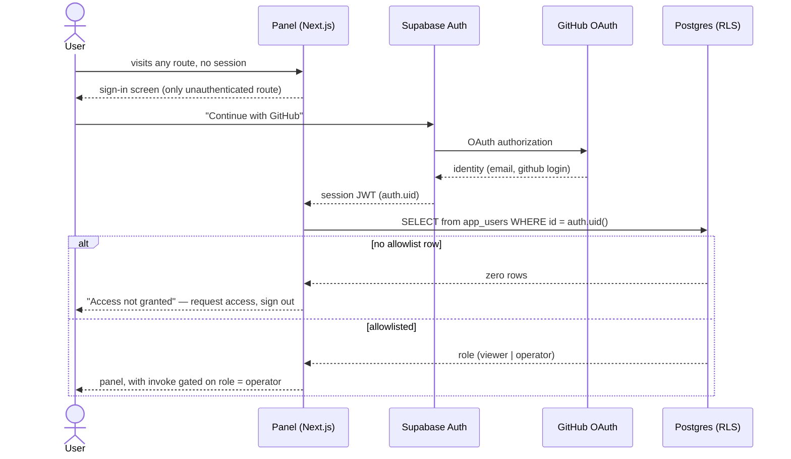
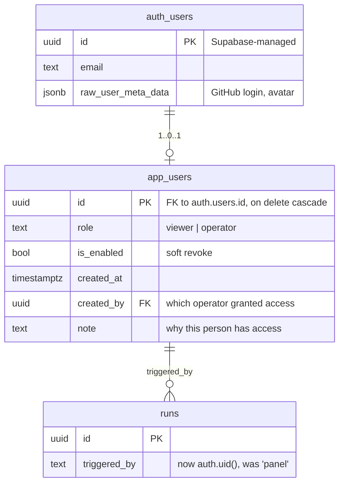
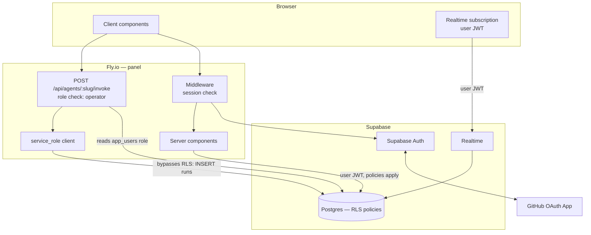

# PRD — Panel Authentication and RLS Policies

## Changelog

| Version | Date       | Summary         | Author             |
| ------- | ---------- | --------------- | ------------------ |
| 1.0     | 2026-08-27 | Initial version. Implements the "Supabase Auth with allowlist" backlog item from [`prd-agent-fleet-panel-v2.md`](prd-agent-fleet-panel-v2.md) §10, retires R1, and replaces the deny-all RLS posture (D11) with identity-based policies. Includes the two hardening items surfaced by the deny-all analysis (explicit `REVOKE`, `security_invoker` on `v_runs`). | product-engineer |

> **Status: awaiting confirmation on five decisions.** This PRD proposes concrete answers rather than leaving blanks, because each blank would block the spec. The proposals are marked **[PROPOSED]** and listed together in §18. Confirm or override before the spec is generated.

---

## 1. Executive Summary

The panel currently has no user authentication (D16), and its only security boundary is that the Fly app is not publicly reachable — a boundary that a single future deploy could silently remove. This feature adds Supabase Auth with a GitHub OAuth provider and an explicit allowlist, then replaces the deny-all RLS posture with identity-based policies, retiring risk R1 and unlocking the secondary persona (small-team members) described in `product-context.md` §3.

The strategic payoff is larger than "add a login screen." Deny-all forced every database read server-side and forced the live log tail through an SSE relay. Authenticated RLS makes a direct browser subscription safe, which removes a whole relay component rather than adding one.

## 2. Feature Overview

This feature delivers:

- **Sign-in** via Supabase Auth using GitHub OAuth. No password storage, no email/OTP provider configuration.
- **An explicit allowlist.** Authentication proves who you are; the allowlist decides whether you may do anything. A user who authenticates but is not on the list sees an "access not granted" screen, not the panel.
- **Two roles:** `viewer` (read runs) and `operator` (read + invoke). This is the distinction R1 already identified — *"read access without auth is a minor problem; invocation without auth is not."*
- **Real RLS policies** replacing deny-all, scoped per table and per role, with `github_installations` remaining service-role-only because it holds a Secrets Manager ARN.
- **Attributed runs.** `runs.triggered_by` carries `auth.uid()` instead of a constant, so the execution registry becomes an audit trail with a real actor.
- **Two hardening fixes** independent of auth but naturally landed here: explicit `REVOKE` so RLS is not a single point of failure, and `security_invoker = true` on `v_runs` so the view stops bypassing policies on its base tables.

This feature does **not** make the Fly app public. It makes doing so *possible* — a separate decision with its own checklist (§10).

## 3. Goals & Objectives

1. **Retire R1.** Remove "anyone with the URL can invoke agents that write to organization repositories" as an accepted risk.
2. **Make the security boundary a property of the application, not of a deploy setting.** Today the boundary is `fly.toml`. After this feature it is enforced in the database.
3. **Unlock the secondary persona.** `product-context.md` §3 gates small-team access on authentication existing. This is that gate.
4. **Turn the execution registry into an audit trail** by attributing every run to a real identity.
5. **Remove the SSE relay** by making direct browser Realtime subscriptions safe — a net reduction in moving parts.
6. **Eliminate the single-control weakness** in the current posture (no `REVOKE`, `v_runs` bypassing RLS).

## 4. Affected Repositories

| Repo | Role / Impact |
|---|---|
| `llipe/dev-tasks-agent-fleet` | **Panel:** sign-in route, session handling, middleware, role-gated invoke UI, replace SSE relay with direct subscription. **Migrations:** `app_users` table, RLS policies, `REVOKE` statements, `v_runs` recreated with `security_invoker`. **Tests:** Layer 2.5 policy tests per role. **Docs:** `technical-guidelines.md` §5/§6, `TESTING.md` |
| Supabase project (infrastructure) | GitHub OAuth provider configured; redirect URLs registered; migrations applied |
| GitHub (infrastructure) | New **OAuth App** (distinct from the existing GitHub *App* used by the agent — different mechanism, different credentials) |
| Fly.io app (infrastructure) | New secrets for the Supabase anon key and auth redirect URL. **Privacy setting unchanged by this feature** |
| `agents/dependency-update/` | **No changes.** The agent uses `service_role`, which bypasses RLS. This feature is invisible to it |

## 5. Target Users

**Primary:** the operator (project author). Gains attribution on their own runs and loses the "don't ever make this app public" constraint.

**Secondary — now reachable:** other members of the GitHub organization who need to trigger or audit runs. `product-context.md` §3 describes this persona as blocked on authentication. A `viewer` role exists specifically so someone can be given audit access without invoke capability.

**Explicitly not a target:** external users, customers, or anyone outside the GitHub organization. This is not multi-tenancy — see §10.

## 6. User Stories

1. As an operator, I want to sign in with my GitHub account so that I do not manage another credential.
2. As an operator, I want the panel to be unusable by anyone not on an allowlist, so that reachability of the URL stops being the security boundary.
3. As an operator, I want to grant a teammate read-only access so they can audit runs without being able to trigger agents against organization repositories.
4. As an operator, I want each run to record who triggered it, so that a surprising run has an accountable actor.
5. As an operator, I want a person whose access I revoke to lose it immediately, without redeploying the panel.
6. As a teammate with `viewer` access, I want the invoke controls to be absent rather than present-and-failing, so the interface tells me the truth about what I can do.
7. As an operator, I want to recover access if I misconfigure a policy and lock myself out, without restoring a backup.
8. As an operator, I want the live log tail to keep working after my session token refreshes mid-stream, so that watching a long run does not silently stop updating.

## 7. Functional Requirements

### Authentication

1. The panel **must** use Supabase Auth with GitHub OAuth as the sole sign-in method. **[PROPOSED]** — see §18 Q1.
2. All routes except the sign-in route and the OAuth callback **must** require an authenticated session. An unauthenticated request **must** redirect to sign-in, not render partial content.
3. Sign-out **must** clear the session and revoke the Supabase refresh token.
4. The panel **must not** implement email/password sign-in, self-service registration, or password reset flows.

### Authorization and allowlist

5. Authentication alone **must not** grant access. Authorization **must** require a row in `app_users` keyed by `auth.uid()`.
6. A user who authenticates without an `app_users` row **must** see an explicit "access not granted" state offering sign-out, and **must not** be able to read any run data.
7. `app_users` **must** carry a role of `viewer` or `operator`. **[PROPOSED]** — see §18 Q2.
8. `operator` grants read plus invoke. `viewer` grants read only.
9. Rows in `app_users` **must** be created by an existing operator or directly in SQL — never by self-signup.
10. Revoking access **must** take effect by deleting or disabling the `app_users` row, with no panel deploy required.
11. Invoke controls **must** be absent from the UI for `viewer`, not merely disabled or failing on submit. The invoke route **must** independently reject `viewer` requests — UI absence is not an authorization control.

### RLS policies

12. RLS **must** remain enabled on all tables. Deny-all **must** be replaced with explicit policies per the matrix in §8.
13. All policies **must** target the `authenticated` role. No policy **must** target `anon`.
14. `github_installations` **must** remain readable only by `service_role`. It holds `private_key_secret_arn` and has no client-side use case.
15. `runs` **must** remain insert-only by `service_role`. The panel's invoke route continues to generate `run_id` and write the snapshot server-side (D1, D8) — clients **must not** insert runs directly.
16. `run_events`, `run_steps`, and `run_artifacts` **must** be readable by allowlisted authenticated users, which is what permits a direct browser Realtime subscription.
17. Explicit `REVOKE` statements **must** remove the Supabase default grants on `anon` for all application tables, so that RLS is not the only control standing between the public API and the data.
18. `v_runs` **must** be recreated with `security_invoker = true` so the view respects the invoking user's policies instead of executing with owner privileges.

### Attribution

19. `runs.triggered_by` **must** be populated with `auth.uid()` for panel-triggered runs, replacing the `"panel"` constant.
20. Run history and run detail **must** display the triggering user. Runs predating this feature **must** render as "unattributed" rather than blank or erroring.

### Live tail

21. The SSE relay introduced for the deny-all posture **must** be replaced by a direct browser Realtime subscription authenticated with the user's JWT. **[PROPOSED]** — see §18 Q3.
22. On session token refresh, the Realtime connection **must** re-authenticate without dropping events. The gap-free `seq` cursor design from the Phase 2 spec is retained; only the transport changes.

### Recovery

23. A documented recovery path **must** exist for operator lockout caused by policy misconfiguration, executable via the Supabase SQL Editor using `service_role`.

## 8. Business Rules

- **AD1 — Authentication and authorization are separate gates.** GitHub OAuth proves identity. The `app_users` row grants access. Conflating them would mean anyone with a GitHub account gets in.
- **AD2 — The allowlist is a table, not a config value or an env var.** Revocation must not require a deploy (FR10), and the list needs an audit trail.
- **AD3 — Sign-in succeeds for non-allowlisted users; authorization fails.** The alternative — rejecting the sign-up itself via an auth hook — hides the reason from the user and gives the operator no record that someone attempted access. A visible "access not granted" state plus an `auth.users` row is more debuggable.
- **AD4 — Policies are role-gated, not row-gated.** This is single-tenant: every allowlisted user sees every run. There is no "my runs" scoping, because there is no product reason for one and inventing it would add policy surface with no benefit. This is honest RLS usage — the row-level mechanism enforcing a table-level rule.
- **AD5 — `service_role` remains the write path for `runs`.** D1 requires the panel to generate `run_id` and snapshot timeouts before invoking. Moving that to a client insert would let a client fabricate snapshot values and produce runs the reaper cannot resolve.
- **AD6 — The GitHub OAuth App is not the GitHub App.** The agent authenticates as a GitHub *App* installation to clone and open PRs. This feature adds a separate GitHub *OAuth App* for user sign-in. Different credentials, different purpose; conflating them would couple user auth to repository write access.
- **AD7 — `REVOKE` and RLS are independent controls, deliberately redundant.** Today Supabase's default grants remain in place and RLS is the only thing blocking `anon`. Disabling RLS on one table, or adding a table without enabling it, would expose it instantly. Two controls means one mistake is not sufficient.

## 9. Data Requirements

One new table. No changes to existing columns.

| Field | Sensitivity | Notes |
|---|---|---|
| `app_users.id` | Low | Opaque uuid |
| `app_users.role` | Low | Authorization-relevant; readable by the user themselves |
| `auth.users.email` | **Moderate — new PII** | First PII the system stores. Previously it held only repository names and dependency versions |
| `auth.users` GitHub metadata | Low | Public GitHub profile data |
| `runs.triggered_by` | Low | uuid reference, not an email |

`runs.triggered_by` is already `text`, so a uuid fits without a type change. Existing rows hold `"panel"` and are treated as unattributed (FR20) rather than migrated.

### Policy matrix

| Table | `anon` | `authenticated` + allowlisted | `service_role` |
|---|---|---|---|
| `github_installations` | none | **none** (holds secret ARN) | full |
| `agents` | none | SELECT | full |
| `repositories` | none | SELECT | full |
| `runs` | none | SELECT | full (INSERT/UPDATE) |
| `run_steps` | none | SELECT | full |
| `run_events` | none | SELECT | full |
| `run_artifacts` | none | SELECT | full |
| `app_users` | none | SELECT own row; `operator` SELECT all | full |

## 10. Non-Goals (Out of Scope)

- **Making the Fly app public.** This feature is the *precondition*, not the act. Going public needs its own decision covering rate limiting on the invoke route, abuse monitoring, and a review of what an authenticated-but-hostile allowlisted user could do. Bundling them would ship two risky changes as one.
- **Multi-tenancy.** Single GitHub organization, single installation. No tenant isolation, no org scoping.
- **Per-repository or per-agent permissions.** `viewer`/`operator` is global. `agent_repository_settings` remains backlog.
- **SSO, SAML, MFA, or session-length policy.** Supabase Auth defaults are accepted.
- **Invite flows or self-service access requests.** The "access not granted" screen may show a contact hint; it does not create a request record.
- **Migrating historical `runs.triggered_by`.** Pre-feature runs stay unattributed.
- **A separate audit log table.** `runs` plus `app_users.created_by` is the trail. `run_events` retention (R3) is unaffected.
- **Row-scoped visibility.** See AD4.

## 11. Design Considerations

`/DESIGN.md` is the visual contract. This feature adds the first authenticated surfaces, and `/DESIGN.md` §11.3 currently states "No authentication UI: single-user system, no login screen, no user avatar, no roles." **That line must be updated** — it is now false.

New surfaces:

| Surface | Design notes |
|---|---|
| **Sign-in screen** | The only unauthenticated route. Centered card on `--color-bg`, single `.btn-primary` "Continue with GitHub" with the Phosphor `GithubLogo` icon. No form fields — there is nothing to type. Follows the Invoke dialog's centered-card pattern (`/DESIGN.md` §5.4) at a smaller max-width |
| **Access-not-granted state** | Same centered card. `--st-fail` accent on the heading, explanation, sign-out `.btn-secondary`. Not an error page — a legitimate terminal state |
| **User indicator** | Sidebar footer, collapsed-state aware. GitHub avatar at `--radius-sm`, login name in `--font-body` 12.5px, role as a `.tag-neutral` at 9.5px. Sign-out on click |
| **Role-gated invoke** | For `viewer`, the "Run" action is **absent** from agent rows and the dashboard, per FR11 — not rendered disabled. A disabled control invites a support question; an absent one states the boundary |
| **Attribution in run lists** | Triggering user as avatar + login in the run history table and run detail summary. Unattributed runs render `—` at `opacity: 0.45`, matching the existing pending-outcome convention (`/DESIGN.md` §8.2) |

**Accessibility:** the sign-in button must be reachable and operable by keyboard with a visible `:focus-visible` ring (§6.4). The access-denied state must be announced — it is a state change, not a navigation. Role must never be conveyed by color alone.

**DESIGN.md impact — required updates:** §11.3 item 5 (the "no authentication UI" claim), a new §5.7 for sign-in and access-denied screens, and a sidebar-footer entry in §4.1's shell diagram.

## 12. Technical Considerations

**Two clients, two credentials.** After this feature the panel holds both a user-scoped client (anon key + user JWT, policies apply) and a `service_role` client (bypasses RLS, used only for `runs` writes and recovery). Keeping them in separate modules with names that cannot be confused is a hard requirement — an accidental `service_role` read in a user-facing path silently defeats every policy in §9.

**Alignment with `technical-guidelines.md`.** §5 and §6 both currently document the no-auth posture and deny-all; both need updating. D11's original rationale ("enabling RLS later is an ugly migration") is finally cashed in here: RLS is already on, so this feature adds policies rather than performing the risky enable-on-populated-tables migration. That was the decision's intended payoff.

**Migration ordering matters and is not reversible cheaply.** Applying policies before the panel sends a user JWT would break every read. The safe sequence: ship auth with the panel still reading via `service_role`, verify sessions work, *then* apply policies and switch reads to the user-scoped client. Each step is independently verifiable.

**Realtime token refresh (FR22)** is the subtle one. A Supabase Realtime connection authenticated with a JWT does not automatically pick up a refreshed token; the client must call `setAuth` on refresh or the subscription silently stops delivering. For a panel whose primary job is watching long-running agents, a live tail that dies at the one-hour mark is a serious defect and an easy one to miss in testing.

**Performance.** Negligible. Policies add a predicate on an indexed uuid lookup. `app_users` is expected to hold single-digit rows. The relay removal reduces server-side work.

## 13. Acceptance Criteria

1. An unauthenticated request to any route except sign-in and the OAuth callback redirects to sign-in and renders no run data.
2. A GitHub sign-in by a user with no `app_users` row reaches the "access not granted" state and can read nothing — verified by asserting the API returns zero rows, not merely that the UI hides them.
3. A user with `role = 'operator'` can list agents, list runs, view a run detail with live tail, and invoke an agent successfully.
4. A user with `role = 'viewer'` sees no invoke control anywhere, **and** a direct `POST` to the invoke route from that session is rejected with 403 and writes no `runs` row.
5. Deleting a user's `app_users` row revokes access on their next request, with no panel deploy.
6. A run triggered from the panel records the triggering user's `auth.uid()` in `runs.triggered_by` and displays that user in run history and run detail.
7. Runs created before this feature display as unattributed without error.
8. An `anon`-key client (no JWT) reads zero rows from every application table — verified per table, not in aggregate.
9. `github_installations` returns zero rows for an allowlisted `operator` session, confirming FR14.
10. A `SELECT` against `v_runs` from an allowlisted session returns rows; the same query from an `anon` client returns zero, confirming `security_invoker = true` closed the bypass.
11. Revoking Supabase default grants does not break any allowlisted-user path (regression check on FR17).
12. A live tail survives a session token refresh: events continue arriving with no `seq` gap across the refresh boundary.
13. The documented recovery path restores operator access from the Supabase SQL Editor after policies are deliberately misconfigured to lock the operator out.
14. The agent's write path is unaffected — a full agent run completes and writes lifecycle, steps, events, and artifacts after policies are applied.

## 14. Success Metrics

Binary, matching the parent PRD's convention:

1. R1 is closed — no path exists to invoke an agent without an allowlisted authenticated session.
2. The Fly app's privacy setting is no longer load-bearing for security (verifiable by reasoning about AC1-AC4, independent of `fly.toml`).
3. Every run created after this feature has an attributable actor.
4. The SSE relay is deleted, not merely bypassed — net negative lines of transport code.
5. Access grant and revoke are both achievable without a deploy.

## 15. Assumptions

- All intended users have GitHub accounts. Safe: the product exists to operate on GitHub repositories.
- The user count stays in single digits, so `app_users` needs no management UI beyond direct SQL and a minimal grant path.
- Supabase Auth's default session and refresh behavior is acceptable; no custom session-length policy is needed.
- A GitHub OAuth App can be created in the organization. If org policy forbids it, Q1 in §18 changes.
- `service_role` remains available as a recovery channel. If that stopped being true, FR23 has no implementation.
- The Phase 2 panel is deployed and working before this feature starts. This is strictly additive to it.

## 16. Constraints & Dependencies

| Dependency | Nature |
|---|---|
| Phase 2 panel deployed | **Hard prerequisite.** There is nothing to authenticate otherwise |
| GitHub OAuth App | Must be created; client ID/secret into Supabase Auth provider config |
| Supabase Auth provider config | Redirect URLs must cover both local development and the Fly hostname |
| `supabase/migrations/` (F6 in parent PRD) | **Hard prerequisite.** This feature is three or four migrations; applying them by hand-pasting SQL is not acceptable at this risk level |
| Fly secrets | Supabase anon key, auth redirect URL |
| `/DESIGN.md` update | Required — §11.3 currently asserts no auth UI exists |

**Timeline:** not fixed. Sequencing constraint only — after Phase 2, before any decision to expose the app publicly.

## 17. Security & Compliance

**Risks introduced or changed by this feature:**

| ID | Risk | Mitigation |
|---|---|---|
| AR1 | **Operator lockout** from a misconfigured policy | `service_role` recovery path, documented and *tested* (AC13). The realistic failure mode of this feature |
| AR2 | **`service_role` client used in a user-facing read path**, silently bypassing every policy | Separate modules, unmistakable names, lint rule restricting the `service_role` import to the invoke route and recovery scripts. A code review cannot reliably catch this at a glance |
| AR3 | **Policies written but never verified per role.** RLS policies fail open in ways that look fine in manual testing with an admin session | Layer 2.5 tests asserting each role's exact visibility per table, and negative assertions for `anon`. Candidate for pgTAP |
| AR4 | **Realtime silently stops after token refresh** (FR22) | Explicit `setAuth` on refresh; AC12 tests across a refresh boundary |
| AR5 | **First PII in the system** (`auth.users.email`) | Supabase-managed, never copied into application tables, never logged. `app_users` stores a uuid FK, not an email |
| AR6 | **OAuth App confused with the GitHub App** (AD6), coupling sign-in to repository write scope | Separate credentials; the OAuth App requests only identity scopes — never `repo` |
| AR7 | **Applying policies breaks the panel** if reads still use `service_role` or the JWT is not forwarded | Staged migration ordering (§12): auth first, policies second, switch reads last |

**Risks closed:** R1 (no authentication) is retired. The single-control weakness is closed by FR17. The `v_runs` bypass is closed by FR18.

**Risks unchanged and worth restating:** R2 stands — the agent still authenticates with the `service_role` key and holds full database access. This feature does nothing about the largest actual credential in the system. R2's exit path (scoped Postgres role, signed JWT per run) remains backlog, and this feature does not bring it closer.

## 18. Open Questions

Five decisions are proposed rather than left blank. Confirm or override before spec generation.

**Q1 — Sign-in method. [PROPOSED: GitHub OAuth only.]** Rationale: every intended user already has a GitHub account, the identity that matters is GitHub org membership, and it avoids configuring an email provider. Alternatives: magic-link email OTP (needs an email provider, clunkier, but no OAuth App); email+password (rejected — credential management burden for no benefit).

**Q2 — Role model. [PROPOSED: `viewer` and `operator` only.]** Rationale: this is exactly the distinction R1 draws between read and invoke. An `admin` role would only govern `app_users` management, which at single-digit user count is better done in SQL. Override if you want in-panel user management.

**Q3 — Replace the SSE relay, or keep both transports? [PROPOSED: replace.]** Keeping both means maintaining two live-tail paths with different failure modes. The `seq` cursor reconnect design is retained either way — only the transport changes. Counter-argument: the relay is working code and direct subscription adds AR4.

**Q4 — Should `viewer` see `runs.params`?** Params can carry operational detail, and `run_events` messages will reveal most of it anyway. Proposed: yes, full read for both roles — partial column visibility means a second policy layer for little gain. Flagging because it is the one place row/column scoping might be justified.

**Q5 — Does the "access not granted" screen tell the user how to request access?** A contact hint is friendly but hardcodes a name or email into the UI. Proposed: generic message, no contact detail. Low stakes.

**Carried forward, unresolved:** R2's exit path is untouched by this feature. Worth a decision on whether *this* is the moment to scope the agent's database credential, since policy work is already in flight and the context is loaded — or whether that stays a separate PRD.

---

> **UI scope detected.** This feature adds a sign-in screen, an access-denied state, a sidebar user indicator, and role-gated controls. **Recommended:** use `ux-engineer` (lite mode) to sketch the sign-in and access-denied screens before spec generation — they are the first surfaces in the product with no data on them, and `/DESIGN.md` has no precedent for an empty centered-card layout.
