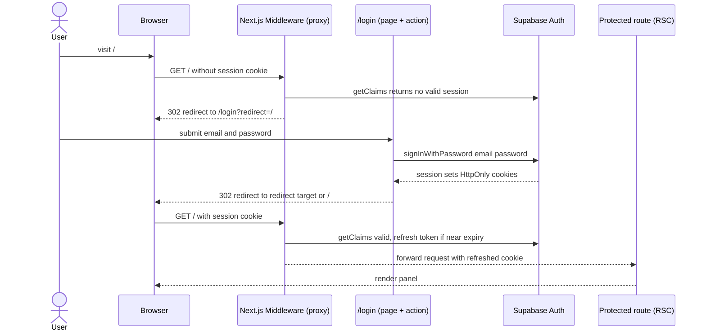
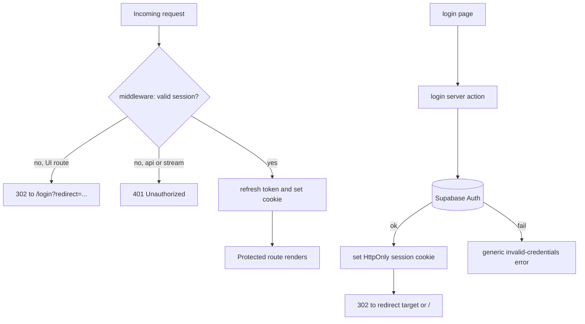

# PRD — Panel Password Authentication

## Changelog

| Version | Date       | Summary                                         | Author           |
| ------- | ---------- | ----------------------------------------------- | ---------------- |
| 1.0     | 2026-09-09 | Initial version. Password auth for the panel via Supabase Auth (`@supabase/ssr`), full-panel gating, login-only, Nocturne-styled `/login`, and the SR2/D16/R1 security-posture change (private → public). | product-engineer |
| 1.1     | 2026-09-09 | Adopted the approved Nocturne login mockup as the reference layout (§11). Added FR13 (password SHOW toggle), FR14 (12h inactivity session expiry — resolves OQ2), FR15 (sign-in audit logging); AC13–AC16; new OQ5 (inert "Forgot password?" link) and OQ6 (audit-log depth). Reconciled the "Forgot password?" affordance against the login-only non-goal. | product-engineer |
| 1.2     | 2026-09-09 | Removed sign-in audit logging from scope (dropped FR15, AC15, the login fine-print reference, and the security bullet; resolved OQ6 deferred). Kept "Forgot password?" as a dead link, real flow deferred (resolved OQ5). Adopted the sidebar mockup: FR9 + AC15 now specify a footer "Log out" item (power icon, below System health, above Collapse, icon-only when collapsed); other sidebar nav shown in the mockup remains deferred per §10. | product-engineer |
| 1.3     | 2026-09-09 | Resolved OQ1: make the Fly app public on the same deploy for live testing (no private transition period). Strengthened FR12 and §16 into a hard auth-first deploy ordering — auth deployed and verified before a public IP is allocated — and re-pointed the privacy release gate to fail closed unless auth is configured. | product-engineer |
| 1.4     | 2026-09-09 | Revised OQ1 per operator direction: public exposure is still the goal but becomes the **last, isolated step** — FR12 now forbids sharing a story/PR/deploy with the auth gate (Phase A verify-while-private → Phase B go-public), removing the exposure window rather than merely ordering it. Added **FR15** and **AC17**: public signups MUST be disabled and this is **mechanically verified** by the release gate (an attempted `signUp` must be rejected; success blocks the release) instead of relying on a runbook checkbox. Updated §8 business rules, §16 constraints, and AC11. | product-engineer |
| 1.5     | 2026-09-09 | Confirmed the §15 signing-key assumption by live JWKS probe: the project uses **asymmetric ES256 (EC P-256)** keys, so `getClaims()` verifies locally with no per-request network call (spec OQ1 resolved). Assumption text updated from "default for new projects / either is acceptable" to a measured fact. No scope change. | product-engineer |
| 1.6     | 2026-09-09 | Recorded the relationship to the pre-existing [`prd-panel-auth-and-rls.md`](prd-panel-auth-and-rls.md), which was written earlier and prescribes a different architecture (GitHub OAuth, allowlist, `viewer`/`operator` roles, identity-based RLS replacing deny-all, SSE-relay removal). Per operator decision that PRD is now **DEFERRED — desired future direction, not currently implemented**, and this password-auth PRD is the simpler first iteration. Added §12.2 explaining the split, what the deferred work can reuse, and the two honest consequences (keeping deny-all forecloses relay removal; going public early inverts that PRD's non-goal). Added the OAuth/allowlist/RLS scope to §10 non-goals as explicitly deferred-not-cancelled. | product-engineer |

## 1. Executive Summary

Add email + password authentication to the Next.js panel so it can be exposed publicly instead of relying on Fly private networking as its only security boundary. This directly resolves risk **R1** ("no authentication") and reverses decision **D16** ("no user auth in v1"), replacing the **SR2** "privacy is the only boundary" posture with an actual login gate. User accounts are managed out-of-band in the Supabase dashboard; the panel ships a login-only flow (no self-service signup or password reset).

## 2. Feature Overview

The panel currently runs with no login (D16) and is kept unreachable from the public internet as its sole protection (SR2). This feature introduces cookie-based session authentication using **Supabase Auth** and the officially recommended **`@supabase/ssr`** integration for the Next.js App Router. Every panel route — pages, the SSE stream, and the future invoke API — is gated: an unauthenticated request is redirected to `/login` (or rejected with `401` for API/stream routes). A successful `signInWithPassword` establishes an HttpOnly cookie session; a logout route clears it. Once shipped, the Fly app can be made public.

This feature is **additive and parallel** to the existing data layer. It does **not** modify `lib/supabase/server.ts` (the service-role client that bypasses RLS for data reads, D15). Authentication uses separate cookie-aware anon-key clients.

## 3. Goals & Objectives

1. Require a valid authenticated session for **every** panel route (UI, API, SSE stream).
2. Provide a Nocturne-styled `/login` page (email + password) with clear error, loading, and disabled states.
3. Provide server-side login and logout flows that set/clear an HttpOnly cookie session correctly across Server Components (via middleware token refresh).
4. Verify identity on the server using `getClaims()` / `getUser()` — never the un-revalidated `getSession()` user object — for authorization decisions.
5. Unlock the public-exposure change: reverse D16/SR2 and update R1 so the Fly app can serve public traffic behind the login gate.
6. Keep the change additive: no modification to the service-role data client or RLS deny-all posture (D11/D15).

## 4. Affected Repositories

| Repo | Role / Impact |
| ---- | ------------- |
| `llipe/dev-tasks-agent-fleet` (the `panel/` package) | All changes: `@supabase/ssr` dependency, browser/server auth clients, `middleware.ts`, `/login` page + login server action, logout route, route-gating, `NEXT_PUBLIC_SUPABASE_*` env, `fly.toml` public-service change, and the `verify-fly-private.sh` release-gate reversal. |
| Supabase project (config, not a git repo) | Enable Email provider, disable public signups (dashboard), create the operator user(s) manually. Recorded here for completeness; no code artifact. |

## 5. Target Users

**Primary:** the panel operator (project author) — signs in with an email + password created in the Supabase dashboard.

**Secondary (enabled, not built here):** additional small-team members, once the operator creates their accounts in the Supabase dashboard. No in-app user management, roles, or invitations in this feature.

## 6. User Stories

1. As an operator, I want to sign in with my email and password so that I can access the panel over the public internet.
2. As an operator, I want unauthenticated visitors redirected to a login page so that no one can reach the panel (or the invoke surface) without credentials.
3. As an operator, I want to sign out so that my session is cleared on a shared or public machine.
4. As an operator, I want my session to persist across page reloads and refresh automatically so that I am not logged out mid-session.
5. As an operator, I want a clear, specific error when my credentials are wrong so that I know to retry rather than assume the panel is broken.
6. As an operator, I want API and SSE requests without a valid session to be rejected so that the live-tail and invoke endpoints are not open.

## 7. Functional Requirements

1. **FR1 — Dependency.** Add `@supabase/ssr` (pinned) to `panel/package.json`. Do not add `@supabase/auth-helpers-nextjs` (deprecated).
2. **FR2 — Auth clients.** Add cookie-aware Supabase clients distinct from the service-role client:
   - a **browser client** (anon/publishable key) for Client Components,
   - a **server client** (anon/publishable key, cookie-backed) for Server Components, Server Actions, and Route Handlers.
3. **FR3 — Middleware token refresh.** Add `panel/middleware.ts` that runs on all panel routes (with a matcher excluding static assets) to refresh the auth token and propagate the refreshed cookie to both the request (for Server Components) and the response (for the browser).
4. **FR4 — Route gating.** Every route except `/login` and the auth callback/logout endpoints requires a valid session. Unauthenticated navigations to UI routes redirect to `/login?redirect=<original-path>`. Unauthenticated requests to API/stream routes (`/api/**`, including `/api/runs/[id]/events/stream`) receive `401` (not a redirect).
5. **FR5 — Login page.** Add `/login` as a public route matching the reference mockup (§11): brand mark + wordmark, "Sign in" heading + invitation-only subtitle, an email field (placeholder `you@company.com`), a password field with a **SHOW** reveal/mask toggle, a full-width outlined submit button, a footer row ("Forgot password?" + region tag), and fine-print about session expiry. An error alert region and loading/disabled states apply during submission. Styled with Nocturne tokens/CSS Modules using the existing `Input`/`Button`/`KLabel` primitives. Not wrapped in the authenticated `AppShell`.
6. **FR6 — Login action.** A server action (or route handler) calls `signInWithPassword`. On success it establishes the session cookie and redirects to the `redirect` target (validated as a local path) or `/` by default. On failure it returns a generic invalid-credentials error without leaking whether the email exists.
7. **FR7 — Logout.** A logout route/action calls `signOut`, clears the session cookie, and redirects to `/login`. It MUST require a POST (not a bare GET link) to avoid CSRF-triggered logout.
8. **FR8 — Identity verification.** Server-side authorization decisions (middleware gate, protected pages) MUST use `getClaims()` (or `getUser()`), never the `getSession()` user object.
9. **FR9 — Logout affordance.** Add a **Log out** item in the sidebar footer (below "System health", above "Collapse") with a power-style Phosphor icon, per the sidebar mockup. Visible only when authenticated. Activating it performs the POST-based logout (FR7). In the collapsed sidebar it renders icon-only, consistent with the other footer controls.
10. **FR10 — Environment config.** Introduce `NEXT_PUBLIC_SUPABASE_URL` and `NEXT_PUBLIC_SUPABASE_ANON_KEY` (publishable key). Document them in `.env.local` guidance and Fly secrets. The service-role key remains server-only and untouched.
11. **FR11 — Redirect-after-login safety.** The `redirect` parameter MUST be restricted to same-origin relative paths; an absolute or off-origin URL falls back to `/`.
12. **FR12 — Fly public exposure (final step).** Make the panel publicly reachable so it can be live-tested — as the **last step of the rollout**, isolated from the auth deploy. Update `panel/fly.toml` to add a public HTTPS service, and replace the privacy release gate (`scripts/verify-fly-private.sh` + `panel/scripts/fly-privacy-check.mjs`) with an auth gate that fails closed unless auth is configured AND observably enforcing (unauthenticated UI → 302, unauthenticated API → 401) AND public signups are disabled. Public exposure MUST NOT share a story, PR, or deploy with the auth gate: the gate ships and is verified while the app is still private, then exposure is flipped as a separate, reversible action.
13. **FR13 — Password SHOW toggle.** The password field has a client-side SHOW/HIDE control that toggles the input between masked and plain text, keyboard-operable, with `aria-pressed` and an accessible label. Default is masked.
14. **FR14 — Session expiry (12h inactivity).** Configure the session so it expires after 12 hours of inactivity, matching the login-screen fine print. This is enforced via Supabase session/JWT settings and the middleware refresh window; the login screen states the policy. (Resolves OQ2.)
15. **FR15 — Public signups disabled, verified.** Public self-registration MUST be disabled in the Supabase project, and this MUST be verified mechanically by the release gate (an attempted `signUp` must be rejected) before the app may be made public. A successful signup attempt is a release blocker.

## 8. Business Rules

- No self-service signup, password reset, email confirmation, or magic links in this feature. Accounts are created in the Supabase dashboard.
- Public signups MUST be disabled in the Supabase project so the exposed Auth endpoint cannot mint new accounts. This is verified mechanically by the release gate (FR15), not by convention.
- Login errors are generic ("Invalid email or password") — no user-enumeration signal.
- The service-role data client and RLS deny-all (D11/D15) are unchanged; authentication does not grant row access — it gates the panel process, which continues to read via the service role.

## 9. Data Requirements

No application schema or migration changes. Auth state lives in Supabase's managed `auth.*` schema and in browser cookies. No new tables in the project's canonical migration. Sensitive data handled: user email (displayed to the signed-in user), password (submitted over HTTPS to Supabase, never stored or logged by the panel), and session tokens (HttpOnly cookies, never logged).

## 10. Non-Goals (Out of Scope)

- Self-service signup, password reset / "forgot password" flow, email verification, magic-link or OAuth/SSO login. (A "Forgot password?" link is shown per the mockup but is a dead link — see §11 — and initiates no reset; a real flow is deferred.)
- **GitHub OAuth, an access allowlist, `viewer`/`operator` roles, identity-based RLS policies replacing deny-all, `runs.triggered_by` attribution, and SSE-relay removal.** All of these are wanted, and all are specified in [`prd-panel-auth-and-rls.md`](prd-panel-auth-and-rls.md) — which is **DEFERRED**, not cancelled. This PRD is the deliberately simpler first iteration; see §12.2 for how the two relate.
- In-app user management, roles, permissions, or multi-tenant separation.
- Per-row authorization / RLS policies for authenticated users (data reads stay service-role).
- Rate limiting / brute-force lockout beyond what Supabase Auth provides by default.
- Changing the existing service-role data client or any data query.

## 11. Design Considerations

**Reference mockup:** the `/login` layout follows the approved Nocturne mockup (dark ground, blurple accent, brand mark + "Agent Fleet" wordmark, outlined primary "Sign in" button, monospace section labels). The screen elements, top to bottom:

- Brand mark + **Agent Fleet** wordmark.
- **Sign in** heading (h-scale) with a muted subtitle: "Access is by invitation. Accounts are provisioned by the fleet operator." — this copy reinforces the login-only, dashboard-managed-accounts business rule.
- A faded Nocturne rule (the signature transparent-at-ends divider).
- **EMAIL** field — monospace `.klabel`, placeholder `you@company.com`.
- **PASSWORD** field — `.klabel` with a right-aligned **SHOW** toggle to reveal/mask the value.
- **Sign in** primary outlined button (full width).
- A footer row: **Forgot password?** on the left, a muted **· us-east-1** region tag on the right (monospace).
- Fine print (muted): "Sessions expire after 12 hours of inactivity."

Design notes and reconciliations against scope:

- **Styling:** Nocturne design system (`styles/tokens.css`, CSS Modules), reusing the existing `Input` and `Button` primitives and the `KLabel` primitive for the monospace labels. No Tailwind, no new component library. (An injected steering rule assumes Tailwind + a blue/orange palette; it does not match this project and is intentionally not followed — the panel is Nocturne/CSS-Modules.)
- **Layout:** `/login` is a left-aligned column centered in the viewport on the Nocturne dark ground, outside the `AppShell` (no sidebar/top bar).
- **SHOW toggle:** a client-side reveal/mask control on the password field (`type` toggles between `password` and `text`), with `aria-pressed` and an accessible label.
- **"Forgot password?" link (scope reconciliation):** self-service password reset is a non-goal (accounts are managed in the Supabase dashboard). The link is rendered per the mockup but is a **dead link in this feature** (no target / no reset flow) — to be implemented later. It MUST NOT imply a working reset flow.
- **Region tag (`us-east-1`):** a static, informational label sourced from the panel's configured region (non-secret); purely cosmetic/operational context, no behavior.
- **Accessibility:** semantic `<form>`, `<label>`-associated inputs, `type="submit"` button, visible `:focus-visible` ring (already defined in `globals.css`), error surfaced via `role="alert"`. The SHOW toggle is keyboard-operable.
- **Logout affordance (per the sidebar mockup):** a **Log out** item in the sidebar footer, below "System health" and above "Collapse", with a power-style icon (Phosphor, matching §10 icon usage). Visible only when authenticated. It is a POST-based sign-out (not a bare GET link) that clears the session and redirects to `/login`. In the collapsed sidebar it shows the icon only (consistent with the other footer controls). Styling matches the existing `Sidebar` footer controls.
  - Note: the sidebar mockup also shows other nav (All runs, Repositories, an AGENTS group, Settings, System health) as enabled; those remain **deferred** per PRD §10 and are out of scope here — only the Log out affordance is added by this feature.

## 12. Technical Considerations

- **Recommended model (validated against the [official Supabase Next.js SSR guide](https://supabase.com/docs/guides/auth/server-side/nextjs?router=app)):** `@supabase/ssr` with a browser client, a cookie-backed server client, and middleware for token refresh is the current recommended integration for the App Router. The older `@supabase/auth-helpers-nextjs` is deprecated. *(Content was rephrased for compliance with licensing restrictions.)*
- **Two client families, kept separate:** the new anon-key cookie clients (user auth) are distinct from `lib/supabase/server.ts` (service-role, `persistSession: false`, data reads). The SD2 `server-only` guard and the `no-restricted-imports` ESLint rule must continue to hold; the anon browser client is the only Supabase client allowed in a client bundle, and it must carry only the publishable key.
- **`getClaims()` over `getSession()`:** per the docs, the `getSession()` user object is not re-validated against the Auth server and must not drive authorization. Middleware and protected pages verify via `getClaims()`/`getUser()`.
- **CDN/caching caveat:** responses carrying a refreshed `Set-Cookie` must not be cached, or one user could receive another's session. The panel's data routes are already `force-dynamic`/`no-store`; `/login` and gated routes must not be statically cached. The SSE route is already `force-dynamic`.
- **SSE + auth:** the browser `EventSource` cannot set custom headers, so the stream must authenticate via the session cookie (sent automatically same-origin). The relay route validates the session server-side before subscribing.
- **Middleware matcher:** exclude `_next/static`, `_next/image`, and favicon/asset paths so the proxy runs only where Supabase access matters.

### 12.2 Relationship to the deferred OAuth + RLS PRD

[`prd-panel-auth-and-rls.md`](prd-panel-auth-and-rls.md) (v1.1, **DEFERRED**) describes the desired end state for panel authorization: GitHub OAuth, an explicit allowlist, `viewer`/`operator` roles, identity-based RLS replacing deny-all, `runs.triggered_by` attribution, and removal of the SSE relay. This PRD is the deliberately **simpler first iteration** and is being implemented now; that one is not.

The split is intentional rather than accidental:

- **This iteration closes the actual gap** — "no authentication at all" (risk **R1**, decision **D16**) — with the smallest surface that does so. It touches no schema, no RLS policy, and no data query.
- **That iteration changes the authorization model**, which is a larger and riskier change: it rewrites RLS, moves reads into the browser, and deletes a shipped, tested component (the SSE relay).

Designed so the deferred work can build on this one rather than replace it: the cookie-session clients, the middleware chokepoint, `getClaims()`-based verification, the route-classification split, the `/login` screen, and the `app/(panel)/` route group are all reusable as-is. What the deferred PRD adds on top is the *provider* (OAuth) and the *authorization model* (allowlist, roles, RLS).

Two consequences to be honest about:

1. **Keeping deny-all forecloses a simplification.** The deferred PRD's argument is that deny-all is precisely *why* the SSE relay exists — authenticated RLS would let the browser subscribe directly, deleting a component instead of gating one. This PRD gates it instead. That is the right call for a first iteration (it is additive and reversible), but it means the relay becomes a tested component with reconnect semantics that a later refactor must remove deliberately, with regression coverage.
2. **Going public early inverts an assumption of the deferred PRD.** It treats public exposure as an explicit non-goal and a later decision; this PRD does it in S-123. Its §17 threat model therefore needs re-reading against an internet-facing login endpoint before it is specified. Recorded in its §0.3.

## 13. Acceptance Criteria

- [ ] **AC1** Given no session, when I navigate to any panel UI route (`/`, `/agents/[slug]`, `/runs/[id]`), then I am redirected to `/login?redirect=<path>`.
- [ ] **AC2** Given no session, when a request hits `/api/**` or the SSE stream route, then it receives `401` (not an HTML redirect).
- [ ] **AC3** Given valid credentials, when I submit the login form, then a session cookie (HttpOnly) is set and I land on the `redirect` target (or `/`).
- [ ] **AC4** Given an off-origin/absolute `redirect` value, when I log in, then I land on `/` (the unsafe redirect is ignored).
- [ ] **AC5** Given invalid credentials, when I submit, then I see a generic "Invalid email or password" error (no user-enumeration), the password is not echoed, and the button returns to an enabled state.
- [ ] **AC6** Given an authenticated session, when I click sign out (POST), then the session cookie is cleared and I am redirected to `/login`; revisiting a protected route redirects to `/login`.
- [ ] **AC7** Given an authenticated session near token expiry, when I load a protected page, then middleware refreshes the token and I stay signed in (no spurious logout).
- [ ] **AC8** Authorization checks use `getClaims()`/`getUser()`; a test proves the gate does not rely on the `getSession()` user object.
- [ ] **AC9** The service-role client (`lib/supabase/server.ts`) is unchanged and no `NEXT_PUBLIC_*` variable exposes the service-role key (bundle-secret test still passes).
- [ ] **AC10** The `/login` page renders with Nocturne tokens/primitives per the reference mockup (§11): brand mark + wordmark, "Sign in" heading + invitation subtitle, labeled EMAIL/PASSWORD fields, SHOW toggle, full-width outlined submit, footer row (Forgot password? + region tag), and the session-expiry fine print. It has labeled fields, an `role="alert"` error region, and a visible focus ring; it renders outside the `AppShell`.
- [ ] **AC11** `panel/fly.toml` exposes a public HTTPS service and the privacy gate is replaced by a fail-closed auth gate; `make validate` passes. Public exposure is applied only after the auth gate is verified on the still-private app (spec §15.1 Phase A → Phase B).
- [ ] **AC17** The release gate fails closed when public signups are enabled: an attempted `signUp` against the project's Auth endpoint is rejected, and a successful signup blocks the release.
- [ ] **AC12** `make validate` (lint, format:check, typecheck, test, audit) passes on both branches; new auth logic has unit + component tests and at least one E2E scenario (login → protected route → logout).
- [ ] **AC13** The password SHOW toggle reveals the value when activated and re-masks when toggled off; it is keyboard-operable with a correct `aria-pressed` state; the field defaults to masked.
- [ ] **AC14** A session is treated as expired after 12 hours of inactivity: a request with a session past that inactivity window is redirected to `/login` (UI) or `401` (API/SSE), consistent with the fine print.
- [ ] **AC15** The sidebar footer shows a **Log out** item (below "System health", above "Collapse") only when authenticated; activating it logs out via POST and lands on `/login`. In the collapsed sidebar it renders icon-only.
- [ ] **AC16** The "Forgot password?" affordance is a dead link — it initiates no reset flow and does not navigate to a working reset — and never implies one.

## 14. Success Metrics

1. An unauthenticated request to every panel route class (UI, API, SSE) is denied (redirect or 401) — verified by E2E.
2. A valid operator login reaches the dashboard and persists across a reload.
3. The Fly app is reachable publicly and every public route requires login (no unauthenticated access path remains).
4. No service-role key or session token appears in any client bundle or log (bundle-secret test + log review).

## 15. Assumptions

- Supabase Auth Email provider is enabled and public signups are disabled in the project dashboard.
- Operator user account(s) are created manually in the Supabase dashboard before first login.
- The project uses asymmetric signing keys (**confirmed 2026-09-09 by live JWKS probe: `alg: ES256`, `kty: EC`, `crv: P-256`** — spec OQ1 resolved), so `getClaims()` verifies locally via JWKS with no per-request network call.
- One shared Supabase project; no separate auth tenancy needed.

## 16. Constraints & Dependencies

- Depends on the `@supabase/ssr` package and the publishable/anon key.
- FR12 (public exposure + gate replacement) MUST NOT merge or deploy ahead of, or together with, the working auth gate. Public exposure is the **final, isolated step**: (Phase A) deploy the auth gate with the app still private, verify over the private network that unauthenticated UI requests are redirected and unauthenticated API requests get 401, and verify public signups are disabled; (Phase B) only then enable the public service / allocate the public IP and re-verify against the public hostname. `fly ips release` is the one-command containment path. See spec §15.1.
- Git Guard invariants apply: no direct push/merge to `main`; Conventional Commits; `gh` uses `--body-file`.
- Deployment (`fly deploy`, `fly secrets set` for the anon key + URL, making the app public) is an operator-gated step per the existing deployment runbook, not executed by implementation.

## 17. Security & Compliance

- **Reverses D16 / SR2, resolves R1:** login becomes the security boundary; keeping the app private is downgraded from "only boundary" to optional defense-in-depth. The spec §17 (OQ1/R1) and `technical-guidelines.md` §5/§6/§18 must be updated to record this reversal (routed via changelog on those docs during spec/handoff).
- **Cookies:** session cookies are HttpOnly, Secure (in production), SameSite=Lax; never logged.
- **No secret exposure:** publishable/anon key is safe for the browser; the service-role key stays server-only (SD2 guards intact).
- **CSRF:** logout is POST-only; login is a form POST/server action. No state-changing GET auth endpoints.
- **User enumeration:** login failures are generic.
- **Password handling:** submitted directly to Supabase over HTTPS; the panel never stores, logs, or transforms it.
- **Session inactivity (FR14):** sessions expire after 12 hours of inactivity, bounding exposure on an unattended public machine.

## 18. Open Questions

1. **OQ1** ~~Keep Fly private as defense-in-depth vs. make public immediately~~ — **Resolved (revised):** the app **will** be made public for live testing, but public exposure is the **last step**, deliberately separated from the auth deploy. The auth gate ships and is verified while the app is still private; flipping to public is an independent, one-command-reversible final action (`fly ips release` to contain). See spec §15.1 (Phase A / Phase B) and FR12.
2. **OQ2** ~~Session lifetime~~ — **Resolved:** 12 hours of inactivity, per the reference mockup and FR14. Remaining sub-question: refresh-token rotation policy (accept Supabase defaults?).
3. **OQ3** Should the SSE relay return `401` and let the client stop reconnecting, or emit a `closed{reason:"unauthorized"}` frame first? (Affects `useRunStream` reconnect behavior.)
4. **OQ4** Do we want minimal brute-force protection (e.g., a small server-side delay or relying on Supabase's built-in rate limits) for a publicly exposed login?
5. **OQ5** ~~"Forgot password?" — inert explainer vs. omit~~ — **Resolved:** rendered as a dead link now, real reset flow implemented later.
6. **OQ6** ~~Audit logging depth~~ — **Resolved (deferred):** sign-in audit logging is out of scope for this feature (removed from doc and UI); may be revisited later.
