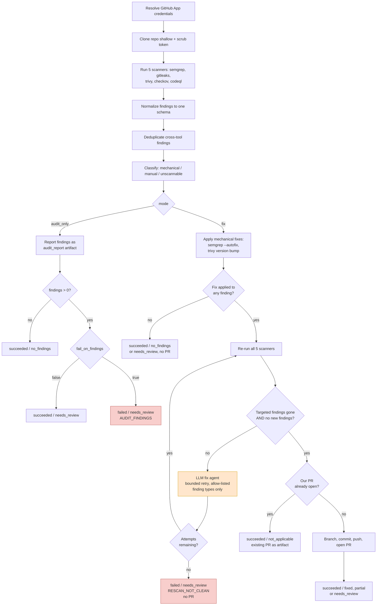
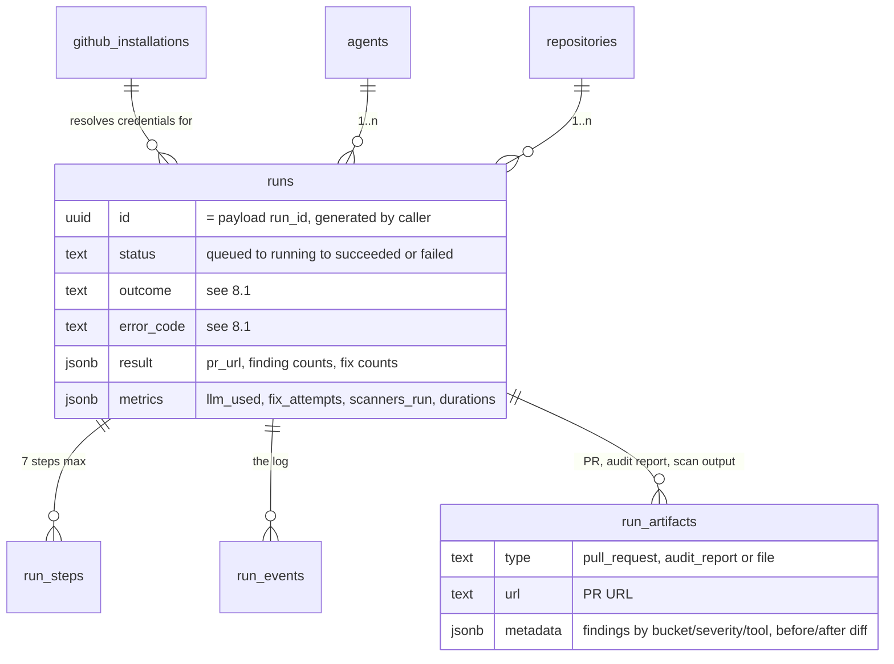
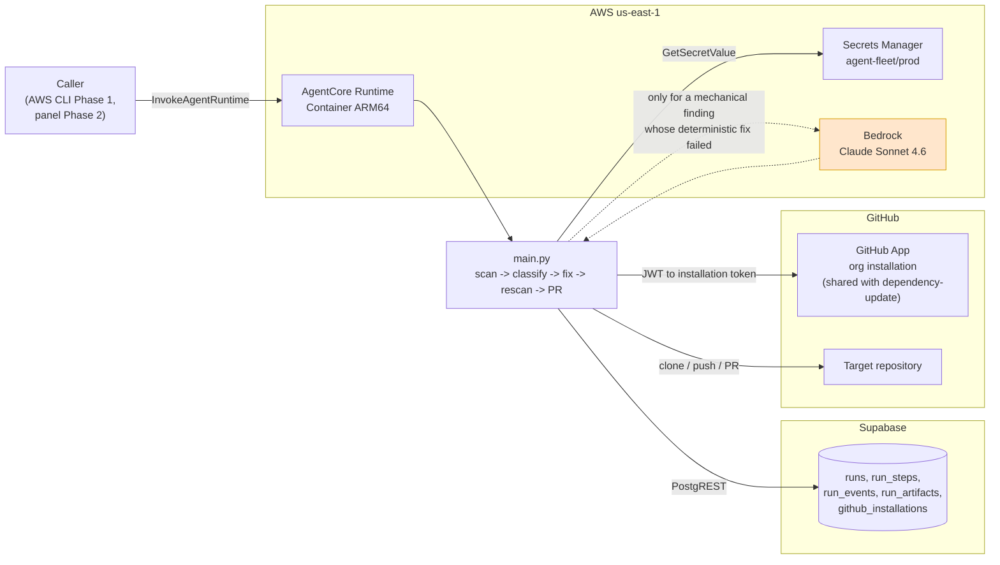

# PRD — Security Analyst Agent

## Changelog

| Version | Date       | Summary                                                                                                                                                            | Author           |
| ------- | ---------- | ------------------------------------------------------------------------------------------------------------------------------------------------------------------ | ---------------- |
| 1.0     | 2026-09-14 | Initial version. Scopes the fleet's second productive agent: a five-tool security scanner (Semgrep, Gitleaks, Trivy, Checkov, CodeQL) with `audit_only` and `fix` modes, a bounded deterministic-plus-LLM autofix path scoped to Semgrep autofix and Trivy version bumps, full-repo scan-fix-rescan, and a PR opened only after a clean re-scan. Introduces decisions D16-D27. | product-engineer |
| 1.1     | 2026-09-14 | Fixes the v1 supported-stack gap: adds §7.4a defining a common minimum per tool, scoped to **JavaScript/TypeScript and Python** (the operator's primary stack) — CodeQL limited to those two (interpreted, no build step) query packs, Semgrep rulesets pinned rather than `--config auto`, Trivy's `fs` scan covering both npm/pnpm and Python manifests. Clarifies D24's lockfile boundary applies to npm/pnpm only — Python dependency version bumps stay in this agent's mechanical lane (new requirements 51-57). Narrows R10 and OQ5 to reflect the reduced (interpreted-only) untrusted-build surface. Adds a non-goal for CodeQL languages beyond the pair. | product-engineer |
| 1.2     | 2026-09-14 | Closes two implementation-blocking gaps identified before spec/stories work: adds §7.4b, a fixed per-tool severity-normalization table (D28) covering the two tools with no native severity — Gitleaks (always `critical`, D29) and Checkov OSS (falls to the shared `medium` unknown floor, D30, shared with Trivy `UNKNOWN` and unscored CodeQL results). Introduces the `min_severity` invocation parameter (D31, requirements 62-64), gating only the `fail_on_findings`/outcome decision — never scan, fix, or re-scan scope, so the floor cannot silently reduce coverage. Updates §8.1's status/outcome table and §7.2's invocation contract accordingly; adds acceptance criteria 12a-12b. | product-engineer |

> **Relationship to other documents.** This PRD is a **child** of [`prd-agent-fleet-panel-v2.md`](prd-agent-fleet-panel-v2.md). The parent PRD defines the control plane (Supabase as system of record, the `runs` lifecycle, the reaper, the Next.js panel) and the fleet's operating model. Decisions D1-D15 are inherited from the parent and are not restated except where this agent constrains them. This document's own decisions restart at **D16** and its own risks restart at **R8**, following the numbering convention established by the sibling agent PRD below — the two child documents do not share a decision or risk namespace with each other, only each inherits independently from the parent.
> **Sibling reference.** [`prd-dependency-update-agent.md`](prd-dependency-update-agent.md) is the fleet's first agent and establishes the reusable shape this PRD follows: `/agents/<agent-name>/` AgentCore Container project, GitHub App installation-token auth, deterministic pipeline with the LLM reachable from exactly one edge, PR body as the reviewer's entire interface, and the `status`/`outcome`/`error_code` reporting contract. This PRD reuses that shape rather than re-deriving it, and calls out every place it deviates.
> **Explicit boundary with the sibling agent.** Both agents can, in principle, touch a dependency version. §10 and D24 draw the line: `dependency-update` owns routine JS/TS (pnpm/npm) dependency freshness via package-manager audit; `security-analyst` owns vulnerability findings Trivy surfaces outside that lane — container base images, OS packages, and non-JS/TS ecosystems — plus everything the other four scanners cover. Trivy's own npm/pnpm advisory output is explicitly excluded from this agent's fix path to avoid two agents opening competing PRs against the same lockfile.

---

## 1. Executive Summary

The `security-analyst` agent is the fleet's second productive agent. It runs five security scanners — Semgrep (SAST), Gitleaks (secrets), Trivy (dependency/container/IaC vulnerabilities), Checkov (IaC misconfiguration), and CodeQL (deep SAST) — against a target repository, classifies every finding, and, in `fix` mode, applies a narrow, well-defined class of **mechanical** fixes before re-scanning to prove the fix actually worked and opening a pull request.

Like its sibling, it is deliberately narrow about what it is allowed to change on its own. Only two finding categories are mechanically fixable in v1: a Semgrep finding whose rule carries a native `--autofix` patch, and a Trivy finding closed by a dependency or base-image version bump that does not collide with the sibling agent's lane. Everything else — every Gitleaks secret, every Checkov and CodeQL finding, and every Trivy finding outside the fixable lane — is scan-only: reported with full detail, never modified. This is not a temporary limitation to be lifted casually; it is the same trust boundary the sibling agent draws around its own mandate, applied to a wider and more heterogeneous tool surface.

The pipeline's defining property is **scan → fix → re-scan**: a fix is never trusted on the strength of applying cleanly. The agent re-runs the same five scanners after fixing and only opens a pull request if the re-scan confirms the targeted findings are gone and introduces nothing new that the fix itself caused. `audit_only` mode runs the same five scanners and reporting logic with no write path at all — no fix, no branch, no PR — so the agent is safe to run as a pure posture check.

---

## 2. Feature Overview

Given a target repository and a mode, the agent:

1. Resolves GitHub App credentials for the repository's organization and mints a short-lived installation token (identical mechanism to the sibling agent).
2. Clones the repository shallowly and scrubs the token from disk immediately.
3. Runs all five scanners against the full repository state and normalizes their output into one finding schema.
4. Deduplicates findings that multiple tools reported for the same underlying issue (e.g., Trivy and Checkov both flagging the same Dockerfile line).
5. Classifies every finding into `mechanical` (fixable in this run), `manual` (requires human judgment), or `unscannable` (a tool error or a finding the classifier cannot place with confidence).
6. In `audit_only` mode: reports the classified findings and stops. No working-tree change, no branch, no PR.
7. In `fix` mode: applies every `mechanical` finding's fix — Semgrep native autofix first, then the Trivy version-bump path; when a targeted finding's native autofix does not exist or does not resolve it, a bounded LLM escape hatch attempts the fix under a strict allow-list of touchable finding types (mirroring the sibling agent's escape hatch, reachable from exactly this one edge).
8. Re-runs all five scanners against the fixed working tree.
9. Compares the before/after finding sets: every targeted `mechanical` finding **MUST** be absent from the re-scan, and no new finding may appear that was not present before the fix. If either check fails, the fix is discarded and the run reports the failure rather than opening a PR with an unverified change.
10. Opens a pull request whose body contains the full findings inventory (fixed, remaining `manual`, remaining `unscannable`), the tools' before/after counts, and — when the LLM escape hatch fired — the same AI-modification warning the sibling agent requires.

Throughout, it reports `status`, `outcome`, steps, events, and artifacts to Supabase through [`agent_reporter.py`](../reference/agent_reporter.py), identically to the sibling agent.

### 2.1 Pipeline shape

The decisive property is the same one the sibling PRD names for its own pipeline, applied to a wider tool surface: the LLM sits outside the main path, reachable only when a targeted mechanical fix's own tooling could not close it deterministically. The second decisive property, unique to this agent, is that **no fix is trusted without a confirming re-scan** — the PR is the reward for a re-scan that agrees the fix worked, not for the fix applying without error.



### 2.2 Credential resolution

Identical mechanism to the sibling agent — see [`prd-dependency-update-agent.md` §2.2](prd-dependency-update-agent.md). No new decision is introduced here; D18 is inherited by reference.

---

## 3. Goals & Objectives

1. **Give the operator one command for organization-wide security posture** across five tool categories (SAST, secrets, dependency/container/IaC vulnerabilities, IaC misconfiguration, deep SAST) instead of five separate invocations with five separate output formats.
2. **Never open a PR on an unverified fix.** The re-scan gate is the core trust mechanism of this agent, the way the validation suite is for the sibling agent. Measurable: zero PRs exist in history whose stated "fixed" findings are still present in a fresh scan of the merged commit.
3. **Keep the mechanical-fix surface small and named**, not "whatever the tools can do today." Only Semgrep autofix and Trivy version bumps are mechanical in v1; expanding the set is a PRD change, not a runtime configuration change.
4. **Reuse the fleet's control-plane and credential architecture exactly**, adding zero new infrastructure decisions beyond what this agent's tool surface strictly requires (SARIF normalization, the five scanner binaries, the re-scan gate).
5. **Never silently duplicate the sibling agent's PRs.** Trivy findings resolvable by a JS/TS lockfile change stay out of this agent's fix path — see D24.
6. **Make `manual` and `unscannable` findings as visible as `mechanical` ones.** A PR (or an audit report) that only shows what got fixed and hides what didn't is a worse product than one that shows both, exactly as the sibling PRD's `major_required` section exists to prevent a false "all clear."

---

## 4. Affected Repositories

| Repo / component                       | Role / Expected impact                                                                                                                                                                                                                    |
| --------------------------------------- | ------------------------------------------------------------------------------------------------------------------------------------------------------------------------------------------------------------------------------------------ |
| `dev-tasks-agent-fleet` (this repo)     | **Primary.** Adds `/agents/security-analyst/` — an AgentCore CLI project (config, CDK, `app/`, Dockerfile) with `main.py` and a copy of `agent_reporter.py`. Updates [`002_seed.sql`](../reference/002_seed.sql) with this agent's `params_schema`, `runtime_arn`, and timeout thresholds. |
| Target repositories (~20, org-wide)     | **Read + write via the same GitHub App installation** used by `dependency-update`. Cloned; receive a branch `security/fix-<timestamp>` and a pull request in `fix` mode. No direct pushes to their default branch.                        |
| Supabase project (infrastructure)       | Consumes writes to `runs`, `run_steps`, `run_events`, `run_artifacts`. Reuses the existing `github_installations` row — no new installation required. **No schema migration required.**                                                    |
| AWS account (infrastructure)            | Hosts a second AgentCore Container runtime (ARM64, `us-east-1`), reusing the `agent-fleet/prod` Secrets Manager vault. Provisioned by `agentcore deploy`.                                                                                    |
| GitHub App (infrastructure)             | Same installation as `dependency-update`. If GitHub Code Scanning upload is adopted later (§18 OQ3), its permission grant is an installation-level change affecting both agents — see R9.                                                   |

---

## 5. Target Users

**Primary:** the fleet operator, who invokes the agent and reviews the resulting pull requests or audit reports. Identical role to the sibling agent's primary user.

**Secondary:** any future maintainer of a target repository, who consumes the agent's output as a PR or an audit report. They never interact with the agent directly.

There is no external end user.

---

## 6. User Stories

1. As an operator, I want to run one agent that covers SAST, secrets, dependency/container/IaC vulnerabilities, and IaC misconfiguration, so I stop running five separate CLIs with five separate report formats.
2. As an operator, I want an `audit_only` run that changes nothing, so I can check a repository's security posture without risking a bad automated change landing.
3. As an operator, I want the agent to fix only what it can prove it fixed, so a `fix` run's PR is trustworthy without me re-running the scanners myself.
4. As an operator, I want every finding the agent could not or would not fix to still be visible in the PR or audit report, so nothing silently falls through the cracks between "fixed" and "not mentioned."
5. As an operator, I want the agent to never open a competing PR against the same dependency the `dependency-update` agent already manages, so the two agents don't fight over the same lockfile.
6. As an operator, I want to see exactly which findings the LLM touched, distinct from what the tools fixed deterministically, so I know where to look more carefully in review.
7. As an operator, I want a second invocation on the same repository to be a no-op while my fix PR is still open, so a schedule or a double-click does not create PR spam — same guarantee the sibling agent gives.
8. As an operator, I want repository access to come from the same GitHub App installation the fleet already uses, so I am not managing a second credential for a second agent.

---

## 7. Functional Requirements

### 7.1 Project structure and deployment

1. The agent **MUST** live at `/agents/security-analyst/` inside this repository, as a self-contained AgentCore CLI project, following the exact layout convention of [`prd-dependency-update-agent.md` requirement 2](prd-dependency-update-agent.md) — **D16**.
2. The project structure **MUST** be generated by `agentcore create`, not hand-authored — inherits the sibling agent's D22 rationale without restating it.
3. The runtime **MUST** use the `Container` build type. The image **MUST** be ARM64 and **MUST** include: Semgrep, Gitleaks, Trivy, Checkov, the CodeQL CLI with the JavaScript/TypeScript and Python query packs only (§7.4a), `git`, the `gh` CLI, and Python 3.13+.
4. Deployment **MUST** be performed by `agentcore deploy`. No separate hand-written CDK stack is introduced for this agent.
5. The entrypoint **MUST** use the `bedrock-agentcore` Python SDK (`BedrockAgentCoreApp`, `@app.entrypoint`) and the `HTTP` protocol — identical to the sibling agent.
6. The fix agent **MUST** use the Strands Agents framework with Bedrock as the model provider, the same model ID as the sibling agent (`us.anthropic.claude-sonnet-4-6`, overridable by `MODEL_ID`) — reuses D23.

### 7.2 Invocation contract

7. The agent **MUST** accept the following invocation payload:

   ```json
   {
     "run_id": "uuid",
     "repository_org": "string",
     "repository_name": "string",
     "params": {
       "mode": "audit_only | fix",
       "fail_on_findings": true,
       "min_severity": "low",
       "max_fix_attempts": 3,
       "scanners": ["semgrep", "gitleaks", "trivy", "checkov", "codeql"]
     }
   }
   ```

8. The agent **MUST** tolerate the payload arriving wrapped as a JSON string inside a `prompt` key, and unwrap it transparently — inherited from the sibling agent's contract.
9. The agent **MUST** validate the payload before doing any work and, on mismatch, terminate the run as `failed` with `error_code = INVALID_PARAMS`.
10. Parameter defaults **MUST** be: `mode = audit_only`, `fail_on_findings = true`, `min_severity = low`, `max_fix_attempts = 3`, `scanners = all five`. `max_fix_attempts` **MUST** be constrained to `0..5`; `0` disables the LLM escape hatch entirely. `min_severity` **MUST** be one of `low`/`medium`/`high`/`critical` — see §7.4b.
11. The `scanners` parameter **MAY** narrow the run to a subset of the five tools (e.g., a fast Semgrep-and-Gitleaks-only pass). A run with an empty or unrecognized `scanners` list **MUST** terminate `failed` / `INVALID_PARAMS`.
12. The clone URL **MUST** be derived as `https://github.com/{repository_org}/{repository_name}.git`, identically to the sibling agent — **D17 reuse**: the agent **MUST NOT** accept a caller-supplied URL.

### 7.3 Credentials

13. Credential resolution, installation token minting, token scrubbing, and the 45-minute re-mint threshold **MUST** follow [`prd-dependency-update-agent.md` requirements 14-20](prd-dependency-update-agent.md) exactly, reusing the same `github_installations` row and the same `SUPABASE_SERVICE_ROLE_KEY` secret. No new credential, no new secret, no new installation.
14. CodeQL's own database-build step **MUST NOT** require network egress beyond what cloning and scanner tooling already need. Both v1 language packs (§7.4a) are interpreted languages, so CodeQL's own auto-extraction covers them without a compiled build step — the "if a language's CodeQL pack requires a build step" case does not arise in v1 and is deferred with any future compiled-language pack (§10).

### 7.4 Scanner execution

15. All five scanners **MUST** run against the full checked-out repository on every invocation — **D19**. There is no diff-only or baseline-tracked mode in v1; every run is a complete posture snapshot.
16. Each scanner **MUST** run in a mode that emits machine-readable output: Semgrep (`--json`), Gitleaks (`--report-format json`), Trivy (`--format json`, covering `fs`, `config`, and, when a Dockerfile is present, `image` scanning against the built or a representative base image), Checkov (`--output json`), CodeQL (SARIF via `codeql database analyze`).
17. A scanner that is not applicable to the repository's content (e.g., CodeQL with no supported language detected, Checkov with no IaC files present) **MUST** be skipped with a `run_event` naming the reason, and **MUST NOT** fail the run.
18. A scanner that errors (crashes, times out, or produces unparseable output) **MUST** be recorded as a per-tool failure in `run_events` at `error` level and its findings excluded from the run, but **MUST NOT** by itself fail the run — a broken Checkov invocation should not block a Semgrep-only finding from being reported and fixed. If **every** requested scanner fails, the run **MUST** terminate `failed` / `error_code = ALL_SCANNERS_FAILED`.
19. Each scanner **MUST** run under an individual timeout (`SCANNER_TIMEOUT`, default 600s, env-tunable), independent of the others, so one slow tool cannot silently consume the whole run's budget.

### 7.4a Supported stack — common minimum (v1)

Neither the container image nor the classification rules can be tool-default-and-hope; each tool's language reach differs, and left unscoped, the container grows to host every compiled-language toolchain CodeQL supports for a fleet that does not need them. This PRD fixes the v1 supported stack at **JavaScript/TypeScript and Python** — the operator's actual primary stack — and defines, per tool, what "supported" means against it. This is a scope decision, not a technical limitation of any tool; widening it later is a container/config change, not a redesign.

51. **CodeQL query packs are limited to `javascript-typescript` and `python` in v1.** No other language pack **MUST** ship in the container image. A repository containing only a language outside this pair (Go, Java, Ruby, C/C++, Rust, etc.) causes CodeQL to report `SKIPPED` under requirement 17 — a legitimate, non-fatal reduced-coverage outcome, not an error. Both packs are interpreted-language extraction (no compiled build step), which is also why requirement 14's build-step caveat does not apply in v1 — see R10 for the risk consequence of this being wider later.
52. **Semgrep rulesets are scoped to JavaScript/TypeScript and Python plus one generic ruleset**, at minimum: `p/javascript`, `p/typescript`, `p/python`, and `p/security-audit` (broad OWASP-style patterns, language-agnostic). The exact ruleset identifiers **MUST** be pinned in `fixers/semgrep_autofix.py`'s `RULESET` constant (or equivalent config), not left to `--config auto`, so the autofix surface stays enumerable and reviewable rather than drifting with Semgrep's registry. A repository outside this stack still gets `p/security-audit` coverage — Semgrep is never fully skipped the way CodeQL can be.
53. **Trivy's dependency-vulnerability scanning (`fs` mode) MUST cover both npm/pnpm lockfiles and Python dependency manifests** (`requirements.txt`, `poetry.lock`, `Pipfile.lock`) in v1. Trivy's `config`/`image` modes (Dockerfile and container misconfiguration/vulnerability scanning) **MUST** run regardless of the application-language stack — they are language-agnostic by construction and already in scope.
54. **The D24 lockfile-managed boundary (requirement 24) applies only to npm/pnpm lockfiles**, not to Python dependency files. A Trivy finding on `requirements.txt`/`poetry.lock`/`Pipfile.lock` closed by a version bump **IS** eligible for `mechanical` classification — Python dependency freshness has no equivalent "sibling agent" carve-out, because `dependency-update` is JS/TS-only (its own PRD §10, "pip / uv support" listed as deferred there). `trivy_runner.py`'s normalizer **MUST** set `lockfile_managed = true` only for `package-lock.json`/`pnpm-lock.yaml` targets, so Python findings are not accidentally excluded by the same rule.
55. **Gitleaks and Checkov remain fully language-agnostic** and require no stack-specific scoping — Gitleaks scans file content regardless of language, and Checkov's IaC coverage (Terraform, CloudFormation, Kubernetes manifests, Dockerfiles) is independent of the application language entirely. Neither is constrained by this section.
56. **A repository with no JavaScript/TypeScript or Python content still receives full-coverage scanning from Gitleaks, Trivy (`config`/`image`), and Checkov**, partial coverage from Semgrep (`p/security-audit` only), and no coverage from CodeQL (`SKIPPED`). This combination — not a hard refusal — is the agent's defined behavior outside the v1 stack, matching the "opinionated with margin" posture the sibling agent's toolchain contract established (its requirement 23) rather than refusing to work on a repository outside the primary stack.
57. **Widening the supported stack is a config and container change, not a redesign.** Adding a language means: an additional CodeQL query pack in the Dockerfile, additional Semgrep ruleset identifiers in the pinned config, and — only if the new ecosystem's dependency management is not already owned by `dependency-update` or a future sibling agent — no change to requirement 54's boundary rule, since it is already ecosystem-agnostic in shape (it names npm/pnpm specifically, not "the sibling agent's whole language").

### 7.4b Severity normalization and the findings-gate floor

Five tools means five native severity taxonomies, and two of them (Gitleaks, and Checkov's open-source checks) do not carry a severity at all. Without an explicit per-tool mapping, "normalized to a common 4-level scale" (requirement 20) is an assertion with no implementation behind it — this section is that mapping. It also introduces the one new invocation parameter this decision requires: `min_severity`, so `fail_on_findings` is not an all-or-nothing trip on a single Semgrep `INFO` finding.

58. Every `Finding` **MUST** carry a normalized `severity` in `{critical, high, medium, low}`, derived per tool as follows — **D28**:

    | Tool | Native signal | Mapping |
    | --- | --- | --- |
    | Semgrep | `results[].extra.severity` (`ERROR`/`WARNING`/`INFO`) | `ERROR → high`, `WARNING → medium`, `INFO → low`. Semgrep never yields `critical` on its own — see requirement 61. |
    | Gitleaks | none (no native severity field) | **Always `critical`.** A committed secret is not a graded risk — see D29. |
    | Trivy | `Vulnerabilities[].Severity` / `Misconfigurations[].Severity` (`CRITICAL`/`HIGH`/`MEDIUM`/`LOW`/`UNKNOWN`) | Direct pass-through for the four named levels; `UNKNOWN → medium` (the shared unknown-severity floor, requirement 60). |
    | Checkov | `results.failed_checks[].severity`, present only when the check carries a Bridgecrew-assigned or custom severity; **absent on plain OSS checks** | When present, direct pass-through (`CRITICAL`/`HIGH`/`MEDIUM`/`LOW` → same). When absent (the common OSS case), `→ medium` — the shared unknown-severity floor. |
    | CodeQL | SARIF `results[].properties.security-severity` (a 0.0-10.0 CVSS-like float) when present; else SARIF `level` (`error`/`warning`/`note`) | `security-severity`: `≥9.0 → critical`, `≥7.0 → high`, `≥4.0 → medium`, else `low`. When absent: `level=error → high`, `level=warning → medium`, `level=note → low`. When neither is present, `→ medium` (the shared unknown-severity floor). |

59. **D29 — every Gitleaks finding is `critical`, unconditionally, with no per-rule exception.** Gitleaks does not grade secrets by type, and this PRD does not introduce a grading scheme of its own (an AWS key and a low-entropy test fixture token are treated identically) — a secret that should not be committed is a `critical` finding by policy, not by measurement. This is a deliberate simplification, not an oversight; a future PRD revision may introduce per-rule severity if false-positive volume on low-risk secret patterns (e.g., generic high-entropy strings) makes the blanket `critical` unworkable in practice.
60. **The shared unknown-severity floor is `medium`, applied identically wherever a tool has no reliable severity signal** (Trivy `UNKNOWN`, Checkov's unset OSS severity, CodeQL with neither `security-severity` nor a usable `level`) — **D30**. `medium` is deliberately the midpoint: `low` would let genuinely severe, unrated findings slip under a `min_severity = medium` floor (requirement 62) unnoticed; `high` would over-alarm on Checkov's routine OSS output, where the *absence* of a severity is the normal case, not the exceptional one. This is the same reasoning that drives the sibling agent's `unknown` classification bucket — an unrated finding is reported, not guessed into either extreme.
61. Severity normalization **MUST NOT** be delegated to the LLM and **MUST NOT** inspect free-text rule metadata beyond the fields named in requirement 58's table — the mapping is a fixed, deterministic table, not a heuristic, for the same reason classification (requirement 25) is deterministic: an inferred severity is a claim about risk the agent cannot actually verify.
62. The invocation payload **MUST** accept `min_severity` (`low` | `medium` | `high` | `critical`, default `low`) — **D31**. It gates two things only, never the scan or fix scope itself:
    - **`audit_only`'s `fail_on_findings` check** (§8.1) considers only findings at or above `min_severity`; findings below the floor are still fully reported in the `audit_report` artifact and still count in `findings_before`/`findings_after`, just excluded from the pass/fail decision.
    - **The `fix`-mode outcome's `needs_review` vs. `no_findings` distinction** (§8.1) — remaining `manual`/`unscannable` findings below `min_severity` do not by themselves force `needs_review`.
63. `min_severity` **MUST NOT** narrow what the agent scans, fixes, or re-scans. Every mechanical finding is fixed and every finding of every severity is re-scanned and reported regardless of the floor — requirement 62 gates only the terminal status decision, exactly as `fail_on_findings` already did before this section introduced a severity dimension to it. Fixing a `low`-severity Semgrep autofix finding is free (no additional scan, no additional risk) and withholding it because of an unrelated status-gating parameter would make `min_severity` a worse parameter than a separate `scanners` filter already is.
64. `min_severity` **MUST** default to `low` (equivalent to no floor — every finding counts), so this decision is additive to the invocation contract, not a change to a caller that omits the new parameter.

### 7.5 Normalization, deduplication, and classification

20. The agent **MUST** normalize every scanner's native output into one internal finding schema carrying, at minimum: `tool`, `rule_id`, `severity` (normalized per §7.4b), `file_path`, `line_range`, `message`, `cwe_or_category`, and a `fingerprint` used for deduplication and before/after diffing.
21. The `fingerprint` **MUST** be derived from a normalized `(file_path, rule_id or category, line_range rounded to a tolerance band)` tuple, not from the raw tool output, so that a cosmetic line-number shift caused by an unrelated fix does not spuriously read as "finding resolved" or "new finding introduced" — **D20**.
22. The agent **MUST** deduplicate findings that different tools report for the same underlying issue at the same location (e.g., Trivy and Checkov both flagging a public S3 bucket in the same Terraform resource). Deduplication **MUST** be conservative: two findings are merged only when file path and line range overlap **and** their categories map to the same normalized `cwe_or_category` bucket — **D21**. A merge **MUST** retain both tools' identifiers in the finding record so the PR body can show "flagged by: trivy, checkov" rather than picking one arbitrarily.
23. Every finding **MUST** be classified into exactly one bucket — **D22**:

    | Bucket        | Meaning                                                                                                    |
    | ------------- | ----------------------------------------------------------------------------------------------------------- |
    | `mechanical`  | A Semgrep finding whose rule carries a `--autofix` patch, or a Trivy finding closed by a dependency/base-image version bump that does not fall in the sibling agent's JS/TS lockfile lane (requirement 24). |
    | `manual`      | Every Gitleaks finding; every Checkov and CodeQL finding; every Trivy finding outside the mechanical lane (JS/TS lockfile vulnerabilities, or a fix requiring more than a version bump). Requires human judgment. |
    | `unscannable` | The classifier could not place the finding with confidence — an unrecognized rule ID, a Trivy advisory with no clean version-bump target, or a parse failure on the tool's own remediation metadata. |

24. **Explicit boundary with `dependency-update` (D24).** A Trivy finding **MUST NOT** be classified `mechanical` when its remediation is a version bump to a package resolved through a JS/TS package manager lockfile (`package-lock.json`, `pnpm-lock.yaml`) — that lane belongs to the sibling agent. Such findings **MUST** be classified `manual` with a `cwe_or_category` annotation noting the boundary, so the PR/audit report can tell the operator "this is `dependency-update`'s job, not something this agent skipped." Trivy findings against container base images, OS packages inside an image, and non-JS/TS ecosystems remain eligible for `mechanical`.
25. Classification **MUST NOT** be delegated to the LLM. It is deterministic parsing of each tool's own remediation metadata, mirroring the sibling agent's D17 constraint against putting the model on the classification path.

### 7.6 Fix application

26. In `audit_only` mode the agent **MUST NOT** modify the working tree, **MUST NOT** push a branch, and **MUST NOT** open a pull request — identical guarantee to the sibling agent's requirement 28.
27. In `fix` mode the agent **MUST** apply fixes only to `mechanical` findings, in this order — **D23**:
    - **Semgrep autofix**, via `semgrep --autofix --config <ruleset>`, applied for every finding whose rule carries a native patch.
    - **Trivy version bumps**, applied by updating the resolved package/base-image reference to the lowest version that closes the advisory, subject to the same eligibility reasoning the sibling agent uses for semver (D26 there): a bump that would cross a major version on a semver-versioned, non-lockfile-managed artifact (e.g., a container base image tag) **MUST NOT** be applied automatically and is reclassified `manual` at fix time with the reason recorded.
28. `manual` and `unscannable` findings **MUST NOT** be modified by any code path, including the LLM escape hatch — the allow-list in requirement 30 is closed, not advisory.
29. When a targeted `mechanical` finding's fix cannot be completed deterministically — Semgrep's autofix patch fails to apply cleanly (a merge conflict against surrounding code), or a Trivy version bump requires a source edit beyond the version string itself — the agent **MUST** invoke the bounded LLM escape hatch for that specific finding, and **MUST NOT** silently drop it to `manual` without attempting the escape hatch first (unless `max_fix_attempts = 0`).
30. The fix agent **MUST** be given exactly these tools, and no others: run a shell command inside the checkout, read a file, write a file, find files by name, grep source files. Every path-taking tool **MUST** resolve the path against the workspace root and refuse any path that escapes it — reuses the sibling agent's requirements 45-46 verbatim.
31. The fix agent's system prompt **MUST** forbid: touching any file location not named by the specific finding it was invoked for; widening the fix to unrelated findings; and modifying test files to make a re-scan pass. Its **only** input for a given invocation is the single finding's normalized record (file, line range, rule, message) — it is never given the full findings list, so it cannot decide on its own to touch something else.
32. The fix loop **MUST** be bounded by `max_fix_attempts`, applied **per finding**, not per run — a run with 10 mechanical findings and 3 LLM-eligible ones does not let one stubborn finding consume the attempt budget of another.

### 7.7 The re-scan gate

33. After fix application (deterministic and, where invoked, LLM), the agent **MUST** re-run every scanner that was run in the initial pass — **D25**. A scanner skipped in the initial pass (requirement 17) **MAY** be skipped again for the same reason.
34. The agent **MUST** compare the before and after finding sets by `fingerprint` and require both, for the run to be considered clean:
    - every `fingerprint` targeted by a fix **MUST** be absent from the after-scan;
    - the after-scan **MUST NOT** contain a `fingerprint` absent from the before-scan (a fix-introduced regression), **except** a new finding whose `fingerprint` maps to a targeted finding's known remediation shape (e.g., Trivy's own advisory database briefly flags an intermediate patch version) — such exceptions **MUST** be enumerated by tool in an explicit allow-list and never inferred.
35. If the re-scan is not clean and attempts remain, the run returns to the LLM fix step for the specific findings that failed to clear, per requirement 32's per-finding budget.
36. If the re-scan is still not clean after the attempt budget is exhausted for every targeted finding, the agent **MUST NOT** open a pull request. It terminates as `failed` / `needs_review` / `RESCAN_NOT_CLEAN`, and the after-scan's full result **MUST** be recorded as a `run_artifacts` row so the operator can see exactly what remained.
37. If **no** mechanical finding could be fixed at all (empty intersection between `mechanical` findings and successfully applied fixes) the agent **MUST** stop without opening a pull request, terminating `succeeded` / `no_findings` (if there were no findings of any kind) or `succeeded` / `needs_review` (if `manual`/`unscannable` findings remain) — mirroring the sibling agent's D21 no-op shape.

### 7.8 Pull request

38. The branch name **MUST** be `security/fix-<UTC timestamp YYYYMMDD-HHMMSS>`.
39. The commit message **MUST** follow Conventional Commits: `fix(security): automated mechanical security fixes`.
40. The agent **MUST NOT** push to or merge into the target repository's default branch — reuses the sibling agent's requirement 55 verbatim.
41. Before creating a pull request the agent **MUST** check for an already-open pull request whose head branch matches `security/fix-*`. If one exists, it **MUST** stop, record that PR's URL as the run artifact, and terminate as `succeeded` / `not_applicable` — reuses D21's shape.
42. The pull request body **MUST** be passed via `--body-file` and **MUST** contain:
    - a summary table: total findings before, findings fixed, findings remaining by bucket (`manual`, `unscannable`), per severity;
    - a table of fixed findings with tool, rule, file, severity, and a one-line description;
    - a table of remaining `manual` findings, grouped by bucket, with the same columns, so a green PR does not read as "all clear" — same reasoning as the sibling agent's `major_required` section;
    - **when any Trivy finding was reclassified `manual` under requirement 24 (the `dependency-update` boundary)**, a short section naming those findings and stating that the sibling agent owns them;
    - **when any Trivy finding was reclassified `manual` under requirement 27's major-version guard**, a short section naming those with the version gap;
    - **when the LLM escape hatch fired for any finding**, a prominent warning identical in spirit to the sibling agent's requirement 57, naming exactly which findings it touched;
    - a re-scan confirmation line stating the before/after finding counts and confirming the gate of requirement 34 passed.
43. The pull request **MUST** be recorded as a `run_artifacts` row of type `pull_request` with its URL and title.

### 7.9 Reporting

44. The agent **MUST** report its lifecycle through [`agent_reporter.py`](../reference/agent_reporter.py), used as a context manager — identical to the sibling agent's requirement 59.
45. The copy of `agent_reporter.py` under `/agents/security-analyst/app/` **SHOULD** remain byte-identical to `docs/reference/agent_reporter.py`, using the same Secrets-Manager-before-`from_env()` sequencing as the sibling agent's D24.
46. The agent **MUST** emit these `run_steps`, in order:

    | `run_steps.key`       | Covers                                                          | Modes         |
    | ---------------------- | ---------------------------------------------------------------- | ------------- |
    | `resolve_credentials`  | Installation lookup, PEM fetch, installation token mint          | both          |
    | `checkout`             | Clone, token scrub, git identity                                 | both          |
    | `scan`                 | Run all requested scanners, normalize output                     | both          |
    | `classify`             | Deduplicate, classify into mechanical/manual/unscannable          | both          |
    | `fix`                  | Apply deterministic fixes and, where invoked, LLM fixes           | `fix`         |
    | `rescan`               | Re-run scanners, compare before/after, gate check                | `fix`         |
    | `open_pr`              | Idempotency check, branch, commit, push, PR creation              | `fix`         |

47. The agent **MUST** return a structured result payload containing at minimum: `status`, `outcome`, `error_code`, `pr_url` (when applicable), finding counts before and after per bucket and severity, findings fixed, fix attempts (deterministic vs. LLM), and `llm_used`.
48. Reporting failures **MUST NOT** terminate the agent — reuses the sibling agent's requirement 62.

### 7.10 Seed configuration

49. [`002_seed.sql`](../reference/002_seed.sql) **MUST** be updated so the `security-analyst` row carries the `params_schema` implied by requirement 7, `requires_repository = true`, and timeout thresholds consistent with the deployed runtime. Because CodeQL database builds and five sequential (or parallel) scanner runs are heavier than the sibling agent's pipeline, `max_runtime_seconds` **MUST** be set higher than the sibling agent's — see §12.3.
50. `agents.max_runtime_seconds` **MUST** match the `maxLifetime` configured in `agentcore.json`, per the same manual-sync constraint the sibling agent documents.

---

## 8. Business Rules

New decisions introduced by this PRD. D1-D15 are inherited from the parent PRD; the sibling agent's D16-D26 are **not** inherited — this agent restates only the specific ones it reuses (D17, D22, D23) by reference rather than by number, to avoid implying a shared namespace that does not exist.

- **D16 — Agent lives at `/agents/security-analyst/`, the fleet's `/agents/<agent-name>/` convention.** Same rationale as the sibling agent's structural decision: the schema, the reporting SDK, and its consumers version together in one monorepo.
- **D17 (this PRD) — Full-repo scan every run, no diff-only mode in v1.** Simpler, and matches this agent's role as a posture check rather than a PR gate. The cost — re-scanning re-surfaces pre-existing findings on every run — is accepted for v1 and named as the first open question worth revisiting once the operator has real usage data (§18 OQ1).
- **D18 — Fingerprint-based deduplication and diffing, tolerant of line-number drift.** A raw-output diff would spuriously flag "new" or "resolved" findings on every unrelated line-shifting change. The fingerprint tuple (file, rule/category, line-range band) is deliberately coarser than exact line match, trading a small false-merge risk for a much lower false-new-finding rate.
- **D19 — Cross-tool deduplication is conservative: file+line overlap AND category match, never on tool confidence alone.** Merging too aggressively would hide a real second issue at the same location under a single tool's framing. The record keeps both tools' identifiers rather than picking a winner.
- **D20 — Findings are classified into exactly three buckets: `mechanical`, `manual`, `unscannable`.** Mirrors the sibling agent's three-bucket advisory classification (`in_range`/`major_required`/`unknown`) for the same reason: an ambiguous finding is reported as unclassifiable rather than guessed into either extreme.
- **D21 — Two mechanical categories only in v1: Semgrep autofix and Trivy version bumps (outside the sibling agent's lane).** Every other tool's findings are scan-only. This is a deliberately small, named surface — expanding it (e.g., adding a defined subset of Checkov autofixes) is a PRD change, not a config flag, so the fix path's blast radius stays auditable at any point in time.
- **D22 — The LLM escape hatch is reachable only for a finding already classified `mechanical` whose deterministic fix did not apply cleanly, never for `manual` or `unscannable` findings.** The allow-list is closed by construction: the fix agent is invoked per finding, with only that finding's record as input, so it structurally cannot decide to fix something outside its mandate the way it could if given the full findings list.
- **D23 — No fix is trusted without a re-scan.** This is this agent's answer to the sibling agent's "never open a PR whose tests fail" (D-implicit in its requirement 51): the equivalent verification instrument here is a second full scan, not a test suite, because there usually isn't a test that would catch "this Semgrep finding is still present." The PR is the reward for a confirmed re-scan, not for a fix applying without a stack trace.
- **D24 — Trivy findings resolvable through a JS/TS package-manager lockfile stay out of this agent's mechanical lane; they are `dependency-update`'s job. Python dependency findings have no such carve-out and stay in this agent's mechanical lane (requirement 54).** Without the JS/TS boundary, both agents could open competing PRs bumping the same package in the same lockfile on the same schedule. The boundary is drawn on the *remediation mechanism* (npm/pnpm-lockfile-managed vs. not), not on severity, tool, or "any dependency change," because npm/pnpm is the actual collision surface — `dependency-update` has no Python support (its own PRD §10 lists pip/uv as deferred), so there is nothing for a Python version bump to collide with.
- **D25 — The re-scan gate requires both "targeted findings gone" and "no new findings," with exceptions only from an explicit, tool-specific allow-list.** A fix that closes the intended finding but introduces a new one (a Semgrep autofix that breaks a lint-adjacent pattern, a version bump that pulls in a transitively vulnerable package) is not a clean fix. Allowing silent exceptions by inference rather than by enumerated allow-list would make the gate untrustworthy over time.
- **D26 — Fix attempts are budgeted per finding, not per run.** A run touching ten mechanical findings should not have one stubborn finding exhaust the budget that would otherwise fix nine easy ones; conversely a run should not burn its whole budget escalating one finding through the entire `max_fix_attempts` count while others sit unattempted.
- **D27 — Reporting stays PR-body-plus-Supabase-artifacts only in v1; no GitHub Code Scanning (SARIF) upload, no auto-filed tracking issue.** Matches the sibling agent's reporting surface exactly, avoids a wider GitHub App permission grant (`security_events: write`) before the agent has a track record, and avoids inheriting the sibling PRD's still-open "does it re-alert forever" question (its OQ2) into a second agent before the first has resolved it. Revisit in §18 OQ2/OQ3 once usage data exists.
- **D28 — Severity is normalized per tool by a fixed, deterministic table (§7.4b), never inferred from free text or delegated to the LLM.** The same reasoning as classification (D22/requirement 25): a guessed severity is a risk claim the agent cannot verify. Two tools (Gitleaks, Checkov OSS) have no native severity at all, which is what makes D29/D30 necessary rather than optional.
- **D29 — Every Gitleaks finding is `critical`, with no per-rule grading.** A committed secret is a binary risk in this PRD's model, not a graded one; introducing a grading scheme would require Gitleaks rule-type judgment this agent does not currently make anywhere else.
- **D30 — The shared unknown-severity floor is `medium`, applied identically across every tool's "no reliable signal" case.** Deliberately the midpoint of the four-level scale: low enough to not over-alarm on Checkov's routine unset-severity OSS output, high enough that a genuinely severe but unrated finding cannot slip under a `min_severity = medium` gate (D31) unnoticed.
- **D31 — `min_severity` gates the pass/fail decision only, never scan, fix, or re-scan scope.** Introducing a severity floor without this constraint would create a parameter that silently reduces security coverage rather than just reducing alert noise — the two are different products, and this PRD chooses the latter. Every finding is scanned, every mechanical finding is fixed, and every severity is reported regardless of the floor; only `fail_on_findings`'s pass/fail verdict and the `fix`-mode `needs_review`-vs-`no_findings` split read it.

### 8.1 Status and outcome mapping

| Mode         | Condition                                                                 | `status`    | `outcome`        | `error_code`          | PR  |
| ------------ | -------------------------------------------------------------------------- | ----------- | ----------------- | ---------------------- | --- |
| `audit_only` | No findings                                                                | `succeeded` | `no_findings`      | —                       | no  |
| `audit_only` | Findings, none at/above `min_severity`                                     | `succeeded` | `no_findings`      | —                       | no  |
| `audit_only` | Findings at/above `min_severity`, `fail_on_findings = false`               | `succeeded` | `needs_review`     | —                       | no  |
| `audit_only` | Findings at/above `min_severity`, `fail_on_findings = true`                | `failed`    | `needs_review`     | `AUDIT_FINDINGS`        | no  |
| `fix`        | No mechanical findings existed, no other findings                          | `succeeded` | `no_findings`      | —                       | no  |
| `fix`        | No mechanical findings existed, `manual`/`unscannable` remain, none at/above `min_severity` | `succeeded` | `no_findings` | —                | no  |
| `fix`        | No mechanical findings existed, `manual`/`unscannable` remain at/above `min_severity` | `succeeded` | `needs_review` | —                   | no  |
| `fix`        | Our PR already open                                                         | `succeeded` | `not_applicable`   | —                       | no (existing) |
| `fix`        | Re-scan clean, every mechanical finding fixed, no `manual`/`unscannable` remain | `succeeded` | `fixed`         | —                       | yes |
| `fix`        | Re-scan clean, some mechanical findings fixed, `manual`/`unscannable` remain | `succeeded` | `partial`        | —                       | yes |
| `fix`        | Re-scan not clean after attempt budget exhausted                           | `failed`    | `needs_review`     | `RESCAN_NOT_CLEAN`      | no  |
| both         | Payload invalid                                                            | `failed`    | `needs_review`     | `INVALID_PARAMS`        | no  |
| both         | No matching `github_installations` row                                     | `failed`    | `needs_review`     | `NO_INSTALLATION`       | no  |
| both         | All requested scanners failed                                              | `failed`    | `not_applicable`   | `ALL_SCANNERS_FAILED`   | no  |
| both         | Clone failed / GitHub auth failed                                          | `failed`    | `needs_review`     | `CLONE_FAILED` / `GITHUB_AUTH_FAILED` | no |
| both         | Unhandled exception                                                        | `failed`    | `needs_review`     | exception class name    | no  |

**Precedence:** `ALL_SCANNERS_FAILED` and `INVALID_PARAMS`/`NO_INSTALLATION`/`CLONE_FAILED` (no work possible) → `RESCAN_NOT_CLEAN` (work attempted, not verified) → any `succeeded` outcome. The already-open-PR short-circuit wins outright, identically to the sibling agent.

Unlike the sibling agent's `MAJOR_UPDATE_REQUIRED`, there is no "open the PR, then fail" combination in this agent's mapping — see D23: a `fix`-mode run either produces a re-scan-verified PR, or it produces no PR at all. There is no intermediate state where unverified work is preserved, because unlike a validated patch/minor dependency bump, an *unverified* security fix is not obviously more valuable than no fix.

---

## 9. Data Requirements

**No schema migration is required.** The same tables the sibling agent uses (`runs`, `run_steps`, `run_events`, `run_artifacts`, `github_installations`) carry everything this agent needs.



### 9.1 Data this agent writes

| Target                    | Content                                                                                                                      |
| -------------------------- | ------------------------------------------------------------------------------------------------------------------------------ |
| `runs` (update)            | `status`, `outcome`, `started_at`, `finished_at`, `error_code`, `error_message`, `result`, `metrics`                            |
| `run_steps`                | Up to 7 rows per §7.9                                                                                                          |
| `run_events`                | Pipeline narration plus captured third-party tool logging, buffered per inherited D5                                          |
| `run_artifacts`             | `pull_request` (URL, title); `audit_report` (normalized findings by bucket/severity/tool, before/after when applicable); `file` (raw per-tool scanner output, for debugging a classification dispute) |
| `runs.metrics` (proposed)   | `llm_used`, `fix_attempts_deterministic`, `fix_attempts_llm`, `findings_before`, `findings_after`, `findings_fixed`, `scanners_run`, `scanners_skipped`, `scanners_failed`, per-step durations |

### 9.2 Data this agent reads

| Source                                     | Content                                                        |
| ------------------------------------------- | ----------------------------------------------------------------- |
| `github_installations` (PostgREST)          | `app_id`, `installation_id`, `private_key_secret_arn` — same row the sibling agent reads |
| Secrets Manager `agent-fleet/prod`          | `SUPABASE_SERVICE_ROLE_KEY`; GitHub App PEM at the row's ARN       |
| Target repository (clone)                   | Full source tree, Dockerfiles, IaC files, dependency lockfiles for all ecosystems |

### 9.3 Sensitivity

Same two sensitive values as the sibling agent (GitHub App private key, Supabase service role key), same scrubbing obligation. One additional consideration: **scanner findings themselves can be sensitive** — a Gitleaks finding names the location of a live secret, and a CodeQL/Semgrep finding can describe an exploitable code path in detail. Findings **MUST** be treated with the same care as the codebase itself: they flow into the PR body and Supabase artifacts (both already access-controlled at the level the codebase and the fleet's control plane are), but **MUST NOT** appear in `run_events` at a verbosity that would leak the secret's actual value — a Gitleaks finding's `message` field **MUST** carry only the location and rule, never the matched secret string, truncating or redacting the tool's own output if necessary.

---

## 10. Non-Goals (Out of Scope)

**Explicitly out of scope for this agent:**

- **Fixing anything outside the two named mechanical categories.** Every Gitleaks finding, every Checkov finding, every CodeQL finding, and every Trivy finding outside the version-bump lane is report-only in v1. "Out of scope" here means "will not be attempted automatically," not "will not be reported" — the same distinction the sibling agent draws for major-version bumps.
- **Secret rotation or revocation.** Gitleaks findings are reported with location and rule; the agent never rotates a credential, edits it out of history, or calls any secret-management API. That is unambiguously a human/infra action.
- **Rewriting git history to remove a committed secret.** `git filter-repo` / BFG-style history rewrites are destructive, org-wide-impacting operations explicitly outside this agent's write model (it only ever opens a branch + PR).
- **JS/TS lockfile vulnerability fixes.** Owned by `dependency-update` — see D24. (Python dependency vulnerability fixes are **not** out of scope — see requirement 54.)
- **CodeQL query packs beyond JavaScript/TypeScript and Python.** Go, Java, C#, Ruby, C/C++, Swift, and any other CodeQL-supported language are out of scope for v1 — see §7.4a. A repository in one of those languages still receives Gitleaks/Trivy/Checkov coverage and partial Semgrep coverage; only CodeQL is skipped for it.
- **Expanding the mechanical-fix set to Checkov autofixes or CodeQL suggested fixes.** Deferred; see §18 OQ4.
- **Diff-only / PR-triggered scanning.** v1 always scans the full repository — see D17 (this PRD) and §18 OQ1.
- **Uploading SARIF to GitHub Code Scanning.** Deferred — see D27 and §18 OQ3.
- **Auto-filing a tracking GitHub Issue for `manual`/`unscannable` findings in `audit_only` mode.** Deferred for the same reason the sibling agent's equivalent question is still open — see §18 OQ2.
- **Custom Semgrep/Checkov rule authoring or tuning.** The agent runs each tool's default/recommended ruleset (or an explicitly configured one supplied at deploy time); it does not generate or curate rules itself.
- **Scheduled invocation.** Same deferral as the sibling agent — the scheduler is the parent PRD's backlog item.
- **Cancellation.** Same inherited constraint as the sibling agent.
- **Cross-repository fan-out.** One invocation targets one repository.
- **Merging its own pull requests or pushing to a default branch.**

**Deferred, with the shape they would take:**

| Item                                   | Future form                                                                                             |
| ---------------------------------------- | ------------------------------------------------------------------------------------------------------- |
| Diff-only scanning                       | A `scan_scope: diff` param comparing against a base branch/commit, requiring baseline finding tracking |
| GitHub Code Scanning SARIF upload        | A dedicated `security_events: write` GitHub App permission and an upload step per scanner run           |
| Auto-filed tracking issues               | On persistent `manual` findings across runs, open/update one GitHub Issue per finding fingerprint        |
| Expanded mechanical set                  | A per-tool allow-list of additional autofix-capable rule categories, reviewed and versioned explicitly   |
| Custom rule/policy configuration per repo | A `params.ruleset_overrides` field, deploy-time or per-invocation                                        |

---

## 11. Design Considerations

This agent has **no user interface**, identically to the sibling agent. `/DESIGN.md` is not affected.

Two human-facing surfaces exist, mirroring the sibling agent's §11:

**The pull request body** is the reviewer's entire interface for a `fix`-mode run. Requirement 42 fixes its structure specifically so a "clean" PR (all green, fixed count high) cannot read as "the repository has no more security findings" — the `manual`/`unscannable` remainder table exists for the same reason the sibling agent's `major_required` section exists: a partial fix that omits what it didn't fix is worse than an honest partial fix.

**The step and event stream** makes a run legible: a run stuck in `scan` names which of the five tools is slow or hung; a run stuck in `rescan` is the re-scan gate doing its job, not a stall.

**One consequence for the Phase 2 panel,** worth recording for the same reason the sibling PRD records its own: this agent's `audit_report` artifact carries a five-way tool breakdown and a three-bucket classification that the panel's existing rendering (built against the sibling agent's simpler advisory shape) does not yet anticipate. The panel work to render this agent's artifacts usefully is out of scope here and belongs to the parent PRD's Phase 2 backlog. *(Status note, 2026-09-17: shipped as issue #241 / PR #243 — the Run Detail page now renders `audit_report` metadata as a findings block; see `DESIGN.md` §5.3.)*

---

## 12. Technical Considerations

### 12.1 Where this sits



### 12.2 Container image

Larger than the sibling agent's — it hosts five scanner toolchains rather than one JS toolchain: Semgrep (Python-based), Gitleaks (single Go binary), Trivy (single Go binary), Checkov (Python-based), and the CodeQL CLI plus exactly two query packs, `javascript-typescript` and `python` (§7.4a) — the largest single component, but deliberately not larger, since no compiled-language pack (Java, Go, C/C++, etc.) ships in v1. ARM64 builds exist for all five as of this writing; this **MUST** be re-verified during implementation for the two packs actually shipped, since CodeQL's ARM64 CLI support has historically lagged its x86_64 release — see §18 OQ5.

`git` and the `gh` CLI are used identically to the sibling agent for PR creation.

### 12.3 Timeouts, layered

| Bound                             | Value              | Owner                                   |
| ----------------------------------- | -------------------- | ------------------------------------------ |
| `agentcore.json` `maxLifetime`      | 5400s (higher than the sibling agent's 3600s) | AgentCore (hard kill) |
| `agents.max_runtime_seconds`        | 5400s                | Reaper threshold, must mirror the above    |
| `agents.grace_seconds`              | 150s                 | Cold-start compensation for a larger image |
| Per-scanner timeout (`SCANNER_TIMEOUT`) | 600s, env-tunable per requirement 19 | Agent |
| Individual LLM-fix shell command    | 180s                 | Agent (fix-agent tool, reused from sibling) |
| GitHub installation token TTL       | 3600s                 | GitHub (hence the inherited re-mint requirement) |

The higher `maxLifetime` reflects the cost of running five scanners plus a full re-scan pass sequentially in the worst case (a large monorepo with every language CodeQL supports, Semgrep and Checkov both scanning a large tree, Trivy pulling and scanning a container image). §18 OQ6 flags whether scanners should run in parallel to bring this down.

### 12.4 Interaction with the reaper

Same mechanism as the sibling agent — inherited from parent D8/D9. This agent's longer worst-case runtime makes accurate `grace_seconds` calibration more consequential; the sibling agent's own open question about whether its `grace_seconds` estimate is measured (§18 OQ8 there) applies here with a higher cost of getting it wrong.

### 12.5 IAM

The agent execution role needs:

- `secretsmanager:GetSecretValue` on `agent-fleet/prod/*`
- `bedrock:InvokeModel` on the Claude Sonnet inference profile
- CloudWatch Logs write for its own log group

Identical grant set to the sibling agent — no new IAM surface. Provisioned by `agentcore deploy`.

### 12.6 Local development

`agentcore dev` runs the container locally, identically to the sibling agent. Same inherited caveat about writing to whichever Supabase is configured.

---

## 13. Acceptance Criteria

1. **Project scaffolding.** `/agents/security-analyst/` exists with the layout implied by requirement 3, was generated by `agentcore create`, and `agentcore validate` passes.
2. **Deploys.** `agentcore deploy` provisions the runtime in `us-east-1` and `agentcore status` reports it ready. `002_seed.sql` carries the resulting `runtime_arn`.
3. **Happy path, audit-only, no findings.** Invoking with `mode = audit_only` on a clean repository produces `status = succeeded`, `outcome = no_findings`, an `audit_report` artifact listing zero findings across all five tools, no branch, no PR.
4. **Audit-only with findings, failing.** The same invocation against a repository with known findings across at least three of the five tools and `fail_on_findings = true` produces `status = failed`, `outcome = needs_review`, `error_code = AUDIT_FINDINGS`, and the `audit_report` artifact correctly buckets every finding into `mechanical`/`manual`/`unscannable`.
5. **Audit-only with findings, tolerant.** With `fail_on_findings = false`, the same repository produces `status = succeeded` / `needs_review`.
6. **Fingerprint stability under unrelated change.** A finding at a fixed file/rule is re-scanned after an unrelated edit shifts its line number by a few lines; the fingerprint match still identifies it as the same finding, not as resolved-plus-new. Verified by unit test over the fingerprint function, not only end-to-end.
7. **Cross-tool deduplication.** A fixture with a Terraform misconfiguration flagged by both Trivy and Checkov at the same resource produces one merged finding in the `audit_report`, carrying both tool identifiers.
8. **Deduplication does not over-merge.** A fixture with two genuinely distinct findings at the same file, different lines, different categories, produces two separate findings — not one, verified directly against the merge function.
9. **Mechanical classification: Semgrep autofix.** A Semgrep finding whose rule carries a native autofix patch is classified `mechanical`.
10. **Mechanical classification: Trivy version bump, in lane.** A Trivy finding on a container base image (not a JS/TS lockfile) with a clean version-bump remediation is classified `mechanical`.
11. **Boundary enforcement with `dependency-update`.** A Trivy finding whose remediation is a `pnpm-lock.yaml`/`package-lock.json` version bump is classified `manual`, and the audit report / PR body names the sibling agent as the owner — verifies requirement 24.
12. **Unclassifiable finding does not become mechanical or fail loudly.** A finding with an unparseable remediation shape is classified `unscannable`, appears in its own group in the artifact, and is never modified.
12a. **Severity normalization table honored exactly.** Unit-tested against §7.4b's table for all five tools: a Semgrep `ERROR` maps to `high`; every Gitleaks finding maps to `critical` regardless of rule; a Checkov finding with no native severity field maps to `medium`; a Trivy `UNKNOWN` maps to `medium`; a CodeQL SARIF result with `security-severity = 9.5` maps to `critical` and one with neither `security-severity` nor a usable `level` maps to `medium`.
12b. **`min_severity` gates status only, never scope.** With `mode = audit_only`, `fail_on_findings = true`, `min_severity = high`, and a repository whose only findings are `low`/`medium`, the run terminates `succeeded` / `no_findings` — not `failed`. With the same repository also containing one `high` finding, the run terminates `failed` / `AUDIT_FINDINGS`, and the `audit_report` artifact still lists every finding, low-severity ones included. With `mode = fix` and the same `min_severity = high` floor, a `low`-severity Semgrep-autofixable finding is still fixed and still appears in the PR's fixed-findings table — verifying requirement 63 directly, not just the status outcome.
13. **Happy path, fix mode, zero tokens.** Invoking with `mode = fix` on a repository with only Semgrep-autofixable findings that apply cleanly opens exactly one PR on branch `security/fix-<timestamp>`, terminates `succeeded` / `fixed` or `partial` per §8.1, and records `metrics.llm_used = false`.
14. **Re-scan gate blocks an unverified fix.** A fixture where the deterministic fix applies but the re-scan still shows the targeted finding present (a fixture manufactured for this) causes the run to invoke the LLM escape hatch and, if still unresolved after the attempt budget, terminate `failed` / `needs_review` / `RESCAN_NOT_CLEAN` with **no PR** — even though a working-tree change exists locally.
15. **Re-scan gate blocks a regression-introducing fix.** A fixture where the fix removes the targeted finding but the re-scan reveals a new finding not present before, terminates the same way — no PR, `RESCAN_NOT_CLEAN` — unless the new finding matches an enumerated allow-list exception.
16. **LLM escape hatch fires only when deterministic fix insufficient.** On a fixture where Semgrep's autofix patch fails to apply cleanly, the run reaches the `fix` step's LLM path, records `metrics.llm_used = true`, is given only that single finding's record (verified by inspecting the tool-call arguments in the run trace, not just the outcome), and — when it succeeds and the re-scan confirms — opens a PR with the AI-modification warning from requirement 42.
17. **LLM budget respected per finding.** With `max_fix_attempts = 1` and two independent LLM-eligible findings where one succeeds on the first attempt and the other never does, the run fixes the first, exhausts the budget only on the second, and the PR (if opened) reflects a `partial` outcome with the unresolved one named — not a run that aborted entirely over the one stubborn finding.
18. **LLM disabled.** With `max_fix_attempts = 0` and a finding whose deterministic fix does not apply cleanly, no Bedrock invocation occurs and that finding is reported as remaining in the PR/audit report rather than silently dropped.
19. **Allow-list is closed.** A test asserting the fix agent's tool surface and prompt content confirms it receives only the single targeted finding's data, never the full findings list — verifying it cannot structurally decide to touch a `manual` or `unscannable` finding.
20. **Path escape refused.** The fix agent's file tools reject a relative path resolving outside the workspace — reuses the sibling agent's verification approach (direct unit test of the resolver).
21. **No-findings no-op in fix mode.** Invoking `fix` on a repository with zero findings across all five tools terminates `succeeded` / `no_findings` with no branch and no PR.
22. **Idempotency.** A second `fix` invocation while the first PR is open terminates `succeeded` / `not_applicable`, creates no second branch or PR, and records the existing PR URL.
23. **Scanner skip is non-fatal.** A repository with no IaC files present skips Checkov with a named `run_event` and completes normally using the remaining four tools.
24. **Scanner failure is non-fatal unless total.** With CodeQL deliberately made to crash (e.g., an unsupported language forced into scope) but the other four tools succeeding, the run completes and reports CodeQL's failure as an `error`-level event without failing the run. With all five deliberately made to fail, the run terminates `failed` / `ALL_SCANNERS_FAILED`.
25. **GitHub App auth, shared installation.** The run authenticates via the same `github_installations` row the sibling agent uses; no new installation or credential is created.
26. **No credential on disk or in logs.** Identical verification to the sibling agent's acceptance criterion 30, applied to this agent's clone/push path.
27. **Secret value never leaks through findings.** A Gitleaks finding's recorded `message`, across `run_events`, the `audit_report` artifact, and the PR body, contains the finding's location and rule but never the matched secret string itself — verified by a fixture with a known dummy secret and asserting its literal value is absent from every reported surface.
28. **Invalid payload fast-fails.** A payload missing `run_id`, carrying an unknown `mode`, or an empty `scanners` list terminates `failed` / `INVALID_PARAMS` without cloning.
29. **Step stream complete.** A completed `fix` run has `run_steps` rows matching requirement 46 in order, each terminal, with events associated to the correct step.
30. **Reporting outage is survivable.** With PostgREST unreachable, the pipeline still completes, the PR (if warranted) is still opened, and the lost payloads appear on stderr in CloudWatch.
31. **Reaper interlock.** `agents.max_runtime_seconds` equals `agentcore.json` `maxLifetime`, and a deliberately hung run is marked `timed_out` by the reaper.

---

## 14. Success Metrics

| Signal                                                          | Target                               | Why it matters                                                                                     |
| ------------------------------------------------------------------ | --------------------------------------- | ------------------------------------------------------------------------------------------------------ |
| Share of `fix`-mode runs reaching a PR without needing the LLM escape hatch | High majority                | Mirrors the sibling agent's zero-token happy-path claim; a collapsing ratio means autofix tooling is less reliable than assumed. |
| Share of re-scan gate failures (`RESCAN_NOT_CLEAN`)                 | Low, trending down                    | This is the agent's core trust mechanism firing; frequent failures mean the deterministic/LLM fix paths need work, not that the gate should be loosened. |
| Count of `manual`-bucket findings persisting across repeated runs on the same repository | Trending down             | The security debt this agent surfaces but cannot pay — same shape as the sibling agent's `major_required` metric, and subject to the same "flat means ignored" reading. |
| Count of findings reclassified `manual` under the `dependency-update` boundary (D24) | Tracked, not targeted            | A high count signals the boundary is doing real work; a persistently high count with no corresponding `dependency-update` activity would suggest the boundary is misrouting findings that should be fixable somewhere. |
| Runs terminating `ALL_SCANNERS_FAILED`                              | Near zero after stabilization         | Indicates a container/toolchain problem, not a finding.                                                |

Explicit non-metrics: number of PRs opened, number of findings fixed in raw count. Both reward churn, as the sibling PRD notes for its own equivalent metrics.

---

## 15. Assumptions

- A single GitHub App installed at organization level, shared with `dependency-update`, covers every target repository.
- **The operator's primary stack is JavaScript/TypeScript and Python (§7.4a).** This PRD's v1 supported-stack decision is scoped to that pair; it is a product decision reflecting the operator's actual repositories today, not a technical ceiling of any of the five tools.
- Target repositories contain at least one language/ecosystem each scanner covers; a repository with nothing in a given scanner's domain produces a legitimate skip (requirement 17), not a false negative. For CodeQL specifically, "covers" now means JavaScript/TypeScript or Python only (§7.4a) — a repository outside that pair legitimately skips CodeQL while still receiving the other four tools' coverage per requirement 56.
- Each scanner's own remediation metadata (Semgrep's autofix patches, Trivy's advisory patched-version data) is reliable enough to drive automatic fixing. This is the same class of assumption the sibling PRD names as its weakest link (patched-range parseability) — here it's spread across two tools' remediation formats instead of one.
- The re-scan gate (D23) is a sufficient trust mechanism on its own, without also requiring the repository's own test suite to pass. A security fix (an autofix patch, a version bump) is not expected to change application behavior in a way the project's own tests would catch that a re-scan would not; this assumption should be revisited if false positives from fix-induced behavior changes appear in practice.
- CodeQL's auto-extraction (no compiled build step, per §7.4a's interpreted-language-only scope) completes within the per-scanner timeout for this fleet's actual repository sizes; this is unverified until implementation against real repositories, but is a materially safer assumption than a compiled-language build step would be.
- Bedrock model access for Claude Sonnet is enabled in `us-east-1` — already true for the sibling agent, reused here.
- `agentcore` CLI behavior is stable enough to rely on for scaffolding and deployment, per the sibling agent's D22 rationale.
- One invocation targets one repository; the caller handles fan-out.

---

## 16. Constraints & Dependencies

**Hard dependencies before the first real run:**

| Dependency                                                          | Owner          | Blocks                        |
| ---------------------------------------------------------------------- | -------------- | ---------------------------------- |
| `001_schema.sql` applied to Supabase                                    | Infrastructure | All reporting                      |
| `github_installations` row (already exists for `dependency-update`)     | Infrastructure | `resolve_credentials`              |
| `SUPABASE_SERVICE_ROLE_KEY` in `agent-fleet/prod`                       | Infrastructure | Startup (already exists)           |
| Bedrock Claude Sonnet access in `us-east-1`                             | Infrastructure | LLM escape hatch only (already exists) |
| CDK bootstrapped in the target account                                  | Infrastructure | `agentcore deploy` (already true)  |
| ARM64-compatible CodeQL CLI + query packs available for this fleet's languages | Infrastructure/Vendor | `scan` step for CodeQL — see §18 OQ5 |
| `pg_cron` scheduled on `reap_stale_runs()`                              | Infrastructure | Reaper (already true)              |

**Constraints:**

- This repository's git invariants apply identically to this agent: no pushing or merging to a default branch, Conventional Commits, `--body-file` for all PR bodies.
- ARM64 only, imposed by AgentCore Runtime — the binding constraint on toolchain selection (see §18 OQ5 for the CodeQL risk specifically).
- The agent cannot be cancelled once running (inherited).
- No timeline is fixed; this agent extends the same containing milestone the sibling agent's Phase 1 belongs to.

**Testing dependency.** Per the repository's `/TESTING.md` contract, a large share of the criteria in §13 are unit-testable against pure functions over recorded scanner-output fixtures — the fingerprint function (criterion 6), the deduplication merge logic (criteria 7-8), the classifier (criteria 9-12), the re-scan gate comparison (criteria 14-15), and the fix agent's tool-scoping (criteria 19-20) — rather than deferred to end-to-end runs. This mirrors the sibling PRD's own emphasis and is more load-bearing here, because five tools' worth of raw output fixtures are needed instead of one package manager's audit JSON. Fixture corpora of real scanner output (Semgrep, Gitleaks, Trivy, Checkov, CodeQL SARIF) covering both a clean and a findings-bearing case per tool are a prerequisite, not an afterthought — and purpose-built fixture repositories are needed for criteria 14-17 (manufactured re-scan failures and LLM-eligible breakages), matching the sibling PRD's own need for seeded-breakage fixture repos.

---

## 17. Security & Compliance

New risks introduced by this agent. R1-R7 are inherited from the parent PRD; the sibling agent's R8-R13 are **not** inherited by number (same reasoning as §8's decision-numbering note) — this section restates the ones that reapply, by reference, rather than renumbering into a shared sequence.

**R8 — The agent writes to organization repositories with the same installation token scope as `dependency-update`.** Reapplies the sibling agent's R8 mitigations verbatim (no default-branch pushes, no merges, constructed clone URL, fixed branch namespace `security/fix-*`). One addition: because this agent's fix path touches source files, IaC files, and dependency manifests across a wider surface than a single lockfile, the residual risk of an unintended write is proportionally wider — mitigated by requirement 31's closed allow-list (the fix agent only ever receives one finding's location at a time).

**R9 — The LLM can write files inside the checkout, reaching a pull request — same sharpest risk as the sibling agent's R9, with two narrower mitigations that don't exist there.** First, this agent's LLM invocation is **per finding**, not per run, and is given only that finding's record rather than the whole repository's context or the full findings list — a materially smaller prompt-injection and scope-creep surface than the sibling agent's fix agent, which at least sees full test output. Second, the re-scan gate (D23) is a stronger verification instrument than "the test suite still passes," because it directly re-checks the specific property the fix claims to have established, rather than a proxy for it. Residual risk: a re-scan gate can still be gamed by a fix that happens to satisfy the fingerprint match without genuinely resolving the underlying issue (e.g., renaming a variable to dodge a Semgrep pattern without changing the vulnerable behavior) — mitigated only by requirement 31's system-prompt constraint, not enforced by comparison the way the sibling agent's range-widening check is. This is a real gap; see §18 OQ7.

**R10 — The agent executes untrusted code from the repositories it scans and fixes.** Semgrep, Checkov, and CodeQL all parse repository source; Trivy may pull and inspect a container image. Same mitigation shape as the sibling agent's R10 (ephemeral container, scrubbed token, scoped IAM). **Materially narrower in v1 than a general-purpose deployment of these five tools would be**, specifically because §7.4a scopes CodeQL to JavaScript/TypeScript and Python only — both interpreted, both analyzed by auto-extraction with no compiled build step. The sharper version of this risk — a CodeQL compiled-language database build being "the closest thing to running the repository's own build," a materially larger untrusted-code-execution surface than the sibling agent's `pnpm install` lifecycle scripts — does not arise until the supported stack widens beyond §7.4a's pair. Exit path if that widening happens: build with further sandboxing, or keep CodeQL restricted to interpreted-language analysis even as other tools' coverage grows.

**R11 — Prompt injection through repository content, narrower here than in the sibling agent.** Because the LLM fix agent receives only a single finding's normalized record (file, line, rule, message) rather than full test output or changelog content, the injection surface is smaller by construction — the finding's `message` field is the main untrusted-content channel, and it is tool-generated, not attacker-authored, in the common case. The exception is a Semgrep/CodeQL finding whose message quotes matched source code verbatim, which could carry attacker-controlled content in a genuinely malicious repository. Mitigated by the same tool-surface confinement as the sibling agent (workspace-scoped path resolver, no credential exposed as a tool argument) plus this agent's own re-scan gate catching a fix that deviates from the intended remediation.

**R12 — Token leakage through error paths.** Identical risk and mitigation to the sibling agent's R12 — reuses the scrubbing obligation and its acceptance-criterion verification approach (criterion 26 here).

**R13 — A misclassified finding sends the wrong signal, in either direction — same shape as the sibling agent's advisory-classification risk (its R13), spread across five tools' remediation metadata instead of one package manager's audit output.** False positive (a `manual` finding misclassified `mechanical`) risks an automated fix being attempted where it shouldn't be — bounded by the re-scan gate catching a bad outcome before a PR opens. False negative (a genuinely `mechanical` finding misclassified `manual` or `unscannable`) is merely a missed automation opportunity, not a safety issue, because `manual` findings are still fully reported. This asymmetry is more forgiving than the sibling agent's equivalent risk, precisely because D23's re-scan gate exists as a backstop that the sibling agent's classifier has no equivalent for.

**R14 — Secret findings are, by definition, sensitive data flowing through the pipeline.** A Gitleaks finding's raw output can include the matched secret value itself. Requirement 27 in §9.3 and acceptance criterion 27 make redaction an explicit, tested obligation — the specific new risk this agent introduces that has no equivalent in the sibling agent's tool surface. Residual risk: a secret matched by a *different* tool incidentally (e.g., a Semgrep rule that happens to flag the same line for an unrelated reason) is not covered by Gitleaks-specific redaction logic unless the redaction step operates on the underlying file content generically rather than per-tool. This should be resolved during implementation as a cross-cutting redaction pass over any finding's associated source snippet, not a Gitleaks-only special case.

**GitHub App permissions** — reuses the existing installation, no new grant in v1:

| Permission      | Level        | Why                                                     |
| ----------------- | -------------- | ---------------------------------------------------------- |
| Contents          | Read + write | Clone; push the fix branch (already granted for `dependency-update`) |
| Pull requests      | Read + write | Open the PR; list PRs for idempotency (already granted)    |
| Metadata           | Read         | Mandatory baseline (already granted)                        |
| Security events    | **Not requested in v1** | Would be required if OQ3 (Code Scanning upload) is adopted later |

**Inherited compliance restated where this agent touches it:** the GitHub App private key lives only in Secrets Manager, referenced by ARN from the database; the Supabase service role key is fetched at startup and never appears in the runtime configuration; no static AWS keys anywhere; `run_events` messages truncated to 8 KB; 4xx responses from PostgREST are not retried.

---

## 18. Open Questions

1. **Should v1 stay full-repo-scan-only, or does diff-only scanning need to come sooner than "deferred"?** Full-repo scanning on every run re-surfaces every pre-existing `manual` finding each time, which will make the "findings persisting across runs" metric look worse than it functionally is on a repository the operator has already triaged once. Diff-only scanning solves that but requires baseline tracking that does not exist in this design. **Decide after the first few weeks of real audit_only usage**, using the same "measure before designing" instinct the sibling PRD applies to its own `grace_seconds` estimate.
2. **Does a `manual` finding re-alert forever, the same open question the sibling PRD left unresolved for `MAJOR_UPDATE_REQUIRED`?** This PRD explicitly declined to solve it independently (D27) rather than risk a second, possibly inconsistent answer landing before the sibling agent's own version is resolved. Whatever the sibling PRD decides (accept the noise, per-repo acknowledgement, or the parent PRD's `findings` table) should very likely apply to both agents identically — this is the strongest argument for resolving the sibling's OQ2 first.
3. **Should findings be uploaded to GitHub Code Scanning (SARIF)?** Would make findings visible in the repository's native Security tab, filterable and dismissible there, but requires a `security_events: write` grant on the shared installation — a permission change that also affects `dependency-update`'s installation, even though that agent would never use it. Worth deciding whether that argues for a *second*, narrower-scoped installation just for this agent, rather than widening the shared one.
4. **Which additional finding categories should join the mechanical set first?** Checkov ships some autofixes; CodeQL does not autofix but some of its findings map cleanly onto known-safe patterns. Candidates should be evaluated individually against the same bar Semgrep-autofix and Trivy-version-bump cleared: a deterministic remediation mechanism the tool itself vouches for, not a pattern this agent infers.
5. **Is CodeQL's ARM64 CLI support solid enough for the AgentCore Runtime's ARM64-only constraint?** Needs verification during implementation, per §12.2 — narrowed by §7.4a to checking only the `javascript-typescript` and `python` query packs at the exact CLI version pinned in the container, rather than every language CodeQL supports.
6. **Should the five scanners run in parallel rather than sequentially?** Would materially reduce `maxLifetime`, currently set 1.5x the sibling agent's, but introduces resource-contention questions inside a single container (CPU/memory limits per AgentCore Container tier) that need to be understood before committing to it.
7. **Is the re-scan gate actually sufficient, or does it need a second, independent check?** R9 names the specific gap: a fix that satisfies the fingerprint-absence check without genuinely resolving the underlying vulnerability (e.g., a cosmetic rename that dodges a pattern match). Whether this risk is acceptable at v1 scale, or needs a stronger check (e.g., asserting the *specific vulnerable behavior* is gone, not just the pattern match), should be revisited once real `RESCAN_NOT_CLEAN` and LLM-escape-hatch data exists.
8. **What is the actual false-merge rate of the cross-tool deduplication logic (D19/D21) in practice?** The fingerprint-tolerance band and category-matching rule are a design choice made without real multi-tool finding data. Should be validated against the fixture corpus required by §16, and revisited if early runs show either over-merging (hiding a real second issue) or under-merging (noisy duplicate findings in every report).

---

**Attribution:** Refined via `product-engineer` (Feature Mode) at the request of the fleet operator, informed by the sibling `dependency-update-agent` PRD's established architecture.
