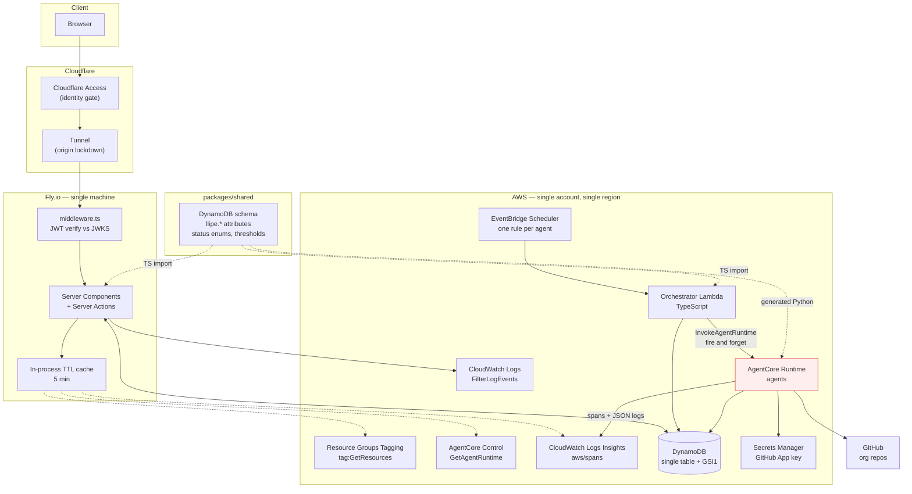
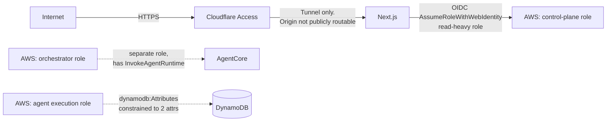
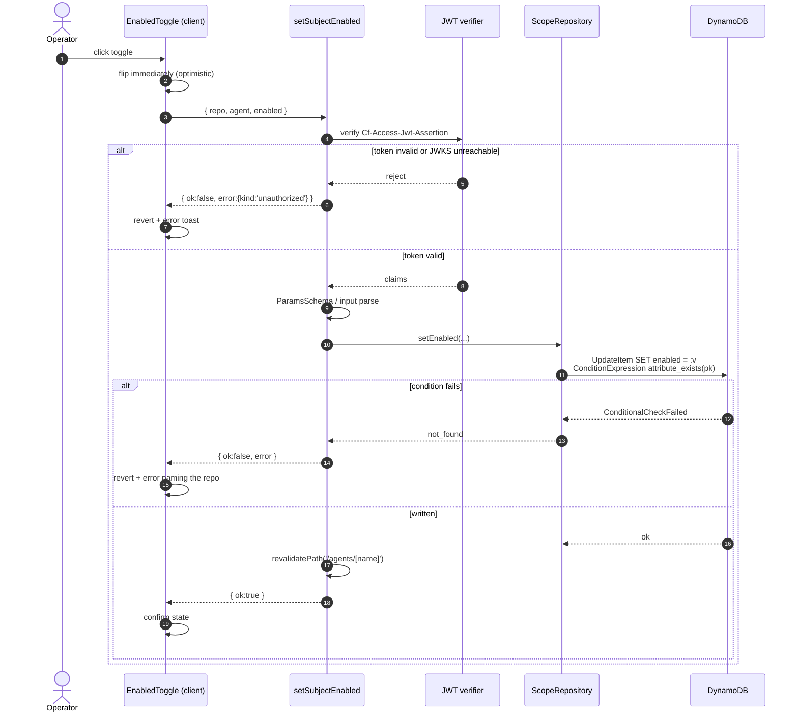
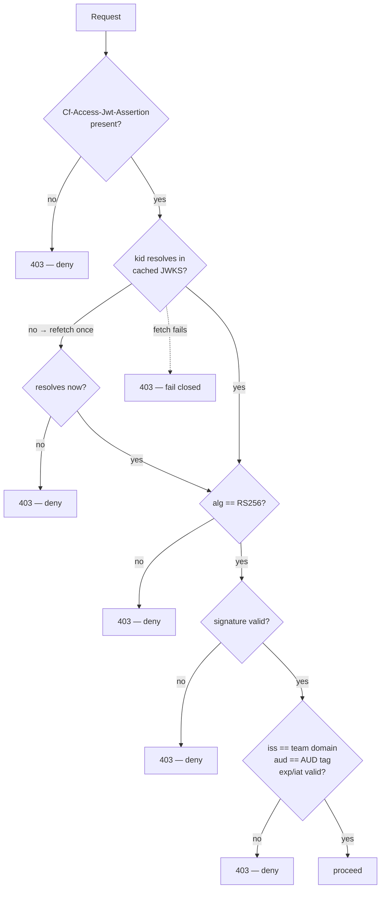
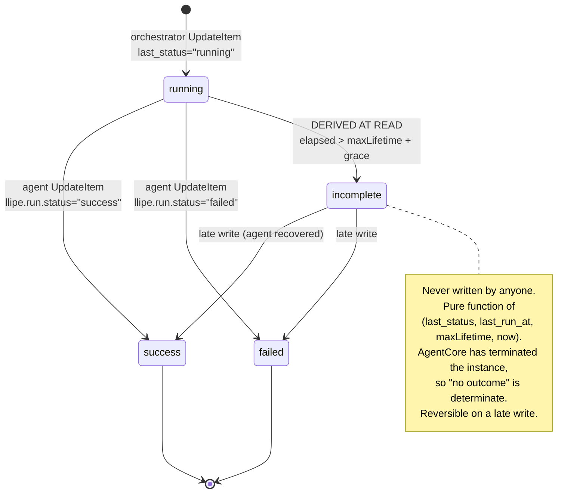
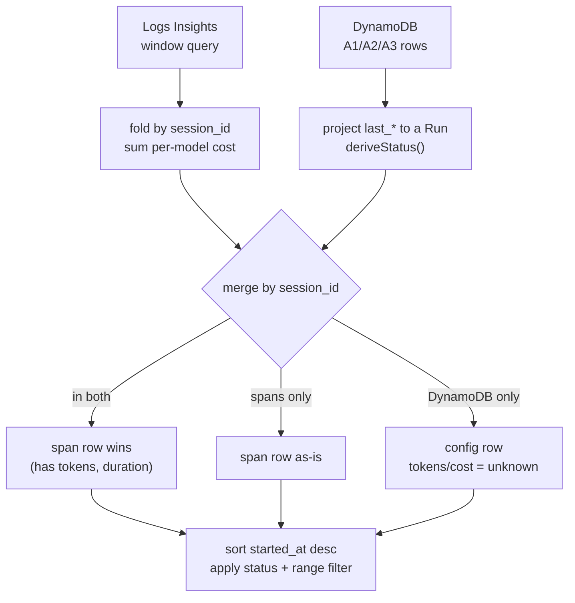
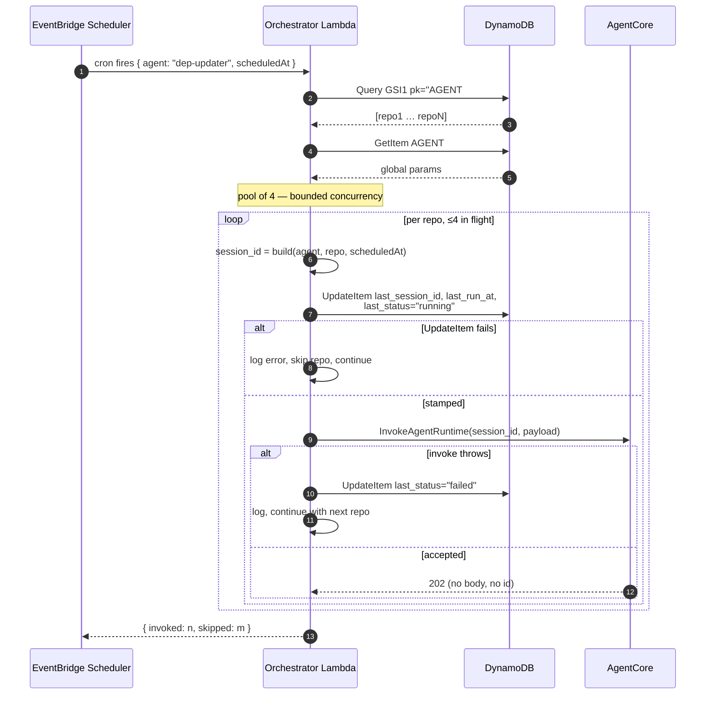
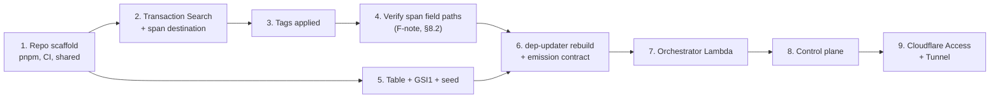

# Technical Specification — Agent Control Plane v1

## Changelog

| Version | Date       | Summary                                          | Author           |
| ------- | ---------- | ------------------------------------------------ | ---------------- |
| 1.2     | 2026-08-19 | CDK approved and recorded. S11 resolved: blocking entrypoint blocks `/ping` and the session is reclaimed — added §2.4 and migration change C16 (async-task pattern). Migration tasks re-ordered. | product-engineer |
| 1.1     | 2026-08-19 | F1/F2/F3 resolved. `incomplete` replaces `stale`, bounded by per-agent `maxLifetime`. Cost estimate simplified. IaC switched to CDK. New §19 agent migration analysis against `llipe/dep-update-agent`. | product-engineer |
| 1.0     | 2026-08-19 | Initial specification, derived from PRD v1.1      | product-engineer |

---

## 1. Executive Summary

The control plane is a single Next.js container that reads four AWS services server-side and writes one. Its core read is a CloudWatch Logs Insights aggregation over OTel spans, merged with DynamoDB configuration rows to produce a unified run list; its core write is two Server Actions constrained to the `enabled` and `params` attributes. Orchestration is an EventBridge-scheduled TypeScript Lambda that fans out over enabled repositories with a bounded concurrency pool, generating each `session_id` before a fire-and-forget invocation.

Three findings emerged while deriving this design from the PRD, each requiring a decision before implementation. They are stated in §2.1 and tracked in §17.

---

## 2. Reference Documents

| Document | Path | Relevant sections |
| --- | --- | --- |
| PRD | [`docs/requirements/PRD-agent-control-plane-v1-en.md`](../docs/requirements/PRD-agent-control-plane-v1-en.md) v1.1 | All |
| Product context | [`docs/product-context.md`](../docs/product-context.md) | §9 constraints, §11 assumptions |
| Technical guidelines | [`docs/technical-guidelines.md`](../docs/technical-guidelines.md) | §2 stack, §3 architecture, §5 auth, §6 security, §7 data, §11 testing |
| Design contract | [`DESIGN.md`](../DESIGN.md) | §2 tokens, §4 interaction, §5 data display |

### 2.1 Findings that change the PRD

These are design consequences the PRD does not currently account for. Each needs a decision; none can be resolved by implementation choice alone.

All three were raised in spec v1.0 and are **resolved** in v1.1. Kept here because the reasoning explains why the design looks the way it does.

**F1 — joining spans to `session_id`. RESOLVED: no contract change needed.** `session_id` is the join key for everything — it addresses the DynamoDB row, filters the logs, and shows in the run panel. AWS documents that when an agent runs on AgentCore Runtime under ADOT instrumentation, [the Runtime injects the `session.id` attribute and exports spans automatically](https://docs.aws.amazon.com/bedrock-agentcore/latest/devguide/supported-frameworks-strands.html). The value is the `runtimeSessionId` passed to `InvokeAgentRuntime` — which the orchestrator generates, so the same string lands on the span, in the DynamoDB row, and in the logs.

The reference agent already satisfies the precondition: it runs Strands under `opentelemetry-instrument` (§19.1). So the answer to "where does the session ID come from" is that the orchestrator mints it before invoking, not that it comes back in a response — `InvokeAgentRuntime` accepts it as an input parameter and returns nothing useful. Phase 1 verifies the attribute is actually present on emitted spans; if it is not, the agent sets `llipe.session.id` explicitly as a one-line fallback. Read via `SPAN_FIELDS.sessionId` so either source is a config change.

**F2 — Tokens are not on the root span, so the run list is an aggregation, not a projection.** `gen_ai.usage.*` attributes are emitted on each model-invocation span, not on the root. A run's token total is a sum across its child spans, and a run using two models has two prices. The query groups and aggregates rather than selecting rows. **Simplified per your direction:** cost is a single best-effort number plus a completeness flag rather than a variant type (§8.4), and full multi-model attribution plus automated pricing sync are recorded in the PRD backlog for a later release.

**F3 — Spans alone cannot show a running run. RESOLVED, and the fix is better than the PRD's original rule.** A `running` run has not emitted a terminal root span, so it does not exist in Logs Insights; a run that died may never emit one at all. Both live only in DynamoDB, so the run list is a **merge of two sources** (§8.3). A span-only implementation would silently never display two of the four statuses.

`GetAgentRuntime` returns [`lifecycleConfiguration.maxLifetime`](https://docs.aws.amazon.com/bedrock-agentcore-control/latest/APIReference/API_LifecycleConfiguration.html) — the instance's maximum lifetime in seconds, after which AgentCore terminates it. The control plane already calls `GetAgentRuntime` and caches it, so this costs nothing extra. Once elapsed time passes `maxLifetime` plus a grace period, the runtime has definitively killed the instance and no outcome was written. That is a **fact, not a heuristic**, which is why the status is `incomplete` — cut off, no output — rather than `failed`, which means an agent ran and reported it could not do the job.

**This also corrects a real defect in the PRD's fixed 6-hour threshold.** The reference agent configures `maxLifetime: 3600` — one hour. A dead run would have sat in `running` for five hours longer than the instance could possibly have been alive. Against the AgentCore default of 28800 s (8 h) the error runs the other way: a legitimately long run would be declared dead two hours early. A per-agent bound is right in both directions. PRD v1.2 and DESIGN.md v1.1 are updated accordingly.

### 2.2 Decisions taken under open questions

| PRD open question | Decision for this spec | Reversibility |
| --- | --- | --- |
| #1 span destination | Shared `aws/spans` log group | Single env var `SPANS_LOG_GROUP`. All queries read it from config; no code change to switch. |
| #2 Fly OIDC | Design for OIDC; credential acquisition isolated behind one provider module | Static-key fallback is a change in that one module. |
| #3 origin lockdown | Cloudflare Tunnel | Deployment-time, no application code. |
| #4 agent base | [`llipe/dep-update-agent`](https://github.com/llipe/dep-update-agent) as the starting point, not a rewrite | §19 enumerates the gaps |

### 2.3 Decided: IaC is AWS CDK, not Terraform

Technical guidelines v1.0 recorded Terraform, chosen before the reference agent was on the table. The reference repo deploys entirely through **AWS CDK in TypeScript** — an agent stack and a trigger stack, both working. Porting that to Terraform means rewriting deployment code that already runs, for no benefit, and CDK fits this repo better anyway: the orchestrator, the control plane, and `packages/shared` are all TypeScript, so a stack can import the constants it deploys instead of restating them as strings.

**Approved 2026-08-19.** Technical guidelines v1.1 updated (§2 stack table, §13 deployment, CI path table). Stacks split by deploy cadence: agent runtime, shared data (table + GSI1), orchestration (scheduler + Lambda).

### 2.4 Resolved: agent liveness (was R11/S11)

This one turned out to be a documented failure mode with a documented fix, and it changes the agent's entrypoint architecture.

`maxLifetime` is not the only lifecycle bound. AgentCore polls the agent's `/ping` endpoint to decide whether a session is still alive: per the [long-running agents guide](https://docs.aws.amazon.com/bedrock-agentcore/latest/devguide/runtime-long-run.html), `/ping` must return `{"status": "HealthyBusy"}` while background work is in flight. A session reporting `Healthy` is terminated after the idle timeout; one reporting `HealthyBusy` survives to `maxLifetime`.

`/ping` is served by the same process as the entrypoint. The reference agent's entrypoint runs its whole pipeline synchronously — `git clone`, `pnpm install`, `pnpm audit`, test suites, possibly Claude fix attempts — which blocks the ping thread. The platform sees a session that stopped answering, concludes it is idle, and terminates it mid-work. AWS lists this exact scenario under common issues ("this can happen when the application is single threaded and the ping thread is blocked"), and there are re:Post reports of the symptom: the agent stops producing output with no error at all.

The reference agent sets `idleRuntimeSessionTimeout: 300`, so it would be cut off at five minutes rather than the platform's 15-minute default.

Fix, per §19.2 C16: move the pipeline onto a worker thread and return from the entrypoint immediately, tracking the work with `app.add_async_task` / `app.complete_async_task`. Two benefits beyond staying alive — the immediate return is exactly what makes the orchestrator's fire-and-forget invocation safe, so C7 and C16 are the same change viewed from either end; and the SDK manages ping status, so there is no health bookkeeping to get wrong.

One caveat carried into the guidelines: do not set `time_of_last_update` manually. AWS warns that a timestamp advancing on every ping reads as continuous status change, which prevents the idle timeout from ever firing and can exhaust the session quota.

---

## 3. Affected Repositories

| Repository | Role | Scope of Changes |
| --- | --- | --- |
| `llipe/dev-tasks-agent-fleet` | Monorepo — everything | New: `apps/control-plane` (Next.js), `packages/shared` (contracts + codegen), `agents/dep-updater` (Python 3.13, ported from the reference agent), `infra/` (CDK + orchestrator Lambda), path-gated CI workflows. |

Single `primary` component, so no cross-repo partitioning applies.

---

## 4. System Architecture

### 4.1 Component view

Four processes, one shared contract package, five AWS services. The control plane never invokes an agent; the orchestrator never serves a request.



The dotted contract edges are the reason this is a monorepo. The red-outlined `AgentCore Runtime` node is deliberately unreachable from the control plane: no `InvokeAgentRuntime` in its role, which is how PRD §10's scope exclusions are enforced.

### 4.2 Read paths and their cost

| View | Reads | Latency class |
| --- | --- | --- |
| Agents list | tags (cached) + `GetAgentRuntime` per agent (cached) + 30d cost aggregate (cached) + DynamoDB last-run rows | Fast on cache hit, seconds cold |
| Agent → Runs | Logs Insights window query (cached) + DynamoDB in-flight rows | Seconds cold |
| Agent → Repos | DynamoDB `Query GSI1 PK=AGENT#x` | Milliseconds, uncached |
| Repos list | DynamoDB, N agent queries + subject META query | Milliseconds, uncached |
| Run panel | Logs Insights trace query + `FilterLogEvents` | Seconds, uncached |

### 4.3 Trust boundaries



Three distinct AWS roles, each with the minimum for its job. The control-plane role and the orchestrator role are not the same role, specifically so that a front-end compromise cannot invoke an agent.

---

## 5. Data Model & Database Design

### 5.1 Logical entities

```mermaid
erDiagram
    SUBJECT ||--o{ SUBJECT_AGENT : "is in scope of"
    AGENT   ||--o{ SUBJECT_AGENT : "covers"
    AGENT   ||--|| AGENT_CONFIG  : "has global"
    SUBJECT_AGENT ||--o| RUN     : "last run points to"
    AGENT   ||--o{ RUN           : "produced"
    SUBJECT ||--o{ RUN           : "was subject of"

    SUBJECT {
        string pk "SUBJECT#<repo>"
        string sk "META"
        bool   enabled "subject-level kill switch"
    }
    SUBJECT_AGENT {
        string pk "SUBJECT#<repo>"
        string sk "AGENT#<name>"
        bool   enabled "front end writes"
        map    params "front end writes"
        string last_session_id "orchestrator writes"
        string last_run_at "orchestrator writes, ISO8601"
        string last_status "orchestrator + agent write"
        string last_outcome_url "agent writes"
    }
    AGENT_CONFIG {
        string pk "AGENT#<name>"
        string sk "CONFIG"
        map    params "global defaults"
    }
    AGENT {
        string name "from tag agent:name"
        string domain "from tag agent:domain"
        string runtime_arn "from tag:GetResources"
        bool   managed "tag agent:managed=true"
    }
    RUN {
        string session_id "join key — see F1"
        string agent
        string repo
        string status
        string started_at
        int    duration_ms
        int    tokens_in
        int    tokens_out
        float  estimated_cost
        string outcome_type
        string outcome_url
    }
```

`AGENT` is not stored — it is projected from AWS resource tags at read time. `RUN` is not stored either; it is derived from spans merged with `SUBJECT_AGENT` (§8.3). Only the three DynamoDB item types are persisted, which is what keeps the control plane stateless.

### 5.2 Table definition

Single table `agent-fleet-config`, on-demand, PITR on.

| Property | Value |
| --- | --- |
| Partition key | `pk` (String) |
| Sort key | `sk` (String) |
| GSI1 | `pk` = `sk`, `sk` = `pk` (inverted), projection `ALL` |
| Billing | `PAY_PER_REQUEST` |
| PITR | Enabled |
| Deletion protection | Enabled |

Attribute names are `snake_case` on the wire, mapped to camelCase in TypeScript inside the repository layer only.

### 5.3 Access patterns

Every pattern is a `Query` or `GetItem`. **No `Scan` anywhere**, including the Repos list, which is the one place a Scan would be tempting.

| # | Need | Operation |
| - | --- | --- |
| A1 | Enabled repos for an agent (orchestrator + Repos tab) | `Query GSI1 pk = "AGENT#<name>" AND begins_with(sk, "SUBJECT#")`, filter `enabled = true` |
| A2 | All repos for an agent, enabled or not (Repos tab) | Same, no filter |
| A3 | Agents covering a repo | `Query pk = "SUBJECT#<repo>" AND begins_with(sk, "AGENT#")` |
| A4 | **All subjects** (Repos list) | `Query GSI1 pk = "META"` |
| A5 | Global agent config | `GetItem pk = "AGENT#<name>", sk = "CONFIG"` |
| A6 | One pair (toggle target) | `GetItem pk = "SUBJECT#<repo>", sk = "AGENT#<name>"` |
| A7 | Add repo to scope | `PutItem` with `attribute_not_exists(pk)` condition |
| A8 | Orchestrator run-start stamp | `UpdateItem` on `last_session_id`, `last_run_at`, `last_status` |
| A9 | Agent run-finish stamp | `UpdateItem` on `last_status`, `last_outcome_url` |

**A4 deserves a note.** Listing every subject looks like it needs a Scan, and it does not. Because GSI1 inverts the keys, every `SUBJECT#<repo> / META` item appears in GSI1 under partition `META`. `Query GSI1 pk = "META"` returns all subjects in one query, no schema change, no Scan. This works only if a `META` item is written for every subject, so §8.5 makes `addSubjectToAgent` write both items transactionally.

### 5.4 Write separation as policy, not convention

| Writer | Role | May write | Operation | Enforcement |
| --- | --- | --- | --- | --- |
| Control plane | `control-plane-role` | `enabled`, `params` | `PutItem`, `UpdateItem` | `dynamodb:Attributes` condition |
| Orchestrator | `orchestrator-role` | `last_session_id`, `last_run_at`, `last_status` | `UpdateItem` | `dynamodb:Attributes` condition |
| Agent | `agent-exec-role` | `last_status`, `last_outcome_url` | `UpdateItem` **only** | `dynamodb:Attributes` + no `PutItem` in policy |

The agent's `PutItem` denial is load-bearing, not stylistic. A `PutItem` from an agent replaces the whole item, silently erasing `enabled` and `params` — the operator's configuration would vanish on the next successful run, and nothing would report it. §12.2 gives the policy.

### 5.5 Migration strategy

Greenfield: no migration. Initial seed loads the current repository list as one `PutItem` pair per repo (`META` + `AGENT#dep-updater`), run as a one-shot script committed under `infra/seed/`. Idempotent via `attribute_not_exists`, so re-running is safe.

---

## 6. API Design

**There is no HTTP API.** Per technical guidelines §4, reads happen in Server Components and writes are Server Actions. The only route handler is an unauthenticated `GET /healthz` returning `200 {"status":"ok"}` with no data access, needed by Fly health checks.

### 6.1 Server Actions

Three actions, each a public endpoint regardless of how it looks in source.

```ts
// apps/control-plane/src/server/actions/scope.ts
'use server';

type ActionResult<T = void> =
  | { ok: true; data: T }
  | { ok: false; error: ActionError };

type ActionError =
  | { kind: 'validation'; field: string; message: string }
  | { kind: 'conflict'; message: string }
  | { kind: 'not_found'; message: string }
  | { kind: 'unauthorized' }
  | { kind: 'upstream'; message: string };   // AWS detail logged, not returned

export async function setSubjectEnabled(
  input: unknown,
): Promise<ActionResult>;

export async function setSubjectParams(
  input: unknown,
): Promise<ActionResult>;

export async function addSubjectToAgent(
  input: unknown,
): Promise<ActionResult>;
```

Every action follows the same four steps, in this order:

1. **Re-verify the Access JWT.** Middleware guards navigation; it must not be the only check on a mutation. Reading the header inside the action and verifying it again costs a cached JWKS lookup.
2. **Parse `input` with Zod.** The parameter is typed `unknown` deliberately — a typed parameter on a Server Action is a compile-time fiction, since the caller is the network.
3. **Execute** through the repository layer.
4. **`revalidatePath`** on the affected route only.

### 6.2 Action contracts

| Action | Input schema | Success | Failure modes |
| --- | --- | --- | --- |
| `setSubjectEnabled` | `{ repo: RepoName, agent: AgentName, enabled: boolean }` | `{ ok: true }` | `not_found` if pair absent; `upstream` |
| `setSubjectParams` | `{ repo: RepoName, agent: AgentName, params: ParamsSchema }` | `{ ok: true }` | `validation` on bad JSON or unknown key; `not_found`; `upstream` |
| `addSubjectToAgent` | `{ repo: RepoName, agent: AgentName, params?: ParamsSchema }` | `{ ok: true }` | `conflict` if pair exists; `validation` on malformed repo name; `upstream` |

```ts
// packages/shared/src/schema/scope.ts
export const RepoName = z.string()
  .min(1).max(100)
  .regex(/^[A-Za-z0-9._-]+(?:\/[A-Za-z0-9._-]+)?$/, 'owner/repo or repo');

export const AgentName = z.string()
  .min(1).max(64)
  .regex(/^[a-z0-9-]+$/, 'lowercase, digits, hyphens');

/**
 * Params are per-agent, so the schema is a registry rather than one shape.
 * dep-updater's keys are the ones its entrypoint actually reads (§19.1).
 * An unregistered agent gets an empty strict object: no params accepted,
 * so nothing unvalidated can reach an invocation payload.
 */
export const PARAMS_SCHEMAS = {
  'dep-updater': z.object({
    allow_fixes:      z.boolean().optional(),
    max_fix_attempts: z.number().int().min(1).max(5).optional(),
  }).strict(),
} as const satisfies Record<string, z.ZodType>;

export const paramsSchemaFor = (agent: string) =>
  PARAMS_SCHEMAS[agent as keyof typeof PARAMS_SCHEMAS] ?? z.object({}).strict();
```

The PRD's original example params (`branch`, `severity`, `ignore`) were illustrative; the reference agent reads `allow_fixes` and `max_fix_attempts` and nothing else, so those are the real keys. PRD v1.2 is updated to match — a `params` schema that does not match what the agent reads would let the operator set a value that silently does nothing.

`.strict()` is the key-allowlist requirement from technical guidelines §6, expressed in one method call. It must not be relaxed to `.passthrough()` for convenience; `params` reaches the agent's invocation payload, and unknown keys are unvalidated data crossing a process boundary.

### 6.3 Sequence — toggle a repository's scope

Optimistic UI with rollback, because a silently failed toggle means a repository the operator believes is enabled that will simply never run.



---

## 7. Authentication & Authorization Design

### 7.1 Two independent controls

Technical guidelines §5 requires both, and neither is a follow-on to the other. Validation without origin lockdown means anyone who finds the `.fly.dev` hostname bypasses Cloudflare entirely; lockdown without validation means anything routed through Cloudflare is trusted.



### 7.2 Implementation

```ts
// apps/control-plane/src/middleware.ts  (Edge runtime)
import { createRemoteJWKSet, jwtVerify } from 'jose';

const JWKS = createRemoteJWKSet(
  new URL(`https://${process.env.CF_ACCESS_TEAM_DOMAIN}/cdn-cgi/access/certs`),
  { cooldownDuration: 30_000, cacheMaxAge: 600_000 },
);

export async function middleware(req: NextRequest) {
  const token = req.headers.get('Cf-Access-Jwt-Assertion');
  if (!token) return deny();

  try {
    await jwtVerify(token, JWKS, {
      issuer: `https://${process.env.CF_ACCESS_TEAM_DOMAIN}`,
      audience: process.env.CF_ACCESS_AUD,
      algorithms: ['RS256'],          // allowlist, never read from the header
      clockTolerance: 30,
    });
    return NextResponse.next();
  } catch {
    return deny();                     // fail closed on every path, incl. JWKS fetch failure
  }
}

export const config = { matcher: ['/((?!healthz|_next/static|favicon).*)'] };
```

`jose` rather than `jsonwebtoken`: middleware runs in the Edge runtime, which has Web Crypto but not Node's `crypto`. `algorithms: ['RS256']` is an explicit allowlist — accepting the token header's own `alg` claim is the classic algorithm-confusion hole.

### 7.3 Authorization matrix

| Principal | Read runs/agents/repos | Toggle `enabled` | Edit `params` | Add repo | Invoke agent | Modify runtime |
| --- | --- | --- | --- | --- | --- | --- |
| Authenticated operator | yes | yes | yes | yes | **no** | **no** |
| Unauthenticated | no | no | no | no | no | no |

One authenticated role, matching PRD §10's exclusion of differentiated permissions. That is a decision about *what distinctions exist among authenticated users* — it is not permission to skip authentication. The last two columns are `no` for every principal because the capability is absent from the credential, not hidden from the UI.

### 7.4 AWS credentials

```ts
// apps/control-plane/src/server/aws/credentials.ts — the only place this varies
export const credentials =
  process.env.AWS_ROLE_ARN
    ? fromWebToken({                        // Fly Machines OIDC (preferred)
        roleArn: process.env.AWS_ROLE_ARN!,
        webIdentityToken: await readFlyOidcToken(),
        durationSeconds: 3600,
      })
    : fromEnv();                            // static-key fallback, same minimal policy
```

Isolating this means resolving PRD open question #2 either way touches one module. If the fallback is used, keys must be rotatable via `fly secrets set` without a rebuild.

---

## 8. Business Logic Implementation

### 8.1 Run status state machine

Three states are written; the fourth is derived and never persisted.



`failed` and `incomplete` are different facts, not different severities. `failed` means the agent ran and reported it could not do the job — there is a diagnosis to read. `incomplete` means the runtime cut the instance off before anything was reported — there is no diagnosis, only logs up to the cut. Merging them would tell the operator "something went wrong" while hiding which of the two questions to ask.

```ts
// packages/shared/src/run/status.ts

/** AgentCore service default when lifecycleConfiguration.maxLifetime is absent. */
export const DEFAULT_MAX_LIFETIME_MS = 28_800_000;   // 8 h

/** Covers instance termination (~15 s) plus span and DynamoDB write lag. */
export const TERMINATION_GRACE_MS = 5 * 60 * 1000;

export function deriveStatus(
  lastStatus: PersistedStatus,
  lastRunAt: string,
  maxLifetimeMs: number = DEFAULT_MAX_LIFETIME_MS,
  now: number = Date.now(),
): RunStatus {
  if (lastStatus !== 'running') return lastStatus;
  const elapsed = now - Date.parse(lastRunAt);
  return elapsed > maxLifetimeMs + TERMINATION_GRACE_MS ? 'incomplete' : 'running';
}
```

`maxLifetimeMs` is per agent, read from the cached `GetAgentRuntime` response:

```ts
// src/server/aws/agentcore.ts
const rt = await cached(`runtime:${arn}`, () => acControl.send(new GetAgentRuntimeCommand({ ... })));
const maxLifetimeMs = (rt.lifecycleConfiguration?.maxLifetime ?? 28_800) * 1000;
```

Pure, exported from `shared`, the only place the grace and the fallback appear. Tested at the boundary in both directions and with `maxLifetime` absent (§14).

`idleRuntimeSessionTimeout` is deliberately not used for derivation. It governs reclamation of idle sessions, and whether a fire-and-forget invocation counts as idle is unverified — see R11, which is the one open risk that could invalidate the orchestration model.

### 8.2 The Logs Insights query layer

All queries target one log group, read from `SPANS_LOG_GROUP`. Because tokens live on child spans (F2), the run-list query aggregates by session and model.

```
# Run list — window query, grouped by session and model
fields
  @timestamp,
  `attributes.llipe.session.id`   as session_id,
  `attributes.llipe.subject.id`   as repo,
  `attributes.llipe.run.status`   as run_status,
  `attributes.llipe.outcome.type` as outcome_type,
  `attributes.llipe.outcome.url`  as outcome_url,
  `attributes.gen_ai.request.model` as model_id,
  `attributes.gen_ai.usage.input_tokens`  as tok_in,
  `attributes.gen_ai.usage.output_tokens` as tok_out,
  `attributes.service.name`       as agent,
  durationNano / 1000000          as duration_ms
| filter ispresent(session_id)
| stats
    max(duration_ms)   as duration_ms,
    min(@timestamp)    as started_at,
    sum(tok_in)        as tokens_in,
    sum(tok_out)       as tokens_out,
    max(run_status)    as status,
    max(repo)          as repo,
    max(agent)         as agent,
    max(outcome_type)  as outcome_type,
    max(outcome_url)   as outcome_url
  by session_id, model_id
| sort started_at desc
| limit 5000
```

> **Field paths must be verified against real emitted spans in Phase 1.** The exact JSON shape Transaction Search writes (nesting, whether `attributes.` is the correct prefix, the `durationNano` field name) is an AWS implementation detail I have not verified against a live span. The entire mapping is confined to `src/server/aws/spans/fields.ts` so verification touches one file. This is task 1 of the query-layer work, not an assumption to build on.

Grouping by `(session_id, model_id)` yields one row per model per run. The app then folds rows by `session_id`, summing per-model costs (§8.4). Runs using one model produce one row; multi-model runs produce several.

Query execution wraps `StartQuery` → poll `GetQueryResults`:

```ts
async function runInsightsQuery(q: string, range: TimeRange): Promise<QueryOutcome> {
  const { queryId } = await logs.send(new StartQueryCommand({
    logGroupName: config.spansLogGroup,
    startTime: Math.floor(range.from / 1000),
    endTime: Math.floor(range.to / 1000),
    queryString: q,
    limit: 5000,
  }));

  const deadline = Date.now() + QUERY_TIMEOUT_MS;   // 25s
  let delay = 300;
  while (Date.now() < deadline) {
    const res = await logs.send(new GetQueryResultsCommand({ queryId }));
    if (res.status === 'Complete') return { kind: 'ok', rows: res.results ?? [] };
    if (res.status === 'Failed')    return { kind: 'error', message: 'query failed' };
    if (res.status === 'Cancelled') return { kind: 'error', message: 'query cancelled' };
    await sleep(delay);
    delay = Math.min(delay * 1.5, 2000);            // backoff, not a tight loop
  }
  await logs.send(new StopQueryCommand({ queryId }));
  return { kind: 'timeout' };                        // distinct from ok-with-zero-rows
}
```

`timeout` is a first-class outcome, not an empty result. DESIGN.md §4 requires the UI to distinguish "there are no runs" from "we could not find out"; that distinction starts here and would be impossible to reconstruct later.

### 8.3 The run-list merge (F3)

Spans give completed history. DynamoDB gives in-flight and dead runs. Neither alone is the run list.



```ts
export function mergeRuns(spanRuns: Run[], configRuns: Run[]): Run[] {
  const bySession = new Map(spanRuns.map(r => [r.sessionId, r]));
  for (const cr of configRuns) {
    if (!bySession.has(cr.sessionId)) bySession.set(cr.sessionId, cr);
  }
  return [...bySession.values()].sort((a, b) => b.startedAt - a.startedAt);
}
```

Span rows win on conflict because they carry tokens and duration, which DynamoDB never has.

Config-only rows are included **regardless of `last_status`**, not just when `running`. Two cases justify this:

- **Span ingestion lag.** An agent writes `success` to DynamoDB before its spans are queryable. Including only `running` rows would make the run vanish from history for the lag window, then reappear — worse than showing it immediately with tokens marked unknown.
- **Death before emission.** An `incomplete` run may never produce a terminal span. It exists only here.

One structural limitation, worth stating rather than discovering: DynamoDB holds only the **latest** run per `(subject, agent)` pair, so at most one in-flight run per pair is visible. This is sufficient because one schedule per agent means at most one concurrent run per pair. If a future agent gets multiple schedules, this assumption breaks and the merge needs a real run ledger — which PRD §10 explicitly excludes from v1.

### 8.4 Cost estimation

Best-effort, per your direction: price what the table knows, flag what it does not, and defer the harder accounting to a later release rather than modelling it now.

```ts
// apps/control-plane/src/lib/cost.ts
export interface CostEstimate {
  /** Sum over priced models. null when nothing could be priced at all. */
  usd: number | null;
  /** false when at least one model in the run had no pricing entry. */
  complete: boolean;
  unpricedModels: string[];
}

export function estimateRunCost(perModel: ModelUsage[], table: PricingTable): CostEstimate {
  let usd = 0;
  let priced = 0;
  const unpricedModels: string[] = [];

  for (const u of perModel) {
    const p = table.models[u.modelId];
    if (!p) { unpricedModels.push(u.modelId); continue; }
    usd += (u.tokensIn / 1_000_000) * p.inputPerMTok
         + (u.tokensOut / 1_000_000) * p.outputPerMTok;
    priced++;
  }

  return {
    usd: priced > 0 ? usd : null,
    complete: unpricedModels.length === 0,
    unpricedModels,
  };
}
```

One shape and one flag rather than a variant union — less machinery, same guarantee. The `usd: number | null` split is what keeps PRD's "never `$0.00`" honest: an unpriced run returns `null`, not zero, so it cannot render as free. The `complete` flag keeps a partially priced run from being presented as exact.

Display rules, per DESIGN.md §5:

| State | Rendered |
| --- | --- |
| `complete`, `usd` set | `$0.0123` |
| `!complete`, `usd` set | `≥ $0.0123` with an incomplete marker and the unpriced model in the tooltip |
| `usd` null | `unknown` |

`warn`-level log on any unpriced `model_id`, so a pricing gap surfaces without a dashboard. Full multi-model attribution and automated pricing sync are in the PRD backlog, marked pending for a later release.

```jsonc
// apps/control-plane/pricing/pricing-v1.json — versioned, hand-maintained
{
  "version": 1,
  "updatedAt": "2026-08-19",
  "currency": "USD",
  "note": "Per million tokens. Fill from AWS Bedrock pricing at implementation time.",
  "models": {
    "<model-id>": { "inputPerMTok": 0.0, "outputPerMTok": 0.0 }
  }
}
```

Values are placeholders. I have not verified current Bedrock per-model prices and will not guess them into a file that computes displayed numbers — populating this from the AWS pricing page is an implementation task with a validation test that every model appearing in spans has an entry.

**30-day agent cost** (Agents list) is a separate aggregation over a 30-day window grouped by `(agent, model_id)`, cached 5 minutes. It is the heaviest query in the app; it runs once per cache period, not once per row.

### 8.5 Adding a subject transactionally

A4 (list all subjects) depends on every subject having a `META` item. A repo added with only its `AGENT#` item would be invisible in the Repos list — present in the agent's scope, absent from the repos view. `TransactWriteItems` makes that state impossible:

```ts
await ddb.send(new TransactWriteItemsCommand({
  TransactItems: [
    { Put: {                                  // idempotent: fine if it exists
        TableName, Item: { pk: `SUBJECT#${repo}`, sk: 'META', enabled: true },
        ConditionExpression: 'attribute_not_exists(pk) OR attribute_exists(pk)',
    }},
    { Put: {                                  // must not clobber existing scope
        TableName,
        Item: { pk: `SUBJECT#${repo}`, sk: `AGENT#${agent}`, enabled: true, params },
        ConditionExpression: 'attribute_not_exists(sk)',
    }},
  ],
}));
```

### 8.6 Orchestrator



The DynamoDB stamp happens **before** invocation. Reversing that order loses the run entirely if the Lambda dies between the two calls: an agent would be running with no row pointing at it, and no `incomplete` detection possible because `incomplete` is derived from a row that does not exist.

If invocation throws, the row is walked back to `failed` — otherwise it would sit `running` until `maxLifetime` elapsed before surfacing as `incomplete`, misreporting a known synchronous failure as an unknown cut-off.

**Session ID construction.** `InvokeAgentRuntime` requires ≥33 characters, and the PRD's example format does not guarantee that: a short agent and repo (`ci-fmt` + `web`) yields 28. Silently short IDs would fail at invocation time, per repo, intermittently — the worst failure shape.

```ts
// packages/shared/src/run/session-id.ts
export const SESSION_ID_MIN_LENGTH = 33;

export function buildSessionId(agent: string, repo: string, scheduledAt: Date): string {
  const slug = repo.includes('/') ? repo.split('/')[1]! : repo;
  const ts = scheduledAt.toISOString().replace(/[-:T]/g, '').slice(0, 14); // yyyymmddhhmmss
  const base = `${agent}-${slug}-${ts}`.replace(/[^A-Za-z0-9-]/g, '-');
  return base.length >= SESSION_ID_MIN_LENGTH
    ? base
    : `${base}-${randomSuffix(SESSION_ID_MIN_LENGTH - base.length - 1)}`;
}
```

Derived from `scheduledAt` rather than `Date.now()` so a Lambda retry of the same scheduled occurrence reproduces the same ID, making the `UpdateItem` idempotent instead of creating a duplicate run.

**Concurrency:** a pool of 4 (midpoint of the PRD's 3–5), as `ORCHESTRATOR_CONCURRENCY`. **Partial failure:** per-repo try/catch; one repo's failure never aborts the loop. Lambda timeout 60s — it invokes and returns, it does not wait for agents.

---

## 9. Integration Details

| Integration | Client | Retry | Failure behaviour |
| --- | --- | --- | --- |
| `tag:GetResources` | `@aws-sdk/client-resource-groups-tagging-api` | 3×, jittered backoff | Agents list shows error state; other views unaffected |
| `GetAgentRuntime` | `@aws-sdk/client-bedrock-agentcore-control` | 3× | Row renders without runtime detail |
| Logs Insights | `@aws-sdk/client-cloudwatch-logs` | No retry on timeout | `timeout` state, retry button |
| `FilterLogEvents` | same | 2× | Panel shows metadata; log section shows error |
| DynamoDB | `@aws-sdk/lib-dynamodb` | SDK default adaptive | Action returns `upstream`; UI reverts optimistic state |
| `InvokeAgentRuntime` | `@aws-sdk/client-bedrock-agentcore` (orchestrator only) | None — no blind retry | Stamp `failed`, continue |
| GitHub App | agent-side, `PyGithub` or raw REST | 3× on 5xx, honour `Retry-After` | Run fails, `llipe.run.status="failed"` |

Retry policy: jittered exponential backoff on throttling and 5xx only. **Never retry a validation error**, and never blind-retry `InvokeAgentRuntime` — a retry after an ambiguous timeout can double-invoke an agent that already started, producing two runs against one repo with one `session_id`.

Every adapter returns domain types. No AWS SDK type escapes `src/server/aws/`, which is what keeps the mappers testable without AWS.

---

## 10. User Interface & Client Behavior

### 10.1 Routes

| Route | View | Rendering |
| --- | --- | --- |
| `/` | redirect → `/agents` | — |
| `/agents` | Agents table | Server, dynamic |
| `/agents/[name]?tab=runs&status=&from=&to=&run=` | Agent detail, Runs tab | Server, streamed |
| `/agents/[name]?tab=repos` | Agent detail, Repos tab | Server, dynamic |
| `/repos` | Repos table | Server, dynamic |
| `/repos/[repo]?status=&from=&to=&run=` | Repo runs | Server, streamed |
| `/healthz` | health check | Static, unauthenticated, no data |

All data routes set `export const dynamic = 'force-dynamic'`. Static prerendering of a page that reads AWS would bake one operator's data into the build output and serve it stale forever.

### 10.2 Filter and panel state in the URL

`status`, `from`, `to`, and `run` are query parameters. Three consequences, all of them the point: reload restores the view, a failed run is a shareable link, and server components read filters as props rather than the client re-fetching.

`run=<session_id>` drives the panel. Because it is a URL parameter, the panel is server-rendered on first paint and browser back closes it — no client state machine, no lost scroll position. That is the mechanism behind PRD's "under 3 clicks" metric.

### 10.3 Streaming boundaries

The run panel's three sections have different latencies and must not block each other:

```tsx
<Sheet open={!!runId}>
  <RunMetadata run={run} />                        {/* already loaded from the table */}
  <Suspense fallback={<TimelineSkeleton />}>
    <SpanTimeline sessionId={runId} />             {/* Insights trace query, ~seconds */}
  </Suspense>
  <Suspense fallback={<LogSkeleton />}>
    <LogViewer sessionId={runId} />                {/* FilterLogEvents, uncached */}
  </Suspense>
</Sheet>
```

Metadata is already in hand from the table row, so it paints instantly while the two slow reads stream in. Awaiting all three would make a 4-second blank panel, which reads as broken.

### 10.4 Component mapping

Per DESIGN.md §3 — one `DataTable`, one `StatusBadge`, no second implementations.

| View | Components |
| --- | --- |
| Agents | `DataTable`, `StatusBadge`, `RelativeTime`, `CostEstimate` |
| Agent → Runs | `DataTable`, `StatusBadge`, `RelativeTime`, `CostEstimate`, `RunPanel` |
| Agent → Repos | `DataTable`, `EnabledToggle`, `ParamsEditor`, `AddRepoForm`, `StatusBadge` |
| Repos | `DataTable`, `StatusBadge`, `RelativeTime` |
| Run panel | `RunPanel`, `SpanTimeline`, `LogViewer`, `CostEstimate` |

### 10.5 Client-side validation

`ParamsEditor` parses JSON on change and validates against `ParamsSchema` before enabling save, with the failing key named inline. Server-side validation still runs — the client check is a courtesy, not a control.

### 10.6 Required states

Every async surface implements four states (DESIGN.md §4): loading skeleton, empty (`"No runs in this range"`), error (message + retry), and timed-out (`"Query timed out — narrow the date range"`). The last two are visually and textually distinct because they are different facts.

---

## 11. Performance & Scalability Approach

### 11.1 Cache

```ts
// apps/control-plane/src/server/cache/ttl-cache.ts
const TTL_MS = 5 * 60 * 1000;
const store = new Map<string, { at: number; value: unknown }>();
const inflight = new Map<string, Promise<unknown>>();

export async function cached<T>(key: string, fn: () => Promise<T>): Promise<T> {
  const hit = store.get(key);
  if (hit && Date.now() - hit.at < TTL_MS) return hit.value as T;

  const pending = inflight.get(key);
  if (pending) return pending as Promise<T>;        // single-flight

  const p = fn()
    .then(v => { store.set(key, { at: Date.now(), value: v }); return v; })
    .finally(() => inflight.delete(key));
  inflight.set(key, p);
  return p;
}
```

Single-flight matters more than the TTL here. Without it, a page with four server components requesting the same 30-day cost aggregate fires four Logs Insights queries against a quota-limited API, on every cold load.

| Key | TTL |
| --- | --- |
| `agents:inventory` | 5 min |
| `runtime:<arn>` | 5 min |
| `runs:<agent|repo>:<from>:<to>:<status>` | 5 min |
| `cost30d:<agent>` | 5 min |
| `logs:*`, `config:*` | **not cached** |

Logs and DynamoDB configuration reads stay uncached because they are read precisely when the operator needs current truth — mid-incident, or right after a toggle.

Cache entries are bounded by an LRU cap (500) so a long-lived container with many distinct filter combinations cannot grow unboundedly. Restart-clears-cache is expected and harmless.

### 11.2 Targets

| Path | Target |
| --- | --- |
| Cached view render | < 300 ms server time |
| Cold run list | < 8 s, hard timeout 25 s |
| Log fetch | < 5 s for 1,000 events |
| DynamoDB read | < 50 ms |
| Container memory | < 512 MB |

### 11.3 Bounds

Query `limit 5000`, date range capped at 30 days with the UI defaulting to 7. Pagination is client-side in TanStack Table over the fetched window — server-side pagination over Logs Insights would mean re-running the query per page, which is slower and burns quota.

Not optimising for: horizontal scale, concurrent users, sub-second cold queries. Single machine, no autoscaling.

---

## 12. Security Implementation

### 12.1 Control-plane IAM policy

Exactly PRD §12.2, no additions.

```json
{
  "Version": "2012-10-17",
  "Statement": [
    { "Sid": "Discovery", "Effect": "Allow",
      "Action": ["tag:GetResources"], "Resource": "*" },
    { "Sid": "RuntimeReadOnly", "Effect": "Allow",
      "Action": ["bedrock-agentcore-control:GetAgentRuntime",
                 "bedrock-agentcore-control:ListAgentRuntimes"],
      "Resource": "*" },
    { "Sid": "LogsRead", "Effect": "Allow",
      "Action": ["logs:StartQuery", "logs:GetQueryResults",
                 "logs:StopQuery", "logs:FilterLogEvents"],
      "Resource": ["arn:aws:logs:*:*:log-group:aws/spans:*",
                   "arn:aws:logs:*:*:log-group:/aws/bedrock-agentcore/*"] },
    { "Sid": "ConfigReadWrite", "Effect": "Allow",
      "Action": ["dynamodb:GetItem", "dynamodb:Query", "dynamodb:PutItem",
                 "dynamodb:UpdateItem", "dynamodb:DeleteItem",
                 "dynamodb:TransactWriteItems"],
      "Resource": ["arn:aws:dynamodb:*:*:table/agent-fleet-config",
                   "arn:aws:dynamodb:*:*:table/agent-fleet-config/index/GSI1"] }
  ]
}
```

No `bedrock-agentcore:InvokeAgentRuntime`. No runtime write action of any kind. PRD §10's scope exclusions are enforced by this absence — a UI regression that renders an "invoke" button produces an `AccessDenied`, not an invocation.

### 12.2 Agent execution role — the `PutItem` denial

```json
{
  "Version": "2012-10-17",
  "Statement": [
    {
      "Sid": "AgentMayOnlyStampOutcome",
      "Effect": "Allow",
      "Action": ["dynamodb:UpdateItem"],
      "Resource": "arn:aws:dynamodb:*:*:table/agent-fleet-config",
      "Condition": {
        "ForAllValues:StringEquals": {
          "dynamodb:Attributes": ["pk", "sk", "last_status", "last_outcome_url"]
        },
        "StringEqualsIfExists": { "dynamodb:Select": "SPECIFIC_ATTRIBUTES" }
      }
    }
  ]
}
```

`PutItem` is absent, not conditioned. An attribute-constrained `PutItem` would still replace the item and erase `enabled` and `params`; only withholding the action prevents it. The `dynamodb:Attributes` condition syntax must be verified against a live deny in Phase 2 — a policy that silently fails open is worse than no policy, so §14 makes this an integration test rather than a review item.

### 12.3 Input handling

`params` is the one operator-controlled value that crosses a process boundary: textarea → DynamoDB → invocation payload → agent. Treated as untrusted at both ends.

| Boundary | Control |
| --- | --- |
| Client | JSON parse + `ParamsSchema` before save enabled |
| Server Action | `ParamsSchema.strict()` — unknown keys rejected, not stripped |
| DynamoDB | `lib-dynamodb` marshalling, no expression string interpolation |
| Agent (Python) | Re-validate against the generated schema on payload receipt |
| Agent sinks | Never interpolated into a shell command, prompt, or URL without sink-appropriate escaping |

Rejecting unknown keys rather than stripping them is deliberate: stripping makes a typo'd key look accepted while silently doing nothing.

### 12.4 Secrets and logging

| Secret | Location | Never |
| --- | --- | --- |
| GitHub App private key | Secrets Manager | In repo, image, env var, or log |
| GitHub installation token | Memory only, short TTL | Persisted, logged, or spanned |
| `CF_ACCESS_AUD`, team domain | Fly secrets | Committed |
| AWS credentials | OIDC, or Fly secrets | Committed |

A log-redaction helper strips known secret-shaped keys before emission, and no span attribute carries operator input. HTTPS only, HSTS on.

### 12.5 OWASP notes

| Risk | Handling |
| --- | --- |
| Broken access control | Middleware + per-action re-verification; capability absent from IAM |
| Injection | Zod `.strict()`, no string-built expressions, parameterised SDK calls |
| Cryptographic failures | `alg` allowlist, JWKS pinned to team domain, fail closed |
| SSRF | `outcome_url` rendered as a link with `rel="noopener noreferrer"`, never fetched server-side |
| Vulnerable components | Exact pins, `pnpm audit` in CI |
| Logging failures | JSON logs with `session_id`; no alerting in v1 by design |

---

## 13. Error Handling & Logging

### 13.1 Read outcome type

```ts
export type ReadOutcome<T> =
  | { kind: 'ok'; data: T }
  | { kind: 'empty' }
  | { kind: 'timeout' }
  | { kind: 'error'; message: string; correlationId: string };
```

Four cases, propagated to the UI unflattened. Collapsing `timeout` into `empty` is the single most likely implementation shortcut here and it destroys the operator's ability to tell "nothing ran" from "we couldn't tell" — a distinction that matters most during exactly the incident the tool exists to support.

### 13.2 Log format

JSON, one object per line, `session_id` on every line that relates to a run. With 3–5 repos in parallel, a time-window filter interleaves runs into noise; `session_id` is the only separator.

```json
{"timestamp":"2026-08-24T06:00:03.412Z","level":"info","session_id":"dep-updater-fintrack-home-20260824-060000","agent":"dep-updater","repo":"myorg/fintrack-home","message":"run started"}
```

| Level | Use |
| --- | --- |
| `error` | Failed runs, unexpected exceptions, JWT verification infrastructure failures |
| `warn` | Retries, throttling, degraded reads, unpriced `model_id` |
| `info` | Run lifecycle boundaries, scope writes (who changed what) |
| `debug` | Off in production |

Scope writes log at `info` with the before/after value. It is the only mutable state in the system and the only thing whose history is otherwise unrecoverable.

### 13.3 Correlation

Server errors return a `correlationId` (ULID) shown in the UI and logged with the full AWS error. Raw AWS messages never reach the client — they leak ARNs and account IDs.

### 13.4 Alerting

None, per PRD §10. `incomplete` is the manual substitute: it converts a silent death into something visible on the next look. Nothing pages anyone.

---

## 14. Testing Strategy

Test-first per technical guidelines §11. Tests are written before the implementation they cover.

### 14.1 Layers

| Layer | Tool | Scope |
| --- | --- | --- |
| Unit (TS) | Vitest | `deriveStatus`, `estimateRunCost`, `buildSessionId`, `mergeRuns`, key builders, span→Run mapper, `ParamsSchema` |
| Integration (TS) | Vitest + `aws-sdk-client-mock` | Adapters, repository, Insights poll loop, orchestrator fan-out |
| Contract | Vitest + pytest | Emitted span attributes and item shapes vs `packages/shared`; generated Python matches TS source |
| E2E | Playwright | Four views, filters, toggle, panel, four async states; stubbed Access header, fixture AWS |
| IAM | CDK + integration | Real deny assertions against a live table (§12.2) |
| Unit (Python) | pytest | Payload parse, re-validation, emission helper |

### 14.2 The contract test

The load-bearing one. Everything else in the repo can be re-derived from source; a drifted contract fails silently and corrupts the repository axis with no error anywhere. It asserts:

1. A span emitted by the agent's helper contains every required `llipe.*` attribute with the exact key strings from `shared`.
2. The generated Python module is byte-identical to what codegen produces from current TS (CI fails on drift).
3. An agent-written DynamoDB item validates against the `SubjectAgentItem` schema.
4. `session_id` from `buildSessionId` satisfies the ≥33 constraint for the shortest plausible agent/repo pair.

### 14.3 Acceptance criteria → tests

| PRD AC | Test |
| --- | --- |
| Agents list from `agent:managed=true` | Integration: tagging mock incl. an untagged agent asserted absent |
| Runs tab filterable by status + range | E2E: filter, assert rows and URL params |
| Repos view lists all subjects | Integration: A4 GSI1 `META` query; asserts no `Scan` issued |
| Panel opens without unmounting table | E2E: scroll, open, assert scroll position and table still mounted |
| Toggle writes and reflects | Integration + E2E incl. failure → revert |
| Add repo < 30 s, zero deploys | E2E: timed happy path |
| `params` validated, bad JSON never stored | Unit + E2E: unknown key, malformed JSON, valid round-trip |
| JWT validated, 401 on invalid | Integration: valid, expired, wrong `aud`, wrong `iss`, missing header, unknown `kid`, `alg: none`, JWKS unreachable — **each must deny** |
| Origin locked down | Manual + deploy checklist; not unit-testable |
| Unknown `model_id` → "unknown", never `$0.00` | Unit: `unknown` and `partial` cases; E2E asserts rendered text |
| `incomplete` derived at read | Unit at the `maxLifetime + grace` boundary ±1 ms both directions, plus the absent-`maxLifetime` fallback |
| Cost < USD 10/month | Manual monthly check; not a test |

### 14.4 Coverage

No aggregate threshold. The §14.3 table plus §14.2 are the gate — all must exist and pass. Pure functions in `shared` and `lib` should approach full branch coverage because they are cheap to test and hold the logic most likely to be subtly wrong.

---

## 15. Deployment & Rollout

### 15.1 Order

Data before surface. Building the front end first yields empty tables and no way to distinguish an integration bug from an absence of data.



Step 4 is new relative to PRD §20 and blocks the query layer: the span field mapping must be confirmed against a real emitted span before the read path is written against guessed paths.

### 15.2 CI workflows

| Trigger path | Job |
| --- | --- |
| `apps/control-plane/**` | `validate` → build → deploy Fly |
| `agents/<name>/**` | `validate` → deploy that agent |
| `infra/**` | `cdk diff` → gated `cdk deploy` |
| `packages/shared/**` | `validate` **all** consumers + assert generated artifacts current |

The `shared` fan-out is the one path where narrow gating would be wrong — a contract change that only validated `shared` would let a breaking change reach both consumers unnoticed.

CI authenticates to AWS via GitHub OIDC. No long-lived AWS keys in Actions secrets.

### 15.3 Feature flags, compatibility, rollback

No feature flags. Single operator, no gradual rollout to stage.

No backward compatibility concerns: greenfield, no existing consumers, no public API.

| Component | Rollback |
| --- | --- |
| Control plane | `fly deploy --image <previous>`; stateless, instant |
| Agent | Redeploy previous AgentCore version |
| Orchestrator | CDK deploy of previous version |
| Table schema | Additive only; PITR for data recovery |

Rollback is cheap precisely because the control plane holds no state. That property was chosen for cost and simplicity, and this is where it pays a second time.

---

## 16. Dependencies & Risks

### 16.1 Dependencies

| Dependency | Used by | Risk if unavailable |
| --- | --- | --- |
| `next`, `react` | control plane | — |
| `@aws-sdk/client-*` (5 clients) | control plane, orchestrator | — |
| `@aws-sdk/lib-dynamodb` | both | — |
| `jose` | middleware (Edge-compatible) | Auth cannot be implemented in middleware |
| `zod` | shared, actions | — |
| `@tanstack/react-table` | tables | — |
| shadcn/ui + Tailwind | UI | — |
| `vitest`, `@playwright/test`, `aws-sdk-client-mock` | tests | — |
| AgentCore Python SDK | agents | Agent rebuild blocked |
| `ruff`, `mypy`, `uv` | agents | — |

All pinned exactly, lockfiles committed.

### 16.2 Risks

| # | Risk | Impact | Mitigation |
| - | --- | --- | --- |
| R1 | Span field paths differ from §8.2's assumption | High — read path is wrong | Phase 1 step 4 verifies against real spans; mapping confined to one file |
| R2 | F1 unresolved: no `session_id` on spans | High — no span↔log↔row join | Add `llipe.session.id` (needs your decision) |
| R3 | Logs Insights quota or latency worse than assumed | Medium — cold loads degrade | 25 s timeout, distinct `timeout` state, 5 min cache, single-flight, 30 d range cap |
| R4 | `dynamodb:Attributes` condition doesn't deny as expected | High — silent config loss | Integration test asserting a real deny (§14.1) |
| R5 | Fly OIDC friction | Low | Fallback isolated in one module (§7.4) |
| R6 | Pricing table goes stale | Low — estimates drift | Versioned in repo; test asserts every observed `model_id` is priced |
| R7 | Multi-model runs mis-costed | Medium | `partial` cost variant; per-model aggregation |
| R8 | Log retention shorter than expected | Medium — history truncated | PRD open question #6; surface retention in the UI's range picker |
| R9 | `incomplete` false-positive on a long run | Low | Bound is the agent's own `maxLifetime`, so a false positive means AgentCore already killed it; reversible on late write |
| R10 | Agent `PutItem` erases config despite policy | High | Action withheld entirely, plus R4's test |
| R11 | ~~`idleRuntimeSessionTimeout` reclaims fire-and-forget sessions.~~ **Resolved (§2.4)** — confirmed real: a blocking entrypoint blocks `/ping`, and the session is reclaimed at 300 s. | Was high | Async-task pattern (C16). Residual: verify `HealthyBusy` is observed on a real long run. |
| R12 | Reused `session_id` collapses run history (§19.2 C1) | High | Timestamp component + contract test on uniqueness |
| R13 | Lambda waits for agent completion (§19.2 C7): 15 min Lambda ceiling vs 60 min agent lifetime | High | Fire-and-forget rewrite; bounded pool |

---

## 17. Open Questions

Carried from PRD §18, plus those raised by this specification. S1, S2 and S7 are resolved in v1.1.

| # | Question | Blocks | Needs |
| - | --- | --- | --- |
| ~~S1~~ | ~~F1: add `llipe.session.id`?~~ **Resolved** — AgentCore injects `session.id` under ADOT; the verification task survives as S3 | — | Closed |
| ~~S2~~ | ~~F3 merge confirmation~~ **Resolved** — `incomplete` bounded by `maxLifetime`, merge as specified in §8.3 | — | Closed |
| S3 | Exact span JSON field paths, **including whether `session.id` is actually present** | Query layer | Phase 1 verification against a real span |
| S4 | Span destination: shared `aws/spans` assumed | Query config | Confirm the default |
| S5 | Fly OIDC vs static keys | Deployment auth | Phase 1 spike |
| S6 | Cloudflare Tunnel vs IP allowlist | Deployment | Your decision |
| ~~S7~~ | ~~`dep-updater` scope and params~~ **Resolved** — reference repo read; params are `allow_fixes` / `max_fix_attempts`; gaps enumerated in §19 | — | Closed |
| S8 | Bedrock per-model prices | Cost accuracy | Populate `pricing-v1.json` |
| S9 | Span log-group retention period | Range picker bounds | Confirm at Phase 2 |
| ~~S10~~ | ~~Adopt CDK over Terraform?~~ **Resolved** — CDK approved; technical guidelines v1.1 updated | — | Closed |
| ~~S11~~ | ~~Does `idleRuntimeSessionTimeout` kill fire-and-forget runs?~~ **Resolved (§2.4)** — yes, via a blocked `/ping`; fixed by the async-task pattern (C16) | — | Closed |
| S12 | Canonical agent name — reference uses `dependencyUpdateAgent` / `depUpdateAgent`, PRD uses `dep-updater` (§19.2 C14) | Tag ↔ `AGENT#` key join | Confirm `dep-updater` |
| S13 | Should `idleRuntimeSessionTimeout` be raised from 300 s as defence in depth, given `HealthyBusy` should already cover it? | Agent runtime config | Low stakes; decide at M1 |

What remains are lookups and one deployed-run verification (S3), not design decisions. The two that could have changed the architecture are closed.

---

## 18. PRD Requirement Traceability

| PRD § | Requirement | Spec § |
| --- | --- | --- |
| 7.1 | Run entity fields | 5.1, 8.2, 8.3 |
| 7.2 | Data sources + cache | 4.2, 11.1 |
| 7.3 | Emission contract | 2.1 F1, 14.2 |
| 7.4 | Discovery tags | 4.1, 9 |
| 7.5 A | Agents view | 10.1, 10.4 |
| 7.5 B | Agent view, both tabs | 10.1, 10.4, 6.2 |
| 7.5 C | Repos view | 5.3 A4, 10.1 |
| 7.5 D | Run panel | 10.3, 10.4 |
| 7.6 | Estimated cost | 8.4 |
| 8.1 | DynamoDB schema | 5.1, 5.2, 5.3 |
| 8.2 | Write separation | 5.4, 12.2 |
| 8.3 | Orchestration | 8.6 |
| 8.4 | GitHub | 9, 12.4 |
| 9 | Data requirements | 5.1, 5.5, 12.4 |
| 10 | Non-goals | 12.1 (enforced by IAM) |
| 11 | Design considerations | 10 |
| 12.1 | Authentication | 7.1, 7.2 |
| 12.2 | IAM | 12.1, 12.2 |
| 12.3 | Repo layout | 3, 15.2 |
| 12.4 | Prerequisites | 15.1 |
| 13 | Acceptance criteria | 14.3 |
| 17 | Security & compliance | 12 |

---

## 19. Agent Migration — `llipe/dep-update-agent` → control-plane compatible

Source: [`llipe/dep-update-agent`](https://github.com/llipe/dep-update-agent) at `main`, read at depth 1 on 2026-08-19.

The good news first: this agent is closer to compatible than a rewrite would be. It already runs on AgentCore Runtime under ADOT instrumentation, already uses a GitHub App with a Secrets Manager private key, already has a working EventBridge → Lambda → runtime chain, and already produces PRs. The gaps are real but bounded, and none of them touch the pipeline logic that makes the agent useful.

### 19.1 What exists today

```
dep-update-agent/
├── dependencyUpdateAgent/
│   ├── agentcore/
│   │   ├── agentcore.json          # runtime spec: lifecycle, container, tags
│   │   └── cdk/lib/cdk-stack.ts    # agent runtime stack (CDK TS)
│   └── app/depUpdateAgent/
│       ├── main.py                 # 773 lines: pipeline + Strands fix agent
│       ├── Dockerfile              # arm64, python 3.13, node 26, pnpm, gh
│       └── pyproject.toml          # requires-python >=3.13
├── infra/lib/trigger-stack.ts      # EventBridge rule + trigger Lambda (CDK TS)
└── lambda/trigger/handler.py       # the fan-out, Python
```

| Aspect | Current state | Control-plane relevance |
| --- | --- | --- |
| Framework | Strands Agents, `BedrockAgentCoreApp`, `@app.entrypoint` | Compatible |
| Instrumentation | `CMD ["opentelemetry-instrument", "python", "main.py"]` | **Already satisfies the F1 precondition** — ADOT is what makes `session.id` injection work |
| Model | Claude Sonnet 4, invoked only when tests break | Most runs cost zero tokens, so many rows will legitimately show near-zero cost |
| Runtime | arm64 container, `PYTHON_3_14` declared, `python:3.13-slim` in the image | Version declarations disagree (C14) |
| Lifecycle | `idleRuntimeSessionTimeout: 300`, `maxLifetime: 3600` | Feeds `incomplete` derivation; the 300 s value drives R11 |
| Fan-out | `lambda/trigger/handler.py`, serial `for` loop over `REPOS` env var | Replaced (C1, C7, C8, C9, C10) |
| Session ID | `f"dep-update-{sha256(repo_url)[:24]}"` | **Broken for this product** (C1) |
| Payload | `{repo_url, allow_fixes, max_fix_attempts}` | Reshaped (C5) |
| Logging | `print(f"[dep-agent] ...")`, plain text | Replaced (C2) |
| Return values | `success` / `no_updates` / `pr_already_open` / `tests_failing` / `error`, `pr_url` when a PR exists | Maps to the emission contract (C15) |
| Tags | `agentcore:created-by`, `agentcore:project-name` | Discovery tags missing (C11) |
| IaC | AWS CDK TypeScript throughout | Drives the §2.3 reversal |
| DynamoDB | none | Added (C10) |

### 19.2 Required changes

Ordered by consequence. C1, C7 and C9 are the ones that make the difference between "an agent that runs" and "an agent the control plane can observe".

**C1 — `session_id` must include a time component. Critical.**
Today: `dep-update-{sha256(repo_url)[:24]}` — 35 characters, satisfies the length minimum, and is **identical for every run of a given repo, forever**. Consequences, all silent:

- The run list collapses to one row per repository for all time. There is no run history, which removes the product's only entity.
- `FilterLogEvents` by `session_id` returns every run's logs ever, interleaved — the exact problem the JSON-logging requirement exists to prevent.
- `last_session_id` in DynamoDB cannot distinguish this week's run from last week's.
- AgentCore may treat a reused `runtimeSessionId` as session resumption rather than a fresh run.

Fix: adopt `buildSessionId(agent, repo, scheduledAt)` from `packages/shared` (§8.6). Derived from the schedule's `scheduledAt` rather than `now`, so a Lambda retry of the same occurrence is idempotent. Keep a hash component only if repo names risk exceeding the ID length limit.

**C2 — Structured JSON logging with `session_id` on every line.**
Today: `print(f"[dep-agent] ▶ invocation start: repo={repo_url} ...")`. Human-readable, unparseable, and carries no correlation key. PRD §7.3 requires JSON with `session_id` on every line. With 3–5 repos in parallel, the run panel cannot filter without it.

Fix: a small logging helper that binds `session_id`, `agent` and `repo` once at entry and emits one JSON object per line. Roughly a 40-call mechanical substitution across `main.py`, no logic change. Keep the existing messages — they are genuinely good progress narration, they just need structure around them.

**C3 — Emit the four `llipe.*` root-span attributes.**
Today: no span attributes are set anywhere. Without `llipe.subject.id` the repository axis does not exist.

```python
from opentelemetry import trace
from shared_contract import LLIPE            # generated from packages/shared

span = trace.get_current_span()
span.set_attribute(LLIPE.SUBJECT_ID,   subject_id)      # "myorg/fintrack-home"
span.set_attribute(LLIPE.RUN_STATUS,   run_status)      # "success" | "failed"
span.set_attribute(LLIPE.OUTCOME_TYPE, outcome_type)    # "pr" | "report" | "none"
span.set_attribute(LLIPE.OUTCOME_URL,  outcome_url or "")
```

Set in a `finally` block so a `failed` run still emits. Attribute name constants come from the generated module, never string literals — a typo here fails silently and is invisible until someone notices a column is always empty.

**C4 — Verify `session.id` is present; add the fallback only if not.**
ADOT is already enabled, so per AWS documentation the Runtime should inject it. Verify against a real span in Phase 1 (S3). If absent, set `llipe.session.id` explicitly alongside C3's attributes.

**C5 — Accept the control-plane payload envelope.**
Today the entrypoint reads `payload["repo_url"]` with a `prompt`-unwrapping shim for CLI invocation. The control plane sends `{session_id, repo, params}`.

```python
payload   = _unwrap(payload)                       # keep the existing CLI shim
session_id = payload["session_id"]
subject_id = payload["repo"]                       # "myorg/fintrack-home" — the SUBJECT# key
params     = payload.get("params") or {}
repo_url   = f"https://github.com/{subject_id}.git"
allow_fixes      = bool(params.get("allow_fixes", True))
max_fix_attempts = int(params.get("max_fix_attempts", 3))
```

**`subject_id` must be byte-identical to the DynamoDB `SUBJECT#<repo>` key.** It is the join between configuration and telemetry; `fintrack-home` versus `myorg/fintrack-home` versus a full clone URL produces three different subjects and a Repos view that fragments without any error. Normalise in `packages/shared` and use it on both sides.

**C6 — Stamp the outcome in DynamoDB.**
The agent must `UpdateItem` `last_status` and `last_outcome_url` on completion — those two attributes only, never `PutItem` (§5.4, §12.2). This is what closes out a run; without it every run eventually reads as `incomplete`.

**C7 — Fan-out must stop waiting for the agent. Critical.**
Today the Lambda reads `resp["payload"]` and parses it, i.e. it blocks until the agent finishes. Combined with a serial loop, the timing does not work: Lambda is capped at 15 minutes (it is configured at exactly that), while the agent's `maxLifetime` is 60 minutes. One slow repository burns the entire Lambda budget, and every repository after it in the list is silently never invoked. Nothing reports this — the schedule looks like it ran.

Fix: do not read the response body. C16 is the other half of this change — once the agent returns immediately, there is nothing to wait for.

**C16 — The agent's entrypoint must not block. Critical, and the subtlest of the set.**
Today `dep_update()` runs the entire pipeline inline: clone, install, audit, update, lint, typecheck, tests, and up to three Claude fix attempts, all synchronous `subprocess` calls. That blocks the `/ping` health endpoint served by the same process, and AgentCore uses `/ping` to decide whether the session is alive (§2.4). With `idleRuntimeSessionTimeout: 300`, the session is reclaimed five minutes in, mid-work, with no error and no exception — the logs just stop.

This is worth dwelling on because of how it would present: the run shows `incomplete`, the logs end partway through `pnpm install`, and every instinct says the agent has a bug. Nothing in the agent's own code is wrong. Time would go into debugging the pipeline instead of the health endpoint.

```python
@app.entrypoint
def dep_update(payload, context):
    payload = _unwrap(payload)
    task_id = app.add_async_task("dep-update-pipeline")
    threading.Thread(
        target=_run_pipeline, args=(payload, task_id), daemon=True,
    ).start()
    return {"accepted": True, "session_id": payload["session_id"]}


def _run_pipeline(payload, task_id):
    try:
        ...                              # the existing 773 lines, unchanged
    finally:
        _stamp_outcome(...)              # C6 DynamoDB write
        _set_span_attributes(...)        # C3 llipe.* attributes
        app.complete_async_task(task_id)
```

The pipeline logic itself does not change — it moves onto a thread. `complete_async_task` in a `finally` block so a crash still releases `HealthyBusy`, and the outcome stamp alongside it so a failed run still closes out.

Do not hand-manage `time_of_last_update`; the SDK handles ping status, and a timestamp that advances on every ping stops the idle timeout from ever firing.

**C8 — Bounded concurrency pool.**
Serial today. PRD §9 wants 3–5 parallel; §8.6 specifies 4. Per-repo try/catch so one failure never aborts the loop.

**C9 — Repository list from DynamoDB, not `REPOS` env var. The whole point.**
Today: `REPOS = json.loads(os.environ.get("REPOS", "[]"))`, set in `trigger-stack.ts`. This single line is PRD §1's first problem — adding a repository is a CDK edit and a deploy. Replace with `Query GSI1 pk = "AGENT#dep-updater"` filtered on `enabled = true`.

**C10 — Orchestrator stamps run start.** `UpdateItem` on `last_session_id`, `last_run_at`, `last_status = "running"` before invoking (§8.6), so a death is detectable.

**C11 — Discovery tags.** Add `agent:managed=true`, `agent:name=dep-updater`, `agent:domain=security` to the runtime resource. Without `agent:managed=true` the agent is invisible to the control plane — this is the opt-in mechanism, so it is easy to forget and produces a confusing "why isn't it listed" with no error.

**C12 — Orchestrator language: Python → TypeScript.** Recommended. It must build `session_id` and read the DynamoDB schema, both of which live in `packages/shared`; TypeScript imports them natively rather than through generated bindings. The existing handler is ~70 lines and C1/C7/C8/C9/C10 rewrite nearly all of it, so little is thrown away. Keeping Python is viable at the cost of consuming the generated contract on the orchestrator side too.

**C13 — Adopt the reference CDK stacks** rather than porting to Terraform (§2.3, S10).

**C14 — Reconcile names and versions.**

| Thing | Today | Target |
| --- | --- | --- |
| Agent identity | `dependencyUpdateAgent` (project), `depUpdateAgent` (runtime) | `dep-updater` everywhere — it is the `agent:name` tag value **and** the `AGENT#` key, so it must match exactly |
| Python | `PYTHON_3_14` in `agentcore.json`, `python:3.13-slim` image, `>=3.13` in `pyproject.toml` | Pick 3.13, align all three |
| Location | `dependencyUpdateAgent/app/depUpdateAgent/` | `agents/dep-updater/` per PRD §12.3 |

The version disagreement may be harmless with `build: Container`, but three declarations of one fact is the kind of thing that becomes load-bearing at the worst moment.

**C15 — Map return values to the emission contract.**
The agent's five outcomes must project onto `llipe.run.status` ∈ {`success`, `failed`} and `llipe.outcome.type` ∈ {`pr`, `report`, `none`}:

| Agent result | `run.status` | `outcome.type` | `outcome.url` | Reasoning |
| --- | --- | --- | --- | --- |
| `success` | `success` | `pr` | `pr_url` | PR opened |
| `no_updates` | `success` | `none` | — | Ran correctly, nothing to do. **Not a failure** — treating it as one would make a healthy fleet look broken most weeks |
| `pr_already_open` | `success` | `pr` | existing PR URL | Correct no-op, and the PR is still the useful artefact |
| `tests_failing` | `failed` | `none` | — | Updates broke the build and the fix agent could not repair it. A real, reported failure |
| `error` | `failed` | `none` | — | Exception |

This mapping is a judgement call worth stating explicitly: two of the five results are *successful runs that produced no pull request*, and collapsing "nothing needed doing" into `failed` would be the single fastest way to make the Agents view useless.

### 19.3 Migration task outline

| # | Task | Depends on |
| - | --- | --- |
| M1 | Move agent to `agents/dep-updater/`, align Python version and names (C14) | Monorepo scaffold |
| M2 | `packages/shared` contract + Python codegen | — |
| M3 | JSON logging with bound `session_id` (C2) | M1 |
| M4 | Emit `llipe.*` attributes in a `finally` block (C3, C15) | M2, M3 |
| M5 | Accept the new payload envelope; normalise `subject_id` (C5) | M2 |
| M6 | Agent-side `UpdateItem` outcome stamp in `finally` (C6) | M2, M5 |
| **M7** | **Non-blocking entrypoint: pipeline onto a worker thread, `add_async_task` / `complete_async_task` (C16)** | M1 |
| M8 | **Verify on one deployed long run:** `session.id` present on spans (C4, S3), `HealthyBusy` observed, run survives past 5 minutes | M4, M7 |
| M9 | Rewrite orchestrator in TypeScript: DynamoDB query, `buildSessionId`, pool of 4, fire-and-forget, start stamp (C1, C7, C8, C9, C10, C12) | M2, M8 |
| M10 | Discovery tags on the runtime (C11) | M1 |
| M11 | Port CDK stacks into `infra/`, importing constants from `shared` (C13) | M2 |
| M12 | Contract tests: attributes present, generated Python current, `session_id` uniqueness and length, agent write cannot clear `enabled` | M4, M6, M9 |

M7 comes before M8 because there is no point verifying span emission on a run that gets killed at five minutes. M8 gates M9: one deployed run answers both the `session.id` question and whether the liveness fix works, and both would change orchestration choices, so the verification belongs before the orchestrator is written rather than after.
