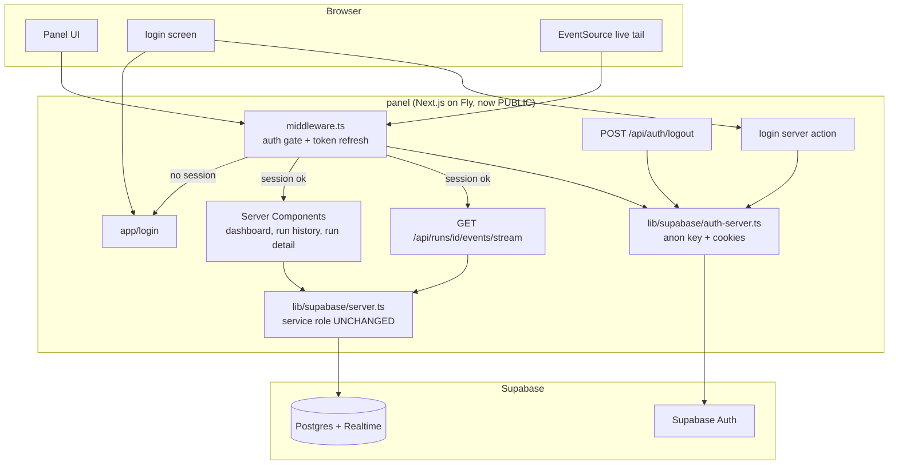
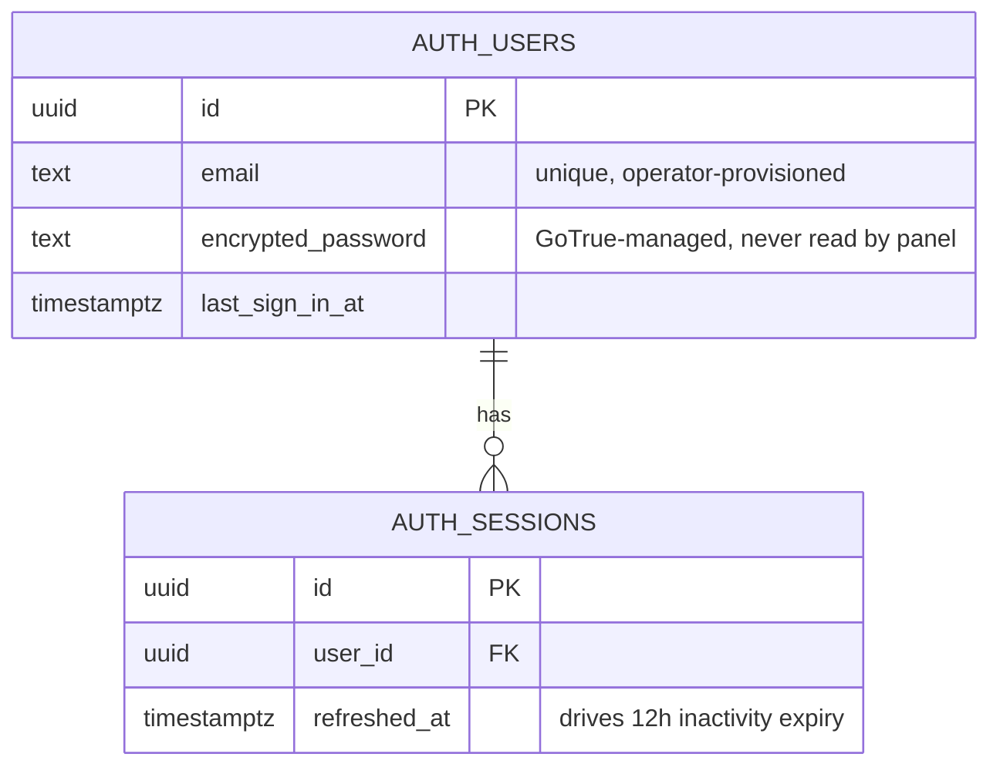
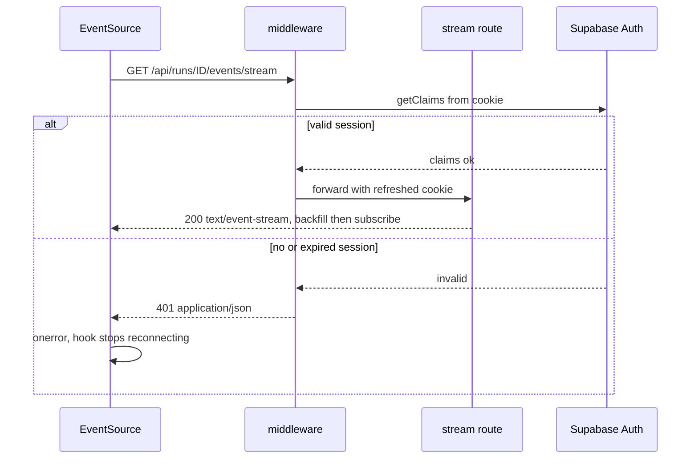
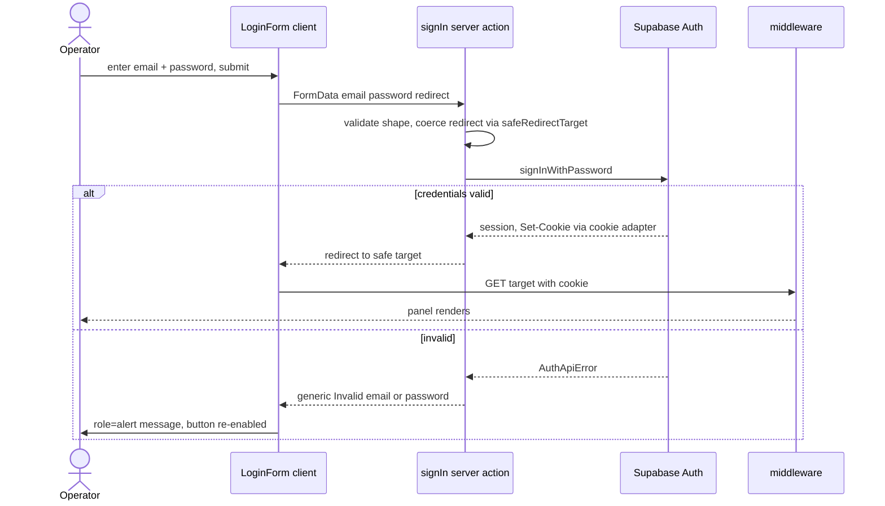
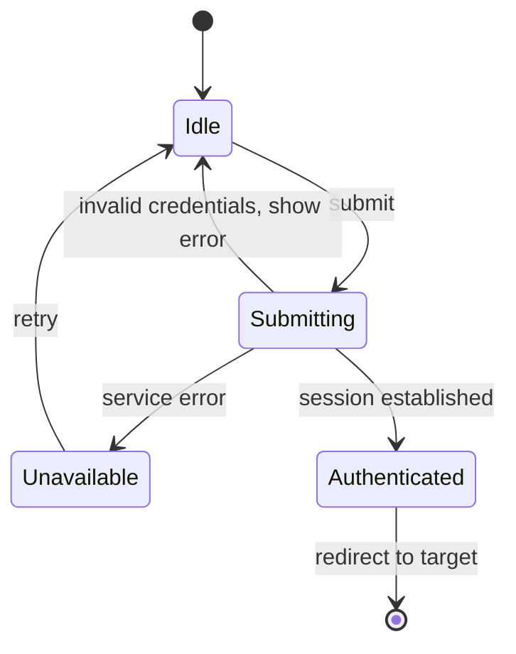
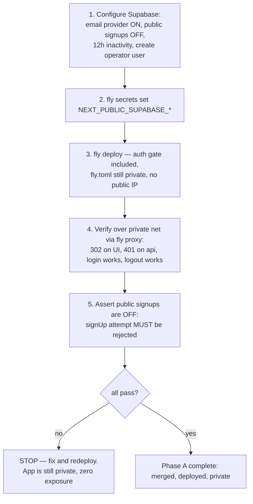
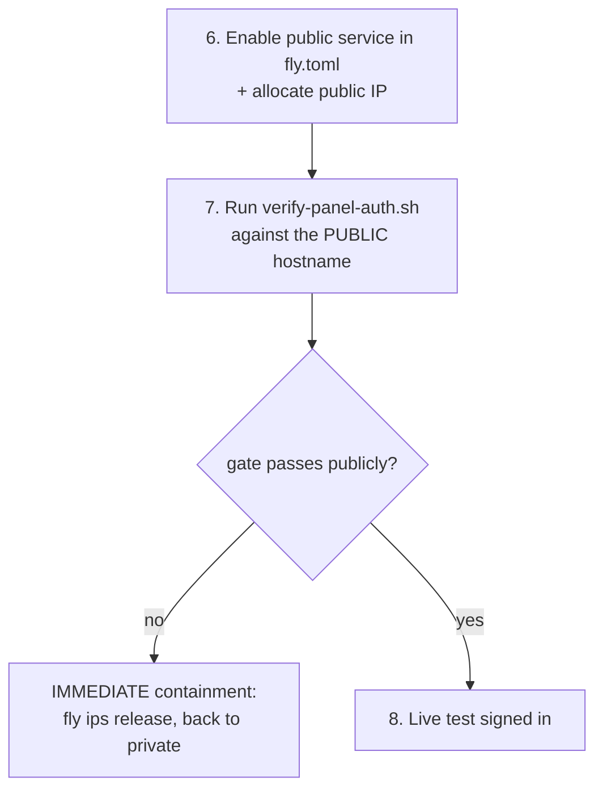

# Technical Specification — Panel Password Authentication

## Changelog

| Version | Date       | Summary | Author |
| ------- | ---------- | ------- | ------ |
| 1.0     | 2026-09-09 | Initial version. Technical design for Supabase password auth on the panel: `@supabase/ssr` cookie clients, `middleware.ts` gate + token refresh, `/login` screen, POST logout, sidebar Log out affordance, and the SR2/D16 private→public release-gate inversion. | product-engineer |
| 1.1     | 2026-09-09 | Hardened the rollout per operator direction. §15.1 split into **Phase A (ship + verify auth, app stays private)** and **Phase B (go public, last and separate)** — Phase B MUST NOT share a story/PR/deploy with the auth gate, structurally removing the exposure window (R10). Made "public signups disabled" a **mechanically verified release blocker**: the §12.1 gate now attempts a `signUp` and fails the release if it succeeds (R9), rather than relying on a runbook checkbox. Updated §9.3 accordingly. | product-engineer |
| 1.2     | 2026-09-09 | Resolved **spec OQ1 by live observation**: the project's JWKS endpoint returns `alg: ES256` / `kty: EC` / `crv: P-256`, so signing keys are **asymmetric** and `getClaims()` verifies locally via cached JWKS with **no per-request network call**. Updated §11 (middleware cost — symmetric contingency removed) and §17 OQ1. No design change; this removes a latency unknown from the middleware gate (#156). | product-engineer |

---

## 1. Executive Summary

This specification implements [`prd-panel-password-auth.md`](../docs/requirements/prd-panel-password-auth.md) by adding a **second, independent Supabase client family** to the panel — cookie-backed anon-key clients for user sessions (`@supabase/ssr`) — alongside the untouched service-role data client. A new `panel/middleware.ts` becomes the single authorization chokepoint: it refreshes the auth token and denies every unauthenticated request (302 to `/login` for navigations, `401` for `/api/**`). The change inverts the panel's security posture: login replaces Fly private networking as the security boundary (reverses **D16**, resolves **R1**, re-points **SR2**), so `fly.toml` gains a public HTTPS service and the privacy release gate is rewritten from "must be private" to "must have auth configured".

---

## 2. Reference Documents

| Document | Relevant sections |
| -------- | ----------------- |
| [`docs/requirements/prd-panel-password-auth.md`](../docs/requirements/prd-panel-password-auth.md) | FR1–FR14, AC1–AC16, §11 design mockups, §17 security |
| [`docs/technical-guidelines.md`](../docs/technical-guidelines.md) | §5 (Auth & Authorization, D12/D15/D16), §6 (Security — SR2 release gate, RLS D11), §9 (Code organization — `panel/` layout), §11 (Testing layers), §12 (Code quality — SD2 rule, inline route-config, Nocturne token discipline), §13 (Deployment — Fly, privacy gate), §16 (Dependency management) |
| [`DESIGN.md`](../DESIGN.md) | §1 Nocturne philosophy, §2 tokens, §3.1–3.2 Button/Input, §3.5 NavItem, §3.7 KLabel, §4.1 app shell, §6.4 focus states, §10 icons, §11.2 component list |
| [`docs/product-context.md`](../docs/product-context.md) | §9 Key Constraints (no auth in v1), §12 Open Questions (R1 mitigation) |
| [Supabase — Creating a Supabase client for SSR](https://supabase.com/docs/guides/auth/server-side/nextjs?router=app) | Recommended App Router integration; `getClaims` vs `getSession` guidance |
| [Supabase — Password-based auth](https://supabase.com/docs/guides/auth/passwords) | `signInWithPassword` contract |

**Traceability note.** Because this feature reverses **D16** and re-points **SR2**, `technical-guidelines.md` §5/§6/§13/§18 and `DESIGN.md` (a new login screen + sidebar footer item) require changelog write-backs at delivery. Those are `technical-writer` deliverables, listed in §15.4.

---

## 3. Affected Repositories

| Repository | Role | Scope of Changes |
| ---------- | ---- | ---------------- |
| `llipe/dev-tasks-agent-fleet` — `panel/` package | Next.js panel (the only code surface) | New `middleware.ts`; `lib/supabase/{browser,auth-server}.ts`; `lib/auth/{redirect,errors,session}.ts`; `app/login/*`; `app/api/auth/logout/route.ts`; `components/shell/Sidebar.tsx` (+ `LogOutItem`); `components/icons.tsx` (power icon); `components/auth/*`; `eslint.config.mjs` (SD2 scope); `package.json` (`@supabase/ssr`); `fly.toml` (public service); `scripts/fly-privacy-check.mjs` → auth-config gate; tests across Layers 1/2/2.5/E2E |
| `llipe/dev-tasks-agent-fleet` — repo root | Release gate + docs | `scripts/verify-fly-private.sh` → renamed/re-pointed gate; `docs/runbooks/panel-deployment.md` (auth-first deploy ordering); `TESTING.md` (new test rows) |
| Supabase project (config, not a git repo) | Identity provider | Enable Email provider; **disable public signups**; set session inactivity timeout to 12h; create operator user(s) manually |

No changes to the agent runtime, the database schema, or any migration.

---

## 4. System Architecture

The panel gains an authorization edge in front of everything it already does. The existing data path (service-role reads, SSE relay, AgentCore invocation) is unchanged behind that edge.



### 4.1 The two client families (the central design rule)

The panel will hold **two** Supabase clients that must never be confused. This table is the normative boundary:

| | `lib/supabase/server.ts` (existing, untouched) | `lib/supabase/auth-server.ts` (new) | `lib/supabase/browser.ts` (new) |
| --- | --- | --- | --- |
| Key | `SUPABASE_SERVICE_ROLE_KEY` (secret) | `NEXT_PUBLIC_SUPABASE_ANON_KEY` | `NEXT_PUBLIC_SUPABASE_ANON_KEY` |
| Purpose | Data reads that bypass RLS (D15) | Session verification, login, logout | Client-side auth calls (if needed) |
| Sessions | Disabled (`persistSession: false`) | Cookie-backed | Cookie-backed |
| Runs in | Server Components, route handlers | Middleware, server actions, route handlers | Client components |
| Guard | `import "server-only"` + SD2 ESLint | `import "server-only"` | none (safe for the browser) |
| Bundle | MUST NOT reach the browser | MUST NOT reach the browser | MAY reach the browser |

**Rule (spec-normative, call it SA1):** authentication logic MUST NOT use the service-role client, and data queries MUST NOT use the auth clients. The service-role client remains the data path because RLS stays deny-all (D11) — authenticating a user grants no row access; it gates the *process*.

### 4.2 Why middleware is the chokepoint

Next.js Server Components cannot write cookies, so token refresh must happen in middleware (the "proxy" role in the Supabase docs). Putting the gate in the same place means one code path decides authorization for pages, route handlers, and the SSE stream — rather than a per-route check that a future route can forget to add. This is the same "one enforceable control" posture the codebase already uses elsewhere (the mandate backstop in ADR-001, the `server-only` guard for SD2).

---

## 5. Data Model & Database Design

**No application schema change. No migration.** This is a documented **migration opt-out**: authentication state lives entirely in Supabase's managed `auth.*` schema (provisioned by the platform, not by this project's migrations) and in browser cookies. The canonical migration `supabase/migrations/20260902200101_initial_schema.sql` and `supabase/seed.sql` are untouched.

Entities involved, for reference only (all platform-managed):



Consequences to respect:

- RLS stays **deny-all** (D11). No `authenticated`-role policies are added. An authenticated panel user still reads data via the service role, server-side.
- The §7 `service_role` SELECT grant asymmetry is unaffected.
- No `auth_events` table (PRD dropped audit logging; deferred).

---

## 6. API Design

Two new HTTP surfaces, plus a behavior change to every existing one.

### 6.1 New endpoints

| Method | Path | Auth | Purpose | Success | Failure |
| ------ | ---- | ---- | ------- | ------- | ------- |
| `POST` | `/login` (server action) | public | `signInWithPassword`, set session cookies | `302` → safe redirect target or `/` | re-render `/login` with generic error (HTTP 200) |
| `POST` | `/api/auth/logout` | session required | `signOut`, clear cookies | `302` → `/login` | `302` → `/login` (idempotent) |

`GET /api/auth/logout` MUST NOT exist — logout is state-changing, so a GET link would be CSRF-triggerable and prefetchable (FR7).

### 6.2 Behavior change to existing routes

| Route class | Unauthenticated response |
| ----------- | ------------------------ |
| UI routes (`/`, `/agents/[slug]`, `/runs/[id]`) | `302` → `/login?redirect=<encoded path>` |
| `/api/**` incl. `/api/runs/[id]/events/stream` | `401` with `{"error":"UNAUTHORIZED"}`, `content-type: application/json` |
| `/login`, `/_next/**`, static assets | pass through (public) |

**Rationale for the split (AC1/AC2):** returning an HTML redirect to `fetch`/`EventSource` produces a confusing parse error rather than a clear failure. A `401` lets `useRunStream` stop cleanly.

### 6.3 SSE + auth sequencing (resolves OQ3)

`EventSource` cannot send custom headers, so the stream authenticates by cookie (automatic, same-origin). **Decision for OQ3:** the middleware returns a plain `401` *before* the stream opens — no `closed{reason:"unauthorized"}` frame. A frame would require opening a `text/event-stream` response to report failure, and the browser would then treat the close as a droppable connection and reconnect. A `401` on the initial request makes `EventSource` fire `onerror` without a stream ever existing; `useRunStream` MUST treat a connection that never opened as terminal and stop reconnecting (see §8.4).



---

## 7. Authentication & Authorization Design

### 7.1 Module layout

```
panel/
  middleware.ts                      # NEW — gate + token refresh (the chokepoint)
  lib/
    supabase/
      server.ts                      # UNCHANGED — service role, data reads
      browser.ts                     # NEW — createBrowserClient (anon)
      auth-server.ts                 # NEW — createAuthClient(cookieStore) (anon, server-only)
      auth-env.ts                    # NEW — reads/validates NEXT_PUBLIC_SUPABASE_* (fail-fast)
    auth/
      route-policy.ts                # NEW — pure: classify a pathname (public / ui / api)
      redirect.ts                     # NEW — pure: safeRedirectTarget(raw) -> local path
      errors.ts                       # NEW — AUTH_* codes + generic user-facing message
      session.ts                      # NEW — requireSession() helper for server components
  app/
    login/
      page.tsx                        # NEW — public, no AppShell
      login.module.css                # NEW — token-only
      actions.ts                      # NEW — "use server" signIn action
    api/auth/logout/route.ts          # NEW — POST-only signOut
  components/
    auth/
      LoginForm.tsx                   # NEW — "use client": fields, SHOW toggle, error, pending
      LoginForm.module.css
      PasswordField.tsx               # NEW — "use client": SHOW/HIDE toggle (FR13)
    shell/
      Sidebar.tsx                     # MODIFIED — Log out footer item (FR9)
      LogOutItem.tsx                  # NEW — POST form styled as a footer nav item
    icons.tsx                         # MODIFIED — add LogOutIcon (Phosphor Power)
```

### 7.2 Middleware contract

The middleware is the only authorization decision point. Pseudocode (normative on ordering, not on syntax):

```ts
// panel/middleware.ts
export async function middleware(request: NextRequest) {
  const policy = classifyRoute(request.nextUrl.pathname); // pure, lib/auth/route-policy
  if (policy === "public") return NextResponse.next();

  // A single response object is threaded through so refreshed cookies land on
  // BOTH request (for Server Components) and response (for the browser).
  const { supabase, response } = createMiddlewareClient(request);

  // getClaims() verifies the JWT; never getSession() for authorization (FR8).
  const { data, error } = await supabase.auth.getClaims();
  const authenticated = !error && data?.claims != null;

  if (!authenticated) {
    return policy === "api"
      ? NextResponse.json({ error: "UNAUTHORIZED" }, { status: 401 })
      : NextResponse.redirect(loginUrlFor(request)); // /login?redirect=<path>
  }
  return response; // carries refreshed Set-Cookie
}

export const config = {
  matcher: ["/((?!_next/static|_next/image|favicon.ico|.*\\.(?:svg|png|jpg|jpeg|gif|webp|ico)$).*)"],
};
```

Normative requirements:

1. **`getClaims()`, never `getSession()`** for the authorization decision (FR8/AC8). Per the Supabase docs, the `getSession()` user object is not re-validated against the Auth server and must not drive authorization. *(Content was rephrased for compliance with licensing restrictions.)*
2. The returned response MUST be the one produced by the cookie handler, so a refreshed token reaches the browser (AC7). Constructing a fresh `NextResponse.next()` after the auth call discards the refresh and causes intermittent logouts.
3. `classifyRoute` MUST be a **pure, unit-tested function** (Layer 1) — the redirect/401 split is security-relevant and must be testable without a running server.
4. Fail-closed: any unexpected error in the auth call is treated as unauthenticated.

### 7.3 Route policy

| Pathname pattern | Policy |
| ---------------- | ------ |
| `/login` | `public` |
| `/api/auth/logout` | `api` (session required; idempotent) |
| `/api/**` | `api` → 401 |
| everything else | `ui` → 302 |
| `/dev/**` | inherits `ui`; the gallery already 404s in production |

### 7.4 Permission matrix

Single role. There is no RBAC in this feature.

| Actor | Login page | Panel UI | `/api/**` + SSE | Invoke (future S-112/S-113) |
| ----- | ---------- | -------- | --------------- | --------------------------- |
| Anonymous | allow | 302 → `/login` | 401 | 401 |
| Authenticated user | allow (redirects to `/` if already signed in) | allow | allow | allow |

### 7.5 Session & cookie management

| Property | Value | Source |
| -------- | ----- | ------ |
| Storage | HttpOnly cookies written by `@supabase/ssr` | FR3 |
| `Secure` | true in production | §17 PRD |
| `SameSite` | `Lax` | §17 PRD |
| Inactivity expiry | **12 hours** (FR14) — Supabase project setting; the login screen states it | FR14/AC14 |
| Refresh | middleware on each matched request | FR3/AC7 |
| Never logged | access token, refresh token, password | §12 |

**FR14 note:** 12-hour inactivity expiry is enforced by Supabase's refresh-token inactivity setting, configured in the project dashboard — it is **not** panel code. The spec's testable surface is the *consequence* (AC14: a session past the window is denied), which is asserted by simulating an expired/invalid cookie, not by waiting 12 hours.

### 7.6 Login flow



---

## 8. Business Logic Implementation

### 8.1 `safeRedirectTarget` (FR11 / AC4) — pure

Open-redirect prevention. Rules, in order:

1. Missing/empty → `/`.
2. MUST start with a single `/` and MUST NOT start with `//` (protocol-relative).
3. MUST NOT contain `://`, and MUST NOT parse as an absolute URL.
4. MUST NOT be `/login` (avoids a redirect loop back to the form).
5. Control characters / newlines (header-injection shapes) → `/`.
6. Otherwise return the path (preserving query + hash).

Total function — never throws, always returns a local path. Mirrors the existing `isSafeArtifactUrl` posture from S-109 (a total, never-throwing security guard).

### 8.2 Error mapping (`lib/auth/errors.ts`)

| Condition | Internal code | User sees | HTTP |
| --------- | ------------- | --------- | ---- |
| Wrong password / unknown email | `AUTH_INVALID_CREDENTIALS` | "Invalid email or password." | 200 (re-render) |
| Empty email or password | `AUTH_MISSING_FIELDS` | "Enter your email and password." | 200 |
| Supabase unreachable / 5xx | `AUTH_SERVICE_UNAVAILABLE` | "Sign-in is temporarily unavailable. Try again." | 200 |
| Missing auth env config | `AUTH_CONFIG_ERROR` | generic failure; loud server log | 500 |
| No session on protected route | `UNAUTHORIZED` | redirect or JSON 401 | 302 / 401 |

**Anti-enumeration (AC5):** unknown-email and wrong-password MUST collapse to the identical `AUTH_INVALID_CREDENTIALS` message and the same response timing characteristics. The distinct Supabase error is logged server-side only.

### 8.3 Login state machine



During `Submitting` the button is disabled and shows a pending state (`useFormStatus`), preventing double submit.

### 8.4 `useRunStream` change (OQ3 consequence)

The hook currently reconnects on an unexpected drop with the highest rendered `seq`. It MUST additionally treat **"errored before the stream ever opened"** as terminal and stop reconnecting — otherwise an expired session produces an infinite 401 reconnect loop against a public endpoint. Implementation: track whether `onopen` fired for the current attempt; if `onerror` fires with `readyState === CLOSED` and no successful open occurred, stop and surface a "session expired — reload to sign in" state.

---

## 9. Integration Details

### 9.1 Dependency

Add to `panel/package.json` dependencies, pinned per §16 policy:

- `@supabase/ssr` — pin the current stable version at implementation time, re-confirmed audit-clean before pinning (the "re-confirm-then-pin" precedent from `next` in S-101 and `@supabase/supabase-js` in S-104). MUST NOT add `@supabase/auth-helpers-nextjs` (deprecated/superseded).

`@supabase/supabase-js` `2.114.0` stays as-is (`@supabase/ssr` wraps it).

### 9.2 Environment variables

| Variable | Scope | Where set | Notes |
| -------- | ----- | --------- | ----- |
| `NEXT_PUBLIC_SUPABASE_URL` | public | `.env.local`, `fly.toml [env]` | Same project URL as `SUPABASE_URL`; public by design |
| `NEXT_PUBLIC_SUPABASE_ANON_KEY` | public | `.env.local`, `fly secrets` (or `[env]`) | Publishable key — safe for the browser, RLS-bound |
| `SUPABASE_URL` | server | existing | unchanged |
| `SUPABASE_SERVICE_ROLE_KEY` | server secret | existing `fly secrets` | unchanged, MUST NOT gain a `NEXT_PUBLIC_` twin |

`lib/supabase/auth-env.ts` validates both new vars with a named `AuthConfigError` at first use (same fail-fast pattern as `readSupabaseEnv`), so a missing var is a clear startup error rather than an opaque runtime failure.

### 9.3 Supabase project configuration (operator, out-of-band)

1. Enable the **Email** provider.
2. **Disable public signups** — mandatory and **mechanically verified** by the release gate (§12.1 check 4), not merely a checklist item. The Auth endpoint becomes publicly reachable in Phase B, so open signup would let anyone mint an account and reach the invoke surface (PRD §8, R9).
3. Set refresh-token **inactivity timeout to 12h** (FR14).
4. Create operator user(s) with email + password.
5. Confirm signing keys (asymmetric default → `getClaims` verifies locally via JWKS).

These are recorded as a checklist in the deployment runbook (Phase A, §15.1). Items 1–4 are operator actions; item 2 is additionally asserted by the automated gate before the app may go public.

---

## 10. User Interface & Client Behavior

### 10.1 `/login` screen

Implements the approved Nocturne mockup (PRD §11). Server component `app/login/page.tsx` renders `metadata`, reads/sanitizes `?redirect`, redirects to `/` when already authenticated, and renders the client `LoginForm`. **Not** wrapped in `AppShell` — so `app/login/layout.tsx` overrides the shell (the root layout currently wraps everything in `AppShell`; see §10.3).

| Element | Implementation | DESIGN ref |
| ------- | -------------- | ---------- |
| Brand mark + "Agent Fleet" | reuse the `Sidebar` brand markup pattern (mark + dot + wordmark) | §4.1 |
| "Sign in" heading | h-scale heading, weight 500 | §2.6 |
| Invitation subtitle | `--muted`, 12.5px body | §2.6 |
| Faded rule | Nocturne fade-to-transparent divider | §1.1 |
| `EMAIL` / `PASSWORD` labels | existing `KLabel` primitive | §3.7 |
| Email input | existing `Input`, `type="email"`, `autoComplete="email"`, placeholder `you@company.com` | §3.2 |
| Password input | new `PasswordField` wrapping `Input`, `autoComplete="current-password"` | §3.2 |
| `SHOW` toggle | text button, right-aligned on the password label row, `aria-pressed` | FR13 |
| Sign in button | existing `Button` `variant="primary"`, full width, disabled+pending while submitting | §3.1 |
| "Forgot password?" | **dead link** — non-navigating, non-actionable, `aria-disabled` | PRD §11 |
| `· us-east-1` tag | monospace `--faint`, from a non-secret region value | §7.4 |
| Fine print | "Sessions expire after 12 hours of inactivity." | FR14 |
| Error | `role="alert"` region above the fields | AC5/AC10 |

Styling: token-only CSS Modules; the S-105 `token-discipline` test rejects hex/`font-family` literals under `components/**`, so `LoginForm.module.css` MUST use tokens only. No Tailwind (the injected steering rule that assumes Tailwind/Zod does not apply to this project — Nocturne + `ajv` is the standard).

**Dead-link implementation note:** render as a `<span>` styled as a link with `aria-disabled="true"`, not an `<a href="#">` — an `href="#"` is focusable and activatable and would read as a broken feature to a keyboard/screen-reader user (AC16).

### 10.2 Sidebar Log out (FR9 / AC15)

Per the sidebar mockup: footer region, **below** System health, **above** Collapse.

- New `LogOutItem.tsx`: a `<form method="post" action="/api/auth/logout">` whose submit button is styled with the existing `.toggle` footer-control pattern from `Sidebar.module.css` (icon + label grid, icon-only when collapsed).
- Icon: add `LogOutIcon` to `components/icons.tsx` mapped to Phosphor `Power` (matching the mockup's power glyph), imported from `@phosphor-icons/react/ssr` per §10 convention.
- A plain form POST means logout works without JS and needs no client handler.
- Rendered only when authenticated. `AppShell` receives an `authenticated` prop (or the item is composed in by the authenticated layout) — the shell MUST NOT call Supabase itself, keeping it presentational and preserving the SD2 boundary.

### 10.3 Layout restructuring (a real constraint, not cosmetic)

`app/layout.tsx` currently wraps **all** children in `AppShell`. `/login` must render outside it. Chosen approach: **`app/login/layout.tsx` renders its own `<div>` wrapper**, and the root layout stops wrapping unconditionally — the shell moves into an authenticated layout. Two options, with the decision:

| Option | Mechanism | Verdict |
| ------ | --------- | ------- |
| A — route group | Move authenticated routes into `app/(panel)/` with `AppShell` in `(panel)/layout.tsx`; `/login` outside it | **Chosen.** Idiomatic App Router; keeps the shell exactly where it belongs; no conditional rendering by pathname |
| B — conditional shell | Root layout inspects the pathname and conditionally renders `AppShell` | Rejected — a server layout cannot read the pathname reliably; forces a client wrapper and re-introduces a hydration concern the S-106 contract deliberately avoids |

Option A moves `app/page.tsx`, `app/agents/`, `app/runs/`, `app/dev/` into `app/(panel)/`. Route group parentheses do not affect URLs, so **every existing path is unchanged** — but this touches many files, so it MUST be a mechanical move verified by the existing E2E suite.

### 10.4 Client-side validation

Minimal and non-blocking: `required` + `type="email"` for native hints. Authoritative validation is server-side in the action (FR6). No Zod — the project uses `ajv` for JSON Schema and has no Zod dependency; a two-field form does not justify adding one.

---

## 11. Performance & Scalability Approach

- **Middleware cost:** one `getClaims()` per matched request. The project uses **asymmetric (ES256/EC P-256) signing keys — confirmed by live JWKS probe, spec OQ1 resolved** — so verification is local via a cached JWKS with **no network round trip** on the hot path.
- **Matcher scope:** static assets and images are excluded so the gate never runs on them.
- **No new caching.** Auth responses MUST NOT be cached: a cached response carrying a refreshed `Set-Cookie` could hand one user another's session (a caveat the Supabase docs call out explicitly). All panel data routes are already `force-dynamic`/`force-no-store`; `/login` and the logout route MUST declare the same **inline** route-segment config per the §12 convention (Next.js ignores re-exported segment config).
- **SSE unaffected:** the gate runs once at connection setup, not per streamed event.

---

## 12. Security Implementation

| Control | Implementation | Verification |
| ------- | -------------- | ------------ |
| Authorization chokepoint | `middleware.ts`, fail-closed | AC1/AC2 + Layer 1 `route-policy` tests |
| Identity verification | `getClaims()` only; `getSession()` user object never used for authz | AC8 — a test greps that no authz path calls `getSession` |
| Service-role isolation | `server.ts` untouched; `server-only` + SD2 ESLint; no `NEXT_PUBLIC_` service key | AC9 + existing `bundle-secrets` test |
| Open-redirect | `safeRedirectTarget` (§8.1) | AC4 + Layer 1 table-driven tests |
| CSRF | logout is POST-only; no state-changing GET | AC6 + a test asserting `GET /api/auth/logout` is not a route |
| User enumeration | single generic credential error | AC5 |
| Password handling | forwarded to Supabase over HTTPS; never stored, logged, or echoed | AC5 + a log-scrub test |
| Token/secret logging | never log tokens, cookies, or the anon/service keys | Layer 1 log-guard test |
| Cookie flags | HttpOnly, Secure in prod, SameSite=Lax | §7.5 |
| XSS | React escapes by default; **no `dangerouslySetInnerHTML`** anywhere in auth UI (continues the S-109/S-110 guard) | grep test |
| Signup abuse | public signups disabled in the Supabase project | runbook checklist + operator confirmation |
| Brute force (OQ4) | rely on Supabase's built-in rate limiting for v1; no custom lockout | recorded as accepted risk R8 (§16) |

### 12.1 The SR2 inversion (the highest-risk change in this spec)

Today `scripts/verify-fly-private.sh` **fails the release if the app is public** — that gate is the mechanized form of "privacy is the only boundary" (SR2/D16). This feature makes the app public, so the gate must be replaced, not deleted. Deleting it would leave no mechanical check at all.

**New gate — `scripts/verify-panel-auth.sh` + `panel/scripts/panel-auth-check.mjs`** (replacing the privacy pair, same fail-closed pattern and same unit-testable pure-parser split):

The gate asserts, after deploy:

1. `NEXT_PUBLIC_SUPABASE_URL` and `NEXT_PUBLIC_SUPABASE_ANON_KEY` are set on the app (via `fly secrets list` / `fly config show` — presence of names only, never values).
2. A live unauthenticated request to a protected UI path returns `302` to `/login` (**not** `200`).
3. A live unauthenticated request to `/api/runs/<uuid>/events/stream` returns `401` (**not** `200`).
4. **Public signups are disabled (R9 — release blocker).** The gate POSTs a `signUp` for a throwaway address to the project's Auth endpoint with the anon key and asserts it is **rejected** (Supabase returns an error when signups are disabled). If a signup succeeds, the release FAILS — anyone on the internet could otherwise self-register into the panel. The check MUST use a clearly-marked disposable address and MUST delete the account if one is somehow created.
5. Fail-closed: unreadable/unparseable output, or any check that cannot be positively confirmed → non-zero exit.

Checks 2, 3, and 4 are the substantive ones — they prove the boundary *by observation* on the deployed app rather than trusting configuration. Check 4 in particular converts what would be a runbook checkbox ("remember to turn signups off") into a mechanical, falsifiable assertion, which is the same posture as the mandate backstop in ADR-001: the operator may intend, but a deterministic check disposes.

The existing `fly-privacy-check.mjs` unit tests are re-pointed to the new parser; the CI `shellcheck` step covers the new wrapper.

---

## 13. Error Handling & Logging

- **Structured JSON to stdout**, matching the existing SSE relay convention (`console.log(JSON.stringify({event, ...fields}))`), captured by Fly.
- Events: `auth.signin.failure` (with error class, **no** email/password), `auth.signout`, `auth.config_error`, `auth.unauthorized` (path + policy class). Sign-in *success* logging is intentionally minimal since audit logging was descoped.
- **Never logged:** password, access/refresh tokens, cookie values, anon or service-role keys.
- User-facing errors come from the §8.2 table only — no raw Supabase error text reaches the browser (it can distinguish unknown-email from wrong-password, defeating AC5).
- `AUTH_CONFIG_ERROR` is loud on the server (misconfiguration must not look like bad credentials).

---

## 14. Testing Strategy

Follows the `TESTING.md` layer taxonomy. Coverage target: 100% statements on the new pure modules (`route-policy`, `redirect`, `errors`), consistent with the S-105/S-106/S-107 precedent for pure domain modules.

### 14.1 Layer 1 — unit (jsdom/node, no I/O)

| Suite | Covers |
| ----- | ------ |
| `tests/unit/auth-route-policy.test.ts` | `classifyRoute` table: `/login`→public, `/`→ui, `/agents/x`→ui, `/api/**`→api, `/api/auth/logout`→api, static→public; unknown paths default to `ui` (fail-closed) |
| `tests/unit/auth-redirect.test.ts` | `safeRedirectTarget`: `//evil.com`, `https://evil.com`, `/\evil`, `javascript:`, newline/control chars, `/login` loop, empty/null → `/`; valid path+query+hash preserved |
| `tests/unit/auth-errors.test.ts` | unknown-email and wrong-password map to the identical message (anti-enumeration); no raw Supabase text leaks |
| `tests/unit/auth-env.test.ts` | fail-fast on missing/blank/malformed `NEXT_PUBLIC_SUPABASE_*` |
| `tests/unit/auth-no-getsession.test.ts` | grep guard: no authorization path calls `getSession()` (AC8) |
| `tests/unit/panel-auth-check.test.ts` | new release-gate parser: pass/fail fixtures incl. `200`-on-protected-path → FAIL, fail-closed on garbage |

### 14.2 Layer 2 — component

| Suite | Covers |
| ----- | ------ |
| `tests/component/LoginForm.test.tsx` | renders labeled EMAIL/PASSWORD, mockup elements present; SHOW toggle reveals/masks with correct `aria-pressed` (AC13); error region is `role="alert"` (AC5/AC10); button disabled while pending; "Forgot password?" is not an activatable link (AC16) |
| `tests/component/LogOutItem.test.tsx` | POST form to `/api/auth/logout`; positioned after System health / before Collapse; icon-only when collapsed; absent when unauthenticated (AC15) |
| `tests/component/middleware-gate.test.ts` | middleware with an injected fake auth client: no session + UI → 302 with correct `redirect`; no session + `/api` → 401 JSON; valid session → passes through and preserves refreshed cookies (AC7); auth error → treated unauthenticated |

Middleware is written to accept an injectable client factory so it is testable without a live Supabase — the same dependency-injection posture as `lib/sse/relay.ts`.

### 14.3 Layer 2.5 — integration (Docker-gated, `REQUIRE_LOCAL_DB=1` in CI)

| Suite | Covers |
| ----- | ------ |
| `tests/integration/auth-login.test.ts` | Against the local Supabase stack: seed a user via admin API; `signInWithPassword` succeeds and sets cookies; wrong password fails; cookie round-trip verifies via `getClaims` |
| `tests/integration/auth-rls-unchanged.test.ts` | An **authenticated** (non-service-role) client still reads **zero** rows — proving RLS deny-all (D11) was not loosened, with a non-vacuous seeded-rows guard |

The second suite matters: it's the falsifiable check that adding auth didn't accidentally grant data access.

### 14.4 E2E — Playwright

Extends `panel/tests/e2e/`; `global-setup.ts` gains operator-user provisioning.

| Scenario | AC |
| -------- | -- |
| Unauthenticated visit to `/` redirects to `/login?redirect=/` | AC1 |
| Unauthenticated `fetch` of the SSE path returns 401 (not HTML) | AC2 |
| Valid login lands on the `redirect` target; reload keeps the session | AC3, AC7 |
| Tampered `redirect=https://evil.com` lands on `/` | AC4 |
| Invalid credentials show the generic error, form stays usable | AC5 |
| SHOW toggle reveals the password | AC13 |
| Sidebar Log out clears the session; revisiting `/` redirects to `/login` | AC6, AC15 |

### 14.5 Mock strategy

- Layer 1/2: inject fake auth clients; never touch the network.
- Layer 2.5/E2E: real local Supabase (`supabase start`), real GoTrue.
- AgentCore stays stubbed via the existing `AWS_ENDPOINT_URL_BEDROCK_AGENTCORE` boundary.

---

## 15. Deployment & Rollout

### 15.1 Public exposure is the LAST step, isolated from the auth deploy

**Ordering decision (operator-confirmed).** Going public is **not** part of the auth deploy. The auth gate ships, deploys, and is fully verified **while the app is still private**; flipping to public is a separate, final, independently reversible step taken only after every check passes. This removes the exposure window entirely — at no point does a public app exist without a proven gate.

Two distinct phases, in order:

**Phase A — ship and verify auth, app stays PRIVATE** (the whole feature except exposure)



**Phase B — go live, as a deliberate separate action**



Normative requirements:

1. Phase A MUST be complete, deployed, and verified before Phase B begins. Phase B MUST NOT be bundled into the same story, PR, or deploy as the auth gate.
2. Step 4 MUST be run over the private network (`fly proxy`) — proving the gate works before anything is reachable publicly.
3. Step 5 is a **release blocker** (R9): if a `signUp` against the project's Auth endpoint succeeds, the app MUST NOT be made public.
4. Phase B is reversible in one command (`fly ips release`), which is why it is isolated: containment does not require a redeploy.

### 15.2 Rollback

| Failure | Rollback |
| ------- | -------- |
| Gate fails after going public | `fly ips release <addr>` → app private again (fastest containment), then diagnose |
| Auth broken, operator locked out | App is private-reachable via `fly proxy`; redeploy the previous image (`fly releases` → `fly deploy --image <prev>`) |
| Supabase misconfigured | Fix in dashboard; no redeploy needed for provider/session settings |

Because the change is additive to the data path, a rollback to the previous image restores the pre-auth panel exactly.

### 15.3 Feature flags

None. An auth gate behind a flag is a footgun — a flag that disables the gate on a public app is precisely the exposure this design prevents. The rollout control is the ordered deploy above, not a runtime toggle.

### 15.4 Documentation write-backs (delivery obligations)

| Doc | Change |
| --- | ------ |
| `docs/technical-guidelines.md` | §5 (auth exists now; D16 reversed), §6 (SR2 rule replaced by the auth gate), §13 (public deploy + new gate), §18 (R1 resolved; new R8 brute-force) — changelog row required |
| `DESIGN.md` | New login screen spec + sidebar footer Log out item — changelog row required |
| `docs/runbooks/panel-deployment.md` | The §15.1 ordering, Supabase checklist, new gate, rollback |
| `TESTING.md` | New Layer 1/2/2.5/E2E rows + the auth E2E scenario→AC map |
| `panel/README.md` | New env vars, login flow, route-group layout change |

---

## 16. Dependencies & Risks

### 16.1 Dependencies

| Dependency | Purpose | Note |
| ---------- | ------- | ---- |
| `@supabase/ssr` (new, pinned) | Cookie-based session clients | Re-confirm current + audit-clean before pinning; must keep `pnpm audit --audit-level=high` green |
| `@supabase/supabase-js` 2.114.0 | Wrapped by `@supabase/ssr` | Unchanged |
| Supabase Auth (GoTrue) | Identity provider | Now a runtime availability dependency for *access*, not just data |
| Supabase project settings | Signups off, 12h inactivity | Operator-applied; not in code — drift is possible (R9) |

### 16.2 Risks

| ID | Risk | Impact | Mitigation |
| -- | ---- | ------ | ---------- |
| R8 | Public login endpoint invites credential-stuffing / brute force | Account compromise → agent invocation | Rely on Supabase built-in rate limits for v1 (OQ4 accepted); strong operator password; revisit with lockout/CAPTCHA if abuse appears |
| R9 | Supabase **public signups left enabled** | Anyone on the internet can self-register and reach the panel + invoke agents | **Mechanically enforced:** the release gate attempts a `signUp` and fails the release if it succeeds (§12.1 check 4). Also a runbook step (Phase A step 5) and an explicit release blocker — not a checkbox |
| R10 | Exposure window if steps are run out of order | Unauthenticated invoke surface on the internet | **Structurally removed:** public exposure is isolated as Phase B (§15.1), taken only after the gate is proven on a still-private app. Phase B MUST NOT share a story/PR/deploy with the auth gate; `fly ips release` is one-command containment |
| R11 | Middleware misconfiguration silently allows a route | A path bypasses the gate | Matcher excludes only static assets; `classifyRoute` defaults unknown → `ui` (fail-closed); Layer 1 tests + live gate checks |
| R12 | Route-group move (§10.3) breaks existing routes | Panel 404s | URLs are unchanged by route groups; existing E2E suite must pass unmodified as the regression proof |
| R13 | Cached response leaks a refreshed session cookie | One user receives another's session | No caching on auth routes; inline `force-dynamic`/`force-no-store`; single-operator scale limits blast radius |
| R14 | `getSession()` used for authz by a future change | Spoofable authorization | AC8 grep guard test in CI |
| R15 | Operator lockout (forgotten password, dead link) | No panel access | Reset via Supabase dashboard; documented in the runbook (the real reset flow is deferred) |

---

## 17. Open Questions

1. **OQ1 (spec)** ~~Does the Supabase project use asymmetric signing keys?~~ — **Resolved 2026-09-09 by live observation.** The project's JWKS endpoint (`GET /auth/v1/.well-known/jwks.json`) returns one signing key with `alg: ES256`, `kty: EC`, `crv: P-256`, `use: sig`, `key_ops: ["verify"]`. The project therefore uses **asymmetric** signing keys, so `getClaims()` verifies **locally** against the cached JWKS and the middleware gate adds **no network round trip per request** (§11). The symmetric-key contingency noted in §7.5/§11 does not apply. Re-check with `curl -s https://<project-ref>.supabase.co/auth/v1/.well-known/jwks.json` if the key configuration is ever moved to the legacy JWT-secret system (an empty `keys` array indicates symmetric HS256).
2. **OQ2 (spec)** `NEXT_PUBLIC_SUPABASE_ANON_KEY` via `fly.toml [env]` (visible in config, which is fine for a publishable key) or via `fly secrets` (consistent with other config)? Recommend `[env]` — it is publishable by design and keeps the deploy reproducible.
3. **OQ3 (spec)** Should `/dev/**` be gated like the rest, or stay 404 in production only? Recommend gating it (it inherits `ui`), so it is never reachable unauthenticated even in a non-production build.
4. **OQ4 (spec)** Do we want a "session expired" interstitial on the SSE hook (§8.4), or is a silent stop plus the next navigation's redirect sufficient? Recommend a small inline notice — a log tail that silently stops looks like a product bug.
5. **OQ5 (spec)** Should logout redirect to `/login` with a "signed out" confirmation, or bare `/login`? Cosmetic; recommend bare for v1.
