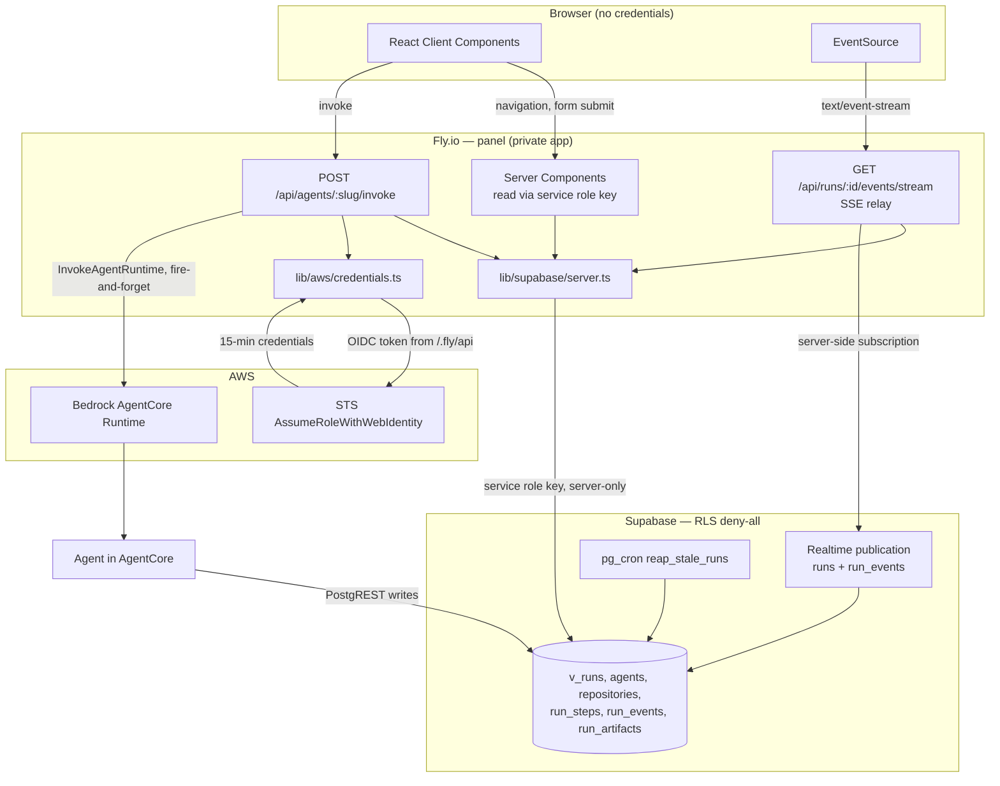
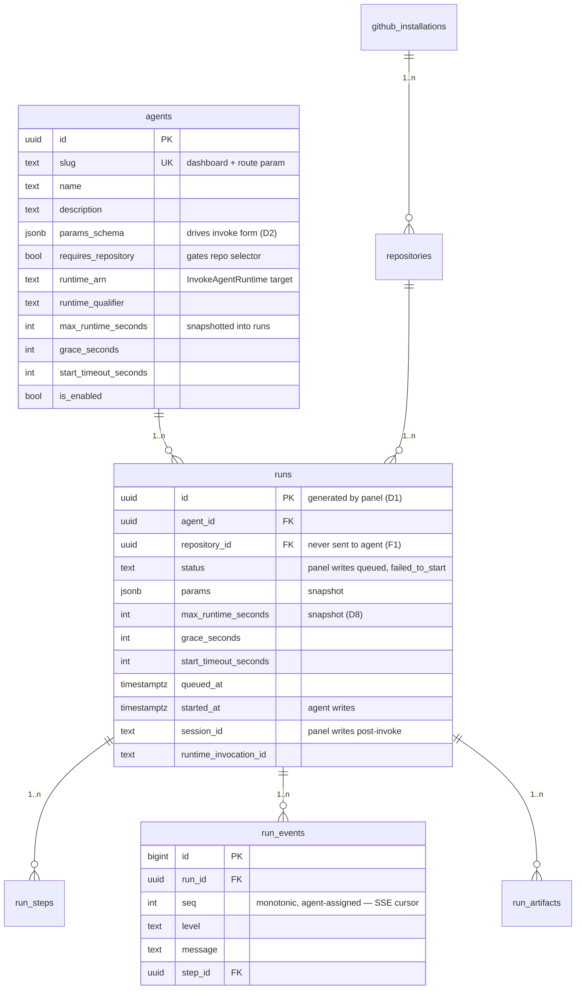
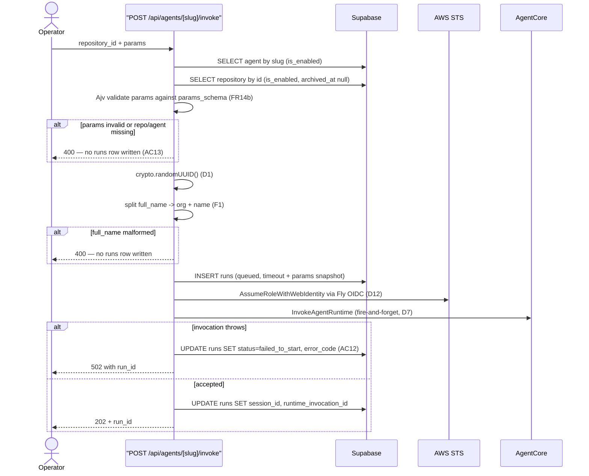
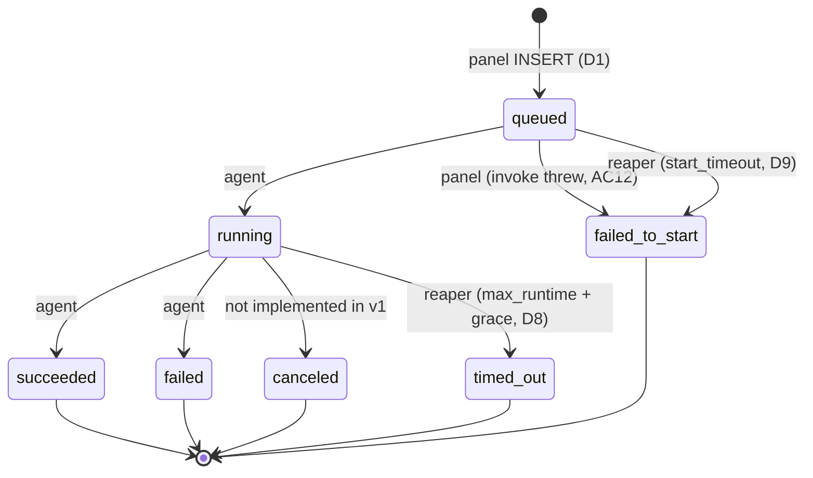
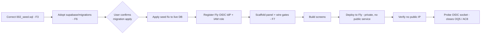

# Technical Specification — Agent Fleet Control Panel, Phase 2

## Changelog

| Version | Date       | Summary         | Author             |
| ------- | ---------- | --------------- | ------------------ |
| 1.0     | 2026-08-27 | Initial version. Derived from PRD v2.2 (Phase 2 scope only) and research artifact at commit `411b027`. Records twelve specification decisions (SD1-SD12) and resolves fix proposals F1-F7. | product-engineer |
| 1.1     | 2026-08-27 | Reconciled against `origin/main` at `c8d515e` (issue #77 deployment merged). F1 re-verified unchanged. `prompt` wrapping now has partial evidence from the deployment runbook (§9.1, OQ2). SD11 gains a sizing note: the seeded `max_runtime_seconds` is 3600, not the 900 assumed from schema defaults, so a run can emit ~4x the log volume. | product-engineer |
| 1.2     | 2026-09-02 | Story-generation pass. **F3 scope extended** beyond the seed's `params_schema` labels: `001_schema.sql` writes Spanish operator-facing text into `run_events.message` (line 288) and `runs.error_message` (line 315) from `reap_stale_runs()`, both rendered verbatim by the Run Detail log viewer — so §5's "no schema changes" now admits one reversible `create or replace function` migration, carried by story S-103 under the SD3 confirmation gate. Also recorded: `002_seed.sql:48` asserts `start_timeout_seconds (300)` must equal `idleRuntimeSessionTimeout`, which issue #98 raised to 900 — resolved in S-103. **Open Question 3 answered without a probe:** `001_schema.sql:131` declares `runs.max_runtime_seconds integer not null` with no default, while `grace_seconds`/`start_timeout_seconds` are `not null` with defaults (60/300) that no longer match the seeded agent — so the panel must send all three explicitly (folded into S-112). See [`user-stories-prd-agent-fleet-panel-v2.md`](user-stories-prd-agent-fleet-panel-v2.md) v1.0 § Scope Delta. | product-engineer |

---

## 1. Executive Summary

Phase 2 builds a Next.js 15 App Router panel, deployed to Fly.io, that reads the Supabase execution registry the Phase 1 agent already writes to and invokes AgentCore runtimes via a fire-and-forget route handler. Because RLS is deny-all with zero policies (D11), **every** database access is server-side — including the live log tail, which is relayed to the browser over Server-Sent Events rather than a direct Supabase Realtime subscription. The panel holds no user authentication (D16) and no static AWS credentials (D12).

The dominant technical risk is not the UI. It is the two cross-language boundaries: the panel emits a payload a Python agent validates (issue [#89](https://github.com/llipe/dev-tasks-agent-fleet/issues/89)), and it recomputes in TypeScript a status expression that also lives in SQL (F4). Neither boundary is checked by any compiler, so both get explicit contract tests.

## 2. Reference Documents

| Document | Sections consumed |
|---|---|
| [`docs/requirements/prd-agent-fleet-panel-v2.md`](../docs/requirements/prd-agent-fleet-panel-v2.md) v2.2 | §7 FR10-FR18 (Phase 2), §8 D1-D17, §10 Non-Goals, §11 Design, §12 Technical, §13 AC6-14, §17 Risks, §19 Fix Proposals F1-F7 |
| [`docs/technical-guidelines.md`](../docs/technical-guidelines.md) v1.3 | §2 stack, §3 patterns, §4 API standards, §5 auth, §6 security, §7 data, §11 testing, §12 quality, §16 dependencies |
| [`docs/product-context.md`](../docs/product-context.md) v1.1 | §6 roadmap, §9 constraints |
| [`/DESIGN.md`](../DESIGN.md) v1.0 | All — visual source of truth |
| [`workstream/research-phase2-panel-spec-inputs-2026-08-27.md`](research-phase2-panel-spec-inputs-2026-08-27.md) | All slices; commit `411b027` |
| [`TESTING.md`](../TESTING.md) | Layer taxonomy, canonical scripts, reachability rules |
| [`docs/reference/001_schema.sql`](../docs/reference/001_schema.sql) | Lines 11-23 enums, 81-99 agents, 212-213 publication, 234-251 `v_runs`, 332-338 RLS |
| [`docs/reference/credentials.ts`](../docs/reference/credentials.ts) | Adopted with F5 corrections |

**Staleness note.** The research artifact records commit `411b027`. Re-verify its findings if HEAD has advanced materially before implementation starts.

## 3. Affected Repositories

| Repository | Role | Scope of Changes |
|---|---|---|
| `llipe/dev-tasks-agent-fleet` (this repo) | Monorepo — panel, agent, schema | **New:** `panel/` pnpm package (Next.js app). **New:** `supabase/migrations/` (F6). **Modified:** root `package.json` + `pnpm-workspace.yaml`, `Makefile` `validate` target, `.github/workflows/ci.yml`, `TESTING.md`, `002_seed.sql` (F3), `workstream/pending-manual-config-dependency-update-agent.md` (F1) |
| Supabase project (infrastructure) | System of record | Migration history adopted; corrected seed re-applied. **No RLS policy changes** |
| AWS account (infrastructure) | AgentCore + STS + OIDC | One-time: Fly registered as OIDC IdP, IAM role with federated trust, `bedrock-agentcore:InvokeAgentRuntime` scoped to the runtimes ARN |
| Fly.io app (infrastructure) | Panel hosting | New app. **Must remain private** — this is D16's only mitigation (§12) |
| `agents/dependency-update/` | Phase 1 agent | **No code changes.** Its payload contract is authoritative and the panel conforms to it (F1) |

## 4. System Architecture

The panel is a single Next.js process. Its defining structural property is that no browser code holds a Supabase or AWS credential — every data path terminates server-side.



### SD1 — Repository layout: pnpm workspace with the panel as a package

The repo already has Python (`agents/dependency-update/`) and TypeScript (`agents/dependency-update/agentcore/cdk/`). `technical-guidelines.md` §9 explicitly defers this choice to now.

```
/
├── pnpm-workspace.yaml          # new
├── package.json                 # new — root, scripts delegate to packages
├── Makefile                     # modified — validate gains a JS/TS branch
├── panel/                       # new — the Next.js app
│   ├── app/
│   │   ├── layout.tsx            # app shell: sidebar + top bar
│   │   ├── page.tsx              # agents dashboard (FR10, FR17)
│   │   ├── agents/[slug]/page.tsx        # run history (FR11)
│   │   ├── agents/[slug]/invoke/page.tsx # invoke dialog (FR13)
│   │   ├── runs/[id]/page.tsx            # run detail (FR12)
│   │   └── api/
│   │       ├── agents/[slug]/invoke/route.ts
│   │       └── runs/[id]/events/stream/route.ts
│   ├── components/              # /DESIGN.md §11.2 component set
│   ├── lib/
│   │   ├── supabase/server.ts
│   │   ├── aws/credentials.ts   # adopted from docs/reference (F5)
│   │   ├── aws/invoke.ts
│   │   ├── domain/status.ts     # effective_status recomputation (F4)
│   │   ├── domain/payload.ts    # agent payload translation (F1)
│   │   └── schema/form.ts       # params_schema → form model
│   ├── styles/tokens.css        # /DESIGN.md §2, incl. the four --st-* colors
│   └── tests/
├── supabase/                    # new (F6)
│   ├── migrations/
│   └── seed.sql
└── agents/                      # unchanged
```

`panel/` rather than root-level so the repo root stays neutral between the Python agent and the TS panel, and so `pnpm --filter` can scope commands.

### SD2 — All Supabase access is server-side; Realtime is relayed over SSE

Resolves **F2**. RLS is deny-all with zero policies. Therefore:

- The service role key is a server-only environment variable. There is **no** `NEXT_PUBLIC_SUPABASE_*` variable anywhere in the panel. A lint rule forbids importing `lib/supabase/server.ts` from a client component.
- Reads happen in server components or route handlers.
- The live tail does **not** use a browser Supabase subscription. `GET /api/runs/:id/events/stream` subscribes to `run_events` server-side and re-publishes to the browser as SSE.

The rejected alternative — a narrow `anon` read policy on `run_events` — fails because the anon key ships in the browser bundle and Supabase's REST/Realtime endpoints are public. That exposes run logs (repository names, dependency versions, agent error output) to anyone holding the key, and D16's private-Fly mitigation does not cover Supabase's own API surface. See PRD §19 F2.

Consequence to accept: SSE means the browser cannot reconnect directly to Supabase, so reconnect logic lives in the relay. At single-operator concurrency this is a small server-side cost, not a scaling concern.

## 5. Data Model & Database Design

**No schema changes.** Phase 1's `001_schema.sql` is complete for Phase 2's needs. The panel reads six objects and writes exactly one table.



| Object | Panel access | Purpose |
|---|---|---|
| `v_runs` (view) | read | Run lists and detail. Supplies `effective_status`, `agent_slug`, `repository_full_name` |
| `agents` | read | Dashboard (FR10), `params_schema` for the form (FR13), invoke targets |
| `repositories` | read | Repo selector; `full_name` → payload translation (F1); `default_branch` |
| `runs` | **write** (insert `queued`, update `session_id`/`failed_to_start`) | The only table the panel writes |
| `run_steps` | read | Steps panel is deferred (v3 C8), but step names label log lines |
| `run_events` | read + subscribe | Log viewer and live tail |
| `run_artifacts` | read | PR links, including on `failed` runs (AC14) |

### SD3 — Adopt Supabase CLI migrations

Resolves **F6**. Create `supabase/migrations/` with `001_schema.sql` moved in verbatim as the first timestamped migration, so the already-applied live database matches without a destructive re-apply. `002_seed.sql` becomes `supabase/seed.sql`. The `docs/reference/` copies are replaced by links to the migration files so they cannot drift independently.

**Migration lifecycle — requires explicit user confirmation before apply.** The live Supabase project holds real Phase 1 run data. Every apply step is gated on human confirmation; no migration is applied autonomously.

| Migration | Content | Reversible? |
|---|---|---|
| `<ts>_initial_schema.sql` | `001_schema.sql` verbatim | Baseline only — expected to be a no-op against the live database. **Must be verified as a no-op before apply** |
| `<ts>_seed_params_schema_fix.sql` | F3: English `title`/`description`, add `max_fix_attempts`, set real `runtime_arn` | Yes — idempotent `on conflict` update; rollback is re-applying the prior schema JSON |

### SD4 — `effective_status` is recomputed client-side from a single pure function

Resolves **F4**. `v_runs` cannot be a Realtime source (views are not publishable; `001_schema.sql:212-213` publishes `runs` and `run_events` only). So the initial read and the live push carry different shapes, and a naive implementation lets a Realtime push carrying `status = 'running'` overwrite a correctly-derived `timed_out`.

`lib/domain/status.ts` exports one pure function mirroring the view's `case` expression (`001_schema.sql:240-248`):

```ts
export function effectiveStatus(run: StatusInputs, now: Date): RunStatus {
  if (run.status === "running" && run.started_at &&
      now > addSeconds(run.started_at, run.max_runtime_seconds + run.grace_seconds)) {
    return "timed_out";
  }
  if (run.status === "queued" &&
      now > addSeconds(run.queued_at, run.start_timeout_seconds)) {
    return "failed_to_start";
  }
  return run.status;
}
```

Applied to both the server-rendered row and every live update, so the two paths cannot disagree. The duplication across SQL and TypeScript is a real cost, accepted because the alternative (polling `v_runs`) contradicts D4's rationale for Realtime. A Layer 2.5 test pins the two implementations together (§14).

## 6. API Design

Two route handlers. No authentication on either (D16) — see §7 for what that means and does not mean.

### 6.1 `POST /api/agents/[slug]/invoke`

Implements FR14 and D1/D7/D12. Request body:

```json
{ "repository_id": "uuid", "params": { "fix_mode": "llm_fix", "fail_on_findings": true, "max_fix_attempts": 3 } }
```

Response `202`:

```json
{ "run_id": "uuid", "status": "queued" }
```

Error responses use a single shape (§13). Ordering is normative — the `runs` row exists before AgentCore is contacted, so an invocation that never starts still leaves a record (D1).



### SD5 — Agent payload translation lives in `lib/domain/payload.ts`

Resolves **F1**, tracked as [#89](https://github.com/llipe/dev-tasks-agent-fleet/issues/89). The authoritative contract is `main.py:64` — `run_id`, `repository_org`, `repository_name` as three non-empty top-level strings.

```ts
export function buildAgentPayload(input: {
  runId: string; repositoryFullName: string; defaultBranch: string; params: AgentParams;
}): AgentPayload {
  const parts = input.repositoryFullName.split("/");
  if (parts.length !== 2 || !parts[0] || !parts[1]) {
    throw new MalformedRepositoryError(input.repositoryFullName);
  }
  return {
    run_id: input.runId,
    repository_org: parts[0],
    repository_name: parts[1],
    base_branch: input.defaultBranch,
    params: input.params,
  };
}
```

Normative rules:

- `repository_id` is the `runs` FK and is **never** sent to the agent.
- A `full_name` without exactly one `/` and two non-empty halves is rejected **before** any `runs` row is inserted.
- `base_branch` is sent explicitly from `repositories.default_branch` rather than relying on the agent's `"main"` fallback.
- The `params` object passes through only keys present in `params_schema` after Ajv validation with `additionalProperties: false` (already set in the seed).

### 6.2 `GET /api/runs/[id]/events/stream`

Implements FR12. `Content-Type: text/event-stream`. Query parameter `after_seq` (integer, default 0) is the resume cursor.

| Event | Payload | Meaning |
|---|---|---|
| `event: event` | one `run_events` row | New log line |
| `event: run` | `{ status, outcome, finished_at, duration_ms, ... }` | Run row changed |
| `event: heartbeat` | `{}` every 15s | Keeps intermediaries from idling the connection out |
| `event: closed` | `{ reason }` | Run reached a terminal state; client stops reconnecting |

### SD6 — Reconnect is gap-free by `seq`, not by timestamp

`run_events.seq` is monotonic and agent-assigned (D5 buffering means arrival order is not emission order, so timestamps are unreliable for ordering). On connect, the handler:

1. Backfills `SELECT ... WHERE run_id = $1 AND seq > $2 ORDER BY seq` from `after_seq`.
2. **Then** opens the server-side Realtime subscription.
3. Drops pushed rows whose `seq` is at or below the highest already sent, so the backfill/subscription overlap cannot duplicate.

The browser tracks the highest `seq` it has rendered and passes it as `after_seq` on reconnect, so a dropped connection loses no events. This satisfies the constraint PRD §12 places on reconnect semantics. Full reconciliation for long disconnects is deferred (v3 C14); this design makes the deferral safe because the cursor is durable.

## 7. Authentication & Authorization Design

### SD7 — No user auth; the security boundary is the Fly app's privacy

Implements D16 and FR18. There is no login, no session, no middleware, no protected route, no role model. `runs.triggered_by` is written as the constant `"panel"`, not an identity.

| Concern | Mechanism | Notes |
|---|---|---|
| Operator → panel | **None** (D16) | Mitigation is deployment-level: the Fly app has no public service and no allocated public IP |
| Panel → AWS | Fly OIDC → `AssumeRoleWithWebIdentity` (D12) | 15-min credentials, in-memory cache, 60s refresh margin |
| Panel → Supabase | Service role key, server-only | Bypasses RLS. Never reaches the browser (SD2) |
| Agent → Supabase | Service role key from Secrets Manager (D15) | Unchanged from Phase 1 |

**This must be stated plainly to whoever deploys.** The invoke route can trigger an agent that writes to organization repositories, with no authentication in front of it. The *only* thing preventing an internet caller from doing so is that the Fly app is not publicly reachable. A future deploy that adds a public service silently removes the entire security boundary. The spec therefore requires:

- `fly.toml` committed with **no** `[http_service]` / public ports block, and a comment stating why.
- A deploy-time check in the release process asserting the app has no public IP.
- `README` in `panel/` documenting this as a precondition, not an implementation detail.

Permission matrix is trivial and recorded for completeness: a single anonymous principal with full read and full invoke capability. There is nothing to differentiate.

## 8. Business Logic Implementation

### 8.1 Run status state machine

The panel writes only the two transitions on the left edge. Everything else is written by the agent or the reaper — the panel only reads and, per SD4, derives.



Note the two paths into `failed_to_start`: the panel writes it synchronously when `InvokeAgentRuntime` throws (AC12), and the reaper writes it for invocations that were accepted but never reported. Both are legitimate; the panel must not assume it is the only writer.

### 8.2 Validation rules

| Rule | Where | Failure mode |
|---|---|---|
| `params` conforms to `agents.params_schema` | Route handler, Ajv | `400`, no `runs` row (AC13) |
| Agent exists, `is_enabled = true` | Route handler | `404` |
| Repository exists, `is_enabled`, `archived_at is null` | Route handler | `400` |
| `requires_repository = true` implies `repository_id` present | Route handler | `400` |
| `full_name` splits into exactly two non-empty parts | `buildAgentPayload` | `400`, no `runs` row (F1) |
| Timeout snapshot columns non-null on insert | Route handler | Fail the request rather than write a run the reaper cannot resolve |

The last rule matters more than it looks: a `runs` row missing its timeout snapshot can never be reaped, so it hangs in `queued` or `running` forever — defeating PRD §14's "absence of executions stuck indefinitely" metric.

### SD8 — Validate with Ajv; render the form by hand

`params_schema` is JSON Schema, so validation uses **Ajv** (`ajv@8`, `ajv-formats@3`) — the same schema drives both validation and rendering, satisfying D2 and FR16.

Rendering does **not** use a generic JSON-Schema form library. `react-jsonschema-form` and peers impose their own markup and theming, which fights `/DESIGN.md`'s token system hard. The actual need is small: `enum` → select, `boolean` → toggle switch, `integer` with `minimum`/`maximum` → number input, `string` → text input. `lib/schema/form.ts` maps the schema to a field-descriptor array, and the components in `/DESIGN.md` §3 render it. Unknown types render a disabled field with a visible "unsupported type" note rather than silently vanishing — otherwise a future agent's schema loses parameters invisibly.

## 9. Integration Details

### 9.1 AWS Bedrock AgentCore

Fire-and-forget from the route handler (D7) using `@aws-sdk/client-bedrock-agentcore`. Target from `agents.runtime_arn` + `runtime_qualifier`. No retry on failure — mark `failed_to_start` and stop (PRD §12); the reaper covers accepted-but-never-started.

The panel must determine whether `InvokeAgentRuntime` wraps the payload in a `prompt` key. **Partial evidence:** `docs/runbooks/issue-77-deployment-e2e.md:236` shows the AgentCore CLI invoking with the payload wrapped as `{"prompt": "{\"run_id\":...}"}`, so the envelope is expected on the CLI path. Whether the SDK's `InvokeAgentRuntime` requires the panel to wrap explicitly is still unconfirmed. The agent's `unwrap_payload` (`main.py:67-82`) tolerates both, so this remains low-risk, but the spec requires it be **confirmed by observation** on the first integration test rather than assumed in either direction.

### SD9 — Adopt `credentials.ts` with the F5 corrections

Resolves **F5**. `docs/reference/credentials.ts` moves to `panel/lib/aws/credentials.ts` with three changes:

1. **Replace the unsafe token-extraction chain.** Current: `parsed.value ?? parsed.token ?? parsed.aud`. `aud` is the audience (`sts.amazonaws.com`), not a token — that branch would send the audience string to STS as a web identity token, producing a misleading auth error instead of a clear parse failure. Same for the `data.trim()` fallback on unparseable bodies. Replacement: accept `value` or `token`, otherwise throw `FlyOidcShapeError` naming the keys actually received.
2. **Translate comments to English.**
3. **Keep the embedded `curl` verification command** — it is the procedure that closes Open Question #5.

Retained unchanged: the `FLY_APP_NAME` + socket-existence branch detection, in-memory cache with 60s refresh margin, single-flight promise, and the `credentialSource()` diagnostic.

**Open Question #5 remains open and blocks AC8.** The OIDC socket's response shape and AWS's `sub` claim normalization are unverified against a real Machine. The spec defines the contract; only a deploy closes it.

### 9.2 Supabase

`@supabase/supabase-js@2` server-side only, created per request with the service role key. Realtime uses the same client in the SSE relay. PostgREST errors surface as `500` with the Postgres error code logged but not returned (§13).

## 10. User Interface & Client Behavior

Four screens plus the invoke dialog. `/DESIGN.md` is the visual contract — this section specifies behavior, not appearance.

| Screen | Route | FRs | Key behavior |
|---|---|---|---|
| App Shell | `app/layout.tsx` | §11 | Sidebar 212px/52px, `localStorage` collapse state, `Cmd+\`. Deferred nav items rendered **disabled**, not as links (PRD §10) |
| Agents Dashboard | `/` | FR10, FR17 | Three density variants behind a toggle, default dense rows, `localStorage` persisted (D17) |
| Run History | `/agents/[slug]` | FR11, FR11a | Newest-first, unfiltered, unpaginated in Phase 2. `effective_status` per SD4 |
| Run Detail | `/runs/[id]` | FR12 | Full-height, log viewer owns the scroll. SSE live tail. Artifact links including on `failed` runs (AC14) |
| Invoke dialog | `/agents/[slug]/invoke` | FR13, FR14 | Schema-driven form, repo selector separate when `requires_repository` |

### SD10 — Token layer includes the four app-level status colors

`/DESIGN.md` §2.4 flags `--st-ok`, `--st-fail`, `--st-timeout` (plus accent for `running`, muted for `failed_to_start`) as **not** part of the Nocturne stylesheet — they are prototype-page-local. `panel/styles/tokens.css` must define them explicitly. Easy to miss; every status pill and dot depends on them.

### SD11 — Log viewer bounds its initial fetch

PRD §12 requires the run detail not attempt an unbounded `run_events` fetch (R3: this table grows two orders of magnitude beyond the others). Phase 2: fetch the **most recent 2,000 events** on initial load, with an explicit "load earlier" control if `seq` gaps remain above the window. Virtualization is deferred (v3 C13); 2,000 rows of `pre-wrap` text is acceptable un-virtualized, and the bound prevents the pathological case.

**Sizing note.** The seeded agent's `max_runtime_seconds` is **3600** (60 minutes, matching `maxLifetime` in `agentcore.json`) — not the 900 that `001_schema.sql` defaults to. A run can therefore emit four times the log volume an earlier reading of this spec would have assumed. The 2,000-event window is a bound, not a capacity estimate, and no measurement of events-per-run exists yet. The first real 60-minute `llm_fix` run should be used to check whether 2,000 is a reasonable window or a routinely-hit ceiling; if it is routinely hit, virtualization moves from v3 into Phase 2.

Live tail follows `/DESIGN.md` §6.6: auto-scroll when within 24px of bottom, scroll-up pauses, clicking "live tail" resumes.

Responsive: minimum 1024px, no breakpoints below (`/DESIGN.md` §9). Accessibility is not optional — `:focus-visible` per §6.4, semantic table markup for run lists, `aria-live="polite"` on the log region so appended lines are announced, and the status pill's meaning conveyed by text, never by color alone.

## 11. Performance & Scalability Approach

Single operator, few agents, non-continuous runs (`product-context.md` §11). No latency or throughput targets are formalized, and none should be invented.

| Concern | Approach |
|---|---|
| Run list queries | Existing indexes `(agent_id, created_at desc)` and `(repository_id, created_at desc)` cover them |
| Log initial load | Bounded at 2,000 events (SD11) |
| Live tail | Server-side subscription per connected client; 1-2 concurrent expected |
| AWS credentials | In-memory cache, 60s refresh margin — one STS call per 14 minutes, not per invoke |
| Caching | **None.** Run data is live by definition; `export const dynamic = "force-dynamic"` on run routes. Next.js's default caching would show stale statuses, which is precisely the bug FR11a exists to prevent |
| Pagination | Deferred (v3 C4). At current volume the unpaginated list is acceptable; this is a known limit, not an oversight |

## 12. Security Implementation

| Area | Implementation |
|---|---|
| Credentials at rest | No static AWS keys (D12). Supabase service role key as a Fly secret, server-only. No `NEXT_PUBLIC_` Supabase variable exists |
| RLS | Deny-all preserved. **No policies added** (SD2). `v_runs` never granted to `anon` |
| Transport | HTTPS enforced by Fly |
| Input validation | Ajv against `params_schema`; parameterized queries only via `supabase-js` — no string-interpolated SQL |
| Output encoding | Log messages rendered as text, never `dangerouslySetInnerHTML`. Agent-authored `message` content is untrusted input |
| Artifact URLs | `run_artifacts.url` is agent-authored. Render with `rel="noopener noreferrer"` and validate the scheme is `https:` before making it a link |
| Secret leakage in logs | Never log the service role key, STS credentials, or full payloads. Log `run_id` and error codes |
| PII | None handled. Repository names and dependency versions are the only external data |
| Audit logging | The `runs` table *is* the audit log. No separate trail |

Two OWASP-relevant notes specific to this design. **A01 Broken Access Control** is not mitigated — it is accepted by D16 and displaced onto Fly's network boundary (§7). That is a deliberate, documented decision, not a gap, but it is the single largest security property of this system and must not be discovered by a future reader. **A10 SSRF** deserves attention because `run_artifacts.url` is written by an agent that runs LLM-generated code (ADR-001); scheme validation before rendering is the mitigation.

## 13. Error Handling & Logging

Single error shape from both route handlers:

```json
{ "error": { "code": "INVALID_PARAMS", "message": "human-readable", "details": [] } }
```

| Code | HTTP | Cause | User-visible behavior |
|---|---|---|---|
| `INVALID_PARAMS` | 400 | Ajv validation failed | Inline field errors on the form |
| `MALFORMED_REPOSITORY` | 400 | `full_name` not `org/name` (F1) | Error banner naming the repository row |
| `AGENT_NOT_FOUND` | 404 | Unknown or disabled slug | Error page |
| `INVOCATION_FAILED` | 502 | `InvokeAgentRuntime` threw | Navigate to run detail, which shows `failed_to_start` |
| `CREDENTIALS_UNAVAILABLE` | 500 | STS or Fly OIDC failed | Error banner; explicitly distinguished from `INVOCATION_FAILED` because the runbooks differ (R6) |
| `DATABASE_ERROR` | 500 | PostgREST failure | Error banner; Postgres code logged, not returned |

Logging is structured JSON to stdout (Fly captures it). Every invoke logs `run_id`, `agent_slug`, `repository_full_name`, and `credentialSource()` — the last one because R6 (local/Fly permission drift) is diagnosed by knowing which credential branch ran.

The SSE relay logs subscription open, close, and reconnect with `run_id` and last `seq`, so a gap complaint is diagnosable after the fact.

## 14. Testing Strategy

Phase 2 slots into the **existing** `TESTING.md` layer taxonomy rather than inventing a parallel one. Test-first per the repository default.

### SD12 — Vitest for Layers 1-2.5, Playwright for E2E

The repo's only TS test precedent (`agentcore-cdk-app`) uses jest 29 with **no coverage wiring** — a weak precedent not worth following. Jest with Next.js App Router and ESM is friction that buys nothing here. Vitest with React Testing Library, coverage wired from the first commit via `@vitest/coverage-v8`.

| Layer | Scope for the panel | Framework |
|---|---|---|
| 1 — Unit | `effectiveStatus` (SD4), `buildAgentPayload` (SD5), `lib/schema/form.ts` mapping, duration/timestamp formatters per `/DESIGN.md` §7 | Vitest, no I/O |
| 2 — Component | Route handlers with Supabase and AgentCore mocked; React components with `@testing-library/react` | Vitest + RTL |
| 2.5 — Integration | Real Postgres via Supabase CLI local. **`effectiveStatus` parity against the `v_runs` SQL view** — the test that pins SD4's duplicated logic. Also: RLS deny-all is actually deny-all (anon client reads nothing) | Vitest + Supabase CLI |
| E2E | Invoke → run detail → live tail against a seeded local stack | Playwright |
| 3 — Product eval | `N/A` — the panel has no LLM surface | — |

**Mandatory security-negative tests** (per `activity-test-implementation`'s required category):

1. No bundle artifact contains the service role key — assert by grepping the built client chunks.
2. An anon-key Supabase client reads zero rows from every table (Layer 2.5). This is the test that would have caught F2 before it became an architecture decision.
3. Ajv rejects `additionalProperties` and no `runs` row is written (AC13).
4. `buildAgentPayload` rejects every malformed `full_name` shape: no slash, leading slash, trailing slash, multiple slashes, empty string.
5. A non-`https:` `run_artifacts.url` is not rendered as a clickable link.
6. Log messages containing HTML or script tags render as inert text.

**Contract test for F1 (issue #89).** A fixture of the exact payload `buildAgentPayload` emits, asserted against the agent's `_REQUIRED_FIELDS` contract. Because the boundary is TypeScript→Python, the assertion must be executable on both sides or committed as a shared JSON fixture that the Python suite also reads. The spec **requires** the shared-fixture approach: `tests/fixtures/agent-invocation-payload.json`, consumed by the panel's Layer 1 test and by a new Python test asserting `validate_payload` accepts it. Without this, drift recurs silently.

**Coverage targets.** Branch coverage on `lib/domain/` and `lib/schema/` at parity with the agent's gate. UI components are not held to a numeric target — behavior tests over coverage theatre.

### F7 — Reachability

`make validate` gains a JS/TS branch so `panel/` runs in the same aggregate gate as the agent (`Makefile:32` is currently Python-only). `.github/workflows/ci.yml` gains a Node job. `TESTING.md` gains the `panel` package row with its layer assignments. A test package unreachable from the aggregate gate is a harness defect by `TESTING.md`'s own definition.

## 15. Deployment & Rollout

No feature flags — this is a greenfield app with a single operator and no existing users to protect.



Ordering constraints that matter:

- **F3 before the invoke form.** Building the form against a Spanish schema means rebuilding it.
- **Migration apply is gated on explicit user confirmation.** The live database holds real Phase 1 run data. The baseline migration must be verified as a no-op before apply.
- **Agent deployment (#77 follow-up) before E2E.** `runtime_arn` is required for a real invocation, and the panel's E2E depends on a deployed runtime.
- **Fly privacy verification is a release gate, not a checklist nicety** (§7).

Rollback: the panel is stateless, so rollback is redeploying the prior image. The seed migration's rollback is re-applying the previous `params_schema` JSON. The baseline migration has no rollback and needs none — it is a no-op record of existing state.

## 16. Dependencies & Risks

### New dependencies (pinned exactly, per `technical-guidelines.md` §16)

| Package | Version | Purpose |
|---|---|---|
| `next` | `15.5.4` | App Router framework |
| `react` / `react-dom` | `19.1.1` | — |
| `@supabase/supabase-js` | `2.58.0` | Server-side reads + Realtime relay |
| `@aws-sdk/client-bedrock-agentcore` | pin at implementation time | `InvokeAgentRuntime` |
| `@aws-sdk/client-sts` | pin at implementation time | `AssumeRoleWithWebIdentity` (already a `credentials.ts` dep) |
| `@aws-sdk/credential-providers` | pin at implementation time | Local chain branch |
| `@aws-sdk/types` | pin at implementation time | `credentials.ts` type imports |
| `ajv` / `ajv-formats` | `8.17.1` / `3.0.1` | `params_schema` validation (SD8) |
| `@phosphor-icons/react` | `2.1.10` | `/DESIGN.md` §10 icon set |
| `vitest`, `@vitest/coverage-v8`, `@testing-library/react`, `@playwright/test` | dev | SD12 |
| `typescript`, `eslint`, `prettier` | dev | `technical-guidelines.md` §12 canonical scripts |

Versions must be confirmed current at implementation time. All four `@aws-sdk/*` packages **must** be pinned to the same minor to avoid duplicate transitive versions — they are listed without pins here because guessing an AWS SDK minor in a spec is how lockfiles end up with three copies of `@smithy/core`. `next`, `react`, and the others are pinned as best-known-current and must be re-confirmed rather than trusted.

### Risks

| ID | Risk | Severity | Mitigation |
|---|---|---|---|
| SR1 | Fly OIDC socket shape unverified → AC8 unclosable until deploy | High | SD9's explicit failure mode makes the diagnosis obvious instead of misleading. Probe early (§15 step J) |
| SR2 | A future deploy exposes the Fly app publicly, removing D16's only boundary | **High** | Committed `fly.toml` without a public service, release-gate check, `panel/README` precondition (§7) |
| SR3 | SD4's duplicated status logic drifts from the SQL view | Medium | Layer 2.5 parity test (§14) |
| SR4 | F1 payload contract drifts again across the TS/Python boundary | Medium | Shared JSON fixture consumed by both suites (§14), issue #89 |
| SR5 | SSE relay leaks server-side subscriptions on abandoned connections | Medium | Unsubscribe on request `abort`; log open/close pairs so imbalance is visible |
| SR6 | `run_events` volume makes the log viewer sluggish before v3 virtualization | Low | 2,000-event bound (SD11) |
| SR7 | Local dev writes to the production Supabase (R7) | Medium | Supabase CLI local stack for dev and Layer 2.5 — F6's migration directory makes this a command, not a manual replay |
| SR8 | `InvokeAgentRuntime` payload wrapping differs from assumption | Low | Agent tolerates both shapes; confirm by observation (§9.1) |

Inherited and unchanged: R1 (accepted via D16), R2, R3, R5, R6 from PRD §17.

## 17. Open Questions

1. **Fly OIDC socket response shape and `sub` claim normalization** (PRD Open Question #5). Blocks AC8. Requires probing a live Machine; cannot be closed from documentation.
2. **`InvokeAgentRuntime` `prompt` wrapping** — the AgentCore CLI wraps (`docs/runbooks/issue-77-deployment-e2e.md:236`); whether the SDK path requires the panel to wrap explicitly is unconfirmed. Resolve by observation on first integration (§9.1). Low risk — `unwrap_payload` tolerates both.
3. **`runs` timeout-snapshot null constraints.** The research artifact did not verify whether `runs.max_runtime_seconds` and siblings are `not null` in `001_schema.sql`. §8.2 requires the panel enforce them regardless, but knowing the DB-level constraint determines whether a panel bug fails loudly or writes an unreapable row.
4. **Does the operator want the "load earlier" control in Phase 2** (SD11), or is the 2,000-event window sufficient without it? Cutting it is a small scope reduction.
5. **Fly region and machine sizing** — not a spec concern, but needed before deploy.

---

## Appendix A — Requirement Traceability

| PRD requirement | Spec section | Verified by |
|---|---|---|
| FR10 — list agents | §10, SD1 | AC9 |
| FR11 — list runs per agent | §10, §5 | AC10 |
| FR11a — read `v_runs`/`effective_status` | SD4 | AC10, Layer 2.5 parity test |
| FR12 — log with live tail | §6.2, SD2, SD6 | AC6 |
| FR13 — schema-driven form | SD8 | AC11 |
| FR14 — invoke flow ordering | §6.1, SD5 | AC12, AC13 |
| FR15 — no static AWS keys | SD9, §7 | AC8 (blocked on OQ1) |
| FR16 — new agent = one DB row | SD8 | AC7 |
| FR17 — density toggle | §10 | AC9 |
| FR18 — no user auth | SD7 | §7 permission matrix |
| F1 — payload contract | SD5 | Issue #89, shared fixture |
| F2 — RLS data access | SD2 | Security-negative test 2 |
| F3 — seed `params_schema` | SD3, §15 | Migration verification |
| F4 — `v_runs` vs Realtime | SD4 | Layer 2.5 parity test |
| F5 — `credentials.ts` | SD9 | Unit test on shape failure |
| F6 — migrations | SD3 | Applied-state verification |
| F7 — gate reachability | §14 | `make validate` includes panel |
| AC14 — artifact on failed run | §10, §12 | E2E + component test |
