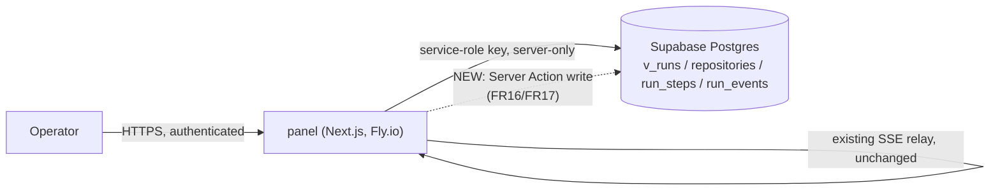
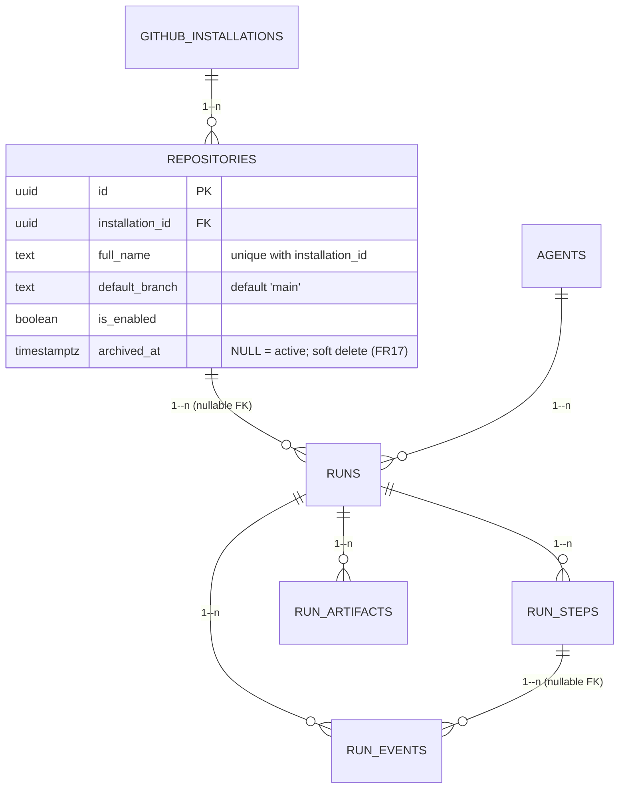

# Specification — Agent Fleet Control Panel v3: UI Depth

## Changelog

| Version | Date       | Summary                                                                 | Author           |
| ------- | ---------- | ----------------------------------------------------------------------- | ---------------- |
| 1.0     | 2026-09-15 | Initial specification, generated from [`prd-agent-fleet-panel-v3-ui-depth.md`](../docs/requirements/prd-agent-fleet-panel-v3-ui-depth.md) v1.0. Grounded directly against the shipped codebase (through S-123 / issue #172) rather than via a separate `researcher` pass — the exact function signatures, error taxonomy, and route conventions cited below were read from `panel/lib/supabase/{queries,types,errors}.ts`, `panel/lib/errors.ts`, `panel/app/api/agents/[slug]/invoke/route.ts`, `panel/components/status-meta.ts`, and `supabase/migrations/20260902200101_initial_schema.sql` during this same session, so a fresh delegated research artifact would only have re-derived the same facts. | product-engineer |
| 1.1     | 2026-09-15 | Closed 3 non-blocking gaps `verifier` (Design Mode) surfaced while building the compliance test plan/traceability matrix for S-142–S-148 (issues #202–#208) — all three are implementation-shape decisions, not product decisions, resolved directly rather than left open into `developer` handoff: (1) §8.1/§17 OQ1 refined — FR8's "connection-state indicator" has no reachable "disconnected" trigger under the resolved presentational design (a server component's failed fetch hits the Next.js error boundary before the indicator can render at all), so it renders a static "connected" state only in v1; this is not missing scope, it is the honest ceiling of the presentational-only resolution, and S-143's tests should assert the static state rather than search for an unreachable disconnected one. (2) §8.1 FR3 gains an explicit rule: the free-text search value is escaped for `ilike` wildcard metacharacters (`%`, `_`) before the query is built, so search stays literal-substring — consistent with the existing dashboard `AgentFilter` precedent (EC-25) — rather than accidentally supporting SQL wildcard syntax nobody asked for. (3) §10/§8.2 FR7 gains an explicit tie-break: a run carrying more than one `pull_request` artifact (not expected in the current `dependency-update` pipeline, which creates at most one per run, but not schema-prevented) shows the most-recently-created one (`order by created_at desc limit 1` inside `getPullRequestArtifactsForRuns`), matching the "newest wins" pattern used elsewhere in this codebase rather than being undefined behavior. | product-engineer |

## 1. Executive Summary

This spec implements PRD v1.0's four groups — Run History filtering/pagination, Run Detail steps-panel + log-level filtering + the queued-animation fix, a new cross-agent All Runs screen, and a new Repositories screen (list/add/archive) — entirely inside the existing `panel/` Next.js package, reusing the established server-component-reads-via-service-role pattern (SD2) and adding the panel's **second** user-triggered write path (after S-112 Invoke) for repository add/archive. No schema migration, no new dependency, no new `app/api/**` route — writes go through Next.js Server Actions, matching the precedent already set by `app/login/actions.ts` (S-119) rather than a new route handler.

## 2. Reference Documents

- PRD: [`docs/requirements/prd-agent-fleet-panel-v3-ui-depth.md`](../docs/requirements/prd-agent-fleet-panel-v3-ui-depth.md) v1.0 (FR1–FR18)
- Technical Guidelines: `docs/technical-guidelines.md` §2 (Technology Stack — panel current-state row), §4 (API Design Standards — D1/D2), §5 (SD2/SA1 auth boundary), §7 (Data & DB — `repositories`/`v_runs`, PostgREST `max_rows`), §9 (Code Organization — the full panel artifact table), §11 (Testing Strategy — layer taxonomy + coverage_gate precedent), §12 (Code Quality — SD2 `no-restricted-imports`, inline route-segment config, Nocturne token discipline)
- Design contract: `/DESIGN.md` §4.1 (sidebar), §4.4 (Run History grid), §5.2 (Agent Run History), §5.3 (Run Detail), §6.1 (animations), §6.5 (keyboard shortcuts), §8.1 (status→visual mapping), §9 (responsive — now declined), §10 (icons)

## 3. Affected Repositories

| Repository | Role | Scope of Changes |
|---|---|---|
| `dev-tasks-agent-fleet` (`panel/` workspace) | Front-end — Next.js App Router, TypeScript strict | All work: new query/mutation helpers, two new screens, two modified screens, one presentational bugfix, two new Server Actions. No AgentCore, CDK, or agent-repo change. |

No other repository is affected — the `dependency-update` agent and its `agent_reporter.py` copy are untouched.

## 4. System Architecture

No new external integration and no change to the three-piece architecture (`docs/technical-guidelines.md` §1). This feature is entirely inside the existing "panel reads Supabase server-side with the service-role key" boundary (SD2), adding one new write shape.



The only new edge on this diagram is the dashed one: a Server-Action-issued `INSERT`/`UPDATE` against `repositories`, using the same `createServerClient()` service-role client every read helper already uses. Everything else in this PRD (filtering, steps panel, log-level coloring, All Runs) is a **read-only** re-composition of `v_runs`, `run_steps`, and `run_events` — no new table is read, no new Realtime subscription is added (see §11 on the FR8 connection indicator).

## 5. Data Model & Database Design

**No migration.** Every column this spec reads or writes already exists (confirmed by reading `supabase/migrations/20260902200101_initial_schema.sql` directly):

| Column | Table | Existing? | Used for |
|---|---|---|---|
| `run_events.level` | `run_events` | Yes | FR11 log-level coloring/filter |
| `run_events.step_id` | `run_events` | Yes | FR10 step-click log filter |
| `run_steps.key`/`title`/`status`/`started_at`/`finished_at` | `run_steps` | Yes | FR9 steps panel |
| `repositories.full_name`/`default_branch`/`is_enabled`/`archived_at` | `repositories` | Yes | FR15–FR17 |
| `v_runs.*` (incl. `effective_status`, `agent_slug`, `repository_full_name`) | view | Yes | FR1–FR8, FR13 |



This ER excerpt is unchanged from the existing schema — it is included to make explicit that **FR16 (add) is an `INSERT` and FR17 (archive) is an `UPDATE ... SET archived_at = now()`**, never a `DELETE`, so `runs.repository_id` never dangles.

**Uniqueness and validation (FR16).** `uq_repositories_full_name unique (installation_id, full_name)` already enforces the duplicate rule at the DB layer. The spec adds application-layer validation *before* the insert (never relying on the constraint alone for the user-facing message, per §12 Business Logic below).

## 6. API Design

No new `app/api/**` route. Per §12/§4 (D1/D2) and the S-119 login precedent, mutations are Next.js **Server Actions** (`"use server"`), not route handlers — this is a deliberate divergence from S-112's invoke route, because a Server Action is the established pattern for a form-submission-shaped write in this codebase (`app/login/actions.ts`), whereas S-112's route handler exists because it is also the boundary AgentCore is invoked from.

| Action | File | Shape |
|---|---|---|
| `addRepository` | `app/(panel)/repositories/actions.ts` | `"use server"`, form-bound via `useActionState` (same shape as `signIn`) — input `{ fullName: string, defaultBranch?: string }`, output `{ ok: true, repository } \| { ok: false, code, message, fieldErrors? }` |
| `archiveRepository` | `app/(panel)/repositories/actions.ts` | `"use server"`, input `{ id: string }`, output `{ ok: true } \| { ok: false, code, message }` |

Both actions run behind the existing S-117 middleware gate (they are POSTs to a protected `ui` route, `/repositories`, not a listed `public` path — no `route-policy.ts` change needed, unlike the deliberate S-120 logout carve-out).

**Error codes added** (extending the existing `ApiErrorCode`-shaped taxonomy in `lib/errors.ts`, §13 pattern):

| Code | Status-equivalent* | Trigger |
|---|---|---|
| `REPOSITORY_ALREADY_EXISTS` | 400 | `full_name` already registered under the installation (checked pre-insert **and** as a `23505` unique-violation fallback, since a race between two adds is still possible) |
| `INVALID_REPOSITORY_FORMAT` | 400 | `full_name` does not match `owner/repo` shape |
| `DATABASE_ERROR` | 500 | Reused from `lib/supabase/errors.ts` — any other Postgres failure |

*Server Actions do not return HTTP statuses the way a route handler does; "status-equivalent" documents how the same code would map if this were ever a route, for consistency with the existing taxonomy table in `lib/errors.ts`.

No versioning concern — this is an internal, non-consumer-facing action, same posture as every existing panel endpoint (§9's recurring "no external/consumer contract" note).

## 7. Authentication & Authorization Design

No new authorization tier. `addRepository`/`archiveRepository` execute exactly where every other protected-route mutation does: behind the S-117 `middleware.ts` fail-closed gate (single authenticated operator, no roles/permissions matrix — this remains a single-operator personal tool per `product-context.md` §3). RLS stays deny-all (D11); both actions use the existing server-only service-role client (`createServerClient()`), never a new credential path. No change to `lib/auth/route-policy.ts` is needed — `/repositories` is not `/login` or `/api/auth/logout`, so it falls through to the default `ui` classification and is gated like `/agents/[slug]` or `/runs/[id]` today.

## 8. Business Logic Implementation

### 8.1 Filter/pagination model (FR1–FR8, FR13)

A single pure module, `lib/domain/run-filter.ts`, owns the URL ↔ filter mapping so `/agents/[slug]` and the new `/runs` share one implementation (FR13 reuse):

```ts
export interface RunFilter {
  status: RunStatus | "all";     // segmented control, FR1
  repositoryId: string | null;   // repo chip, FR2
  search: string | null;         // free text, FR3
  agentSlug: string | null;      // ONLY meaningful on /runs — undefined on /agents/[slug]
  page: number;                  // 1-based, FR4/FR5
}

export function parseRunFilter(searchParams: URLSearchParams): RunFilter;   // total, never throws — unknown values fall back to "all"/null/1
export function serializeRunFilter(filter: RunFilter): URLSearchParams;      // omits default values so the URL stays clean (?status=all is never written)
```

**Pagination decision (resolves PRD Open Question — All-runs pagination, in part).** Rather than true keyset/cursor pagination, this spec uses **cumulative offset paging**: `page` means "show pages 1..page inclusive," and "Load more" is a plain `<Link href="?page=N+1">` (no client-side row accumulation, no new client state) that re-renders the server component with `.range(0, page * PAGE_SIZE - 1)`. This matches the existing codebase's exclusive use of `.range()`-based offset paging (`getAllRunsByAgentSlug`, `getRunEventsInRange`) and needs no new client-side list-merging logic. `PAGE_SIZE = 25`. Cost: a `page=40` load re-reads rows 0..999 every time rather than only the new page — acceptable given `product-context.md` §11's low-volume assumption; flagged in §17 as the thing to revisit if the assumption stops holding.

**Query shape.** One new helper, `getFilteredRuns`, added to the existing `lib/supabase/queries.ts` (alongside `getAllRunsByAgentSlug`, not a new file):

```ts
export interface FilteredRunsResult {
  rows: VRunRow[];
  totalCount: number; // for the "X of Y" text, FR5
}

export async function getFilteredRuns(
  client: SupabaseClient,
  filter: RunFilter,
  pageSize: number,
): Promise<FilteredRunsResult>
```

Internally: `client.from("v_runs").select("*", { count: "exact" })`, conditionally `.eq("agent_slug", filter.agentSlug)` (only on `/agents/[slug]`), `.eq("repository_id", filter.repositoryId)`, `.or(...)` / `.ilike` for `search` across `repository_full_name` and the run's short id, `.order("created_at", { ascending: false })`, `.range(0, filter.page * pageSize - 1)`. **Status filtering is the one place this needs care**: `effective_status` is a *computed* view column, not indexable, so filtering by it in SQL means filtering the view's `effective_status` expression directly (PostgREST/Postgres can filter on a view's computed column, just without an index backing it) — acceptable at v1 volume, flagged in §11 Performance.

**Search input escaping (v1.1, closes a `verifier` Design Mode gap).** `filter.search` MUST be escaped for `ilike` wildcard metacharacters (`%`, `_` — and the escape character itself) before being interpolated into the `.ilike()` pattern, so a search for e.g. `my_repo` matches literally rather than `_` acting as a single-character wildcard. This keeps search behavior literal-substring-only, matching the existing dashboard `AgentFilter`'s EC-25 precedent (a stray regex metacharacter matches literally, never throws) — the same posture applied to a different query mechanism (`ilike` here vs. `String.includes` there).

**Connection indicator's reachable states (v1.1, closes a `verifier` Design Mode gap).** Given the presentational-only resolution above, the indicator has exactly one reachable state in v1: **connected** (rendered once the server component has already returned rows — a failed server-side fetch throws to the Next.js error boundary before this component ever mounts, so there is no code path in which it renders a "disconnected" visual). This is the honest ceiling of the resolution, not an oversight — `RunFilterBar`'s tests should assert the static connected state, not search for an unreachable disconnected one.

Repository chips (FR2) reuse the **existing** `getEnabledRepositories(client)` helper as-is (already implemented, `is_enabled = true and archived_at is null`) rather than deriving "repositories that appear in this agent's runs" as PRD §7/FR2 describes — a deliberate simplification: chip-filtering to a repo with zero runs for that agent just yields the FR6 empty state, which is already a required behavior, so no new query is needed. This is a documented spec-level scope reduction from the PRD wording, not a PRD change.

### 8.2 Steps panel + log filtering (FR9–FR11)

`lib/domain/run-detail.ts` (existing module, extended) gains `buildStepsPanel(steps: RunStepRow[], eventCountByStep: Record<string, number>): StepPanelRow[]`, mapping each step to `{ id, title, status, duration, eventCount }` — `status` feeds the existing `StatusDot`/step-status color mapping (no new color logic; `run_steps.status` is already a closed enum, not `effective_status` — steps do not have a reaper-computed "effective" state, they are directly written by the agent or the reaper's step-closure per `technical-guidelines.md` §8 "Reaper mirrors the agent's step-closure").

Event counts per step: a new grouped helper `getEventCountsByStep(client, runId): Promise<Record<string, number>>` — one grouped read (`select step_id, count(*)` — actually PostgREST needs a `count` via a second lightweight query or a computed view; simplest compliant approach: reuse the already-loaded `run_events` window (`selectRecentWindow` output, already fetched for the log viewer) and count client-side in `buildStepsPanel`'s caller, since the log window is already bounded to 2000 events (SD11) — **no new DB read needed**. This is the resolved approach: **event counts are derived from the already-fetched event window, not a new query**, keeping FR9 read-cost at zero marginal DB round-trips.

FR10 (click step → filter log) and FR11 (log-level filter) are both **client-side filters over the already-loaded event window** — no new server read for either. A new pure reducer, `lib/domain/log-filter.ts`:

```ts
export interface LogFilterState { stepId: string | null; level: LogLevel | "all" }
export function applyLogFilter(lines: LogLine[], filter: LogFilterState): LogLine[]
```

`LogViewer.tsx`/`LiveLogViewer.tsx` gain a small `"use client"` filter-state wrapper (`components/run-detail/StepsPanel.tsx` + a level-filter control) that calls `applyLogFilter` before rendering — both filters compose (AC8), matching the PRD requirement that they apply together.

### 8.3 Queued-animation fix (FR12)

`components/status-meta.ts`'s `StatusMeta` interface gains a `spin: boolean` field (alongside the existing `pulse`/`hollow`). `queued`'s entry changes from `{ pulse: true }` to `{ pulse: false, spin: true }`; every other status keeps `spin: false`. `StatusDot.tsx` adds `meta.spin && styles.spin` to its class list. `StatusDot.module.css` adds:

```css
.spin {
  animation: spin 0.9s linear infinite;
}
```

reusing the `@keyframes spin` **already defined** in `styles/globals.css` (per `technical-guidelines.md` §9: "`styles/globals.css` (`pulse`/`spin`/`rise` keyframes...)") but never consumed until now — this is a one-file-plus-one-field fix, not a new animation.

### 8.4 Repository add / archive (FR15–FR17)

Two new pure validators in `lib/domain/repository-input.ts`:

```ts
export function parseFullName(raw: string): { ok: true; value: string } | { ok: false; code: "INVALID_REPOSITORY_FORMAT" };
// shape: /^[\w.-]+\/[\w.-]+$/ after trim — matches GitHub's own owner/repo charset closely enough for a manual reference; no live GitHub call (PRD §8 Business Rule)
```

Two new helpers in `lib/supabase/queries.ts` (alongside `insertQueuedRun`, the existing write precedent):

```ts
export async function insertRepository(
  client: SupabaseClient,
  row: { installationId: string; fullName: string; defaultBranch: string },
): Promise<RepositoryRow>; // throws RepositoryAlreadyExistsError on 23505, DatabaseError otherwise

export async function archiveRepository(client: SupabaseClient, id: string): Promise<void>;

export async function getRepositories(
  client: SupabaseClient,
  opts?: { includeArchived?: boolean },
): Promise<RepositoryRow[]>; // FR15 list; defaults to excluding archived
```

`getSingleInstallation(client): Promise<GithubInstallationRow>` (new, trivial — there is exactly one row per `product-context.md` §11 and `github_installations` is already read for the invoke path's repository resolution) resolves the installation the Add-repository form writes against, so the form has no installation picker (Assumption in PRD §15).

**Archive side-effect on the Invoke dialog (FR17 acceptance criterion).** The invoke dialog's repository selector already calls `getEnabledRepositories` (`is_enabled = true and archived_at is null`) — archiving a repository via `UPDATE repositories SET archived_at = now()` automatically removes it from that selector with **no code change to the invoke path**, because the existing filter already excludes archived rows. This is the one place FR17's acceptance criterion is satisfied by an existing query, not new code.

## 9. Integration Details

No new third-party integration. FR16 explicitly does **not** call the GitHub API (PRD §8 Business Rule) — this is the one place this spec deliberately does *not* integrate with an existing external boundary (the GitHub App), consistent with `technical-guidelines.md` §8's note that "automatic repo sync from the GitHub App is backlog."

## 10. User Interface & Client Behavior

| Screen | Route | FRs | Change |
|---|---|---|---|
| Agent Run History (existing) | `/agents/[slug]` | FR1–FR8 | `page.tsx` reads `searchParams`, calls `parseRunFilter` + `getFilteredRuns`; `components/runs/RunFilterBar.tsx` (new, `"use client"`) renders the segmented control + chips + search + connection indicator and mutates the URL (`router.replace`, search debounced 300ms); `RunHistoryRow.tsx` gains the PR-link cell (FR7, via a new grouped `getPullRequestArtifactsForRuns(client, runIds)` helper — one grouped read, never N+1, same shape as `getStepProgressForRuns`) |
| Run Detail (existing) | `/runs/[id]` | FR9–FR12 | New `components/run-detail/StepsPanel.tsx` (click sets `stepId` filter state, "All steps" clears it); new level-filter control alongside `LogViewer`/`LiveLogViewer`; `status-meta.ts`/`StatusDot` fix (§8.3 above) |
| **All Runs (new)** | `/runs` | FR13, FR14 | `app/(panel)/runs/page.tsx` — same shape as `/agents/[slug]` minus the agent-scoping, reusing `RunFilterBar` + `RunHistoryTable` with a new `showAgentColumn` prop; sidebar "All runs" `DisabledNavItem` → `NavItem` link |
| **Repositories (new)** | `/repositories` | FR15–FR18 | `app/(panel)/repositories/page.tsx` (list, server component) + `actions.ts` (Server Actions) + `components/repositories/{RepositoryTable,AddRepositoryForm,ArchiveConfirm}.tsx`; sidebar "Repositories" `DisabledNavItem` → `NavItem` link |

`/DESIGN.md` needs a new **§5.6 Repositories** subsection (list + add-form + archive-confirm layout) before this ships — flagged to `ux-engineer` per the refined PRD's §11 recommendation, not authored here.

Client-side validation on `AddRepositoryForm` mirrors `parseFullName` (fail fast before the Server Action round-trip); the Server Action re-validates server-side regardless (never trust client-only validation, consistent with the existing invoke-form/Ajv double-validation pattern in §4 D2).

## 11. Performance & Scalability Approach

- **Status-filter-on-a-view caveat (§8.1).** Filtering `v_runs.effective_status` has no index — acceptable at `product-context.md` §11 volume (few agents, non-continuous runs). If this becomes measurably slow, the exit path already exists in the codebase's own precedent: materialize `effective_status` cheaper (e.g., a partial index on `runs.status` combined with a narrower time-window default), not attempted here.
- **Cumulative offset paging (§8.1)** re-reads from row 0 on every "Load more" — bounded by `page * PAGE_SIZE`, same cost class as the existing `getAllRunsByAgentSlug` unfiltered read it replaces.
- **All Runs (FR13)** is the first unfiltered-by-default cross-agent read; existing indexes are `(agent_id, created_at desc)` and `(repository_id, created_at desc)` (§7 of the guidelines) — neither covers an agent-unscoped `created_at desc` scan optimally, but `v_runs` still resolves via the underlying `runs` table's primary sort direction reasonably at current row counts. Flagged, not fixed, per PRD Open Question §18.
- **PR-link lookup (FR7)** is a new grouped `run_artifacts` read per page of run rows (bounded to `PAGE_SIZE` run ids), never N+1.
- **Multiple-PR-artifact tie-break (v1.1, closes a `verifier` Design Mode gap).** The current `dependency-update` pipeline's `open_pr` step creates at most one `pull_request` artifact per run, but nothing in the schema prevents a future agent (or a re-run bug) from writing more than one. `getPullRequestArtifactsForRuns` MUST resolve ties deterministically: `order by created_at desc limit 1` per `run_id`, so the most-recently-created `pull_request` artifact wins — matching the "newest wins" pattern used elsewhere in this codebase rather than leaving the result undefined (e.g., arbitrary row order from a bare `GROUP BY`).

## 12. Security Implementation

- **FR16 does not verify GitHub existence** — an accepted, explicit risk per PRD §17, restated here: `parseFullName` is a shape check only, not an existence check.
- **`archiveRepository` and `insertRepository` are idempotent-safe:** archiving an already-archived repo is a no-op `UPDATE` (not an error); inserting a duplicate `full_name` is rejected with `REPOSITORY_ALREADY_EXISTS`, never a raw Postgres error surfaced to the client (mirrors the existing `DatabaseError` "log the pg code, never return it" rule, `lib/supabase/errors.ts`).
- **No new secret, no new credential path** — both new Server Actions reuse `createServerClient()` exactly as every existing read helper does.
- **Log message rendering (FR11)** — the level filter and step filter operate on `LogLine`s that are already rendered as inert text nodes (never `dangerouslySetInnerHTML`, the standing security guard #6) — filtering does not touch that guarantee.

## 13. Error Handling & Logging

Extends the existing `lib/errors.ts` taxonomy (§6 above) rather than inventing a parallel one. Server Action failures return a discriminated `{ ok: false, code, message }` (the same shape `signIn`'s `resolveSignIn` core already returns), so `AddRepositoryForm` can branch on `code` for inline vs. banner display, matching the existing `LoginForm`/`useActionState` pattern. No new logging surface — `insertRepository`/`archiveRepository` log through the same `DatabaseError.logDetail` (server-log-only Postgres code) convention as every other write.

## 14. Testing Strategy

Following the established layer taxonomy (`technical-guidelines.md` §11) and the standing per-story precedent (a Layer 1 + Layer 2 + Layer 2.5 + E2E surface per story, `coverage_gate` PASS on every new pure module):

| Layer | New coverage |
|---|---|
| **Layer 1 (unit)** | `run-filter.test.ts` (parse/serialize round-trip, unknown-value fallback, default-omission from the URL); `log-filter.test.ts` (step+level compose, empty result, "all" resets); `repository-input.test.ts` (`parseFullName` valid/invalid shapes, trimming, case sensitivity); `status-meta.test.ts` extension (queued now `spin:true, pulse:false`; every other status unchanged) |
| **Layer 2 (component)** | `RunFilterBar.test.tsx` (segmented control + chips + search drive the URL; debounce); `StepsPanel.test.tsx` (click sets filter, "All steps" clears, colored dot per step status); `AddRepositoryForm.test.tsx` (client validation, pending/disabled submit, duplicate-error display); `RepositoryTable.test.tsx` (archived rows hidden by default); `StatusDot.test.tsx` extension (queued renders `.spin`, running still renders `.pulse`, mutually exclusive) |
| **Layer 2.5 (integration, Docker-gated, run live)** | `filtered-runs.test.ts` (`getFilteredRuns` — status/repo/search combinations against a seeded fixture, paging beyond `max_rows=1000`, count accuracy); `repository-mutations.test.ts` (`insertRepository` duplicate-rejection round-trip against the real local stack, `archiveRepository` idempotent-on-already-archived, and — critically, per the standing RLS-deny-all regression pattern every prior auth-adjacent story includes — **RLS stays deny-all after both writes**) |
| **E2E (Playwright)** | New scenarios: filter Run History by status+repo+search and paginate via "Load more"; click a failed step and confirm the log viewer narrows; add a repository end-to-end and confirm it appears in the Invoke dialog's selector; archive a repository and confirm it disappears from both the Repositories list and the Invoke selector while an existing run against it still shows its name; visit `/runs` and confirm rows from ≥2 agents appear |

`coverage_gate` target: 100% on every new pure module (`run-filter.ts`, `log-filter.ts`, `repository-input.ts`), matching the standing project convention rather than a percentage chosen for this feature specifically.

## 15. Deployment & Rollout

- No migration, no feature flag — every prior Phase 2 UI story shipped directly (no flag infrastructure exists in this codebase, and adding one would be the YAGNI violation the guidelines' §10 explicitly warns against).
- No `fly.toml`/deploy config change — this is application code only.
- Rollback is a plain revert; there is no data migration to reverse.
- Recommended sequencing (non-binding, per PRD §18 Open Questions): Run History depth (FR1–FR8) + the FR12 animation fix first (smallest, most contained), Run Detail depth (FR9–FR11) second, then All Runs (FR13–FR14, reuses FR1–FR8's components), then Repositories (FR15–FR18, the only new write path — largest single unit).

## 16. Dependencies & Risks

- **No new npm dependency.** Every new module composes existing primitives (`components/*`), the existing Supabase client, and existing `lib/domain`/`lib/format` layers.
- **Risk: status-filter-on-a-view has no index (§11)** — accepted at current volume, exit path noted.
- **Risk: cumulative offset paging re-reads from zero on every "Load more" (§8.1/§11)** — accepted, bounded, simpler than keyset pagination for a first version.
- **Risk: FR16's no-GitHub-verification (§12)** — explicitly accepted per PRD §17, restated here for the implementer.
- **Dependency: FR9's zero-marginal-read decision (§8.2)** assumes the log window (`selectRecentWindow`, SD11, capped at 2000 events) is already loaded before the steps panel renders event counts — true for the terminal-run `LogViewer` path; for a **live** run (`LiveLogViewer`), the SSE relay may not yet have delivered every event a step eventually accumulates, so a running run's step event counts in the panel can under-count until the tail catches up. This is presentational and self-corrects live (matches the "eventually consistent under Realtime" posture already accepted for FR8's connection indicator) — not a data-integrity issue, but worth calling out so it isn't reported as a bug.

## 17. Open Questions

1. **FR8 connection indicator — resolved here, further refined in v1.1, no sign-off blocking implementation.** The PRD left this open. This spec resolves it as **presentational only, no new Realtime subscription**: Run History and All Runs remain server-rendered, re-fetched lists (no live row insertion under a filter), so the indicator reflects whether the page's last server fetch succeeded, not a live socket state. This avoids the "filtered list + live insert" risk class the PRD explicitly flagged as a reason to *not* decide this without a spec pass. `verifier` (Design Mode) subsequently flagged that this resolution leaves no reachable "disconnected" trigger; §8.1 now states explicitly that **connected is the only state the indicator can render in v1** — not a gap to fill, the honest ceiling of this resolution. If the operator later wants genuinely live-updating filtered lists (or a real disconnected signal), that is a new PRD, not an extension of this one.
2. **Status-filter-on-a-view performance (§11)** — no action needed now; flagged for the same future revisit as PRD Open Question §18's "All-runs pagination at scale."
3. **Repository restore** — PRD §18 leaves this open; this spec does not add a restore action (an operator would need a direct DB `UPDATE ... SET archived_at = NULL` today). Confirm this is acceptable for v1 before stories are written, since it is the one place FR17 is not fully self-service.
4. **`/DESIGN.md` §5.6 authorship** — this spec assumes `ux-engineer` produces the Repositories screen layout before implementation stories are written (per the refined PRD's §11 recommendation); confirm that pass happens before `activity-generate-stories`, or this spec's FR15–FR18 stories will need to reference placeholder layout instead of an approved design section.
