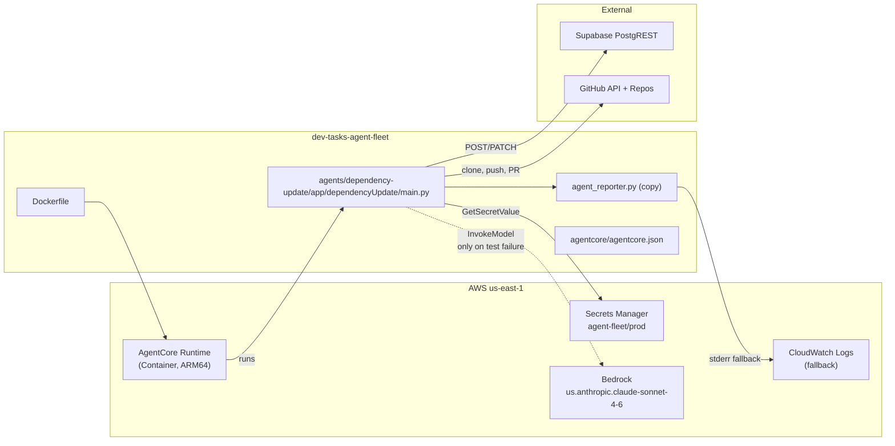
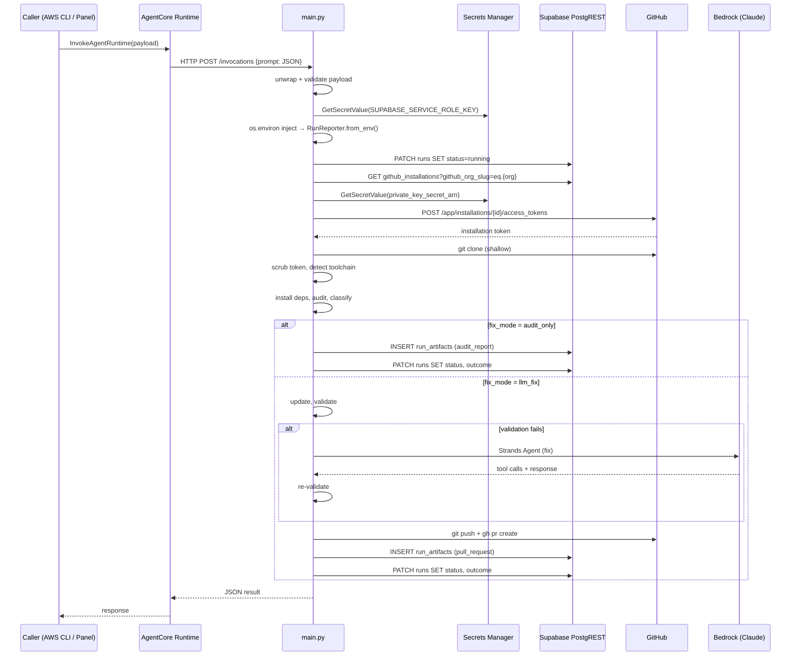
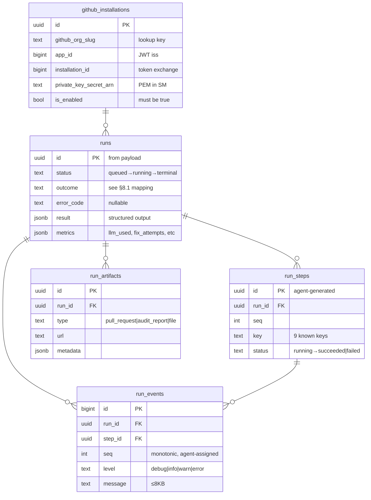
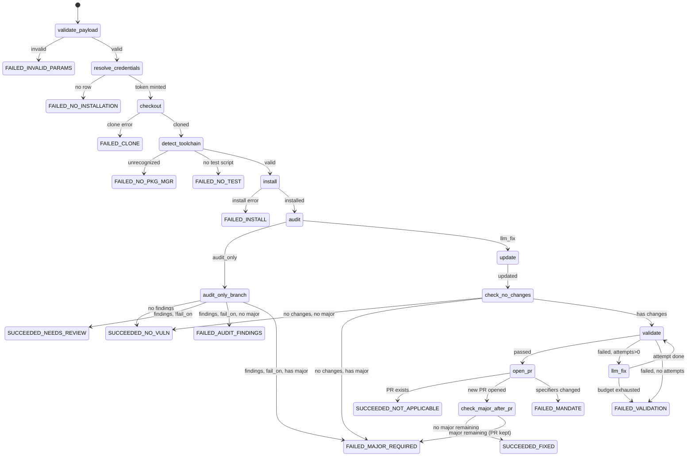

# Technical Specification — Dependency Update Agent

## Changelog

| Version | Date       | Summary         | Author           |
| ------- | ---------- | --------------- | ---------------- |
| 1.0     | 2026-08-26 | Initial version. Translates PRD v1.2 into implementation-ready design: module decomposition, function signatures, Dockerfile, agentcore config, advisory classifier algorithm, fix-agent tools, PR body template, test strategy, and deployment steps. Closes PRD open questions #4 (naive major extraction) and #5 (eligibility = classification, no drift). | product-engineer |

## 1. Executive Summary

This specification describes how to build the `dependency-update` agent as defined in [`prd-dependency-update-agent.md`](../docs/requirements/prd-dependency-update-agent.md). The deliverable is a single AgentCore Container project at `/agents/dependency-update/` containing a Python entrypoint (`main.py`) that implements a deterministic pipeline with a bounded LLM escape hatch, reports its lifecycle to Supabase via the copied `agent_reporter.py`, and authenticates to GitHub through a GitHub App installation token. The container image packages the full JavaScript toolchain (Node 26, pnpm, npm, `gh` CLI) on ARM64.

## 2. Reference Documents

| Document | Location | Relevance |
|---|---|---|
| PRD — Dependency Update Agent | `docs/requirements/prd-dependency-update-agent.md` | Requirements, decisions D16-D26, acceptance criteria |
| PRD — Agent Fleet Panel v2 | `docs/requirements/prd-agent-fleet-panel-v2.md` | Parent: data model, inherited decisions D1-D15 |
| Technical Guidelines | `docs/technical-guidelines.md` | Stack, conventions, integration patterns |
| Schema DDL | `docs/reference/001_schema.sql` | Tables, enums, indexes, reaper |
| Agent Reporter SDK | `docs/reference/agent_reporter.py` | Reporting contract |
| Reference Implementation | `github.com/llipe/dep-update-agent/.../main.py` | Pipeline pattern source |

## 3. Affected Repositories

| Repository | Role | Scope of Changes |
|---|---|---|
| `dev-tasks-agent-fleet` (this repo) | Primary — agent code, config, infra | Add `/agents/dependency-update/` tree; update `docs/reference/002_seed.sql` |
| Target repos (~20) | Consumer — receives branches + PRs | No code changes; receives `deps/update-*` branches via GitHub App |
| Supabase project | Infrastructure — data store | No migration; requires seeded `github_installations` row |
| AWS account (`us-east-1`) | Infrastructure — runtime | AgentCore Container runtime + Secrets Manager entries |

## 4. System Architecture

### 4.1 Component diagram



### 4.2 Invocation flow



## 5. Data Model & Database Design

No schema migration is required. The agent is a pure consumer of the existing schema defined in `001_schema.sql`.

### 5.1 Entities used



### 5.2 Seed update (`002_seed.sql`)

The `dependency-update` agent row requires:

```sql
INSERT INTO agents (id, slug, name, description, version, runtime_arn, runtime_qualifier,
  params_schema, default_params, requires_repository,
  max_runtime_seconds, grace_seconds, start_timeout_seconds, is_enabled)
VALUES (
  gen_random_uuid(),
  'dependency-update',
  'Dependency Update',
  'Deterministic dependency updater with LLM escape hatch for test breakage.',
  '0.1.0',
  '<runtime_arn from agentcore deploy>', -- filled after first deploy
  'DEFAULT',
  '{
    "type": "object",
    "properties": {
      "fix_mode": {"type": "string", "enum": ["audit_only", "llm_fix"], "default": "audit_only"},
      "fail_on_findings": {"type": "boolean", "default": true},
      "max_fix_attempts": {"type": "integer", "minimum": 0, "maximum": 5, "default": 3}
    },
    "additionalProperties": false
  }'::jsonb,
  '{"fix_mode": "audit_only", "fail_on_findings": true, "max_fix_attempts": 3}'::jsonb,
  true,
  3600, 120, 300, true
) ON CONFLICT (slug) DO UPDATE SET
  params_schema = EXCLUDED.params_schema,
  default_params = EXCLUDED.default_params,
  max_runtime_seconds = EXCLUDED.max_runtime_seconds,
  grace_seconds = EXCLUDED.grace_seconds,
  start_timeout_seconds = EXCLUDED.start_timeout_seconds;
```

## 6. API Design

This agent does not expose an HTTP API. It implements the AgentCore runtime contract:

| Endpoint | Method | Purpose |
|---|---|---|
| `/invocations` | POST | AgentCore dispatches the payload here |
| `/ping` | GET | Health check (handled by `BedrockAgentCoreApp`) |

### 6.1 Invocation payload schema

```json
{
  "$schema": "http://json-schema.org/draft-07/schema#",
  "type": "object",
  "required": ["run_id", "repository_org", "repository_name"],
  "properties": {
    "run_id": { "type": "string", "format": "uuid" },
    "repository_org": { "type": "string", "minLength": 1 },
    "repository_name": { "type": "string", "minLength": 1 },
    "params": {
      "type": "object",
      "properties": {
        "fix_mode": { "type": "string", "enum": ["audit_only", "llm_fix"], "default": "audit_only" },
        "fail_on_findings": { "type": "boolean", "default": true },
        "max_fix_attempts": { "type": "integer", "minimum": 0, "maximum": 5, "default": 3 }
      },
      "additionalProperties": false
    }
  },
  "additionalProperties": false
}
```

### 6.2 Return payload

```json
{
  "status": "succeeded | failed",
  "outcome": "fixed | partial | no_vulnerabilities | needs_review | not_applicable",
  "error_code": "string | null",
  "pr_url": "string | null",
  "vulnerabilities_before": 0,
  "vulnerabilities_after": 0,
  "advisories_fixed": 0,
  "advisories_major_required": 0,
  "advisories_unknown": 0,
  "packages_changed": 0,
  "fix_attempts": 0,
  "llm_used": false
}
```

## 7. Authentication & Authorization Design

### 7.1 Agent → Supabase

- Service role key fetched from Secrets Manager at startup.
- Injected into `os.environ["SUPABASE_SERVICE_ROLE_KEY"]` before `RunReporter.from_env()`.
- Authenticates to PostgREST via `apikey` + `Authorization: Bearer` headers (handled by `_SupabaseClient` in `agent_reporter.py`).
- Grants full DB access (service role bypasses RLS) — accepted risk R2.

### 7.2 Agent → GitHub

- GitHub App credentials resolved from `github_installations` table.
- PEM fetched from Secrets Manager at the ARN in that row.
- RS256 JWT signed (`iss=app_id`, `exp=now()+9min`).
- Exchanged at `POST /app/installations/{installation_id}/access_tokens` → 1-hour installation token.
- Token used for `git clone`, `git push`, and `gh pr create/list`.
- Scrubbed from `.git/config` immediately after clone.
- Re-minted if >45 minutes elapsed before push.

### 7.3 Agent → AWS

- Execution role (created by `agentcore deploy` CDK) grants:
  - `secretsmanager:GetSecretValue` on `arn:aws:secretsmanager:us-east-1:*:secret:agent-fleet/prod/*`
  - `bedrock:InvokeModel` on the Claude Sonnet inference profile ARN
  - CloudWatch Logs write (implicit from AgentCore)

## 8. Business Logic Implementation

### 8.1 Module decomposition

The agent is a single Python package under `agents/dependency-update/app/dependencyUpdate/` with these modules:

```
dependencyUpdate/
├── main.py              # Entrypoint: BedrockAgentCoreApp, payload unwrap, orchestrator
├── agent_reporter.py    # Byte-identical copy of docs/reference/agent_reporter.py
├── config.py            # Constants, env var reads, secret IDs
├── credentials.py       # Supabase key fetch, GitHub App token mint + refresh
├── toolchain.py         # Package manager detection, pnpm version matching, script contract
├── audit.py             # Run audit, parse JSON, snapshot versions, diff packages
├── classifier.py        # Advisory classification (in_range / major_required / unknown)
├── eligibility.py       # Version eligibility (semver check, D26 rules)
├── updater.py           # Apply updates, reconcile lockfile
├── validator.py         # Run lint, format, typecheck, test; collect results
├── fix_agent.py         # Strands Agent setup, tools, system prompt, retry loop
├── pull_request.py      # Branch, commit, push, idempotency check, PR body builder
├── scrubber.py          # Token scrubbing for error messages and command output
├── Dockerfile           # ARM64 multi-stage: Python + Node + pnpm + npm + gh
└── pyproject.toml       # Python dependencies
```

### 8.2 Orchestrator (`main.py`)

```python
"""Pseudocode — the orchestrator shape."""
app = BedrockAgentCoreApp()

@app.entrypoint
def dep_update(payload, context):
    payload = unwrap_and_validate(payload)  # req 9, 10
    run_id = payload["run_id"]
    org = payload["repository_org"]
    name = payload["repository_name"]
    params = apply_defaults(payload.get("params", {}))  # req 11

    supabase_key = fetch_supabase_key()  # req 14
    os.environ["SUPABASE_SERVICE_ROLE_KEY"] = supabase_key  # D24
    os.environ["SUPABASE_URL"] = SUPABASE_URL
    os.environ["RUN_ID"] = run_id

    with RunReporter.from_env() as run:
        with run.step("resolve_credentials"):
            token_ctx = resolve_github_credentials(org)  # req 15-17

        with run.step("checkout"):
            workspace = clone_repo(org, name, token_ctx.token)  # req 12, 18

        with run.step("detect_toolchain"):
            pm, scripts = detect_toolchain(workspace)  # req 21-24

        with run.step("install"):
            install_deps(workspace, pm)

        with run.step("audit"):
            audit_before = run_audit(workspace, pm)
            pkgs_before = snapshot_packages(workspace, pm)
            classified = classify_advisories(audit_before, workspace)  # req 36-38

        if params["fix_mode"] == "audit_only":
            return handle_audit_only(run, classified, params)

        # llm_fix mode
        with run.step("update"):
            update_packages(workspace, pm)  # req 29
            if not has_changes(workspace):
                return handle_no_changes(run, classified)
            reconcile_lockfile(workspace, pm)  # req 30
            audit_after = run_audit(workspace, pm)
            pkgs_after = snapshot_packages(workspace, pm)
            reclassified = classify_advisories(audit_after, workspace)

        with run.step("validate"):
            val_result = run_validation(workspace, pm, scripts)  # req 23-24

        if not val_result.passed and params["max_fix_attempts"] > 0:
            with run.step("llm_fix"):
                val_result = run_fix_loop(workspace, pm, scripts,
                                          params["max_fix_attempts"],
                                          val_result)  # req 44-52

        if not val_result.passed:
            return handle_validation_failure(run, val_result)

        # Mandate check after fix agent
        if val_result.llm_used:
            verify_no_mandate_violation(workspace, pkgs_before)  # req 50

        with run.step("open_pr"):
            pr_url = open_pr_if_needed(workspace, token_ctx,
                                        audit_before, audit_after,
                                        pkgs_before, pkgs_after,
                                        reclassified, val_result)  # req 53-58

        return finalize(run, pr_url, reclassified, val_result,
                        audit_before, audit_after, pkgs_before, pkgs_after)

app.run()
```

### 8.3 Version eligibility algorithm (`eligibility.py`)

```python
import re

_SEMVER_RE = re.compile(
    r"^v?(?P<major>0|[1-9]\d*)\.(?P<minor>0|[1-9]\d*)\.(?P<patch>0|[1-9]\d*)"
    r"(?:-(?P<pre>[0-9A-Za-z\-.]+))?(?:\+(?P<build>[0-9A-Za-z\-.]+))?$"
)

def parse_semver(version: str) -> tuple[int, int, int] | None:
    """Returns (major, minor, patch) or None if not semver."""
    m = _SEMVER_RE.match(version.strip())
    if not m:
        return None
    return int(m.group("major")), int(m.group("minor")), int(m.group("patch"))

def is_eligible(installed: str, target: str) -> tuple[bool, str]:
    """
    Returns (eligible, reason).
    Implements PRD requirement 32-34 / D26.
    """
    sv_installed = parse_semver(installed)
    sv_target = parse_semver(target)

    # Either side not semver → accept (req 33)
    if sv_installed is None and sv_target is None:
        return True, "both_non_semver"
    if sv_installed is None:
        # But if target IS semver and major > 0, we can't compare — accept
        # UNLESS target parses and its major exceeds... but we have no installed major.
        # req 34: if target parses as semver and its major exceeds installed major,
        # ineligibility stands. But without a parseable installed, there's no
        # installed major to exceed. Accept.
        return True, "installed_non_semver"
    if sv_target is None:
        return True, "target_non_semver"

    # Both parse as semver
    inst_major, inst_minor, _ = sv_installed
    tgt_major, tgt_minor, _ = sv_target

    # req 34: target semver with higher major always ineligible
    if tgt_major > inst_major:
        return False, "major_increase"

    # 0.x minor treated as major-equivalent (req 32, row 3)
    if inst_major == 0 and tgt_major == 0 and tgt_minor > inst_minor:
        return False, "zero_minor_increase"

    # patch or minor within same major (or same 0.x.y patch)
    return True, "patch_or_minor"
```

### 8.4 Advisory classifier algorithm (`classifier.py`)

Implements naive major extraction (PRD open question #4, option A). Uses `unknown` generously when parsing fails.

```python
import re
from eligibility import parse_semver

# Matches >=X.Y.Z or >X.Y.Z at start of a range segment
_LOWER_BOUND_RE = re.compile(r">=?\s*(\d+\.\d+\.\d+(?:-[0-9A-Za-z\-.]+)?)")

@dataclass
class ClassifiedAdvisory:
    id: str | int
    module: str
    severity: str
    title: str
    url: str
    cves: list[str]
    patched_versions: str
    bucket: str  # "in_range" | "major_required" | "unknown"
    reason: str
    lowest_patched: str | None = None

def classify_advisory(
    advisory: dict,
    installed_version: str,
    declared_range: str,  # from package.json (for reporting)
) -> ClassifiedAdvisory:
    """
    Classify one advisory into in_range / major_required / unknown.
    Uses same eligibility rules as requirement 32 (no drift — req 37).
    """
    patched = advisory.get("patched_versions", "")
    module = advisory.get("module_name", "unknown")

    base = ClassifiedAdvisory(
        id=advisory.get("id", ""),
        module=module,
        severity=advisory.get("severity", "unknown"),
        title=advisory.get("title", ""),
        url=advisory.get("url", ""),
        cves=advisory.get("cves", []),
        patched_versions=patched,
        bucket="unknown",
        reason="",
    )

    if not patched or patched == "<0.0.0":
        base.reason = "no_patched_range"
        return base

    sv_installed = parse_semver(installed_version)
    if sv_installed is None:
        base.reason = "installed_not_semver"
        return base

    # Extract lowest version from the patched range
    lowest = _extract_lowest_version(patched)
    if lowest is None:
        base.reason = "patched_range_unparseable"
        return base

    base.lowest_patched = lowest

    sv_target = parse_semver(lowest)
    if sv_target is None:
        base.reason = "patched_version_not_semver"
        return base

    # Use eligibility check (same rules as req 32)
    inst_major, inst_minor, _ = sv_installed
    tgt_major, tgt_minor, _ = sv_target

    if tgt_major > inst_major:
        base.bucket = "major_required"
        base.reason = "major_increase"
        return base

    if inst_major == 0 and tgt_major == 0 and tgt_minor > inst_minor:
        base.bucket = "major_required"
        base.reason = "zero_minor_increase"
        return base

    base.bucket = "in_range"
    base.reason = "patch_or_minor"
    return base


def _extract_lowest_version(patched_range: str) -> str | None:
    """
    Naive extraction: find the lowest version mentioned in a >=X.Y.Z bound.
    Falls back to the first version-like string found.
    Does NOT do full range satisfaction — uses 'unknown' bucket on failure.
    """
    # Try >=X.Y.Z patterns first (most common in audit output)
    bounds = _LOWER_BOUND_RE.findall(patched_range)
    if bounds:
        # Return the lowest (first, in most audit formats)
        return bounds[0]

    # Fallback: any version-like string
    fallback = re.findall(r"\d+\.\d+\.\d+(?:-[0-9A-Za-z\-.]+)?", patched_range)
    if fallback:
        return fallback[0]

    return None
```

### 8.5 Credential management (`credentials.py`)

```python
@dataclass
class TokenContext:
    token: str
    issued_at: float  # time.monotonic()
    installation_id: int

    def is_stale(self, threshold_minutes: float = 45) -> bool:
        return (time.monotonic() - self.issued_at) > threshold_minutes * 60

def fetch_supabase_key(secret_id: str = None) -> str:
    """Reads SUPABASE_SERVICE_ROLE_KEY from Secrets Manager."""
    sid = secret_id or os.environ.get("SUPABASE_KEY_SECRET_ID",
                                       "agent-fleet/prod/SUPABASE_SERVICE_ROLE_KEY")
    sm = boto3.client("secretsmanager")
    return sm.get_secret_value(SecretId=sid)["SecretString"]

def resolve_github_credentials(org: str, db_client) -> TokenContext:
    """
    1. Query github_installations via PostgREST for org
    2. Fetch PEM from Secrets Manager
    3. Sign JWT, exchange for installation token
    """
    row = db_client.get_installation(org)  # raises NO_INSTALLATION if not found
    pem = fetch_pem(row["private_key_secret_arn"])
    token = mint_installation_token(row["app_id"], row["installation_id"], pem)
    return TokenContext(token=token, issued_at=time.monotonic(),
                        installation_id=row["installation_id"])

def mint_installation_token(app_id: int, installation_id: int, pem: str) -> str:
    """Sign RS256 JWT and exchange for GitHub installation token."""
    import jwt
    now = int(time.time())
    assertion = jwt.encode(
        {"iat": now - 60, "exp": now + 540, "iss": str(app_id)},
        pem, algorithm="RS256",
    )
    resp = requests.post(
        f"https://api.github.com/app/installations/{installation_id}/access_tokens",
        headers={"Authorization": f"Bearer {assertion}",
                 "Accept": "application/vnd.github+json"},
        timeout=30,
    )
    resp.raise_for_status()
    return resp.json()["token"]

def refresh_if_stale(token_ctx: TokenContext, pem: str, app_id: int) -> TokenContext:
    """Re-mint token if >45 min elapsed (req 20)."""
    if token_ctx.is_stale():
        new_token = mint_installation_token(app_id, token_ctx.installation_id, pem)
        return TokenContext(token=new_token, issued_at=time.monotonic(),
                            installation_id=token_ctx.installation_id)
    return token_ctx
```

### 8.6 Token scrubbing (`scrubber.py`)

```python
def scrub(text: str, secrets: list[str]) -> str:
    """Replace any occurrence of known secrets with '***'."""
    for s in secrets:
        if s and s in text:
            text = text.replace(s, "***")
    return text

def scrub_process_error(exc: subprocess.CalledProcessError, secrets: list[str]):
    """Scrub cmd and stderr of a CalledProcessError in-place."""
    cmd_str = " ".join(exc.cmd) if isinstance(exc.cmd, list) else str(exc.cmd)
    exc.cmd = scrub(cmd_str, secrets)
    if exc.stderr:
        exc.stderr = scrub(exc.stderr, secrets)
    if exc.stdout:
        exc.stdout = scrub(exc.stdout, secrets)
```

### 8.7 Fix agent tools (`fix_agent.py`)

Five tools, workspace-confined:

```python
from strands import Agent, tool

@tool
def shell(command: str) -> str:
    """Run a shell command inside the repository checkout."""
    result = subprocess.run(command, shell=True, capture_output=True, text=True,
                            cwd=_ws(), timeout=180)
    return _format_output(result)

@tool
def read_file(path: str) -> str:
    """Read a file relative to the repo root."""
    with open(_safe_path(path)) as f:
        content = f.read()
    return content[:8000] + "\n... [truncated]" if len(content) > 8000 else content

@tool
def write_file(path: str, content: str) -> str:
    """Overwrite a file in the repository."""
    full = _safe_path(path)
    os.makedirs(os.path.dirname(full), exist_ok=True)
    with open(full, "w") as f:
        f.write(content)
    return f"wrote {len(content)} bytes to {path}"

@tool
def find_files(pattern: str) -> str:
    """Find files by glob pattern, skipping node_modules."""
    result = subprocess.run(
        ["find", ".", "-name", pattern, "-not", "-path", "*/node_modules/*"],
        capture_output=True, text=True, cwd=_ws(), timeout=30)
    return "\n".join(result.stdout.splitlines()[:30]) or "no files found"

@tool
def grep_code(pattern: str, file_glob: str = "*.ts") -> str:
    """Search source files for a pattern."""
    result = subprocess.run(
        ["grep", "-rn", "--include", file_glob,
         "--exclude-dir", "node_modules", pattern, "."],
        capture_output=True, text=True, cwd=_ws(), timeout=60)
    return "\n".join(result.stdout.splitlines()[:20]) or "no matches"
```

Path safety (req 46):

```python
def _safe_path(rel: str) -> str:
    root = os.path.realpath(_ws())
    target = os.path.realpath(os.path.join(root, rel))
    if target != root and not target.startswith(root + os.sep):
        raise ValueError(f"path escapes workspace: {rel}")
    return target
```

Fix agent system prompt (req 47):

```python
FIX_AGENT_SYSTEM_PROMPT = """\
You are a senior engineer fixing a test suite that broke after dependency updates \
bumped package versions. You have tools to read, search, edit the repo and run commands.

Method: read the failure output, locate the call site, determine what the new package \
version changed, apply the smallest fix, then run the test command to verify.

HARD CONSTRAINTS — violation means the run is rejected:
- Change only what is needed to make tests pass.
- NEVER delete, skip, disable, or weaken a test to make it green.
- NEVER edit package.json versions to roll a dependency back or forward.
- NEVER widen a declared semver range (e.g., changing ^1.0.0 to ^2.0.0).
- NEVER perform a major version bump on any package.
- NEVER add new dependencies.
The purpose of this run is to land the update as-is, not to survive it by \
changing what was updated or by degrading test quality.
"""
```

### 8.8 Mandate violation check (req 50)

```python
def verify_no_mandate_violation(workspace: str, pkg_json_before: dict):
    """Compare package.json specifiers pre/post fix agent."""
    with open(os.path.join(workspace, "package.json")) as f:
        pkg_json_after = json.load(f)

    for dep_type in ("dependencies", "devDependencies", "peerDependencies",
                     "optionalDependencies"):
        before = pkg_json_before.get(dep_type, {})
        after = pkg_json_after.get(dep_type, {})
        for name in set(before) | set(after):
            if before.get(name) != after.get(name):
                raise MandateViolationError(
                    f"Fix agent modified {dep_type}.{name}: "
                    f"'{before.get(name)}' → '{after.get(name)}'"
                )
```

### 8.9 PR body builder (`pull_request.py`)

The PR body is assembled as markdown, written to a temp file, and passed via `--body-file`:

```python
def build_pr_body(
    vuln_before: int, vuln_after: int,
    fixed_advisories: list[ClassifiedAdvisory],
    major_required: list[ClassifiedAdvisory],
    unknown_advisories: list[ClassifiedAdvisory],
    non_semver_changes: list[dict],
    upgraded: list[dict],
    validation: ValidationResult,
    llm_used: bool, fix_attempts: int,
) -> str:
    sections = []

    # 1. Security summary table
    sections.append(_security_summary(vuln_before, vuln_after, len(fixed_advisories)))

    # 2. Fixed advisories table
    if fixed_advisories:
        sections.append(_fixed_advisories_table(fixed_advisories))

    # 3. MAJOR_REQUIRED section (prominent)
    if major_required:
        sections.append(_major_required_section(major_required))

    # 4. Unknown advisories section
    if unknown_advisories:
        sections.append(_unknown_advisories_section(unknown_advisories))

    # 5. Non-semver accepted section
    if non_semver_changes:
        sections.append(_non_semver_section(non_semver_changes))

    # 6. Package changes table
    sections.append(_package_changes_table(upgraded))

    # 7. Validation results table
    sections.append(_validation_table(validation))

    # 8. AI modification warning (if applicable)
    if llm_used:
        sections.append(_ai_warning(fix_attempts))

    sections.append("---")
    sections.append("*Generated by `dependency-update` agent. Review before merging.*")

    return "\n\n".join(sections)
```

### 8.10 State machine



## 9. Integration Details

### 9.1 Supabase PostgREST

- **Base URL:** `{SUPABASE_URL}/rest/v1`
- **Auth:** `apikey` header + `Authorization: Bearer {service_role_key}`
- **Operations:** GET (github_installations), PATCH (runs), POST (run_steps, run_events, run_artifacts)
- **Retry:** 3 attempts with exponential backoff; 4xx not retried; failures go to stderr (CloudWatch)

### 9.2 AWS Secrets Manager

- **Secret 1:** `agent-fleet/prod/SUPABASE_SERVICE_ROLE_KEY` — plain string value
- **Secret 2:** ARN from `github_installations.private_key_secret_arn` — PEM string
- **SDK:** `boto3.client("secretsmanager").get_secret_value(SecretId=...)`
- **Error:** If either fetch fails, the run terminates immediately with a descriptive error

### 9.3 GitHub API

- **Installation token mint:** `POST /app/installations/{id}/access_tokens` with RS256 JWT
- **Clone:** `git clone --depth 1` with `x-access-token:{token}` in URL, then scrub
- **Push:** ephemeral credential helper per-call
- **PR operations:** `gh pr list --json`, `gh pr create --body-file`

### 9.4 Bedrock (Claude Sonnet)

- **SDK:** Strands Agents (`from strands import Agent`)
- **Model:** `us.anthropic.claude-sonnet-4-6` (overridable via `MODEL_ID` env var)
- **Invoked only:** when validation fails after update, bounded by `max_fix_attempts`
- **Tool surface:** 5 tools (shell, read_file, write_file, find_files, grep_code)

## 10. User Interface & Client Behavior

Not applicable. This agent has no UI. Its human-facing outputs are:

1. **Pull request body** — structured markdown (§8.9)
2. **Step/event stream** — visible in the Phase 2 panel via Supabase Realtime; see `/DESIGN.md` §5.3 for the run detail screen specification and §3.6 for log line component specs

The Phase 2 panel's design is documented in `/DESIGN.md` (Nocturne design system). The dependency-update agent's contribution to that UI is through the data it writes — particularly:
- Status pills colored by the status→color mapping in DESIGN.md §8.1
- Outcome tags (FIXED, PARTIAL, NO VULNS, NEEDS REVIEW) rendered as `.tag-outline`
- The `MAJOR_UPDATE_REQUIRED` failed-with-PR case: the run detail must surface the `pull_request` artifact alongside the failure status
- The 9-step sequence visible in the steps panel of the run detail view
- The `audit_report` artifact rendered as a downloadable/viewable link

## 11. Performance & Scalability Approach

| Concern | Approach |
|---|---|
| Cold start | Large image (~1.5GB estimated); `grace_seconds = 120` compensates |
| Validation timeout | `TEST_TIMEOUT = 600s` env-tunable; per-command timeout 180s for fix tools |
| Event buffering | 50 events or 2s flush interval (inherited from `agent_reporter.py`) |
| Package snapshot | `pnpm list --json --depth 0` / `npm list --json --depth 0` (fast, no full tree) |
| Clone | `--depth 1` shallow clone |
| Overall budget | 3600s maxLifetime; 3 fix attempts × 600s test timeout = 1800s worst case, well within |

## 12. Security Implementation

| Threat | Mitigation | Requirement |
|---|---|---|
| Credential in `.git/config` | Scrub after clone; ephemeral helper for push | 18 |
| Token in error output | `scrubber.py` on all CalledProcessError, log events, return payload | 19 |
| Token expiry mid-run | Re-mint at 45 min threshold before push | 20 |
| LLM escaping workspace | `_safe_path()` resolver refuses paths outside root | 46 |
| LLM widening ranges | Post-fix `package.json` comparison | 50 |
| LLM weakening tests | System prompt constraint + test suite must pass | 47, 51 |
| Arbitrary code execution | Accepted risk (R10); container ephemeral, IAM scoped | — |
| Prompt injection | Bounded tool surface, no credentials in context, test gate, PR review | R11 |

## 13. Error Handling & Logging

### 13.1 Error codes

| Code | When | Recovery |
|---|---|---|
| `INVALID_PARAMS` | Payload validation fails | None; fast-fail before any work |
| `NO_INSTALLATION` | No matching github_installations row | Check seed / org slug |
| `NO_PACKAGE_MANAGER` | No lockfile detected | Add lockfile to repo |
| `NO_TEST_SCRIPT` | No `test` in package.json scripts | Add test script |
| `CLONE_FAILED` | Git clone errors | Check App permissions, repo existence |
| `GITHUB_AUTH_FAILED` | JWT/token exchange failed | Check PEM, app_id, installation_id |
| `INSTALL_FAILED` | `pnpm install` / `npm install` failed | Check registry, lockfile integrity |
| `AUDIT_FINDINGS` | Audit found fixable vulnerabilities (audit_only, fail_on) | Run with llm_fix |
| `MAJOR_UPDATE_REQUIRED` | Advisory needs major bump | Human migration |
| `VALIDATION_FAILING` | Tests fail after all fix attempts | Manual investigation |
| `MANDATE_VIOLATION` | Fix agent modified package.json specifiers | Strengthen prompt; investigate |
| Exception class name | Unhandled error | Bug report |

### 13.2 Logging strategy

- All pipeline narration goes through `RunReporter.log()` (→ `run_events`)
- Third-party library output captured via the `logging.Handler` in `agent_reporter.py`
- Sensitive values scrubbed before any log call
- On PostgREST failure: payloads written to stderr → CloudWatch

## 14. Testing Strategy

### 14.1 Layer mapping

| Layer | What | Framework | Location |
|---|---|---|---|
| 1 (Unit) | `eligibility.py`, `classifier.py`, `scrubber.py`, `toolchain.py` detection, `pull_request.py` body builder, `_safe_path`, payload validation, outcome/precedence mapping | pytest | `agents/dependency-update/tests/unit/` |
| 2 (Component) | Full pipeline with mocked Secrets Manager, PostgREST, GitHub API, Bedrock | pytest + moto + responses/httpx-mock | `agents/dependency-update/tests/component/` |
| E2E | Real invocation against fixture repositories via `agentcore invoke` | pytest + subprocess | `agents/dependency-update/tests/e2e/` (manual trigger) |

### 14.2 Unit test requirements (Layer 1)

**`eligibility.py`** — test the four rows of the eligibility table directly:
- `1.2.3 → 1.3.0` → eligible (patch/minor)
- `1.2.3 → 2.0.0` → ineligible (major increase)
- `0.1.2 → 0.2.0` → ineligible (0.x minor)
- `abc123 → def456` → eligible (non-semver)
- `abc123 → 2.0.0` where installed=`1.0.0` → ineligible (req 34)

**`classifier.py`** — fixture corpus of real audit JSON from pnpm and npm:
- Advisory with `patched_versions: ">=5.0.0"`, installed `4.x` → `major_required`
- Advisory with `patched_versions: ">=4.17.21"`, installed `4.17.0` → `in_range`
- Advisory with empty patched range → `unknown`
- Advisory with complex range `<0.21.0 || >=0.21.1` → test whether lowest extraction works
- Non-semver installed version → `unknown`

**`scrubber.py`** — token appears in various positions of cmd strings; assert zero leakage.

**`_safe_path`** — `../../../etc/passwd`, absolute paths, symlink traversal attempts.

**Mandate violation** — pre/post package.json diffs with widened ranges.

**Outcome/precedence mapping** — pure function that takes classified advisories + validation result → (status, outcome, error_code). Test every row of §8.1 table.

### 14.3 Component test requirements (Layer 2)

- Full pipeline with `fix_mode=audit_only`, mocked HTTP responses
- Full pipeline with `fix_mode=llm_fix`, mocked Bedrock responses
- PostgREST unreachable → pipeline completes, stderr has payloads
- Invalid payload → fast-fail before any network call
- No github_installations row → `NO_INSTALLATION`

### 14.4 Fixture repositories (E2E)

Two fixture repos under the organization:

1. **`fixture-dep-update-clean`** — clean audit, has available patch updates, passing tests
2. **`fixture-dep-update-breaking`** — seeded with a dep whose new version breaks a test assertion; also has a major-only advisory

### 14.5 Commands

```toml
# pyproject.toml [tool.pytest.ini_options]
testpaths = ["tests"]
markers = ["unit", "component", "e2e"]
```

```bash
# Run unit tests only (CI gate)
pytest -m unit

# Run unit + component (full local validation)
pytest -m "unit or component"

# E2E (manual, requires AWS + Supabase + GitHub)
pytest -m e2e --run-e2e
```

## 15. Deployment & Rollout

### 15.1 Scaffolding (one-time)

```bash
cd agents/
agentcore create \
  --name dependency-update \
  --build Container \
  --framework Strands \
  --model-provider Bedrock \
  --protocol HTTP \
  --memory none \
  --network-mode PUBLIC \
  --max-lifetime 3600 \
  --idle-timeout 300 \
  --skip-git \
  --skip-python-setup
```

Then customize:
- Replace generated `main.py` with the pipeline implementation
- Add `agent_reporter.py` (copy from `docs/reference/`)
- Author `Dockerfile` (§15.2)
- Edit `agentcore.json` to set `runtimeVersion: PYTHON_3_14`, code location, entrypoint
- Set `aws-targets.json` to `us-east-1`

### 15.2 Dockerfile

```dockerfile
# Stage 1: Python base
FROM --platform=linux/arm64 python:3.13-slim AS base

# System deps
RUN apt-get update && apt-get install -y --no-install-recommends \
    git curl ca-certificates gnupg && \
    rm -rf /var/lib/apt/lists/*

# Node 26
RUN curl -fsSL https://deb.nodesource.com/setup_22.x | bash - && \
    apt-get install -y nodejs && \
    corepack enable

# pnpm + npm (npm comes with node)
RUN corepack prepare pnpm@9 --activate

# gh CLI
RUN curl -fsSL https://cli.github.com/packages/githubcli-archive-keyring.gpg \
    | dd of=/usr/share/keyrings/githubcli-archive-keyring.gpg && \
    echo "deb [arch=arm64 signed-by=/usr/share/keyrings/githubcli-archive-keyring.gpg] \
    https://cli.github.com/packages stable main" \
    > /etc/apt/sources.list.d/github-cli.list && \
    apt-get update && apt-get install -y gh && \
    rm -rf /var/lib/apt/lists/*

# Python deps
WORKDIR /app
COPY pyproject.toml .
RUN pip install --no-cache-dir -e . 2>/dev/null || pip install --no-cache-dir .

# Agent code
COPY . .

EXPOSE 8080
CMD ["python", "main.py"]
```

> **Note:** The Dockerfile will likely need adjustments after `agentcore create` generates its own template. The Container build type expects a specific structure; the above is the target content, and the actual file may be a modification of the CLI-generated one.

### 15.3 Deploy

```bash
cd agents/dependency-update
agentcore deploy --yes
agentcore status  # confirm runtime is ready
# Record runtime_arn in 002_seed.sql
```

### 15.4 Infrastructure prerequisites (manual, one-time)

| Step | Command / Action |
|---|---|
| CDK bootstrap | `cdk bootstrap aws://<account>/us-east-1` |
| Secrets Manager — Supabase key | Create `agent-fleet/prod/SUPABASE_SERVICE_ROLE_KEY` with the key value |
| Secrets Manager — GitHub PEM | Create secret at the ARN referenced in `github_installations.private_key_secret_arn` |
| Supabase schema | Run `001_schema.sql` in Supabase SQL editor |
| Supabase seed | Run updated `002_seed.sql` |
| pg_cron | `SELECT cron.schedule('reap-stale-runs', '* * * * *', 'SELECT reap_stale_runs()')` |
| Bedrock model access | Enable Claude Sonnet in Bedrock console, `us-east-1` |
| GitHub App | Create App with Contents (rw), Pull Requests (rw), Metadata (r); install org-wide |
| IAM policy | Add `secretsmanager:GetSecretValue` and `bedrock:InvokeModel` to the agent execution role |

### 15.5 Rollback

- `agentcore remove agent --name depUpdateAgent && agentcore deploy` tears down the runtime
- The database rows persist (historical runs remain)
- No data migration to reverse

## 16. Dependencies & Risks

### 16.1 Python dependencies (`pyproject.toml`)

```toml
[project]
name = "dependency-update-agent"
version = "0.1.0"
requires-python = ">=3.13"
dependencies = [
    "bedrock-agentcore",
    "strands-agents",
    "strands-agents-tools",
    "boto3",
    "requests",
    "PyJWT",
    "cryptography",
]

[project.optional-dependencies]
dev = [
    "pytest",
    "pytest-mock",
    "moto[secretsmanager]",
    "responses",
]
```

### 16.2 Risk register (new + inherited)

| Risk | Severity | Mitigation | Status |
|---|---|---|---|
| R8 — Writes to org repos | Medium | Branch namespace, no default-branch push, URL construction | Accepted |
| R9 — LLM writes reach PR | High | 5-tool surface, path confinement, mandate check, test gate, AI warning | Accepted |
| R10 — Untrusted code execution | Medium | Ephemeral container, scoped IAM, token scrub | Accepted |
| R11 — Prompt injection | Medium | Bounded tools, no creds in context, test gate, human review | Accepted |
| R12 — Token leakage | Medium | Scrubber on all error paths | Mitigated by code |
| R13 — Misclassified advisory | Medium | `unknown` bucket, unit-tested classifier, fixture corpus | Accepted |
| Naive classifier misses complex ranges | Low | Generous `unknown` bucket; acceptable per PRD OQ#4 decision (option A) | Accepted |
| `agentcore` CLI breaking changes | Low | Pin CLI version in CI; validate before deploy | Watch |

## 17. Open Questions

1. **Node version in Dockerfile:** The PRD says Node 26, but Node 26 is not yet released as of typical timelines. Confirm whether this means Node 22 LTS (current) or a pre-release. The reference repo uses Node 26 — assume same unless corrected.
2. **`pyproject.toml` exact pinning:** Should dependencies be pinned to exact versions (`==`) or use compatible ranges (`>=`)? The PRD's general guideline says pinned; `agentcore` SDK is fast-moving.
3. **Fixture repository maintenance:** Who creates and maintains `fixture-dep-update-clean` and `fixture-dep-update-breaking`? This blocks E2E acceptance criteria.

---

*End of specification.*
