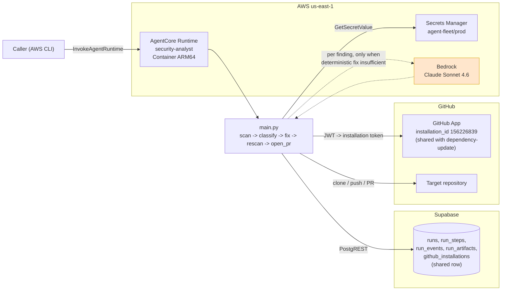
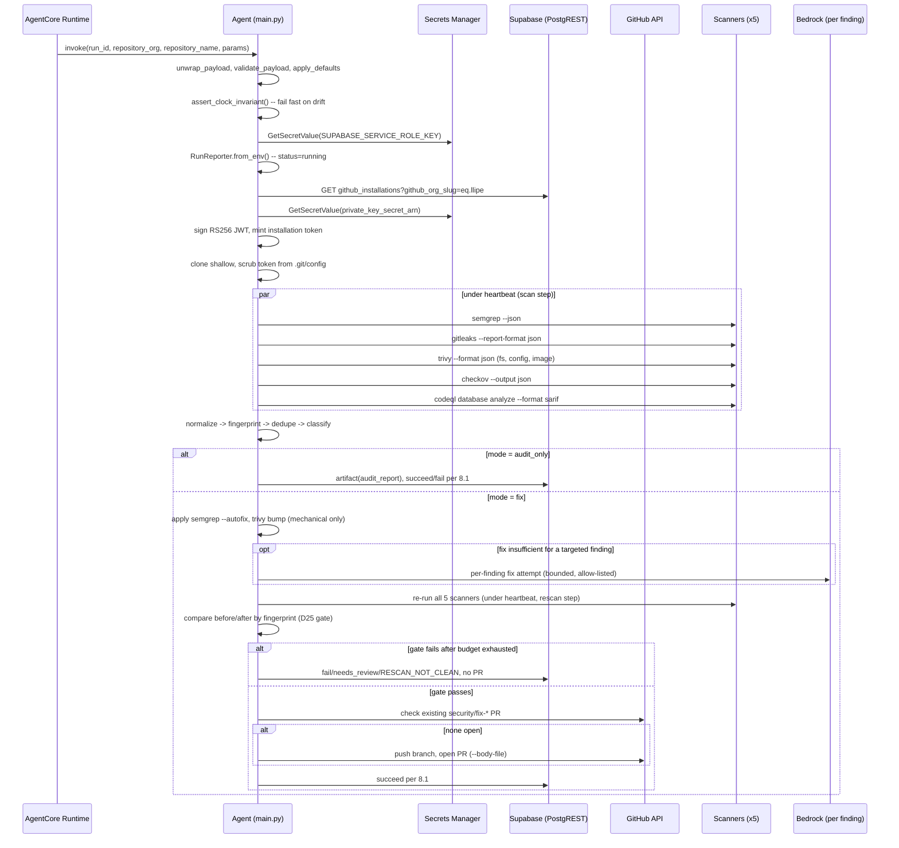
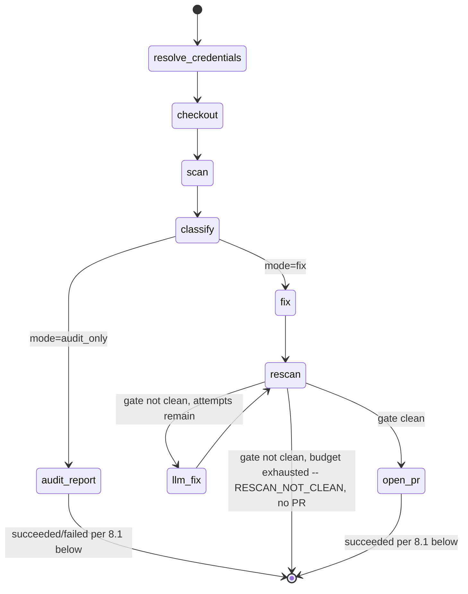

# Technical Specification — Security Analyst Agent

## Changelog

| Version | Date       | Summary                                                                                                                                                                        | Author           |
| ------- | ---------- | -------------------------------------------------------------------------------------------------------------------------------------------------------------------------------- | ---------------- |
| 1.0     | 2026-09-14 | Initial specification, translating [`prd-security-analyst-agent.md`](../docs/requirements/prd-security-analyst-agent.md) into an implementable design, grounded in the actual `agents/dependency-update/` codebase rather than only its PRD. | product-engineer |
| 1.1     | 2026-09-14 | Reflects PRD v1.1's supported-stack decision (§7.4a): CodeQL scoped to `javascript-typescript`/`python` query packs only (§8.5, §15.2 — no compiled-language toolchain in the image), classifier's `_JS_LOCKFILES` set explicitly excludes Python manifests so Python version-bump findings stay mechanical (§8.4). | product-engineer |
| 1.2     | 2026-09-14 | Reflects PRD v1.2's severity normalization (§7.4b/D28-D30) and `min_severity` gate (D31): adds §8.1a implementing the fixed per-tool severity table as pure functions, threads `min_severity` through the invocation contract (§6.1) and seed `params_schema` (§5.2), and rewrites `determine_outcome()` (§8.10) to apply the floor to the status/outcome decision only — scan, fix, and re-scan operate on the full unfiltered finding set throughout, per requirement 63. | product-engineer |

---

## 1. Executive Summary

This spec details a five-tool security scanner agent (`security-analyst`) that reuses `dependency-update`'s proven scaffolding, reporting, credential, PR, and testing conventions near-verbatim, and introduces new design only where the PRD's tool surface genuinely differs: a five-way scanner dispatcher, a cross-tool finding schema with fingerprint-based deduplication, a three-bucket classifier, a re-scan gate that is the agent's core trust mechanism, and a per-finding-scoped LLM escape hatch (narrower in blast radius than the sibling agent's per-run one).

Two corrections against the PRD, both sourced from direct codebase inspection (`workstream/research-security-analyst-agent-spec-inputs-2026-09-14.md`), are folded in throughout this spec rather than left implicit:

1. **Seed file location.** The PRD's requirement 49 cites `docs/reference/002_seed.sql`. That file is a stub — the canonical, applied seed is `supabase/seed.sql`. §5.2 targets the correct file.
2. **Clock invariant precedent.** `dependency-update` already solved the exact class of defect a longer-running, multi-tool agent is most exposed to — silent AgentCore idle-reclamation mid-step (ADR-006, issue #98). §9's timeout design is not new invention; it is `config.assert_clock_invariant()` and `heartbeat.run_with_heartbeat()` recomputed for this agent's five-scanner, higher-`maxLifetime` shape, and every long step (`scan`, `rescan`) is wrapped the same way `validate`/`llm_fix` are in the sibling agent.

---

## 2. Reference Documents

| Document | Role |
| --- | --- |
| [`prd-security-analyst-agent.md`](../docs/requirements/prd-security-analyst-agent.md) | Product requirements this spec implements. Requirement numbers (`req N`) and decisions (`D16`-`D27`) referenced below are this PRD's, not the sibling's, unless explicitly marked "sibling." |
| [`prd-agent-fleet-panel-v2.md`](../docs/requirements/prd-agent-fleet-panel-v2.md) | Parent PRD — control plane, `runs` lifecycle, reaper. Inherited D1-D15. |
| [`prd-dependency-update-agent.md`](../docs/requirements/prd-dependency-update-agent.md) | Sibling agent's PRD — architectural precedent this spec reuses throughout. |
| [`specification-prd-dependency-update-agent.md`](specification-prd-dependency-update-agent.md) | Sibling agent's **spec** — the structural and code-detail template this document follows section-for-section. |
| [`research-security-analyst-agent-spec-inputs-2026-09-14.md`](research-security-analyst-agent-spec-inputs-2026-09-14.md) | Codebase research this spec is grounded in. Every "reuse verbatim" claim below traces to a file:line citation there. |
| [`ADR-006-long-step-keepalive-and-clock-invariant.md`](../docs/adr/ADR-006-long-step-keepalive-and-clock-invariant.md) | The heartbeat/clock-invariant mechanism this agent's §9 extends. |
| [`technical-guidelines.md`](../docs/technical-guidelines.md) | Fleet-wide conventions (data model, integration/timeouts). |

---

## 3. Affected Repositories

Same table as PRD §4. Concretely, this spec touches:

| Path | Change |
| --- | --- |
| `agents/security-analyst/` (new) | Full AgentCore Container project, scaffolded by `agentcore create`, mirroring `agents/dependency-update/`'s layout exactly. |
| `supabase/seed.sql` | New `security-analyst` agent row (Block 3, appended) — **not** `docs/reference/002_seed.sql`, which is a redirect stub. |
| Target repositories (~20, org-wide) | Read via the existing shared `github_installations` row (`llipe`, `installation_id = 156226839`) — **no new GitHub App installation.** Receive branch `security/fix-<timestamp>` + PR in `fix` mode. |

---

## 4. System Architecture

### 4.1 Component diagram



### 4.2 Module decomposition

Following the sibling agent's flat single-responsibility package convention (research S1), `app/securityAnalyst/` is a flat package with no subpackages:

| Module | Concern | Reuse vs. new |
| --- | --- | --- |
| `config.py` | Env constants, `assert_clock_invariant()` | **Reused pattern**, new constants/invariant chain (§9.1) |
| `credentials.py` | GitHub App JWT + installation token, `TokenContext` | **Reused verbatim** (same `github_installations` row) |
| `scrubber.py` | Secret redaction (`scrub`, `scrub_process_error`) | **Reused verbatim, unmodified** |
| `heartbeat.py` | `run_with_heartbeat` long-step keep-alive | **Reused verbatim, unmodified** |
| `signal_backstop.py` | SIGTERM best-effort terminal report | **Reused verbatim, unmodified** |
| `agent_reporter.py` | `RunReporter` SDK | **Reused verbatim** (byte-identical copy, D13/D24) |
| `scanners/` (new subpackage) | One module per tool: `semgrep_runner.py`, `gitleaks_runner.py`, `trivy_runner.py`, `checkov_runner.py`, `codeql_runner.py` | **New** — generalizes `validator.py`'s multi-check pattern (research §8.9), not `audit.py`'s single-command pattern |
| `normalize.py` (new) | Per-tool output → `Finding` schema | **New** |
| `fingerprint.py` (new) | `Finding` → dedup/diff key | **New** |
| `dedupe.py` (new) | Cross-tool merge | **New** |
| `classifier.py` (new, name reused from sibling) | `mechanical` / `manual` / `unscannable` bucketing | **New schema, reused pure-function pattern** |
| `fixers/semgrep_autofix.py` (new) | `semgrep --autofix` application | **New** |
| `fixers/trivy_bump.py` (new) | Version-bump application, eligibility check | **New logic, reuses `eligibility.py`'s semver-parsing pattern** |
| `rescan.py` (new) | Re-run scanners, gate comparison (D25) | **New** |
| `fix_agent.py` | LLM escape hatch | **Reused tool/prompt/safety pattern, new per-finding invocation shape** (research finding 6) |
| `pull_request.py` | Branch, idempotency, push, PR body | **Reused pattern verbatim, new body sections** |
| `main.py` | Orchestration only | **New orchestration, reused shape** (payload unwrap/validate, outcome-mapping, `build_return_payload`/`build_metrics`) |

This is a materially larger module count than the sibling agent (≈24 vs. 18), driven entirely by the five-scanner fan-out and the new finding pipeline (normalize → fingerprint → dedupe → classify) that has no analog in `dependency-update` (research §9, gotcha 9).

### 4.3 Invocation flow



---

## 5. Data Model & Database Design

### 5.1 Entities used

No schema migration. Reuses `runs`, `run_steps`, `run_events`, `run_artifacts`, `github_installations`, `repositories`, `agents` exactly as they exist today (`supabase/seed.sql`, `docs/reference/001_schema.sql`). `RunReporter` writes via raw `urllib.request` PostgREST calls with the sibling agent's retry/backoff and stderr fallback (`agent_reporter.py`, unmodified — research S5).

`run_artifacts.type` values this agent produces: `audit_report` (metadata: findings grouped by `mechanical`/`manual`/`unscannable`, by tool, by severity, plus before/after counts in `fix` mode), `pull_request` (URL, title), `file` (raw per-tool scanner output, for debugging a classification dispute — PRD §9.1).

### 5.2 Seed update (`supabase/seed.sql`)

Appended as a new block after the existing `dependency-update` block (Block 3), following its exact structure and idempotent `on conflict` pattern:

```sql
-- ---------------------------------------------------------------------
-- 4. security-analyst agent
--    runtime_arn set after first `agentcore deploy` (see agents/security-analyst/README.md).
--    max_runtime_seconds (5400) MUST match maxLifetime in agentcore.json (PRD §12.3 --
--    higher than dependency-update's 3600 because 5 scanners + a full rescan pass
--    run sequentially in the worst case).
--    start_timeout_seconds (300) is the queue clock (D9) -- unchanged from the
--    sibling agent, this is not a scanner-runtime concern.
-- ---------------------------------------------------------------------
insert into agents (
  slug, name, description, version,
  runtime_arn, runtime_qualifier,
  requires_repository, max_runtime_seconds, grace_seconds, start_timeout_seconds,
  default_params, params_schema
)
values (
  'security-analyst',
  'Security Analyst',
  'Runs Semgrep, Gitleaks, Trivy, Checkov, and CodeQL against a repository; optionally applies mechanical fixes, re-scans to verify, and opens a PR.',
  '0.1.0',
  'PENDING_FIRST_DEPLOY', -- replace with `agentcore status` output after first deploy
  'DEFAULT',
  true,
  5400,  -- 90 min: MUST equal maxLifetime in agentcore.json
  150,   -- grace_seconds (higher than sibling's 120 -- larger image, more cold-start)
  300,   -- start_timeout_seconds: queue clock (D9), unchanged from sibling
  '{"mode":"audit_only","fail_on_findings":true,"min_severity":"low","max_fix_attempts":3,"scanners":["semgrep","gitleaks","trivy","checkov","codeql"]}'::jsonb,
  $json${
    "type": "object",
    "additionalProperties": false,
    "required": ["mode"],
    "properties": {
      "mode": {
        "type": "string",
        "title": "Mode",
        "description": "audit_only reports findings. fix applies mechanical fixes, re-scans, and opens a PR.",
        "enum": ["audit_only", "fix"],
        "default": "audit_only"
      },
      "fail_on_findings": {
        "type": "boolean",
        "title": "Fail if findings exist",
        "description": "Only applies in audit_only mode.",
        "default": true
      },
      "min_severity": {
        "type": "string",
        "title": "Minimum severity to gate on",
        "description": "Findings below this severity are still scanned, fixed (in fix mode), and reported, but do not affect fail_on_findings or the needs_review/no_findings outcome.",
        "enum": ["low", "medium", "high", "critical"],
        "default": "low"
      },
      "max_fix_attempts": {
        "type": "integer",
        "title": "Max LLM agent attempts per finding",
        "description": "Only applies in fix mode. 0 disables the LLM escape hatch. Range 0..5. Budget applies per finding, not per run.",
        "minimum": 0,
        "maximum": 5,
        "default": 3
      },
      "scanners": {
        "type": "array",
        "title": "Scanners to run",
        "description": "Subset of the 5 supported scanners. Empty or unrecognized values fail INVALID_PARAMS.",
        "items": {
          "type": "string",
          "enum": ["semgrep", "gitleaks", "trivy", "checkov", "codeql"]
        },
        "default": ["semgrep", "gitleaks", "trivy", "checkov", "codeql"],
        "minItems": 1
      }
    }
  }$json$::jsonb
)
on conflict (slug) do update
  set name                  = excluded.name,
      description           = excluded.description,
      version               = excluded.version,
      runtime_arn           = excluded.runtime_arn,
      runtime_qualifier     = excluded.runtime_qualifier,
      requires_repository   = excluded.requires_repository,
      max_runtime_seconds   = excluded.max_runtime_seconds,
      grace_seconds         = excluded.grace_seconds,
      start_timeout_seconds = excluded.start_timeout_seconds,
      default_params        = excluded.default_params,
      params_schema         = excluded.params_schema;
```

No change to the `4. Verification` block — the existing `count(*)` query already covers the new row.

---

## 6. API Design

### 6.1 Invocation payload schema

Identical unwrap/validate contract to the sibling agent (`main.py:74-186` pattern, research S2): tolerant of `prompt`-wrapping up to the same `_MAX_UNWRAP_DEPTH = 16`, `_REQUIRED_FIELDS = {"run_id", "repository_org", "repository_name"}`.

```python
# main.py -- payload contract (mirrors dependency-update's shape exactly)
_REQUIRED_FIELDS = {"run_id", "repository_org", "repository_name"}
_VALID_MODES = {"audit_only", "fix"}
_VALID_SCANNERS = {"semgrep", "gitleaks", "trivy", "checkov", "codeql"}
_VALID_SEVERITIES = {"low", "medium", "high", "critical"}  # PRD SS7.4b / D31

def validate_payload(payload: dict) -> None:
    missing = _REQUIRED_FIELDS - payload.keys()
    if missing:
        raise InvalidParamsError(f"missing required fields: {sorted(missing)}")
    mode = payload.get("params", {}).get("mode", "audit_only")
    if mode not in _VALID_MODES:
        raise InvalidParamsError(f"unknown mode: {mode!r}")
    scanners = set(payload.get("params", {}).get("scanners", sorted(_VALID_SCANNERS)))
    if not scanners or not scanners.issubset(_VALID_SCANNERS):
        raise InvalidParamsError(f"invalid scanners list: {scanners!r}")
    min_severity = payload.get("params", {}).get("min_severity", "low")
    if min_severity not in _VALID_SEVERITIES:
        raise InvalidParamsError(f"unknown min_severity: {min_severity!r}")

def apply_defaults(params: dict) -> dict:
    return {
        "mode": params.get("mode", "audit_only"),
        "fail_on_findings": params.get("fail_on_findings", True),
        "min_severity": params.get("min_severity", "low"),  # req 64 -- additive default
        "max_fix_attempts": max(0, min(5, params.get("max_fix_attempts", 3))),
        "scanners": params.get("scanners", sorted(_VALID_SCANNERS)),
    }
```

Clone URL derivation, no caller-supplied URL — identical to sibling (`req 12`, PRD).

### 6.2 Return payload

Following `main.py:317-345`'s `build_return_payload()` shape:

```python
def build_return_payload(state: PipelineState) -> dict:
    return {
        "status": state.status,
        "outcome": state.outcome,
        "error_code": state.error_code,
        "pr_url": state.pr_url,
        "findings_before": state.findings_before_by_bucket,   # {mechanical: N, manual: N, unscannable: N}
        "findings_after": state.findings_after_by_bucket,      # fix mode only
        "findings_fixed": state.findings_fixed_count,
        "scanners_run": state.scanners_run,
        "scanners_skipped": state.scanners_skipped,
        "scanners_failed": state.scanners_failed,
        "fix_attempts_deterministic": state.fix_attempts_deterministic,
        "fix_attempts_llm": state.fix_attempts_llm,
        "llm_used": state.llm_used,
    }

def build_metrics(state: PipelineState) -> dict:
    # Projected subset written to runs.metrics -- PRD req 47
    return {
        "llm_used": state.llm_used,
        "fix_attempts_deterministic": state.fix_attempts_deterministic,
        "fix_attempts_llm": state.fix_attempts_llm,
        "findings_before": state.findings_before_total,
        "findings_after": state.findings_after_total,
        "findings_fixed": state.findings_fixed_count,
        "scanners_run": state.scanners_run,
        "scanners_skipped": state.scanners_skipped,
        "scanners_failed": state.scanners_failed,
        "step_durations": state.step_durations,
    }
```

---

## 7. Authentication & Authorization Design

### 7.1 Agent → Supabase

Identical to sibling: `SUPABASE_SERVICE_ROLE_KEY` fetched from Secrets Manager at startup, injected into `os.environ` **before** `RunReporter.from_env()` (sibling D24 reused, not renumbered — see PRD §8's namespace note).

### 7.2 Agent → GitHub

**Reuses the exact `credentials.py` module, unmodified**, against the same `github_installations` row (`github_org_slug = 'llipe'`, `installation_id = 156226839`) — no new installation, no new App. `TokenContext.is_stale()` 45-minute re-mint threshold (research S1/finding 3) reused as-is.

### 7.3 Agent → AWS

Same IAM grants as sibling (§12.5 of the PRD): `secretsmanager:GetSecretValue` on `agent-fleet/prod/*`, `bedrock:InvokeModel` on the Claude Sonnet inference profile, CloudWatch Logs write. Per research risk 3, the exact synthesis mechanism (how `agentcore create`/`deploy` turns `agentcore.json` into these IAM statements) was not located in-repo — `cdk-stack.ts` is generic boilerplate with no agent-specific IAM code. This spec asserts the *desired* grants only; verify the synthesis mechanism during implementation rather than assuming CDK code needs to be hand-written.

---

## 8. Business Logic Implementation

### 8.1 Finding schema (`normalize.py`)

```python
@dataclass(frozen=True)
class Finding:
    tool: str                        # semgrep | gitleaks | trivy | checkov | codeql
    rule_id: str
    severity: Severity               # normalized enum: CRITICAL | HIGH | MEDIUM | LOW
    file_path: str                   # repo-relative, normalized separators
    line_start: int
    line_end: int
    message: str                     # redacted per §12 -- never the raw matched secret
    cwe_or_category: str
    remediation: Remediation | None  # None => unscannable candidate
    raw_ref: str                     # pointer into the raw per-tool output artifact, not embedded

@dataclass(frozen=True)
class Remediation:
    kind: str            # "semgrep_autofix" | "version_bump" | "structural" | "none"
    patch: str | None    # unified diff, semgrep-native for autofix
    target_version: str | None   # trivy version-bump remediations
    lockfile_managed: bool       # True => JS/TS package-manager lockfile (D24 boundary)
```

One `normalize_<tool>(raw_output: str) -> list[Finding]` function per scanner module, each a pure function over that tool's native JSON/SARIF shape — mirrors `audit.py`'s single-tool normalize pattern (research S1), generalized to five call sites instead of one.

### 8.1a Severity normalization (`severity.py`, per PRD §7.4b / D28-D30)

One pure function per tool, each called from that tool's `normalize_<tool>()`. A fixed table, not a heuristic — no free-text inspection beyond the named fields:

```python
class Severity(Enum):
    CRITICAL = "critical"
    HIGH = "high"
    MEDIUM = "medium"
    LOW = "low"

_UNKNOWN_SEVERITY_FLOOR = Severity.MEDIUM  # D30 -- shared across all tools' "no signal" case

def severity_from_semgrep(raw_severity: str) -> Severity:
    return {"ERROR": Severity.HIGH, "WARNING": Severity.MEDIUM, "INFO": Severity.LOW}[raw_severity]

def severity_from_gitleaks(_finding: dict) -> Severity:
    return Severity.CRITICAL  # D29 -- unconditional, no per-rule grading

def severity_from_trivy(raw_severity: str) -> Severity:
    mapping = {"CRITICAL": Severity.CRITICAL, "HIGH": Severity.HIGH,
               "MEDIUM": Severity.MEDIUM, "LOW": Severity.LOW}
    return mapping.get(raw_severity, _UNKNOWN_SEVERITY_FLOOR)  # UNKNOWN -> medium

def severity_from_checkov(raw_severity: str | None) -> Severity:
    if raw_severity is None:  # the common OSS case -- no Bridgecrew/custom policy severity
        return _UNKNOWN_SEVERITY_FLOOR
    return {"CRITICAL": Severity.CRITICAL, "HIGH": Severity.HIGH,
            "MEDIUM": Severity.MEDIUM, "LOW": Severity.LOW}[raw_severity]

def severity_from_codeql(security_severity: float | None, level: str | None) -> Severity:
    if security_severity is not None:
        if security_severity >= 9.0: return Severity.CRITICAL
        if security_severity >= 7.0: return Severity.HIGH
        if security_severity >= 4.0: return Severity.MEDIUM
        return Severity.LOW
    if level is not None:
        return {"error": Severity.HIGH, "warning": Severity.MEDIUM, "note": Severity.LOW}.get(
            level, _UNKNOWN_SEVERITY_FLOOR
        )
    return _UNKNOWN_SEVERITY_FLOOR
```

Each function is directly unit-testable against fixture rows (PRD acceptance criterion 12a) without needing a full scanner-output fixture file — pure `str`/`float` in, `Severity` out.

### 8.2 Fingerprinting (`fingerprint.py`)

Per PRD requirement 21 / D18:

```python
_LINE_TOLERANCE_BAND = 3  # lines

def fingerprint(finding: Finding) -> str:
    banded_line = finding.line_start - (finding.line_start % _LINE_TOLERANCE_BAND)
    key = f"{finding.file_path}::{finding.rule_id or finding.cwe_or_category}::{banded_line}"
    return hashlib.sha256(key.encode()).hexdigest()[:16]
```

Deliberately coarser than an exact line match (D18 rationale) — trades a small false-merge risk for a much lower false-new-finding rate under unrelated line-shifting edits. Unit-tested directly against the fingerprint function (PRD acceptance criterion 6), not only end-to-end.

### 8.3 Cross-tool deduplication (`dedupe.py`)

Per requirement 22 / D19 — conservative merge, file+line overlap **and** category match only:

```python
def dedupe(findings: list[Finding]) -> list[MergedFinding]:
    groups: dict[tuple[str, str], list[Finding]] = defaultdict(list)
    for f in findings:
        # group key: (file_path, normalized cwe_or_category) -- never tool alone
        groups[(f.file_path, f.cwe_or_category)].append(f)
    merged = []
    for (_, _), group in groups.items():
        merged.extend(_merge_overlapping_by_line(group))  # line-range overlap check within group
    return merged

@dataclass(frozen=True)
class MergedFinding:
    finding: Finding            # representative record (highest severity wins on conflict)
    reported_by: tuple[str, ...]  # e.g. ("trivy", "checkov") -- both retained, PRD req 22
```

### 8.4 Classifier (`classifier.py`)

Per requirement 23 / D20, and the D24 boundary (requirement 24, narrowed to npm/pnpm only by requirement 54 — Python dependency findings are explicitly **not** covered by this boundary):

```python
# D24 / req 54 -- ONLY these two files route to dependency-update's lane.
# Python manifests (requirements.txt, poetry.lock, Pipfile.lock) are
# deliberately absent: dependency-update has no Python support (its own
# PRD lists pip/uv as deferred), so a Python version-bump finding has
# nothing to collide with and stays MECHANICAL here.
_JS_LOCKFILES = {"package-lock.json", "pnpm-lock.yaml"}

def classify(merged: MergedFinding) -> Bucket:
    f = merged.finding
    if f.remediation is None:
        return Bucket.UNSCANNABLE
    if f.remediation.kind == "semgrep_autofix":
        return Bucket.MECHANICAL
    if f.remediation.kind == "version_bump":
        if f.remediation.lockfile_managed:
            # D24 -- dependency-update's lane, not ours
            return Bucket.MANUAL
        if _is_major_bump(f) and _is_semver(f.remediation.target_version):
            # req 27 -- major bump on a non-lockfile artifact (e.g. container base image tag)
            # stays manual, reason recorded for the PR body
            return Bucket.MANUAL
        return Bucket.MECHANICAL
    return Bucket.MANUAL  # structural remediation, checkov/codeql/gitleaks default
```

`lockfile_managed` is set by `trivy_runner.py`'s normalizer, not inferred here — it inspects Trivy's own target-file field against `_JS_LOCKFILES` only (`requirements.txt`/`poetry.lock`/`Pipfile.lock` targets are `lockfile_managed = False`, so Python findings flow through the `version_bump` branch above unaffected by D24) at parse time, keeping the classifier itself free of scanner-specific parsing (mirrors the sibling agent's `classifier.py` importing `eligibility.parse_semver` rather than re-deriving it — research S7).

### 8.5 Scanner dispatch (`scanners/*.py`, generalizing `validator.py`'s pattern)

Per requirements 15-19. Each scanner module exposes one function with an identical signature shape, following `validator.py`'s `CheckStatus`/multi-check-runner pattern (research finding 9, S1 item 11) rather than `audit.py`'s single-command pattern:

```python
class ScanStatus(Enum):
    PASSED = "passed"    # ran, findings normalized (zero or more)
    SKIPPED = "skipped"  # not applicable to this repo content (req 17)
    FAILED = "failed"    # crashed, timed out, or unparseable output (req 18)

@dataclass(frozen=True)
class ScanResult:
    tool: str
    status: ScanStatus
    findings: list[Finding]
    reason: str | None       # populated for SKIPPED / FAILED

def run_semgrep(workspace: Path, timeout: int) -> ScanResult: ...
def run_gitleaks(workspace: Path, timeout: int) -> ScanResult: ...
def run_trivy(workspace: Path, timeout: int) -> ScanResult: ...
def run_checkov(workspace: Path, timeout: int) -> ScanResult: ...
def run_codeql(workspace: Path, timeout: int) -> ScanResult: ...

_SCANNER_DISPATCH = {
    "semgrep": run_semgrep, "gitleaks": run_gitleaks, "trivy": run_trivy,
    "checkov": run_checkov, "codeql": run_codeql,
}

def run_scanners(workspace: Path, requested: list[str], timeout: int) -> list[ScanResult]:
    results = [_SCANNER_DISPATCH[name](workspace, timeout) for name in requested]
    if all(r.status == ScanStatus.FAILED for r in results):
        raise AllScannersFailedError(results)  # req 18 -- total failure only
    return results
```

Each `run_<tool>` wraps its subprocess call with `scrubber.scrub_process_error()` on failure (reused pattern) and enforces `SCANNER_TIMEOUT` (default 600s, env-tunable per requirement 19) independently per tool — no shared timeout budget across scanners.

CodeQL specifically (`codeql_runner.py`) is a two-phase call: `codeql database create --language=<lang> --build-mode=none` then `codeql database analyze --format sarif-latest`, both under the same per-tool timeout envelope. Per PRD §7.4a, `<lang>` is resolved from a fixed two-entry table — `javascript-typescript` (triggered by any `.js`/`.ts`/`.jsx`/`.tsx`/`package.json` content) and `python` (triggered by any `.py`/`pyproject.toml`/`requirements.txt` content) — with **no third branch**: a repository matching neither is `SKIPPED` (requirement 17/51), and a repository matching both runs CodeQL twice, once per language, with findings from both merged into the same scan pass. Because both packs are interpreted-language extraction, `codeql database create` never requires a compiled build step in v1 (requirement 14) — this is a direct consequence of the stack scoping, not a separate design choice.

**CORRECTED in S-141 (implementation-time finding, not a spec authoring error caught before build):** the original v1.2 spec text described `database create` as never triggering "a compiled build step" and did not include `--build-mode=none` in the command above. That phrasing conflated "no compiled build step is needed to extract from an interpreted language" (still true, and the basis for requirement 14) with `database create`'s own default behavior, which is a separate concern: without an explicit `--build-mode`, the CodeQL CLI still runs each language's **autobuild script** by default (for JS/TS, this includes `npm install` and any detected build script), regardless of whether the language is compiled. Real-repo verification (not exercised until S-141's first live invocation) hit this directly — a repo with no npm registry access failed the whole scan. The shipped `codeql_runner.py`'s `_build_create_command()` now passes `--build-mode=none` explicitly, skipping the build step and extracting straight from `--source-root`; the command line above is corrected to match.

**CORRECTED in S-141 (second implementation-time finding, from the same first live invocation):** the command line above and the "resolved from a fixed two-entry table" wording imply `<lang>` — the internal bucket name `javascript-typescript`/`python` used throughout this spec, `detect_languages()`'s return values, and the `_QUERY_PACKS` dict key — is passed straight through as `--language=<lang>`'s literal value. It is not: `codeql resolve languages` (real CLI, confirmed against the shipped toolchain) has no `javascript-typescript` language, only `javascript` (which extracts both `.js` and `.ts` content; there is no separate `typescript` extractor). Passing the internal name directly was silently accepted by the CLI without error but resolved to no valid language, so `database create` fell back to running the JS autobuild script even with `--build-mode=none` set — the same class of internal-name-vs-external-CLI-identifier bug already found once for the query pack name (see the S-141 correction below). The shipped `codeql_runner.py` now has a `_CLI_LANGUAGE_NAMES` translation dict (`javascript-typescript` -> `javascript`, `python` -> `python`, i.e. a no-op for Python) that `_build_create_command()` looks up before building `--language=`; the internal bucket name itself is unchanged everywhere else (`detect_languages()`, `_QUERY_PACKS`, this spec's two-entry table).

**CLARIFIED in S-141 (third implementation-time finding, from a subsequent live invocation against a real TypeScript repo, `llipe/memo-cli`):** `--build-mode=none` skips a *custom* build command (e.g. `npm run build`/`npm install`), but the JS/TS extractor's own parsing step is unaffected by that flag — it shells out to a real Node.js binary to parse `.ts`/`.tsx` files via the TypeScript compiler API, and fails with "Could not start Node.js. It is required for TypeScript extraction." if none is on `PATH`. This is a container-image dependency (installed at image build time via `apt`, not fetched during a scan run), not a compiled build step and not scan-time network egress, so it does **not** reopen requirement 14 (§7.4a/§8.5's "no compiled build step" claim, scoped to compiled-language toolchains and to requirement 14's own network-egress condition) or requirement 51's "no compiled build step" language — both remain accurate as written. The Dockerfile (§15.2) now installs a Node.js runtime (via NodeSource, pinned major version) immediately after the `codeql pack download` step to satisfy this.

**CORRECTED in S-141 (fourth implementation-time finding, from a subsequent live invocation against `llipe/memo-cli`):** the `database analyze --format sarif-latest` phase above was originally shipped pointing its mandatory `--output` flag at `/dev/stdout` (the same Linux-device-file trick documented for Gitleaks' `--report-path`, §8.5), reading the SARIF back from the subprocess's captured stdout rather than from a file. This does not survive real use: when the calling process's own stdout is a pipe — exactly what `subprocess.run(..., capture_output=True)` gives it, the shape every `run_<tool>()` in this codebase uses — the real CodeQL binary also writes a human-readable one-line post-analysis summary onto that same pipe ahead of the SARIF JSON, breaking `json.loads()` at position 0 every time. This was invisible when the trick was originally verified only via a shell `>`-redirected real file (no such summary line appears in that redirected stream), which is why it passed S-132's original implementation and audit undetected. The shipped `codeql_runner.py` now points `--output` at a real file inside the same per-call temporary directory already used for the CodeQL database and reads the SARIF from that file; `/dev/stdout` is no longer used anywhere in this module. This finding prompted re-checking Gitleaks' own `--report-path /dev/stdout` trick for the same class of bug: it was **also** found affected, though via a distinct and more severe failure mode — no extraneous summary line was observed, but a real, findings-bearing Gitleaks run against a repo with genuine leaks produced **zero captured bytes** on the `/dev/stdout` redirect under pipe-captured stdout (silently downgrading a findings-bearing scan to a false "no leaks" result, rather than corrupting valid JSON with a prefix). `gitleaks_runner.py` received the identical real-file fix in the same S-141 pass; see its module docstring's REVERTED section for the full account. Neither scanner module uses `/dev/stdout` for its output any longer.

**CLARIFIED in S-141 (fifth implementation-time finding, from the first fully clean `audit_only` run against `llipe/memo-cli`):** the `run_scanners()` snippet above shows the dispatcher's only responsibility as the requirement-18 total-failure check, and this section is silent on *which layer* is accountable for §8.1's `Finding.file_path` contract ("repo-relative, normalized separators") — implicitly leaving it to each `normalize_<tool>()`. Every hand-authored test fixture honors the contract, so the mocked-subprocess suite never exposed that the real binaries disagree with each other: Semgrep and Gitleaks, invoked with the absolute workspace path this pipeline passes them, echo that absolute path back (`/tmp/security-analyst-<repo>-<rand>/src/x.ts`), while Trivy, Checkov, and CodeQL report paths relative to the scan root. The persisted `audit_report` artifact from the real run carried the ephemeral `/tmp/...` prefix on its Gitleaks findings. This is not cosmetic: `fingerprint()` (§8.2) and `dedupe()` (§8.3) both key on `file_path`, so a Semgrep and a CodeQL finding on the same line of the same file could never merge across tools (defeating requirement 22), and the temp-directory path would have leaked into fix-mode PR bodies (§8.7 / S-139). Rather than patch five normalizers five ways, the shipped `scanners/__init__.py` now enforces the contract at the single choke point where all five `run_<tool>()` results converge: `run_scanners()` passes each `ScanResult` through a private `_relativize_findings()` that rewrites every finding's `file_path` via a public `relativize_path(file_path, workspace)` helper — an absolute path under `workspace` (matched as given or after `resolve()`, so a symlinked temp root such as macOS's `/tmp` -> `/private/tmp` still matches) becomes workspace-relative; a relative path is POSIX-normalized; an empty path or an absolute path *not* under the workspace (e.g. Trivy `image` mode's image-reference target) is returned unchanged, never raising. The per-tool normalizers are unchanged, and `checkov_runner.py`'s existing leading-`/` strip (its module docstring's "Deviation 2") remains in place and is now a tool-specific pre-step that the dispatcher-level normalization does not depend on. The dispatcher's responsibilities in the snippet above are therefore now two: path relativization of every result, then the total-failure check.

### 8.6 Fix application

**Semgrep autofix (`fixers/semgrep_autofix.py`):**

```python
def apply_semgrep_autofix(workspace: Path, mechanical_findings: list[MergedFinding]) -> FixOutcome:
    # semgrep --autofix --config <ruleset> applies every rule with a native patch
    # in one invocation; the agent does not hand-apply individual patches.
    result = subprocess.run(
        ["semgrep", "--autofix", "--config", RULESET, str(workspace)],
        capture_output=True, timeout=SCANNER_TIMEOUT,
    )
    return FixOutcome(applied_fingerprints=_diff_applied(workspace, mechanical_findings), ...)
```

**Trivy version bump (`fixers/trivy_bump.py`):** applies the lowest version closing the advisory, subject to the major-version guard already enforced at classification time (§8.4) — a finding reaching this function is, by construction, already known eligible.

**LLM escape hatch (`fix_agent.py`) — per-finding invocation, the one genuinely new design point** (research finding 6, PRD D22):

```python
def run_fix_loop_for_finding(
    workspace: Path,
    finding: MergedFinding,        # single finding, NOT the full findings list
    max_attempts: int,
    token_provider: Callable[[], str],
) -> FixAttemptResult:
    """
    Mirrors dependency-update's fix_agent.py tool surface and safety pattern
    (5 tools: shell/read/write/find/grep, workspace-confining _safe_path
    resolver, mandate-check backstop) but is invoked once per targeted
    mechanical finding whose deterministic fixer did not resolve it (req 29),
    never once per run. The agent receives ONLY this finding's record --
    file, line range, rule, message -- never the full findings list (req 31),
    so it cannot structurally decide to touch a manual/unscannable finding.
    """
    agent = Agent(model=MODEL_ID, tools=[shell_tool, read_tool, write_tool, find_tool, grep_tool])
    for attempt in range(1, max_attempts + 1):
        agent.run(_build_finding_prompt(finding))       # single-finding prompt, not full context
        rescan = run_scanners(workspace, [finding.finding.tool], SCANNER_TIMEOUT)
        if fingerprint(finding.finding) not in _fingerprints(rescan):
            return FixAttemptResult(resolved=True, attempts=attempt)
    return FixAttemptResult(resolved=False, attempts=max_attempts)
```

Per-finding budgeting (`max_fix_attempts` applies per finding, not per run — D26/requirement 32): the orchestrator (§8.8) calls this once per LLM-eligible finding, each with its own fresh attempt counter, so one stubborn finding cannot consume the budget that would otherwise fix an easier one (PRD acceptance criterion 17).

System-prompt constraints (`_build_finding_prompt`) forbid touching any file location not named by the finding, widening the fix to unrelated findings, or modifying test files — reuses the sibling agent's prohibition pattern (`req 47` there) narrowed to a single-finding scope (PRD requirement 31).

### 8.7 The re-scan gate (`rescan.py`)

Per requirements 33-37 / D23, D25 — the agent's defining new mechanism, with no analog in the sibling agent:

```python
_ALLOWED_NEW_FINDING_EXCEPTIONS: dict[str, set[str]] = {
    # tool -> set of rule/category patterns permitted as a known transitional
    # artifact of that tool's own remediation flow (req 34) -- enumerated,
    # never inferred.
    "trivy": {"intermediate-patch-advisory"},
}

def rescan_gate(before: list[MergedFinding], after: list[MergedFinding], targeted: set[str]) -> GateResult:
    before_fp = {fingerprint(m.finding) for m in before}
    after_fp = {fingerprint(m.finding) for m in after}

    still_present = targeted & after_fp
    new_fp = after_fp - before_fp
    unexplained_new = {
        fp for fp in new_fp
        if not _matches_allowed_exception(fp, after, _ALLOWED_NEW_FINDING_EXCEPTIONS)
    }

    clean = not still_present and not unexplained_new
    return GateResult(clean=clean, still_present=still_present, unexplained_new=unexplained_new)
```

Invoked from `main.py`'s `rescan` step after fix application; on `clean=False` with attempts remaining, the orchestrator re-invokes `run_fix_loop_for_finding` (§8.6) for exactly the findings named in `still_present`, not the whole run (PRD requirement 35).

### 8.8 Orchestrator (`main.py`)

State machine, mirroring the sibling's `main.py` orchestration-only role (research S1):



`scan` and `rescan` are wrapped in `heartbeat.run_with_heartbeat(...)` (reused verbatim, §9.2) exactly as the sibling agent wraps `validate`/`llm_fix` — CodeQL's database-build phase in particular is the single most likely step to exceed the idle-session bound without it (research finding 5).

### 8.9 PR body builder (`pull_request.py`)

Reuses the sibling's branch naming (`security/fix-<UTC timestamp>`), idempotency check (`gh pr list --head security/fix-*`), ephemeral credential-helper push, and `--body-file` mechanics verbatim (research item 6, S1). New body sections per requirement 42:

```python
def build_pr_body(state: PipelineState) -> str:
    sections = [
        _summary_table(state),                    # always
        _fixed_findings_table(state),              # always
        _remaining_manual_table(state),            # always -- req 42, "no false all-clear"
    ]
    if state.dependency_update_boundary_findings:
        sections.append(_dependency_update_boundary_section(state))   # req 24 callout
    if state.major_version_guard_findings:
        sections.append(_major_version_guard_section(state))          # req 27 callout
    if state.llm_used:
        sections.append(_ai_modification_warning(state))              # req 42, mirrors sibling req 57
    sections.append(_rescan_confirmation_line(state))                 # req 42, new vs. sibling
    return "\n\n".join(sections)
```

### 8.10 State machine — status/outcome mapping

Implements PRD §8.1's table directly as a pure function, following the sibling's `determine_outcome()` pattern. Per PRD requirements 62-64 / D31, `min_severity` filters only the set used for the pass/fail and `needs_review`-vs-`no_findings` decisions (`state.findings` below is already the full, unfiltered set used for scanning/fixing/reporting elsewhere — this function alone applies the floor):

```python
_SEVERITY_ORDER = {"low": 0, "medium": 1, "high": 2, "critical": 3}

def _at_or_above_floor(findings: list[MergedFinding], min_severity: str) -> list[MergedFinding]:
    floor = _SEVERITY_ORDER[min_severity]
    return [f for f in findings if _SEVERITY_ORDER[f.finding.severity.value] >= floor]

def determine_outcome(state: PipelineState) -> tuple[str, str, str | None, bool]:
    """Returns (status, outcome, error_code, pr_opened). state.findings/etc. are the FULL,
    unfiltered sets -- min_severity is applied here only, never upstream (req 63)."""
    if state.existing_pr_url:
        return "succeeded", "not_applicable", None, False

    gated_findings = _at_or_above_floor(state.findings, state.min_severity)

    if state.mode == "audit_only":
        if not gated_findings:
            return "succeeded", "no_findings", None, False
        if not state.fail_on_findings:
            return "succeeded", "needs_review", None, False
        return "failed", "needs_review", "AUDIT_FINDINGS", False

    # mode == fix -- min_severity never affects WHICH findings get fixed (req 63);
    # it only affects the outcome label when nothing was mechanically fixable.
    if not state.mechanical_findings:
        gated_remainder = _at_or_above_floor(state.manual_or_unscannable_findings, state.min_severity)
        outcome = "needs_review" if gated_remainder else "no_findings"
        return "succeeded", outcome, None, False
    if not state.rescan_gate_result.clean:
        return "failed", "needs_review", "RESCAN_NOT_CLEAN", False
    outcome = "fixed" if not state.manual_or_unscannable_findings else "partial"
    return "succeeded", outcome, None, True
```

Unlike the sibling agent's `MAJOR_UPDATE_REQUIRED` combination (PR opened, then run still fails), **this agent has no such combination** — D23 means a `fix`-mode run either produces a re-scan-verified PR or no PR at all (PRD §8.1 note).

---

## 9. Integration Details

### 9.1 Supabase PostgREST

Reused verbatim — `agent_reporter.py` unmodified copy, `HTTP_RETRIES=3`, exponential backoff, 4xx-except-429 short-circuit, stderr/CloudWatch fallback (research S5). `pyproject.toml`'s ruff/mypy path-exclusion for this file is reused unchanged (research finding 8) — do not re-derive the suppression.

### 9.2 Clock invariant and heartbeat (extends ADR-006)

`security-analyst` inherits ADR-006's mechanism wholesale — the heartbeat generator and `assert_clock_invariant()` fail-fast — but must recompute the invariant chain for its own, higher bounds (PRD §12.3):

```python
# config.py -- security-analyst's clock invariant, mirroring config.py:69-134
# in dependency-update but with this agent's own constants (ADR-006 pattern,
# not ADR-006's exact numbers).
SCANNER_TIMEOUT = int(os.environ.get("SCANNER_TIMEOUT", "600"))
FIX_COMMAND_TIMEOUT = int(os.environ.get("FIX_COMMAND_TIMEOUT", "180"))  # per LLM shell call
IDLE_SESSION_TIMEOUT = int(os.environ.get("IDLE_SESSION_TIMEOUT", "900"))
MAX_LIFETIME = int(os.environ.get("MAX_LIFETIME", "5400"))               # PRD 12.3
REAPER_THRESHOLD_SECONDS = MAX_LIFETIME + 120  # grace_seconds, per supabase/seed.sql
HEARTBEAT_INTERVAL = int(os.environ.get("HEARTBEAT_INTERVAL", "120"))

def assert_clock_invariant() -> None:
    # FIX_COMMAND_TIMEOUT <= SCANNER_TIMEOUT <= IDLE_SESSION_TIMEOUT
    #                     <= MAX_LIFETIME <= REAPER_THRESHOLD_SECONDS
    # and 0 < HEARTBEAT_INTERVAL <= IDLE_SESSION_TIMEOUT / 2
    if not (FIX_COMMAND_TIMEOUT <= SCANNER_TIMEOUT <= IDLE_SESSION_TIMEOUT
            <= MAX_LIFETIME <= REAPER_THRESHOLD_SECONDS):
        raise ClockConsistencyError(...)
    if not (0 < HEARTBEAT_INTERVAL <= IDLE_SESSION_TIMEOUT / 2):
        raise ClockConsistencyError(...)
```

Called unconditionally at entrypoint start, exactly as `main.py:507` does in the sibling agent. A unit test asserts the shipped constants satisfy the invariant, per ADR-006's own precedent (`test_clock_invariant.py` pattern).

`scan` and `rescan` steps run under `heartbeat.run_with_heartbeat(...)` (reused, unmodified `heartbeat.py`) — each of the five scanner subprocess calls inside those steps is a candidate for exceeding `IDLE_SESSION_TIMEOUT` individually (CodeQL database builds especially), so the heartbeat wraps the whole multi-scanner step, not each scanner call separately, matching how the sibling agent wraps the whole `validate` step rather than each individual check.

### 9.3 AWS Secrets Manager

Unchanged from sibling — same vault, same secret ID pattern, same startup-injection sequencing (D24, sibling namespace, reused by reference).

### 9.4 GitHub API

Unchanged credential mechanism (§7.2). PR mechanics via `gh` CLI, identical flags to sibling (`pull_request.py` reused pattern).

### 9.5 Bedrock (Claude Sonnet)

Same model ID, same `MODEL_ID` env override, same Strands `Agent` framework — invocation granularity is the only difference (§8.6).

---

## 10. User Interface & Client Behavior

None. No-UI agent, identical to sibling (PRD §11, research S3 confirms no frontend code exists for `dependency-update` either). The PR body (§8.9) and the audit-report artifact are the only human-facing surfaces.

---

## 11. Performance & Scalability Approach

- Five scanners run **sequentially** within the `scan` step in v1 (PRD §18 OQ6 leaves parallelization as an open question pending resource-contention analysis inside a single AgentCore Container). `run_scanners()` (§8.5) is written as a simple loop, not a thread pool, to keep v1's resource envelope predictable and debuggable.
- `SCANNER_TIMEOUT` bounds each tool independently (§8.5) so one slow tool cannot silently consume the whole step's share of `MAX_LIFETIME`.
- CodeQL's database-build phase is the dominant cost driver for repositories with compiled-language content; §12.2 flags ARM64 CLI availability as a verification item, not a performance one, but both should be checked together during implementation against this fleet's actual repositories.
- One invocation targets one repository (PRD assumption, unchanged) — no fan-out concern in this agent's own runtime.

---

## 12. Security Implementation

Implements PRD §17 directly. Two implementation-level additions beyond what the PRD states in prose:

**Finding-message redaction (R14, PRD §9.3, acceptance criterion 27).** `normalize.py`'s per-tool functions **MUST NOT** copy a Gitleaks match's raw secret value into `Finding.message` — only the rule ID, file, and line. A generic redaction pass (not Gitleaks-specific) additionally runs over every finding's `message` field before it reaches `run_events`, the artifact, or the PR body, scanning for high-entropy substrings matching the *other* tools' own secret-adjacent findings (research risk R14's cross-cutting concern) using the same `scrubber.py` redaction utility already proven for credential scrubbing — reused, not reinvented, for a different class of sensitive string.

**Fix-agent tool confinement (§8.6).** `_safe_path` workspace-root resolver reused verbatim from `fix_agent.py` (research item 5) — every path-taking tool call is resolved against the workspace root and refused if it escapes, unit-tested directly (PRD acceptance criterion 20), not only through prompting.

**Mandate-violation-equivalent check.** Because this agent's LLM invocation is scoped to a single finding rather than a whole dependency update, there is no `package.json`-range-widening check to port. The equivalent enforcement is the re-scan gate itself (§8.7) plus a narrower check: after an LLM fix attempt, the diff **MUST** touch only the file path named in the finding record — a post-hoc comparison analogous to the sibling agent's mandate check (`req 50` there), implemented in `fix_agent.py` as `_assert_diff_confined_to(finding.file_path)`, raising `MandateViolationError` → the finding is reported as unresolved (falls through to `RESCAN_NOT_CLEAN` handling) rather than the run being trusted.

---

## 13. Error Handling & Logging

### 13.1 Error codes

| `error_code` | Trigger |
| --- | --- |
| `INVALID_PARAMS` | Payload validation failure (§6.1) |
| `NO_INSTALLATION` | No matching `github_installations` row (shared row missing/disabled) |
| `ALL_SCANNERS_FAILED` | Every requested scanner crashed/timed out/unparseable (§8.5) |
| `RESCAN_NOT_CLEAN` | Re-scan gate failed after attempt budget exhausted (§8.7) |
| `CLONE_FAILED` / `GITHUB_AUTH_FAILED` | Checkout/credential failure, same semantics as sibling |
| exception class name | Unhandled exception, caught by `RunReporter.__exit__` |

### 13.2 Logging strategy

Reuses `RunReporter`'s structured `run_events` logging (`.info`/`.warn`/`.error`/`.debug`), buffered per inherited D5 (flush every 50 events or 2 seconds, forced at step boundaries). Per-scanner skip/fail events emitted at `warn`/`error` respectively (requirements 17-18). `SIGNAL_TERMINATION` path via `signal_backstop.py`, reused unmodified.

---

## 14. Testing Strategy

### 14.1 Layer mapping

Per `/TESTING.md`'s contract, mirroring the sibling agent's `unit`/`component` split (research S4) — no new test layer introduced.

### 14.2 Unit test requirements (Layer 1 — no I/O, no network)

- `fingerprint.py` — stability under line-shift, fixed rule/category (PRD AC6).
- `dedupe.py` — merge on overlap+category match; no-merge on distinct category (AC7, AC8).
- `classifier.py` — all three buckets, including the D24 boundary and the major-version guard (AC9-AC12).
- `severity.py` — all five tools' mapping tables, including both unknown-severity-floor paths (Trivy `UNKNOWN`, Checkov's absent field) and CodeQL's dual `security-severity`/`level` fallback (AC12a).
- `determine_outcome()`'s `min_severity` gating — parametrized over the full status/outcome table (§8.1) crossed with a floor above and below the findings present, plus the fix-mode fixed-regardless-of-floor case (AC12b).
- `rescan.py` gate — clean/not-clean under all four combinations of still-present/new-finding, plus the allow-list exception path (AC14, AC15).
- `fix_agent.py`'s `_safe_path` and `_assert_diff_confined_to` — direct unit tests, not prompt-dependent (AC19, AC20, mirrors sibling's `test_safe_path.py`/`test_mandate_check.py` pattern).
- `config.assert_clock_invariant()` — shipped constants satisfy the chain (mirrors sibling's `test_clock_invariant.py`).
- `determine_outcome()` — full §8.1 table as parametrized cases.

Fixture corpus (new, per PRD §16): raw scanner output JSON/SARIF for each of the five tools, both a clean case and a findings-bearing case, under `tests/fixtures/` — mirrors the sibling's `audit_npm_clean.json`/`audit_npm_vulns.json` pattern (research S4), generalized to five tools.

### 14.3 Component test requirements (Layer 2 — mocked external services)

- `patch("fix_agent.Agent")` — same mocking convention as the sibling (`tests/component/test_fix_agent.py:76`, research finding 7) — verify zero-Bedrock-call at `max_fix_attempts=0`, per-finding budget respected (AC17), and the diff-confinement check fires on a mutated fixture rather than by attempting to prompt the model into misbehaving (mirrors sibling AC23's stated verification approach).
- `test_pipeline.py`-equivalent — full `scan → classify → fix → rescan → open_pr` path with all five scanner subprocess calls mocked (fixture JSON as stdout).
- `test_pr_creation.py`-equivalent — idempotency check, branch naming, `--body-file` invocation.

### 14.4 Fixture repositories (E2E, manual)

Per PRD §16 — a repository seeded so a re-scan deliberately does not clear a targeted finding (AC14), and one seeded so a fix introduces a new finding (AC15). Both are new fixture repos; no reuse from the sibling agent's fixture set, which is JS/TS-audit-specific.

### 14.5 Commands

Mirrors the sibling's Makefile targets exactly (research S6):

```
make install        # pip install -e .[dev]
make lint            # ruff check
make format-check    # ruff format --check
make typecheck       # mypy
make test-unit        # pytest tests/unit -m unit
make test-component   # pytest tests/component -m component
make test-cov          # pytest --cov
make audit             # pip-audit (agent's own Python deps)
make validate           # aggregate, fail-fast: lint -> format-check -> typecheck -> test-cov -> audit
```

---

## 15. Deployment & Rollout

### 15.1 Scaffolding (one-time)

```bash
cd agents/
agentcore create security-analyst --build Container --entrypoint main.py \
  --code-location app/securityAnalyst/ --protocol HTTP
```

Generated layout mirrors `agents/dependency-update/` exactly (`agentcore/`, `app/securityAnalyst/`, `README.md`) — per PRD requirement 2, the CLI owns this layout, not hand-authoring.

### 15.2 Dockerfile

Extends the sibling agent's ARM64/ECR-Public-mirror pattern (research item 16 — Docker Hub 429 workaround, CA-cert build arg) with the five scanner toolchains. Per PRD §7.4a, the image ships **only two CodeQL query packs** — no JDK, Go toolchain, or C/C++ compiler is installed, since neither `javascript-typescript` nor `python` requires a compiled build step. This does not mean the image is dependency-free, though: the `javascript-typescript` extractor still needs a real Node.js runtime on `PATH` to parse `.ts`/`.tsx` content (see the third S-141 correction in §8.5), so a Node.js install step ships alongside the CodeQL CLI below — a runtime dependency, not a compiled build step, so requirement 14 is unaffected:

```dockerfile
# Stage 1: Python base (same ECR Public mirror pattern as dependency-update)
FROM public.ecr.aws/docker/library/python:3.13-slim AS base
# ... CA cert build arg, same as sibling

# Scanner toolchains
RUN pip install semgrep checkov
RUN curl -sSfL https://raw.githubusercontent.com/gitleaks/gitleaks/master/install.sh | sh
RUN curl -sSfL https://raw.githubusercontent.com/aquasecurity/trivy/main/contrib/install.sh | sh

# CodeQL CLI -- verify ARM64 build availability at the pinned version (PRD OQ5).
# Only 2 query packs, per PRD SS7.4a -- no compiled-language packs (Java, Go,
# C/C++, etc.) ship in v1, keeping this stage far smaller than a general-purpose
# CodeQL install would be.
RUN curl -sSfL <codeql-cli-arm64-url> -o codeql.tar.gz && tar xzf codeql.tar.gz
RUN codeql pack download codeql/javascript-typescript-queries codeql/python-queries

# Node.js runtime -- required by the JS/TS extractor to parse .ts/.tsx
# content via the TypeScript compiler API; --build-mode=none only skips a
# *custom* build command, not this extraction-time dependency (S-141).
RUN curl -fsSL <nodesource-setup-script-url> | bash - && apt-get install -y nodejs

# git + gh CLI (same as sibling)
# Python deps (agent's own pyproject.toml, includes semgrep/checkov rulesets pinned per req 52)
# Agent code
```

**Blocking verification, per PRD §18 OQ5 and research risk 2:** confirm the CodeQL CLI ships an ARM64 Linux build at the version pinned here before this Dockerfile is finalized — AgentCore Runtime is ARM64-only (no x86_64 fallback), and this has historically lagged the x86_64 release.

**CORRECTED in S-141 (implementation-time finding, not a spec authoring error caught before build):** `codeql/javascript-typescript-queries` in the snippet above is not a real published package — confirmed via `gh api orgs/codeql/packages`. The actual GHCR package name is `codeql/javascript-queries` (JS and TS share one combined query pack; there was never a separate "javascript-typescript" package). This snippet is left as originally written for historical accuracy of the spec's design intent at v1.2; the shipped `Dockerfile` and `scanners/codeql_runner.py`'s `_QUERY_PACKS` dict use the corrected name.

### 15.3 Deploy

```bash
agentcore deploy -y
agentcore status   # record runtime_arn in supabase/seed.sql, NOT docs/reference/002_seed.sql
```

### 15.4 Infrastructure prerequisites (manual, one-time)

All shared with `dependency-update` — no new prerequisite:

| Prerequisite | Status |
| --- | --- |
| `github_installations` row | Already exists (`llipe`) |
| `SUPABASE_SERVICE_ROLE_KEY` secret | Already exists |
| Bedrock Claude Sonnet access, `us-east-1` | Already exists |
| CDK bootstrapped | Already true |

### 15.5 Rollback

Same as sibling: `agentcore deploy` a prior image tag, or delete the runtime via `agentcore delete` and revert the `runtime_arn` in `supabase/seed.sql`. No data migration to reverse (no schema change).

---

## 16. Dependencies & Risks

### 16.1 Python dependencies (`pyproject.toml`)

New beyond the sibling agent's set: `semgrep`, `checkov` (both pip-installable Python packages, run as subprocesses — not imported as libraries, matching `updater.py`'s subprocess-wrapper pattern rather than an in-process API). Gitleaks, Trivy, and the CodeQL CLI are Go/native binaries invoked via subprocess only, no Python package. `strands-agents` and the Bedrock/boto3 stack reused unchanged from the sibling.

### 16.2 Risk register (new + inherited)

Full register is PRD §17 (R8-R14). Implementation-relevant highlights not already covered above:

- **R9's residual gap** (a fix that dodges the fingerprint match without genuinely resolving the finding) has no code-level mitigation beyond the system prompt in v1 — flagged in the PRD as OQ7, not solved here. Implementation should log every LLM-touched finding's before/after diff to the `file` artifact type so a human can audit this specific failure mode post-hoc even though it isn't mechanically caught.
- **CDK IAM synthesis is unverified** (research risk 3) — implementation must confirm during the first `agentcore deploy` that the execution role actually receives the two non-default grants (§7.3), rather than assuming the sibling agent's working deployment proves the mechanism generalizes.

---

## 17. Open Questions

Carried from PRD §18 without new answers (this spec does not resolve product-level open questions):

- OQ1 (diff-only scanning), OQ2 (re-alert-forever, tied to the sibling PRD's own open OQ2), OQ3 (SARIF upload), OQ4 (expanding the mechanical set), OQ6 (parallel scanner execution).

New, implementation-level open questions from this spec:

1. **CodeQL ARM64 availability (blocks §15.2)** — must be resolved before the Dockerfile can be finalized, not merely noted as a risk.
2. **Exact IAM-grant synthesis mechanism (§7.3, §16.2)** — needs verification against a real `agentcore deploy`, since the sibling agent's CDK stack provided no evidence either way.
3. **Should the generic redaction pass (§12) be a new `scrubber.py` function or a new module?** Reusing `scrub()` as-is may not be shaped for scanning arbitrary finding messages for entropy; this should be resolved during implementation rather than presumed here.
