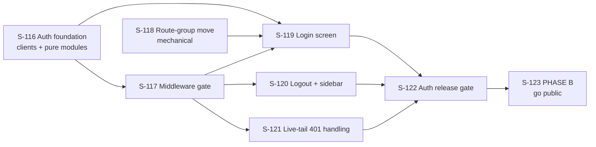

# User Stories — Panel Password Authentication

## Changelog

| Version | Date       | Summary | Author |
| ------- | ---------- | ------- | ------ |
| 1.0     | 2026-09-09 | Initial version. Eight stories (S-116 … S-123) decomposing [`specification-panel-password-auth.md`](specification-panel-password-auth.md), sequenced so Phase A (auth shipped + verified while private) fully precedes Phase B (public exposure). Includes coverage validation against PRD FR1–FR15 / AC1–AC17. | product-engineer |

---

## Source Documents

- PRD: [`docs/requirements/prd-panel-password-auth.md`](../docs/requirements/prd-panel-password-auth.md) (v1.4)
- Specification: [`specification-panel-password-auth.md`](specification-panel-password-auth.md) (v1.1)
- Design contract: [`DESIGN.md`](../DESIGN.md)
- Technical guidelines: [`docs/technical-guidelines.md`](../docs/technical-guidelines.md)

Story IDs continue the panel sequence (existing stories run S-101 … S-115).

## Execution Plan

**Phase A (private, all of S-116 … S-122):** the panel gains a working, verified auth gate while remaining unreachable from the internet.
**Phase B (S-123 only):** public exposure, as an isolated final story. S-123 MUST NOT be merged in the same PR as any Phase A story.

| Story | Title | Priority | Size | Phase |
| ----- | ----- | -------- | ---- | ----- |
| S-116 | Auth client foundation and pure policy modules | Critical | M | A |
| S-117 | Middleware auth gate (the chokepoint) | Critical | M | A |
| S-118 | Route-group restructure for an unshelled login route | High | S | A |
| S-119 | Login screen and sign-in action | Critical | M | A |
| S-120 | Logout route and sidebar Log out affordance | High | S | A |
| S-121 | Live-tail 401 handling (stop infinite reconnect) | High | S | A |
| S-122 | Auth release gate replacing the privacy gate | Critical | M | A |
| S-123 | Go public (Phase B) | Critical | S | B |

---

## Story S-116: Auth client foundation and pure policy modules

**Priority:** Critical
**Estimated Size:** M
**Dependencies:** None (first story)

### User Story

As the panel operator,
I want the panel to have a session-capable Supabase client layer separate from its data client,
So that user login can be built without weakening the service-role data boundary.

### Context

The panel's only Supabase client today is `lib/supabase/server.ts` — service-role, RLS-bypassing, sessions explicitly disabled (D15/D16). Password auth needs a *different* kind of client: anon-key, cookie-backed. This story adds that second client family plus the pure decision logic every later story depends on. No user-visible change ships here, which is deliberate: the security-relevant pure functions (route classification, redirect sanitization, error mapping) get built and exhaustively unit-tested before anything depends on them.

### Acceptance Criteria

- [ ] `@supabase/ssr` is added to `panel/package.json` at a pinned version, re-confirmed current and audit-clean before pinning; `pnpm run audit` stays green at `--audit-level=high`.
- [ ] `lib/supabase/auth-server.ts` exports a cookie-backed server client factory using the anon key, carrying `import "server-only"`.
- [ ] `lib/supabase/browser.ts` exports a browser client factory using the anon key only (no service-role reference).
- [ ] `lib/supabase/auth-env.ts` validates `NEXT_PUBLIC_SUPABASE_URL` and `NEXT_PUBLIC_SUPABASE_ANON_KEY`, throwing a named `AuthConfigError` on missing/blank/malformed values.
- [ ] `lib/auth/route-policy.ts` exports a pure `classifyRoute(pathname)` returning `"public" | "ui" | "api"`, defaulting unknown paths to `"ui"` (fail-closed).
- [ ] `lib/auth/redirect.ts` exports a pure, total `safeRedirectTarget(raw)` that never throws and only ever returns a same-origin relative path.
- [ ] `lib/auth/errors.ts` maps auth failures to the spec §8.2 table; unknown-email and wrong-password produce an identical user-facing message.
- [ ] `lib/supabase/server.ts` is byte-unchanged.
- [ ] `pnpm run validate` passes.

### Business Rules

- **SA1 (spec §4.1):** authentication logic MUST NOT use the service-role client; data queries MUST NOT use the auth clients.
- No `NEXT_PUBLIC_` variable may ever expose the service-role key.
- RLS stays deny-all (D11) — authenticating a user grants no row access.
- Anti-enumeration: unknown email and wrong password are indistinguishable to the client.

### Technical Notes

- Follow the `readSupabaseEnv` fail-fast pattern already in `lib/supabase/server.ts` for `auth-env.ts`.
- `safeRedirectTarget` mirrors the posture of `isSafeArtifactUrl` (S-109): total, never-throwing security guard.
- `classifyRoute` must be pure so the 302-vs-401 split is unit-testable without a server (spec §7.2 requirement 3).
- Do **not** wire middleware in this story — S-117 owns that.

### Testing Requirements

- **Unit Tests:**
  - `tests/unit/auth-route-policy.test.ts` — `/login`→public; `/`, `/agents/x`, `/runs/y`→ui; `/api/**`→api; `/api/auth/logout`→api; unknown→ui (fail-closed).
  - `tests/unit/auth-redirect.test.ts` — rejects `//evil.com`, `https://evil.com`, `http://x`, `javascript:alert(1)`, `/\evil`, newline/control chars, `/login` (loop), empty/null/undefined → all `/`; preserves valid path + query + hash.
  - `tests/unit/auth-errors.test.ts` — unknown-email and wrong-password map to the identical message; no raw Supabase text leaks.
  - `tests/unit/auth-env.test.ts` — missing, blank, and malformed URL each throw `AuthConfigError` with a named message.
- **Integration Tests:** none required in this story (no runtime wiring yet).
- **Manual/UI Testing:** none (no user-visible change). Verify `pnpm run build` succeeds.
- **Edge-Case Matrix:** empty string, whitespace-only, `undefined`, unicode/percent-encoded redirect payloads, extremely long path, path with encoded `%2F%2F`.
- **Acceptance-Criteria Mapping:** AC→`auth-env.test.ts`; route policy AC→`auth-route-policy.test.ts`; redirect AC→`auth-redirect.test.ts`; error AC→`auth-errors.test.ts`; unchanged-server AC→`git diff --exit-code panel/lib/supabase/server.ts`.
- **Execution Commands:** `pnpm run test:unit`, `pnpm run typecheck`, `pnpm run validate`.

### Migration Requirements

**Documented opt-out.** No schema or data-model change: auth state lives in Supabase's platform-managed `auth.*` schema and browser cookies (spec §5). The canonical migration and `supabase/seed.sql` are untouched. No migration artifact, rollback note, apply step, or seed data is required.

### Implementation Steps

1. Confirm the current `@supabase/ssr` version is audit-clean, then pin it in `panel/package.json`; run `pnpm install`.
2. Add `lib/supabase/auth-env.ts` with `AuthConfigError` and validation.
3. Add `lib/supabase/auth-server.ts` (cookie-backed, `server-only`) and `lib/supabase/browser.ts`.
4. Add `lib/auth/route-policy.ts`, `lib/auth/redirect.ts`, `lib/auth/errors.ts` as pure modules.
5. Write the four unit suites.
6. Document the new env vars in `panel/README.md` and `.env.local` guidance.
7. Run `pnpm run validate`.

### Files to Create/Modify

- `panel/package.json` — add pinned `@supabase/ssr`
- `panel/lib/supabase/auth-env.ts` — env validation + `AuthConfigError`
- `panel/lib/supabase/auth-server.ts` — cookie-backed anon server client
- `panel/lib/supabase/browser.ts` — anon browser client
- `panel/lib/auth/route-policy.ts` — pure route classification
- `panel/lib/auth/redirect.ts` — pure `safeRedirectTarget`
- `panel/lib/auth/errors.ts` — auth error taxonomy
- `panel/tests/unit/auth-{route-policy,redirect,errors,env}.test.ts` — unit suites
- `panel/README.md` — env var documentation

### Definition of Done Checklist

- [ ] Code implemented per technical guidelines
- [ ] Unit/integration/manual/edge-case tests written and passing
- [ ] Quality gates passing (`lint`, `format:check`, `typecheck`, `test`, `audit`)
- [ ] Code reviewed and approved
- [ ] Acceptance criteria verified
- [ ] Acceptance criteria explicitly mapped to test evidence
- [ ] Migration opt-out documented
- [ ] Pull Request created and merged

---

## Story S-117: Middleware auth gate (the chokepoint)

**Priority:** Critical
**Estimated Size:** M
**Dependencies:** S-116

### User Story

As the panel operator,
I want every unauthenticated request to the panel denied at a single enforcement point,
So that no page, API route, or stream can be reached without a valid session.

### Context

This is the story that actually makes the panel private-by-login. Next.js Server Components cannot write cookies, so token refresh must live in middleware — and putting the authorization decision in the same place means one code path covers pages, route handlers, and the SSE stream, so a future route cannot forget to add a check. The two subtle failure modes this story must avoid are (a) using `getSession()` for authorization, which is spoofable, and (b) discarding the refreshed-cookie response, which causes intermittent random logouts.

### Acceptance Criteria

- [ ] `panel/middleware.ts` exists with a matcher excluding `_next/static`, `_next/image`, favicon, and image assets.
- [ ] An unauthenticated request to a UI route returns `302` to `/login?redirect=<encoded original path>`. *(PRD AC1)*
- [ ] An unauthenticated request to `/api/**`, including the SSE stream path, returns `401` with a JSON body and `content-type: application/json` — never an HTML redirect. *(PRD AC2)*
- [ ] Authorization uses `getClaims()`; no authorization path calls `getSession()`. *(PRD AC8)*
- [ ] An authenticated request passes through and the response preserves refreshed auth cookies. *(PRD AC7)*
- [ ] Any error from the auth call is treated as unauthenticated (fail-closed).
- [ ] A session past the 12-hour inactivity window is denied (302 for UI, 401 for API). *(PRD AC14)*
- [ ] `pnpm run validate` passes.

### Business Rules

- Fail-closed: unknown route class → `ui` (redirect); unexpected error → unauthenticated.
- `getSession()` MUST NOT drive authorization (its user object is not re-validated against the Auth server).
- The middleware MUST return the cookie-handler's response object so refreshed tokens reach the browser.

### Technical Notes

- Middleware must accept an injectable client factory so it is testable without live Supabase — same dependency-injection posture as `lib/sse/relay.ts` (S-110).
- 12h inactivity is a Supabase project setting, not panel code; the testable surface is the *consequence* — assert denial with an expired/invalid cookie rather than waiting 12 hours.
- Do not add per-route checks; the gate is centralized by design.

### Testing Requirements

- **Unit Tests:** `tests/unit/auth-no-getsession.test.ts` — grep guard proving no authorization path calls `getSession()`.
- **Integration Tests (Layer 2, injected fake client):** `tests/component/middleware-gate.test.ts` — no session + UI → 302 with correct `redirect` param; no session + `/api/...` → 401 JSON; valid session → pass-through with cookies preserved; auth error → treated unauthenticated; expired session → denied.
- **Manual/UI Testing:** with the dev server running and no session, visit `/` → lands on `/login?redirect=%2F`; `curl -i localhost:3000/api/runs/<uuid>/events/stream` → `401` JSON.
- **Edge-Case Matrix:** deeply nested path; path with query string and hash; `/api` exactly; static asset request (must not be gated); concurrent requests sharing a near-expiry token (refresh must not thrash); malformed/garbage cookie.
- **Acceptance-Criteria Mapping:** AC1→`middleware-gate` 302 case + E2E in S-119; AC2→`middleware-gate` 401 case; AC7→cookie-preservation case; AC8→`auth-no-getsession`; AC14→expired-session case.
- **Execution Commands:** `pnpm run test:unit`, `pnpm run test`, `pnpm run validate`.

### Migration Requirements

**Documented opt-out** — no schema or data-model change (see S-116).

### Implementation Steps

1. Add `middleware.ts` with the matcher from spec §7.2.
2. Implement `createMiddlewareClient(request)` threading a single response object for cookie writes.
3. Call `classifyRoute`; short-circuit `public`.
4. Verify identity with `getClaims()`; branch to 302 or 401 per policy.
5. Return the cookie-handler response on success.
6. Write the component gate suite with an injected fake client + the `getSession` grep guard.
7. Manually verify both denial paths; run `pnpm run validate`.

### Files to Create/Modify

- `panel/middleware.ts` — the gate
- `panel/lib/supabase/auth-middleware.ts` — request/response cookie-threading client factory
- `panel/tests/component/middleware-gate.test.ts` — gate behavior
- `panel/tests/unit/auth-no-getsession.test.ts` — AC8 guard

### Definition of Done Checklist

- [ ] Code implemented per technical guidelines
- [ ] Unit/integration/manual/edge-case tests written and passing
- [ ] Quality gates passing (`lint`, `format:check`, `typecheck`, `test`, `audit`)
- [ ] Code reviewed and approved
- [ ] Acceptance criteria verified
- [ ] Acceptance criteria explicitly mapped to test evidence
- [ ] Migration opt-out documented
- [ ] Pull Request created and merged

---

## Story S-118: Route-group restructure for an unshelled login route

**Priority:** High
**Estimated Size:** S
**Dependencies:** None (can run in parallel with S-116/S-117)

### User Story

As a developer,
I want authenticated routes grouped under a layout that owns the app shell,
So that the login page can render without the sidebar and top bar.

### Context

`app/layout.tsx` currently wraps **every** child in `AppShell`. The login screen must render outside it (no sidebar, no top bar). The idiomatic App Router fix is a route group: move authenticated routes into `app/(panel)/` and put `AppShell` in `app/(panel)/layout.tsx`. Route-group parentheses do not appear in URLs, so **every existing path stays identical** — which is exactly why the existing E2E suite is the regression proof. This is deliberately a separate, mechanical story: mixing a large file move with new auth behavior would make a regression hard to attribute.

### Acceptance Criteria

- [ ] `app/page.tsx`, `app/agents/**`, `app/runs/**`, `app/dev/**` are relocated under `app/(panel)/` with content otherwise unchanged.
- [ ] `app/(panel)/layout.tsx` renders `AppShell`; the root `app/layout.tsx` renders only `<html>`/`<body>`, fonts, and global styles.
- [ ] Every existing URL resolves exactly as before (`/`, `/agents/[slug]`, `/runs/[id]`, `/api/...`).
- [ ] Inline route-segment config (`dynamic`/`revalidate`/`fetchCache`) is preserved verbatim in each moved page.
- [ ] The SD2 ESLint rule still applies to the moved tree (the `app/**` glob and its server-entrypoint exclusions still behave).
- [ ] The full existing test suite and E2E suite pass **unmodified** except for import-path updates.
- [ ] `pnpm run build` succeeds and `pnpm run validate` passes.

### Business Rules

- No behavior change. This story is a pure restructure; any behavioral difference is a defect.
- Route-segment config must remain **inline** per the §12 convention (Next.js ignores re-exported segment config).

### Technical Notes

- Rejected alternative: conditionally rendering `AppShell` in the root layout by pathname — a server layout cannot read the pathname reliably, and it would force a client wrapper, reintroducing the hydration concern the S-106 contract deliberately avoids.
- Keep `AppShell`'s props/behavior unchanged; S-120 adds the Log out item.
- Watch for `@/` alias imports and relative CSS-module imports in moved files.

### Testing Requirements

- **Unit Tests:** existing suites pass; update import paths only.
- **Integration Tests:** existing Layer 2.5 suites unchanged and passing.
- **Manual/UI Testing:** visit `/`, an agent run-history page, and a run detail page — all render identically with the shell intact.
- **Edge-Case Matrix:** the dev gallery still 404s in production; the SSE route still streams; `not-found` behavior for an unknown run id is unchanged.
- **Acceptance-Criteria Mapping:** URL-parity AC→existing E2E suite (`pnpm run test:e2e`) passing unmodified; build AC→`pnpm run build`; lint-scope AC→`tests/unit/eslint-server-import.test.ts`.
- **Execution Commands:** `pnpm run build`, `pnpm run test`, `pnpm run test:e2e`, `pnpm run validate`.

### Migration Requirements

**Documented opt-out** — no schema or data-model change.

### Implementation Steps

1. Create `app/(panel)/` and move `page.tsx`, `agents/`, `runs/`, `dev/` into it (keep `app/api/` where it is).
2. Create `app/(panel)/layout.tsx` rendering `AppShell`.
3. Strip `AppShell` from the root `app/layout.tsx`, keeping fonts, metadata, and global CSS imports.
4. Fix import paths and any relative imports broken by the move.
5. Run the full suite plus E2E; confirm zero behavioral diffs.
6. Run `pnpm run build` and `pnpm run validate`.

### Files to Create/Modify

- `panel/app/layout.tsx` — no longer wraps `AppShell`
- `panel/app/(panel)/layout.tsx` — new authenticated layout with `AppShell`
- `panel/app/(panel)/page.tsx`, `panel/app/(panel)/agents/**`, `panel/app/(panel)/runs/**`, `panel/app/(panel)/dev/**` — relocated
- test files — import-path updates only

### Definition of Done Checklist

- [ ] Code implemented per technical guidelines
- [ ] Unit/integration/manual/edge-case tests written and passing
- [ ] Quality gates passing (`lint`, `format:check`, `typecheck`, `test`, `audit`)
- [ ] Code reviewed and approved
- [ ] Acceptance criteria verified
- [ ] Acceptance criteria explicitly mapped to test evidence
- [ ] Migration opt-out documented
- [ ] Pull Request created and merged

---

## Story S-119: Login screen and sign-in action

**Priority:** Critical
**Estimated Size:** M
**Dependencies:** S-116, S-117, S-118

### User Story

As the panel operator,
I want to sign in with my email and password on a Nocturne-styled login page,
So that I can access the panel after being redirected by the auth gate.

### Context

This is the user-facing half of authentication and the only new screen in the feature. It implements the approved mockup exactly: brand mark, "Sign in" heading, invitation-only subtitle, EMAIL/PASSWORD fields with a SHOW toggle, a full-width outlined button, a footer row with a dead "Forgot password?" link and a region tag, and the session-expiry fine print. The security-critical parts are the generic credential error (no user enumeration) and redirect sanitization.

### Acceptance Criteria

- [ ] `/login` renders publicly, outside `AppShell`, matching the mockup element list in spec §10.1. *(PRD AC10)*
- [ ] Submitting valid credentials sets an HttpOnly session cookie and redirects to the sanitized `redirect` target, or `/` when absent. *(PRD AC3)*
- [ ] An absolute or off-origin `redirect` value lands on `/` instead. *(PRD AC4)*
- [ ] Invalid credentials show the generic "Invalid email or password." in a `role="alert"` region; the password is not echoed; the button returns to enabled. *(PRD AC5)*
- [ ] Unknown email and wrong password are indistinguishable in the response. *(PRD AC5)*
- [ ] The SHOW toggle reveals and re-masks the password, is keyboard-operable, and reports `aria-pressed`; the field defaults to masked. *(PRD AC13)*
- [ ] "Forgot password?" is not activatable — a styled non-link with `aria-disabled`, not `<a href="#">`. *(PRD AC16)*
- [ ] An already-authenticated visit to `/login` redirects to `/`.
- [ ] Fields are label-associated, the form is semantic, and focus rings are visible.
- [ ] CSS Modules use tokens only; the `token-discipline` test passes.
- [ ] `pnpm run validate` passes.

### Business Rules

- No signup, no password reset, no email confirmation, no magic link.
- Login errors are generic — never reveal whether an email exists.
- Authoritative validation is server-side; client `required`/`type="email"` are hints only.
- Passwords are forwarded to Supabase over HTTPS and never stored, logged, or echoed.

### Technical Notes

- Server component `app/login/page.tsx` + `"use server"` action in `app/login/actions.ts`; client `LoginForm` for interactivity.
- Route-segment config declared **inline** (`force-dynamic`, `revalidate=0`, `fetchCache="force-no-store"`) — an auth response carrying a refreshed `Set-Cookie` must never be cached.
- Use `useFormStatus` for the pending/disabled state to prevent double submit.
- No Zod — the project uses `ajv`; a two-field form does not justify a new dependency.
- Reuse `Input`, `Button`, `KLabel` primitives; reuse the `Sidebar` brand markup pattern for the mark + wordmark.

### Testing Requirements

- **Unit Tests:** sign-in action logic — missing fields → `AUTH_MISSING_FIELDS`; service error → `AUTH_SERVICE_UNAVAILABLE`; redirect sanitization is applied before use.
- **Integration Tests (Layer 2.5, Docker-gated):** `tests/integration/auth-login.test.ts` — seed a user via the admin API against the local stack; `signInWithPassword` succeeds and sets cookies; wrong password fails; cookie round-trips and verifies via `getClaims`.
- **Component Tests:** `tests/component/LoginForm.test.tsx` — mockup elements present; labels associated; SHOW toggle behavior + `aria-pressed`; `role="alert"` error region; button disabled while pending; "Forgot password?" not activatable.
- **Manual/UI Testing:** visit `/login`, compare against the mockup; sign in with a real seeded user; confirm redirect; try a bad password; toggle SHOW; tab through for focus rings.
- **Edge-Case Matrix:** empty submit; email with surrounding whitespace; very long password; double-click submit (must not double-post); `redirect=/login` (must not loop); `redirect=//evil.com`; already-signed-in visit; Supabase unreachable.
- **Acceptance-Criteria Mapping:** AC3→`auth-login` integration + E2E; AC4→`auth-redirect` unit + E2E; AC5→`LoginForm` + action unit; AC10→`LoginForm` component; AC13→`LoginForm` toggle; AC16→`LoginForm` dead-link assertion.
- **Execution Commands:** `pnpm run test`, `pnpm run test:integration`, `pnpm run test:e2e`, `pnpm run validate`.

### Migration Requirements

**Documented opt-out** — no schema or data-model change. Operator user accounts are created in the Supabase dashboard, not by a seed script (E2E provisions its own test user in `global-setup.ts`).

### Implementation Steps

1. Add `app/login/page.tsx` (public, inline route config, redirects when already authenticated) and `app/login/layout.tsx` if needed to bypass the shell.
2. Add `app/login/actions.ts` with the `signIn` server action: validate, sanitize redirect, `signInWithPassword`, map errors.
3. Add `components/auth/LoginForm.tsx` + `PasswordField.tsx` with token-only CSS Modules.
4. Add E2E scenarios: unauthenticated redirect, valid login, tampered redirect, invalid credentials, SHOW toggle.
5. Add the Layer 2.5 login integration suite and component suite.
6. Compare rendered screen against the mockup; run `pnpm run validate`.

### Files to Create/Modify

- `panel/app/login/page.tsx`, `panel/app/login/layout.tsx`, `panel/app/login/login.module.css` — the screen
- `panel/app/login/actions.ts` — sign-in server action
- `panel/components/auth/LoginForm.tsx` + `.module.css` — form
- `panel/components/auth/PasswordField.tsx` + `.module.css` — SHOW toggle
- `panel/tests/component/LoginForm.test.tsx` — component suite
- `panel/tests/integration/auth-login.test.ts` — Layer 2.5
- `panel/tests/e2e/auth.spec.ts` — E2E scenarios
- `panel/tests/e2e/global-setup.ts` — provision the test operator user
- `DESIGN.md` — add the login screen to the screen specifications (changelog row required)

### Definition of Done Checklist

- [ ] Code implemented per technical guidelines
- [ ] Unit/integration/manual/edge-case tests written and passing
- [ ] Quality gates passing (`lint`, `format:check`, `typecheck`, `test`, `audit`)
- [ ] Code reviewed and approved
- [ ] Acceptance criteria verified
- [ ] Acceptance criteria explicitly mapped to test evidence
- [ ] Migration opt-out documented
- [ ] `DESIGN.md` updated with the login screen spec
- [ ] Pull Request created and merged

---

## Story S-120: Logout route and sidebar Log out affordance

**Priority:** High
**Estimated Size:** S
**Dependencies:** S-117, S-118 (S-119 recommended first for end-to-end manual verification)

### User Story

As the panel operator,
I want a Log out control in the sidebar,
So that I can end my session on a shared or public machine.

### Context

Completes the session lifecycle. Per the sidebar mockup, Log out sits in the footer below "System health" and above "Collapse". It must be a POST — a GET logout link is CSRF-triggerable and can be fired by a prefetcher or link scanner, logging the operator out unexpectedly.

### Acceptance Criteria

- [ ] `POST /api/auth/logout` calls `signOut`, clears session cookies, and redirects to `/login`. *(PRD AC6)*
- [ ] `GET /api/auth/logout` does not exist as a route.
- [ ] Logout is idempotent — invoking it without a session still redirects to `/login` without error.
- [ ] After logout, revisiting a protected route redirects to `/login`. *(PRD AC6)*
- [ ] The sidebar footer shows a **Log out** item below "System health" and above "Collapse", with a power-style Phosphor icon. *(PRD AC15)*
- [ ] The item renders icon-only when the sidebar is collapsed. *(PRD AC15)*
- [ ] The item is absent when unauthenticated. *(PRD AC15)*
- [ ] `AppShell`/`Sidebar` remain presentational — they do not call Supabase (SD2 preserved).
- [ ] `pnpm run validate` passes.

### Business Rules

- Logout MUST be POST-only (CSRF).
- The shell must not perform auth I/O; authentication state is passed in as a prop.
- Styling reuses the existing footer-control pattern; token-only CSS.

### Technical Notes

- Implement as a plain `<form method="post" action="/api/auth/logout">` so logout works without JS and needs no client handler.
- Add `LogOutIcon` to `components/icons.tsx` mapped to Phosphor `Power`, imported from `@phosphor-icons/react/ssr` per the §10 convention.
- Style the submit button with the existing `.toggle` grid pattern in `Sidebar.module.css` (icon + label, icon-only when collapsed).
- Declare route-segment config inline in the logout route.

### Testing Requirements

- **Unit Tests:** route handler — clears cookies and issues a `302` to `/login`; no-session case still redirects.
- **Integration Tests:** covered by the E2E logout scenario; no Layer 2.5 suite required.
- **Component Tests:** `tests/component/LogOutItem.test.tsx` — POST form with the correct action; ordering after System health and before Collapse; icon-only when collapsed; absent when unauthenticated.
- **Manual/UI Testing:** sign in, confirm Log out appears in the sidebar footer, click it, land on `/login`, then confirm `/` redirects back to `/login`. Collapse the sidebar and confirm icon-only rendering.
- **Edge-Case Matrix:** logout with an already-expired session; double-submit; logout while the sidebar is collapsed; keyboard activation; `GET` to the logout path (must not log out).
- **Acceptance-Criteria Mapping:** AC6→logout route unit + E2E logout scenario; AC15→`LogOutItem` component tests + manual check.
- **Execution Commands:** `pnpm run test`, `pnpm run test:e2e`, `pnpm run validate`.

### Migration Requirements

**Documented opt-out** — no schema or data-model change.

### Implementation Steps

1. Add `app/api/auth/logout/route.ts` exporting only `POST`, with inline route config.
2. Add `LogOutIcon` to `components/icons.tsx`.
3. Add `components/shell/LogOutItem.tsx` + CSS Module using the footer-control pattern.
4. Render it in `Sidebar.tsx` between System health and Collapse, gated on an `authenticated` prop threaded from the authenticated layout.
5. Add the component suite and the E2E logout scenario.
6. Manually verify both expanded and collapsed states; run `pnpm run validate`.

### Files to Create/Modify

- `panel/app/api/auth/logout/route.ts` — POST-only logout
- `panel/components/shell/LogOutItem.tsx` + `.module.css` — footer item
- `panel/components/shell/Sidebar.tsx` — render the item
- `panel/components/shell/AppShell.tsx` — thread the `authenticated` prop
- `panel/components/icons.tsx` — add `LogOutIcon`
- `panel/tests/component/LogOutItem.test.tsx` — component suite
- `panel/tests/e2e/auth.spec.ts` — logout scenario
- `DESIGN.md` — sidebar footer Log out item (changelog row required)

### Definition of Done Checklist

- [ ] Code implemented per technical guidelines
- [ ] Unit/integration/manual/edge-case tests written and passing
- [ ] Quality gates passing (`lint`, `format:check`, `typecheck`, `test`, `audit`)
- [ ] Code reviewed and approved
- [ ] Acceptance criteria verified
- [ ] Acceptance criteria explicitly mapped to test evidence
- [ ] Migration opt-out documented
- [ ] `DESIGN.md` updated with the sidebar Log out item
- [ ] Pull Request created and merged

---

## Story S-121: Live-tail 401 handling (stop infinite reconnect)

**Priority:** High
**Estimated Size:** S
**Dependencies:** S-117

### User Story

As the panel operator,
I want the live log tail to stop cleanly when my session expires,
So that an expired session does not hammer the server with reconnect attempts or look like a broken product.

### Context

A direct consequence of gating the SSE route. `useRunStream` currently reconnects on an unexpected drop — correct behavior for a network blip, but against a `401` it becomes an infinite reconnect loop against a soon-to-be-public endpoint. `EventSource` cannot send headers, so the stream authenticates by cookie and a denied connection surfaces as `onerror` with the stream never having opened. That "never opened" signal is what distinguishes auth failure from a recoverable drop.

### Acceptance Criteria

- [ ] `useRunStream` tracks whether `onopen` fired for the current attempt.
- [ ] An `onerror` with `readyState === CLOSED` and no successful open is treated as **terminal** — no reconnect. *(PRD AC2 consequence)*
- [ ] A genuine mid-stream drop (stream had opened) still reconnects with the highest rendered `seq`, preserving existing S-110 behavior.
- [ ] The UI surfaces a session-expired notice rather than silently freezing.
- [ ] No line is lost or duplicated on a legitimate reconnect (existing `seq` dedupe intact).
- [ ] `pnpm run validate` passes.

### Business Rules

- Never retry indefinitely against an authorization failure.
- A stopped tail must be visible to the operator — a silently frozen log reads as a product bug.
- Terminal runs keep using the server-rendered `LogViewer`; only the live path changes.

### Technical Notes

- Resolves spec OQ3: the gate returns a plain `401` before the stream opens rather than a `closed{reason:"unauthorized"}` frame, because emitting a frame requires opening a `200 text/event-stream` response, and the browser would then treat the close as a droppable connection and reconnect.
- Keep the change inside `lib/hooks/useRunStream.ts` and the live viewer; do not alter `lib/sse/relay.ts` sequencing.
- Reuse existing Nocturne tokens for the notice; no new component library.

### Testing Requirements

- **Unit Tests:** `tests/unit/use-run-stream-auth.test.ts` — errored-before-open → no reconnect scheduled; opened-then-dropped → reconnect with correct `after_seq`; repeated failures do not accumulate timers.
- **Integration Tests:** existing Layer 2.5 `stream-e2e` suite continues to pass (authenticated path unchanged).
- **Component Tests:** `LiveLogViewer` shows the session-expired notice when the hook reports a terminal auth stop.
- **Manual/UI Testing:** open a run detail page with a live run, clear the session cookie in devtools, observe the tail stop once with a notice and no reconnect storm in the network panel.
- **Edge-Case Matrix:** 401 on the very first connection; 401 on a reconnect after a successful period; rapid open/close flapping; run reaching terminal state simultaneously with a 401.
- **Acceptance-Criteria Mapping:** no-reconnect AC→`use-run-stream-auth` unit; reconnect-preserved AC→same suite + existing `stream-e2e`; notice AC→component test + manual check.
- **Execution Commands:** `pnpm run test:unit`, `pnpm run test`, `pnpm run test:integration`, `pnpm run validate`.

### Migration Requirements

**Documented opt-out** — no schema or data-model change.

### Implementation Steps

1. Add open-tracking state to `useRunStream`.
2. Branch `onerror`: never-opened → terminal stop; previously-opened → existing reconnect path.
3. Expose a terminal-auth-stop state from the hook.
4. Render a session-expired notice in `LiveLogViewer`.
5. Add the unit suite and the component assertion.
6. Manually verify with a cleared cookie; run `pnpm run validate`.

### Files to Create/Modify

- `panel/lib/hooks/useRunStream.ts` — open-tracking + terminal auth stop
- `panel/components/run-detail/LiveLogViewer.tsx` — session-expired notice
- `panel/tests/unit/use-run-stream-auth.test.ts` — unit suite
- `panel/tests/component/LiveLogViewer.test.tsx` — notice assertion

### Definition of Done Checklist

- [ ] Code implemented per technical guidelines
- [ ] Unit/integration/manual/edge-case tests written and passing
- [ ] Quality gates passing (`lint`, `format:check`, `typecheck`, `test`, `audit`)
- [ ] Code reviewed and approved
- [ ] Acceptance criteria verified
- [ ] Acceptance criteria explicitly mapped to test evidence
- [ ] Migration opt-out documented
- [ ] Pull Request created and merged

---

## Story S-122: Auth release gate replacing the privacy gate

**Priority:** Critical
**Estimated Size:** M
**Dependencies:** S-119, S-120, S-121

### User Story

As the panel operator,
I want an automated release gate that proves the auth boundary actually holds,
So that the panel can never be exposed publicly without a working login and with self-registration open.

### Context

Today `scripts/verify-fly-private.sh` **fails the release if the app is public** — the mechanized form of the decision this feature reverses (SR2/D16). Deleting it would leave no mechanical check at all, so it must be *replaced*, not removed. The replacement asserts the new boundary by observation: unauthenticated requests are actually denied on the deployed app, and public signups are actually rejected. The signup check matters most — "remember to turn signups off in the dashboard" is exactly the out-of-band config that drifts silently, and the failure mode is anyone on the internet self-registering into a panel that can invoke agents against your repositories.

This story ships the gate and the still-private `fly.toml`; it does **not** make the app public.

### Acceptance Criteria

- [ ] `panel/scripts/panel-auth-check.mjs` is a pure, unit-tested parser deciding the gate verdict from inputs (no I/O), mirroring the existing `fly-privacy-check.mjs` split.
- [ ] `scripts/verify-panel-auth.sh` supplies live inputs and exits non-zero on any failure.
- [ ] The gate asserts the auth env var **names** are present on the app (never their values).
- [ ] The gate asserts an unauthenticated request to a protected UI path returns `302` to `/login`, not `200`.
- [ ] The gate asserts an unauthenticated request to the SSE path returns `401`, not `200`.
- [ ] The gate asserts an attempted `signUp` is **rejected**; a successful signup fails the release. *(PRD AC17)*
- [ ] The gate is **fail-closed**: unreadable/unparseable input or any unconfirmable check → non-zero exit.
- [ ] Both gate directions are demonstrated: fixtures prove it passes on a correct deployment and fails on each violation (200-on-protected-path, 200-on-SSE, successful signup, missing env).
- [ ] The old privacy gate is removed and its unit tests are re-pointed to the new parser.
- [ ] `fly.toml` remains **private** in this story (no public service, no public IP).
- [ ] CI runs the parser unit tests and `shellcheck` on the new wrapper.
- [ ] `pnpm run validate` passes.

### Business Rules

- The gate replaces, never merely deletes, the SR2 privacy gate.
- Fail-closed by construction — anything not positively confirmed is a failure.
- The signup check must use a clearly-marked disposable address and delete any account it somehow creates.
- Never log secret values; presence-of-name checks only.

### Technical Notes

- Follow the `fly-privacy-check.mjs` architecture exactly: pure parser + shell wrapper, so the suite can *observe* the gate failing on a violation fixture.
- Checks are run against a hostname argument so the same gate works over the private network (Phase A) and publicly (Phase B).
- Keep the runbook's Phase A/Phase B ordering authoritative; this story adds the tooling Phase A step 4/5 depends on.

### Testing Requirements

- **Unit Tests:** `tests/unit/panel-auth-check.test.ts` — passing fixture; failing fixtures for `200` on a protected path, `200` on SSE, successful signup, missing env name, malformed/garbage input; fail-closed default.
- **Integration Tests:** CLI exit-code smoke — the wrapper exits `0` on a passing fixture set and non-zero on each failing one.
- **Manual/UI Testing:** run `scripts/verify-panel-auth.sh` against the local dev server with and without a session; confirm verdicts.
- **Edge-Case Matrix:** redirect to a non-`/login` location (must fail); `401` with an HTML body; network timeout; Supabase returning an unexpected signup error shape; empty output.
- **Acceptance-Criteria Mapping:** each gate check AC→its named fixture case in `panel-auth-check.test.ts`; AC17→the successful-signup-fails-the-release fixture; both-directions AC→documented RED-then-reverted evidence in `workstream/`.
- **Execution Commands:** `pnpm run test:unit`, `bash scripts/verify-panel-auth.sh <host>`, `pnpm run validate`.

### Migration Requirements

**Documented opt-out** — no schema or data-model change.

### Implementation Steps

1. Write `panel/scripts/panel-auth-check.mjs` (pure verdict logic + CLI entry).
2. Write `scripts/verify-panel-auth.sh` collecting live inputs (HTTP probes, `fly secrets list` names, signup attempt).
3. Add the parser unit suite with pass and per-violation fail fixtures.
4. Remove `scripts/verify-fly-private.sh` + `panel/scripts/fly-privacy-check.mjs`; re-point their tests.
5. Update CI: parser tests + `shellcheck` on the new wrapper.
6. Record RED-then-reverted evidence for both gate directions.
7. Update `docs/runbooks/panel-deployment.md` with the Phase A/B procedure, the Supabase config checklist, and rollback.
8. Run `pnpm run validate`.

### Files to Create/Modify

- `panel/scripts/panel-auth-check.mjs` — pure gate parser
- `scripts/verify-panel-auth.sh` — live wrapper
- `scripts/verify-fly-private.sh`, `panel/scripts/fly-privacy-check.mjs` — removed
- `panel/tests/unit/panel-auth-check.test.ts` — gate tests (replacing the privacy-parser tests)
- `.github/workflows/ci.yml` — parser test + `shellcheck` steps
- `panel/fly.toml` — comment banner updated (still private in this story)
- `docs/runbooks/panel-deployment.md` — Phase A/B procedure
- `docs/technical-guidelines.md` — §5/§6/§13/§18 write-back (changelog row required)

### Definition of Done Checklist

- [ ] Code implemented per technical guidelines
- [ ] Unit/integration/manual/edge-case tests written and passing
- [ ] Quality gates passing (`lint`, `format:check`, `typecheck`, `test`, `audit`)
- [ ] Code reviewed and approved
- [ ] Acceptance criteria verified
- [ ] Acceptance criteria explicitly mapped to test evidence
- [ ] Migration opt-out documented
- [ ] Both gate directions demonstrated (RED then reverted)
- [ ] `technical-guidelines.md` updated (D16 reversed, SR2 replaced, R1 resolved)
- [ ] Pull Request created and merged

---

## Story S-123: Go public (Phase B)

**Priority:** Critical
**Estimated Size:** S
**Dependencies:** S-116 … S-122 all merged, deployed, and verified while private

### User Story

As the panel operator,
I want the panel reachable over the public internet behind the login gate,
So that I can use and live-test it without a private network tunnel.

### Context

The final, deliberately isolated step. Everything before this ships and is verified with the app still unreachable from the internet; this story only flips exposure. Keeping it separate means a public app never exists without an already-proven gate — the exposure window is removed structurally rather than managed by careful sequencing. Containment is one command (`fly ips release`), which is why isolating it is cheap.

**This story MUST NOT be merged in the same PR as any Phase A story.**

### Acceptance Criteria

- [ ] Supabase project confirmed: Email provider on, **public signups off**, 12h inactivity timeout, operator user exists.
- [ ] Phase A verification evidence recorded: over the private network, unauthenticated UI → `302 /login`, unauthenticated SSE → `401`, login and logout both work.
- [ ] `scripts/verify-panel-auth.sh` passes against the **private** deployment before any exposure change.
- [ ] `panel/fly.toml` adds a public HTTPS service; the SR2 banner is rewritten to state that login — not network privacy — is now the boundary. *(PRD AC11)*
- [ ] A public IP is allocated and the app is reachable over HTTPS.
- [ ] `scripts/verify-panel-auth.sh` passes against the **public** hostname, including the signup-rejected check. *(PRD AC17)*
- [ ] A signed-in live test succeeds: dashboard, run history, run detail, live tail.
- [ ] An unauthenticated public request to `/` redirects to `/login`; to the SSE path returns `401`.
- [ ] Rollback is documented and tested-in-principle: `fly ips release <addr>` returns the app to private.
- [ ] Evidence is recorded in the deployment runbook with no secret material.

### Business Rules

- Phase A MUST be complete, deployed, and verified before this story begins.
- If any gate check fails after exposure, containment (`fly ips release`) happens immediately, before diagnosis.
- A successful `signUp` is a hard blocker — do not proceed while self-registration is open.
- No feature flag may disable the auth gate.

### Technical Notes

- Operator-gated: this story involves real, hard-to-reverse cloud actions and requires explicit user execution and confirmation.
- `fly ips release` is faster containment than a redeploy — prefer it.
- Rolling back the image restores the pre-auth panel exactly, since auth is additive to the data path.
- OQ2 (spec): decide `NEXT_PUBLIC_SUPABASE_ANON_KEY` via `fly.toml [env]` (recommended — publishable by design) vs `fly secrets`.

### Testing Requirements

- **Unit Tests:** none new (gate logic covered in S-122).
- **Integration Tests:** none new.
- **Manual/UI Testing:** the full signed-in walkthrough over the public hostname; the unauthenticated denial checks; sign out and confirm re-gating.
- **Edge-Case Matrix:** unauthenticated access to every route class publicly; expired session on a public URL; direct SSE URL access without a session; a wrong-password attempt from a public client.
- **Acceptance-Criteria Mapping:** AC11→`fly.toml` diff + live reachability check; AC17→public `verify-panel-auth.sh` run; denial ACs→recorded `curl -i` output in the runbook.
- **Execution Commands:** `fly deploy -a dt-agent-fleet-panel --config panel/fly.toml`, `bash scripts/verify-panel-auth.sh <public-host>`, `fly ips release <addr>` (rollback).

### Migration Requirements

**Documented opt-out** — no schema or data-model change. The only "apply" step is infrastructure exposure, which carries its own explicit user-confirmation gate below.

- Apply step: allocating the public IP / enabling the public service **requires explicit user confirmation** before execution.
- Rollback/impact notes: `fly ips release <addr>` restores private-only reachability; documented in the runbook.
- Verification after apply: the public `verify-panel-auth.sh` run plus the signed-in walkthrough.

### Implementation Steps

1. Confirm the Supabase checklist (provider, **signups off**, 12h inactivity, operator user).
2. Deploy Phase A code with secrets set; app still private.
3. Verify over the private network (`fly proxy`): denial paths, login, logout; run the gate against the private host.
4. **Request explicit user confirmation to expose the app.**
5. Update `fly.toml` with the public service; deploy; allocate the public IP.
6. Run the gate against the public hostname, including the signup-rejected check.
7. Perform the signed-in live test; record evidence in the runbook.
8. If anything fails, run `fly ips release` immediately, then diagnose.

### Files to Create/Modify

- `panel/fly.toml` — public HTTPS service; SR2 banner rewritten
- `docs/runbooks/panel-deployment.md` — Phase B execution log, evidence, rollback
- `docs/technical-guidelines.md` — §13 deployment state: panel is deployed and public (changelog row required)
- `docs/product-context.md` — §9 constraint "no authentication in v1" resolved (changelog row required)

### Definition of Done Checklist

- [ ] Phase A complete, deployed, and verified private
- [ ] Supabase signups confirmed disabled (gate-verified)
- [ ] Explicit user confirmation obtained before exposure
- [ ] Public gate run passing
- [ ] Signed-in live test successful
- [ ] Rollback documented
- [ ] Evidence recorded in the runbook with no secret material
- [ ] `technical-guidelines.md` and `product-context.md` updated
- [ ] Pull Request created and merged (separate from all Phase A stories)

---

## Coverage Validation

### Summary

- **Total PRD Requirements:** 47 (15 functional requirements, 17 acceptance criteria, 4 business rules, 6 user stories, 5 non-goals)
- **Total User Stories:** 8 (S-116 … S-123)
- **Coverage:** 100%
- **Status:** Complete — no gaps

### Functional Requirement Mapping

| PRD Requirement | Story ID(s) | Status |
| --------------- | ----------- | ------ |
| FR1 — `@supabase/ssr` dependency | S-116 | ✅ Covered |
| FR2 — Browser + server auth clients | S-116 | ✅ Covered |
| FR3 — Middleware token refresh | S-117 | ✅ Covered |
| FR4 — Route gating (302 UI / 401 API) | S-117 | ✅ Covered |
| FR5 — Login page per mockup | S-119 | ✅ Covered |
| FR6 — Login server action | S-119 | ✅ Covered |
| FR7 — POST-only logout | S-120 | ✅ Covered |
| FR8 — `getClaims()` not `getSession()` | S-117 | ✅ Covered |
| FR9 — Sidebar Log out affordance | S-120 | ✅ Covered |
| FR10 — `NEXT_PUBLIC_SUPABASE_*` env config | S-116, S-123 | ✅ Covered |
| FR11 — Redirect-after-login safety | S-116 (logic), S-119 (applied) | ✅ Covered |
| FR12 — Fly public exposure, last + isolated | S-122 (gate), S-123 (exposure) | ✅ Covered |
| FR13 — Password SHOW toggle | S-119 | ✅ Covered |
| FR14 — 12h inactivity session expiry | S-117 (enforcement consequence), S-123 (config) | ✅ Covered |
| FR15 — Public signups disabled, verified | S-122 (check), S-123 (confirmed) | ✅ Covered |

### Acceptance Criteria Mapping

| PRD AC | Story ID(s) | Status |
| ------ | ----------- | ------ |
| AC1 — Unauthenticated UI → `/login?redirect=` | S-117, S-119 (E2E) | ✅ Covered |
| AC2 — Unauthenticated API/SSE → 401 | S-117, S-121 | ✅ Covered |
| AC3 — Valid login sets cookie, lands on target | S-119 | ✅ Covered |
| AC4 — Off-origin redirect falls back to `/` | S-116, S-119 | ✅ Covered |
| AC5 — Generic credential error, no enumeration | S-116, S-119 | ✅ Covered |
| AC6 — Logout clears session, re-gates | S-120 | ✅ Covered |
| AC7 — Token refresh, no spurious logout | S-117 | ✅ Covered |
| AC8 — `getClaims()` for authz | S-117 | ✅ Covered |
| AC9 — Service-role client unchanged, no key in bundle | S-116 | ✅ Covered |
| AC10 — Login page Nocturne/mockup fidelity | S-119 | ✅ Covered |
| AC11 — Public service + gate replacement | S-122, S-123 | ✅ Covered |
| AC12 — `make validate` + tests + E2E | all stories (DoD) | ✅ Covered |
| AC13 — SHOW toggle | S-119 | ✅ Covered |
| AC14 — 12h inactivity denial | S-117 | ✅ Covered |
| AC15 — Sidebar Log out placement/visibility | S-120 | ✅ Covered |
| AC16 — "Forgot password?" is a dead link | S-119 | ✅ Covered |
| AC17 — Signup-disabled verified by gate | S-122, S-123 | ✅ Covered |

### PRD User Story Mapping

| PRD User Story | Story ID(s) | Status |
| -------------- | ----------- | ------ |
| 1 — Sign in with email/password | S-119 | ✅ Covered |
| 2 — Unauthenticated visitors redirected | S-117 | ✅ Covered |
| 3 — Sign out | S-120 | ✅ Covered |
| 4 — Session persists and refreshes | S-117 | ✅ Covered |
| 5 — Clear error on wrong credentials | S-119 | ✅ Covered |
| 6 — API/SSE requests rejected without session | S-117, S-121 | ✅ Covered |

### Business Rule Mapping

| PRD Business Rule | Story ID(s) | Status |
| ----------------- | ----------- | ------ |
| No signup/reset/confirmation/magic-link in scope | S-119 (non-goal respected) | ✅ Covered |
| Public signups disabled, gate-verified | S-122, S-123 | ✅ Covered |
| Generic login errors (no enumeration) | S-116, S-119 | ✅ Covered |
| Service-role client + RLS deny-all unchanged | S-116 (SA1), S-119 (Layer 2.5 RLS test) | ✅ Covered |

### Supporting Coverage (spec-derived, not PRD-numbered)

| Spec item | Story ID(s) | Status |
| --------- | ----------- | ------ |
| §10.3 route-group layout restructure | S-118 | ✅ Covered |
| §8.4 / OQ3 live-tail 401 handling | S-121 | ✅ Covered |
| §12.1 SR2 gate replacement | S-122 | ✅ Covered |
| §15.1 Phase A / Phase B ordering | S-122, S-123 | ✅ Covered |
| §15.4 documentation write-backs | S-119, S-120 (DESIGN.md), S-122, S-123 (guidelines/context) | ✅ Covered |
| §14.3 RLS-unchanged integration test | S-119 | ✅ Covered |

### Non-Goals Validation

- [x] **Self-service signup** — Confirmed NOT in any story; S-122/S-123 actively assert it is disabled.
- [x] **Password reset / "forgot password" flow** — Confirmed NOT implemented; S-119 renders it as a non-activatable dead link only.
- [x] **Email verification, magic-link, OAuth/SSO** — Confirmed NOT in any story.
- [x] **In-app user management, roles, permissions** — Confirmed NOT in any story; single-role permission matrix only.
- [x] **Per-row RLS policies for authenticated users** — Confirmed NOT in any story; S-119 adds a test proving RLS deny-all is unchanged.
- [x] **Custom brute-force lockout / rate limiting** — Confirmed NOT in any story; accepted as risk R8 relying on Supabase defaults.
- [x] **Sign-in audit logging** — Confirmed NOT in any story (descoped at PRD v1.2).
- [x] **Changes to the service-role data client or any data query** — Confirmed NOT in any story; S-116 asserts `server.ts` is byte-unchanged.

### Sizing Note

Every story fits a single Pull Request. S-118 (route-group move) touches the most files but is mechanically verifiable by the unmodified E2E suite; S-123 is small in code but operator-gated and intentionally isolated.
